# 新冠肺炎可视化与 R 和 Tableau

> 原文：<https://medium.com/analytics-vidhya/corona-19-visualizations-with-r-and-tableau-595296894ca7?source=collection_archive---------26----------------------->

在 2020 年 3 月 1 日之前，这个世界是一个快乐的地方，然后一个看不见的敌人从中国飞来，摧毁了整个世界。

当经常被称为“T1 原子弹之父”的 J. Robert Oppenheimer 被选中管理一个实验室来执行曼哈顿计划(Manhattan Project)时，他可能没有意识到，在将近 81 年后，这个世界将不需要一个原子武器来毁灭人类。一个病毒就足以毁灭整个人类。


由[托拜厄斯·雷宾](https://unsplash.com/@tobiasrehbein?utm_source=medium&utm_medium=referral)在 [Unsplash](https://unsplash.com?utm_source=medium&utm_medium=referral) 拍摄的照片

在这个世界上，任何人，甚至在他的梦里，都不会想到，2019 年 12 月来自中国的一个无形的敌人，会以这样一种方式释放其恐怖，使世界各地的人们无法走出他们的家园。新冠肺炎暂时摧毁了所有国家的经济。在许多国家，许多人失业了。很少有非洲国家面临食物和水的短缺。

似乎地球已经停止了它在轴上的运动。

新冠肺炎对世界经济和人类造成了不可逆转的损害。即使科学家开发出疫苗，在不久的将来把它从世界上清除，世界肯定不会再一样了。

在这篇文章中，我想向你展示一些你可以在 Tableau 中实现的可视化。我已经清理了 R 中的数据，并使用 R 准备了一个 csv 文件，我在 Tableau 中使用它来生成可视化效果。

r 最近开发了一个库 **covid19.analytics** 。每当您在代码中使用它时，它都会为您获取最新的数据。这是一个漂亮的软件包，你可以在其中做一些漂亮的可视化。由于它仍在开发中，我用它来为自己生成数据，并在 Tableau 可视化中使用这些数据。

我也可以使用 **R ggplot2** 来进行可视化。但是我发现这个场景给了你更多的空间去跳出框框思考。

自从我在 2020 年 5 月 17 日写了这篇文章，数据只到 2020 年 5 月 16 日。

下面是给你的 R 代码，可以直接用。您只需要将代码复制并粘贴到您的项目中。

一旦您运行了几行代码，您将会找到当前数据的截止日期。

```
> x <- covid19.data()
Data being read from JHU/CCSE repository
~~~~~~~~~~~~~~~~~~~~~~~~~~~~~~~~~~~~~~~~~~~~~~~~~~~~~~~~~~~~~~~~~~~~~~~~~~~~~~~~ 
Reading data from [https://raw.githubusercontent.com/CSSEGISandData/COVID-19/master/csse_covid_19_data/csse_covid_19_daily_reports/**05-16-2020**.csv](https://raw.githubusercontent.com/CSSEGISandData/COVID-19/master/csse_covid_19_data/csse_covid_19_daily_reports/05-16-2020.csv)
```

**R 代码**

```
library(covid19.analytics)
library(dplyr)
library(tidyr)
covid19.data(case = “aggregated”, local.data = FALSE, debrief = FALSE)x <- covid19.data()names(x)# Check death, confirmed and recovered cases
covid19.TS.deaths <- covid19.data(“ts-deaths”)
covid19.TS.confirmed <- covid19.data(“ts-confirmed”)
covid19.TS.recovered <- covid19.data(“ts-recovered”)#write.csv(covid19.TS.deaths, file = ‘D:/Harish/R practice projects/Corona/Covid R Package/Deaths.csv’, row.names = F)#covert dates to column ‘Date’ with gather function and no of cases to Deaths, Confirmed and Recovered columns#5:XXX value denotes date column. Add one day for each day.finalDeath <- gather(covid19.TS.deaths, “Date”, “Deaths”, 5:120)
finalConfirmed <- gather(covid19.TS.confirmed, “Date”, “Confirmed”, 5:120)
finalRecovered <- gather(covid19.TS.recovered, “Date”, “Recovered”, 5:120)#write.csv(finalDeath, file = ‘D:/Harish/R practice projects/Corona/Covid R Package/finalDeath.csv’, row.names = F)#grouping on country and date — Deaths, Confirmed and Recovered cases
finalDeath1 <- finalDeath %>% select(Country.Region, Date, Deaths) %>% 
 group_by(Country.Region, Date) %>% summarise(deaths = sum(Deaths))
nrow(finalDeath1)finalConfirmed1 <- finalConfirmed %>% select(Country.Region, Date, Confirmed) %>% 
 group_by(Country.Region, Date) %>% summarise(confirmed = sum(Confirmed))
nrow(finalConfirmed1)finalRecovered1 <- finalRecovered %>% select(Country.Region, Date, Recovered) %>% 
 group_by(Country.Region, Date) %>% summarise(recovered = sum(Recovered))
nrow(finalRecovered1)#Changing name of Country.Region to Country
names(finalConfirmed1)[names(finalConfirmed1) == “Country.Region”] <- “Country”
names(finalDeath1)[names(finalDeath1) == “Country.Region”] <- “Country”
names(finalRecovered1)[names(finalRecovered1) == “Country.Region”] <- “Country”#Merging three datasets to make a single DatasetCovidData <- merge(finalConfirmed1, finalDeath1, by = c(“Country”,”Date”))FinalCovidData <- merge(CovidData, finalRecovered1, by = c(“Country”,”Date”))#making a new column Active
FinalCovidData$Active <- (FinalCovidData$confirmed — FinalCovidData$deaths — FinalCovidData$recovered)write.csv(FinalCovidData, file = ‘D:/Harish/R practice projects/Corona/Covid R Package/FinalCovidData.csv’, row.names = F)## code ends here for Tableau preparation data
```

有一点你需要确定，在下面的代码行中，你需要注意最后的日期。你需要每天将 120 加 1。例如，如果数据截止到 5 月 17 日，那么您需要使用 5:121 等等。

```
finalDeath <- gather(covid19.TS.deaths, “Date”, “Deaths”, 5:120)
```

我将在我的 Tableau 可视化中使用“ **FinalCovidData.csv** ”。我把文件名改成了“ **owid-covid-data.csv** ”。我已经在 Tableau 窗口中导入了这个文件。该文件包含**确诊、死亡、康复和活跃的**病例、**国家**年份和**日期**年份。

该文件包含以下字段:

**国家、日期、确诊、死亡、康复和活跃**

我创建了两个计算字段>**确认了**和**排名**也在 Tableau 中。

在 Tableau 数据源窗口中查看下面给出的文件结构。

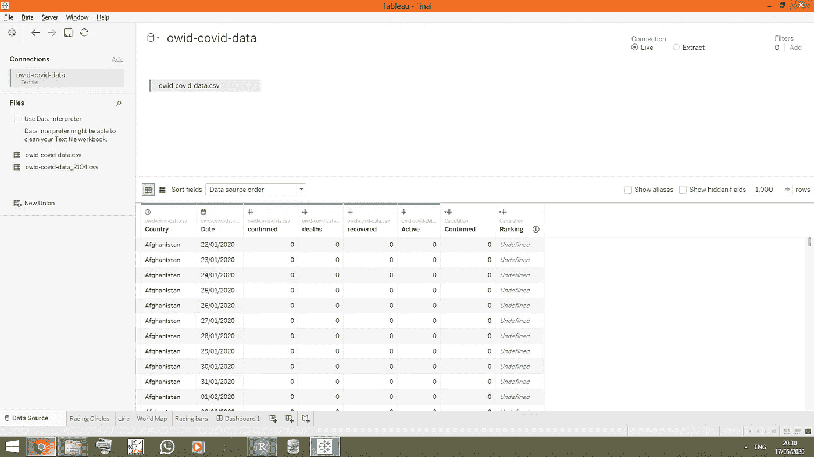

**Tableau 数据源屏幕**

让我们根据以上数据制作赛车圈图表。

我把确诊病例标在 X 轴上，死亡病例标在 Y 轴上。因为我想将它显示为动画图表，所以我使用**格式- >动画选项**将该页面显示为基于**日期**字段的动画页面。

按照以下步骤创建图表:

1.  将**已确认的**字段拖到列架子上，将**死亡**字段拖到行架子上。
2.  将**日期**字段拖至页面，以动画显示**日期**的数据。一旦你设置了这个选项，你会在屏幕上看到一个类似开始、停止按钮的视频窗口。
3.  拖动**国家**和**日期**到过滤器。
4.  拖动**国家**到**颜色**和**标签标记**。
5.  拖动**确认**到**尺寸标记**。
6.  从标记下拉窗口中选择**圆圈**。
7.  根据您的喜好格式化轴
8.  你会看到图表是如何形成的。
9.  按照您希望显示数据的方式设置动画速度。请参见我在动画窗口下面设置的参数。

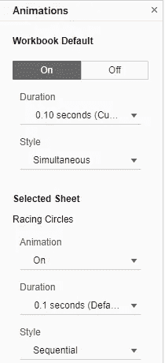

**动画选项**

要将日期字段放在图表上，右击图表并点击**注释>点**并将其值如下所示。


一旦你设置了以上所有选项，你的最终屏幕将如下所示:

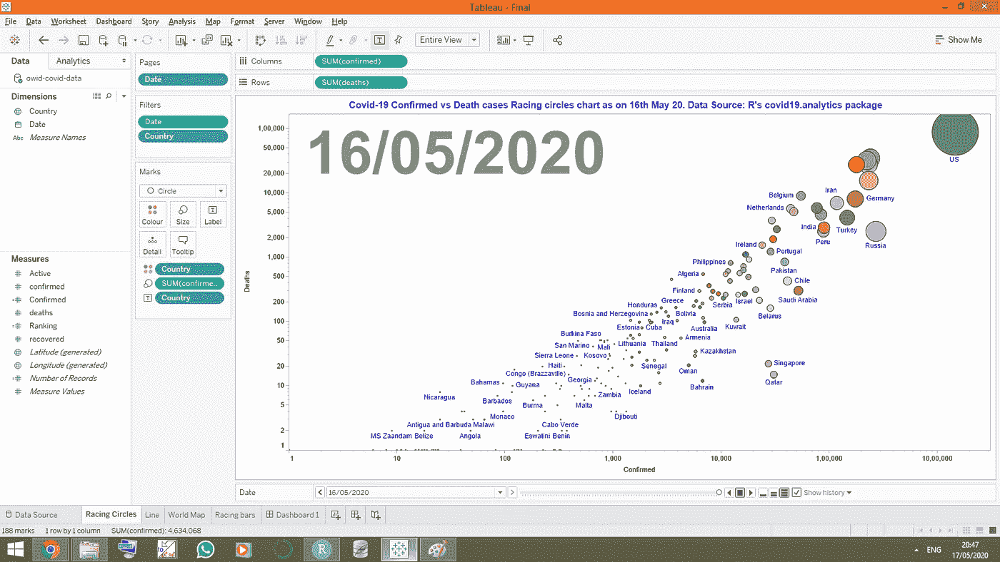

**赛车圈图表最终屏幕**

点击播放按钮，你会看到圆圈开始出现。圆圈的大小随着确诊和死亡病例的增加而增加。

这是最终输出，如下所示。点击屏幕下方，然后点击不同的按钮来放大它。

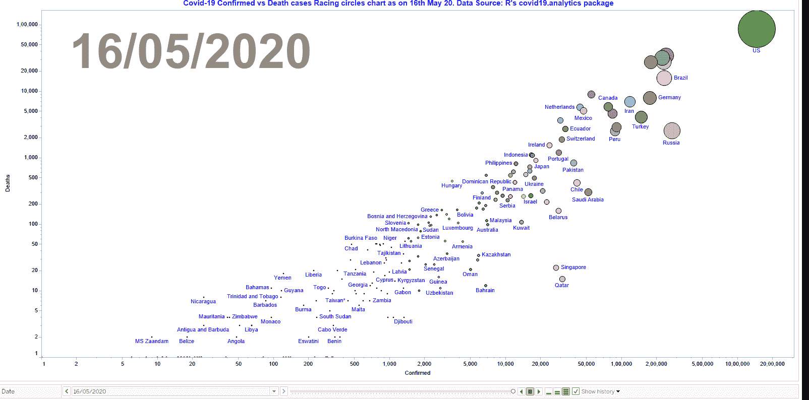

**确诊及死亡病例赛车圈图**

**折线图**

现在让我们做一个**活跃、确诊、死亡**和**痊愈**病例的简单折线图。

将**日期**字段拖到列架上，将**确认**字段拖到行架上。这是一个难题。将**活动、死亡和恢复**字段拖到 Y 轴，而不是架子上。因此，您将以**测量值**的形式获得 Y 轴上的所有数值。拖动**测量值**至**色标**。将**标记**改为**线**。你会得到一个折线图。请参见下面的屏幕截图以供参考。

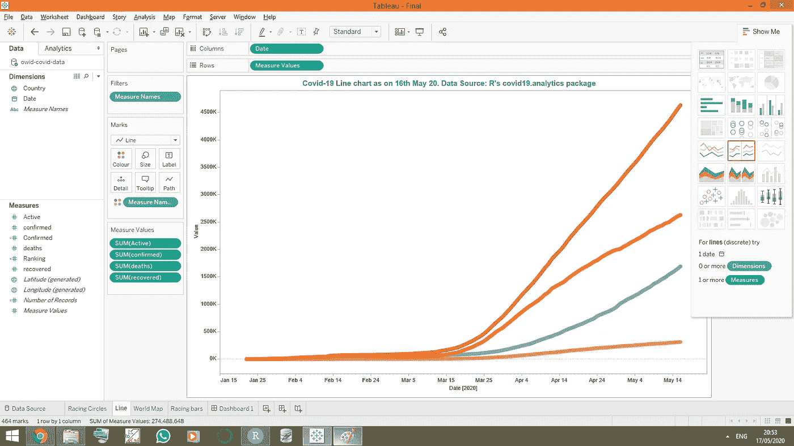

**折线图**

**世界地图**

让我们为**确诊**病例绘制一张世界地图。

将**经度**拖至列架，将**纬度**拖至行架。我们已经在**国家**字段中输入了国家名称。拖动**国家**到颜色和细节标记。你很快就会看到一幅世界地图正在成形。Tableau 将自动为您绘制世界地图。

创建一个新的计算字段**确认**并设置其值如下所示，拖动该字段至尺寸和标签标记。将下拉窗口中的标记改为圆形。

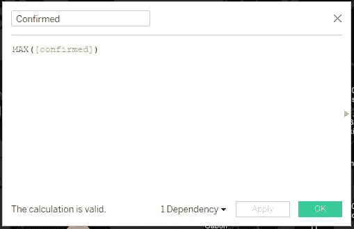

已确认计算字段。

通过调整尺寸标记中的圆形尺寸来增大或减小圆形尺寸。我想要一个黑色的贴图，所以我将贴图值设置为**贴图>背景贴图>暗。**

正确设置所有值后，您的屏幕将如下图所示:

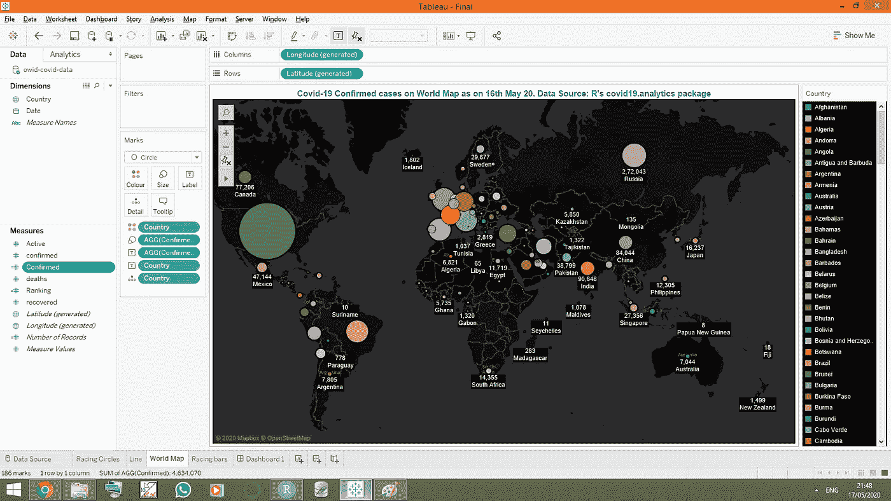

**世界地图屏幕**

最大化屏幕，您的最终屏幕将如下所示:

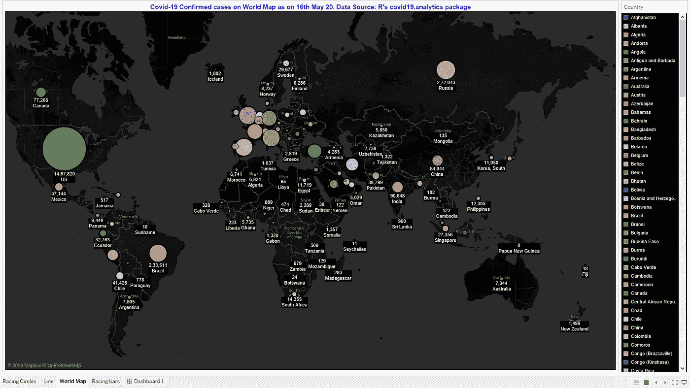

**世界地图最终屏幕**

# **赛车酒吧图表**

你一定是从 whatsup 视频里的朋友那里拿到这张图表的。让我们来创建这个图表。

你一定已经注意到，图表会根据确诊病例自动对国家进行排序，也就是说，它会根据日期的变化对国家进行排序。它基本上使用了 Tableau 的动画特性。

我们将使用相同的动画功能，因为我们用在赛车圈图表。

创建新的计算字段排名，并输入如下值:

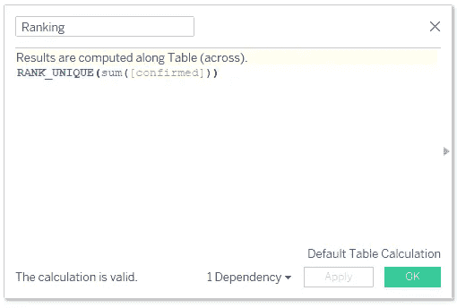

**排名计算字段**

1.  将**确认的**字段拖到列架上，将**排序的**字段拖到行架上。
2.  将下拉列表中的标记更改为条形。
3.  拖动**国家**到颜色、工具提示和标签标记。
4.  拖动**确认**到标签，并设置其值为 Max。
5.  将日期拖到页面上。您将看到带有日期值的动画按钮。
6.  要在条形上显示国家和案例值，请在标签标记窗口中设置它们的对齐值。
7.  您将在屏幕上看到如下图表。试着按下播放按钮。您将看到随着条形值的增加或减少而上下移动。点击下面的屏幕放大它。

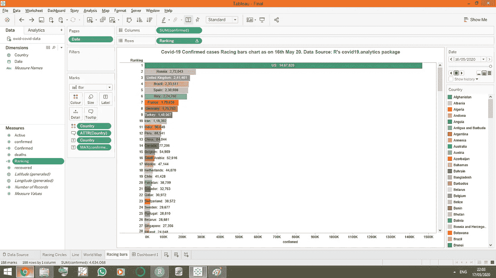

**赛车吧最终屏幕**

要将日期字段放在图表上，右键单击图表并单击**注释>点**并输入其值，如下所示:


**日期标注**

将注释拖到屏幕上的任意位置，并将其放在您想要的位置。最终屏幕如下所示:

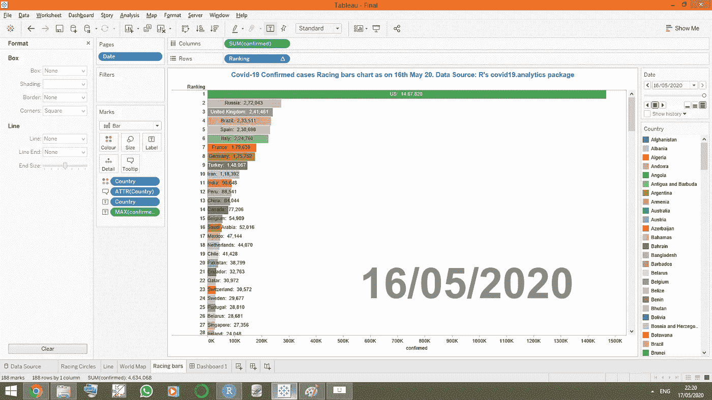

**在屏幕上添加日期字段后的赛车栏屏幕**

一旦一切都设置好了，最大化屏幕，拖动日期到第一个日期，然后按下播放按钮。你将会看到这些条上下移动，如下所示。点击图表将其放大。

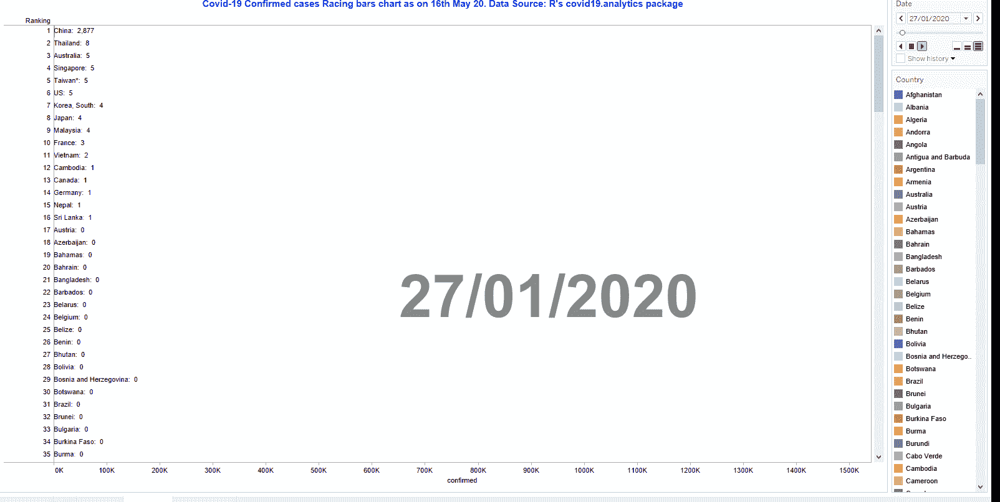

**赛车条形图**

希望你喜欢我的文章。下一篇文章再见。

在这里看我的数据科学[数学](https://www.instagram.com/artofhary/)艺术

在 Linkedln [此处](https://www.linkedin.com/in/harish-nagpal-8696529/)与我联系。