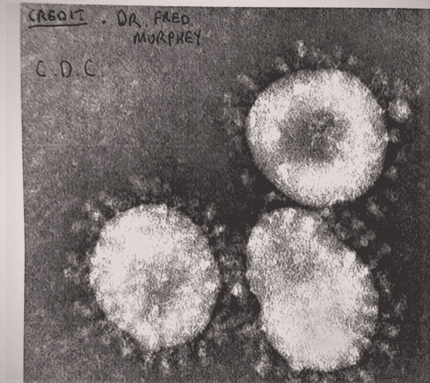
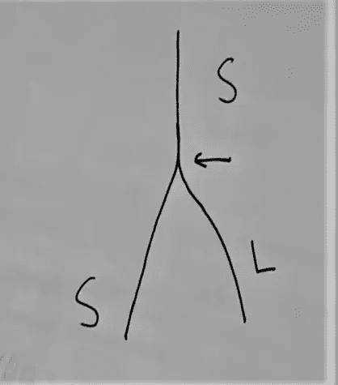
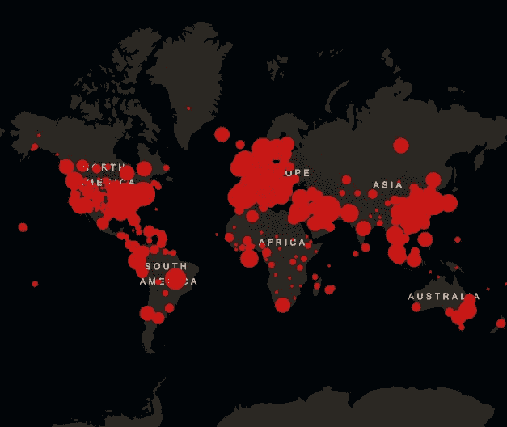
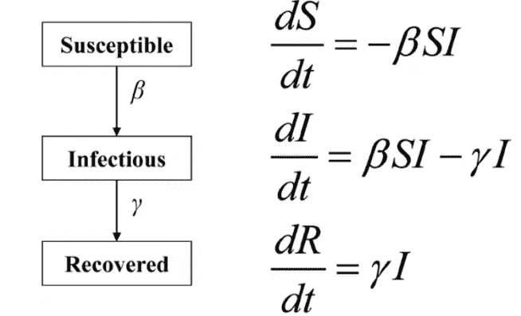
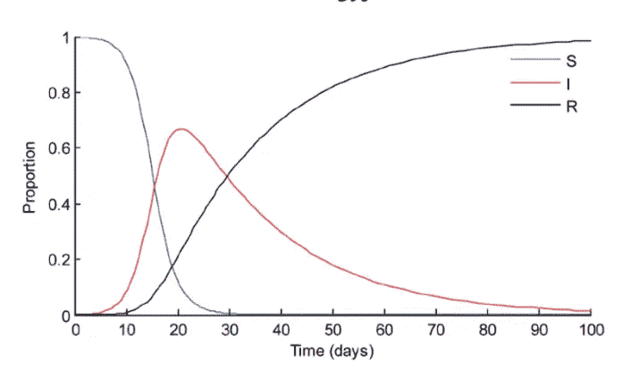
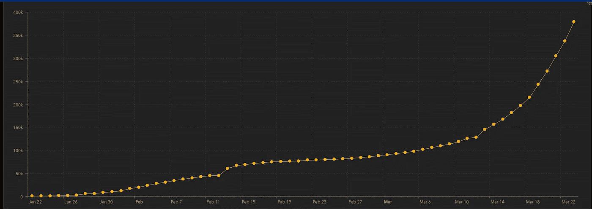

# 日冕危机:第一部分

> 原文：<https://medium.com/analytics-vidhya/corona-crisis-part-1-8f027726474a?source=collection_archive---------19----------------------->

# 无形的战争。

我们都在打仗。但是，这次我们的敌人是微生物。一切似乎都太电影化了，难以置信，完全没问题。如何阻止一些看不见的东西，一些成倍增长的东西和一些有可能结束生命的东西。理解和想象这样的问题总是具有挑战性，我们对疫情的整体理解越好，我们克服这种局面的机会就越大。所以，让我们试着理解下面的内容，我们即将开始一段旅程。

1.  什么是冠状病毒？
2.  在新冠肺炎发现的不同形式及其在不同表面上的寿命。
3.  用一种更标准、更数学的方式理解疫情利差(相信我，这比听起来容易理解)。

**1。什么是冠状病毒？**

病毒是一种微生物或生物制剂，在生物细胞内繁殖。冠状病毒是**人畜共患病**，是指由动物或昆虫传播给人类的疾病，人类进一步参与人与人之间的传播。我们经历了 2003 年的 **SARS** (严重急性呼吸综合征)，2012 年的 **MERS** (中东呼吸综合征)，以及现在的**新冠肺炎**(冠状病毒疾病 2019)。SARS 和新冠肺炎被认为是首先在中国发生的，尤其是在中国武汉的新冠肺炎。新冠肺炎由 RNA(核糖核酸)组成，RNA 被带链的蛋白质外壳包裹(帮助病毒在宿主体外存活相当长的一段时间)。新冠肺炎如下图所示。

图片来自 YouTube:
约翰·坎贝尔博士

**2。在新冠肺炎发现的不同形式及其在不同表面上的寿命。**

图片来自 YouTube:
约翰·坎贝尔博士

现在，新冠肺炎病毒在突变中经历了两次变化，最初的 S 型病毒后来分支为 L 型病毒，导致了双重存在。S 型:较轻，传染性较低和 **L 型:较重，传染性较高**。这种病毒定居在咽喉隧道和肺部。据发现，截至 2020 年 1 月 21 日，S 型和 L 型都在美国流通。中国科学家研究的 70%的病毒是 L 型，主要在武汉。

导致新冠肺炎的冠状病毒能在表面存活多久？

最近的一项研究发现，新冠肺炎电晕病毒可以在铜上存活长达四小时，在纸板上存活长达 24 小时，在塑料和不锈钢上存活长达两到三天。研究人员还发现，这种病毒在落下之前可以在空气中悬浮长达三个小时。但最常见的是，它们会跌得更快。

详细的见解请浏览文章末尾的链接。

**3。用一个更标准、更数学的模型来理解疫情利差(相信我，这比听起来容易理解)。**

当一种病毒在全国范围内传播时，它就被称为**流行病。如果是多个国家和大洲的情况，那么这将是一个**疫情。根据约翰·霍普斯金互动地图，现在我们正在经历一场疫情，总共有 168 个国家受到影响。****

资料来源:https://coronavirus.jhu.edu/map.html

因此，大多数全球卫生组织，如世卫组织(世界卫生组织)、CDC(疾病控制和预防中心)等，都使用类似于 **SIR(易感、感染和康复)**的疫情预测模型来了解流行病的规模(传播速度)，并为当前和未来的措施制定计划。

易感者是指那些可能被感染的人，换句话说，理想情况下是所有人。

让我们考虑 S(t) =给定时间的易感者，I(t) =给定时间的感染者，R(t) =给定时间的康复者。因此，S(t)+I(t)+R(t) = N，其中 N 可以是一个城镇或城市或国家的总人口。所以，易感者会被感染，然后康复，这就是流程。因此，在建立模型时考虑了上述与时间相关的变量。

振作起来，让我们深入了解 SIR 模型。正如我之前所说，这个概念比看起来要简单。

图片提供:研究门

现在，这个 d 是什么，这些常数β和γ是什么。你不需要真正了解他们，就能理解呈现在左边的图像的动机。但是，我还是会解释需要什么。现在，微分方程系统将在这三个函数(S，I，R)上执行。微分方程是相对于给定时间的变化率。

*   现在，上面的三个等式解释了，在一段时间内**易感者**将成为**受感染者**(因此，易感者中的计数被扣除，-βSI)
*   被感染的人将会被 T2 治愈。(因此，恢复的计数将从曾经易感**，** βSI- γI 的感染计数中扣除)。
*   最终**每个人**都会**恢复**一段时间(因此，γI)。

上面解释的可视化看起来如下，为了直观的目的分享图表。

图片提供:研究门

该图表示人口比例与时间的关系。我们可以看到**蓝色 S 易受**非线性曲线下降，并在一段时间后变为零。我们可以看到**红色 I 感染**和**黑色 R 恢复**线一起表现。在一段时间内，黑线达到最大比例，红线达到最小值。换句话说"*不再有感染，全部康复。*

上述趋势对于任何与疫情签约的国家都是一样的，包括印度。总的来说，高温似乎对新冠肺炎没有影响。不管怎样，病毒正在传播。

*   目前，疫情正导致受感染的宿主呈指数增长。下图显示了不同时间的感染情况。

[https://coronavirus.jhu.edu/map.html](https://coronavirus.jhu.edu/map.html)

在《古洛那危机:第二部分》中，我会进一步探索这一点。

*   阻止疫情病毒传播的方法(新冠肺炎)。
*   为什么这个疫情会在未来几个月或几年改变我们的生活方式？

参考链接:

流行病的数学 SIR 模型简介

 [## 哈佛健康冠状病毒资源中心

### 导致新冠肺炎病毒的快速传播在世界范围内引发了恐慌。世界卫生组织(世卫组织)已经…

www.health.harvard.edu](https://www.health.harvard.edu/diseases-and-conditions/coronavirus-resource-center) 

[https://www . research gate . net/figure/SIR-model-Schematic-re presentation-differential-equations-and-plot-for-the-basic-SIR _ fig 1 _ 47676805](https://www.researchgate.net/figure/SIR-model-Schematic-representation-differential-equations-and-plot-for-the-basic-SIR_fig1_47676805)

 [## 约翰霍普金斯冠状病毒资源中心

### 约翰霍普金斯大学全球公共卫生、传染病和应急准备方面的专家一直在…

coronavirus.jhu.edu](https://coronavirus.jhu.edu/map.html) 

新冠肺炎突变和进化