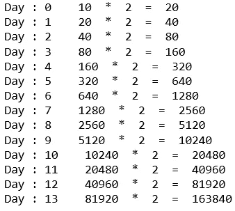
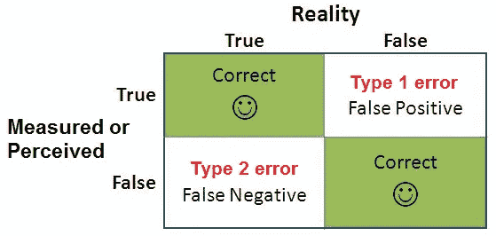
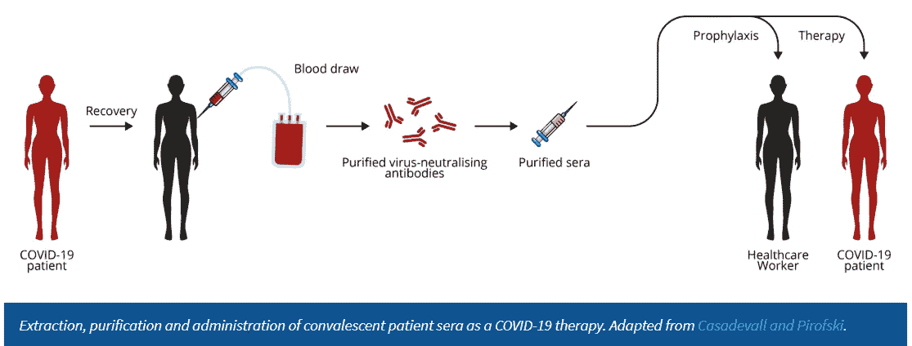
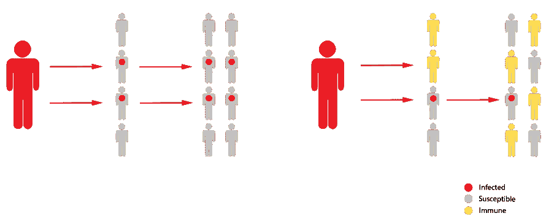
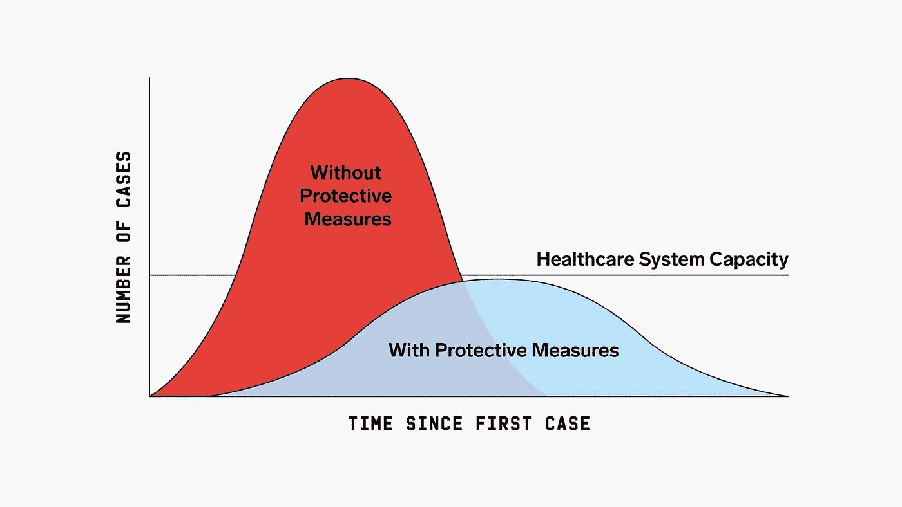
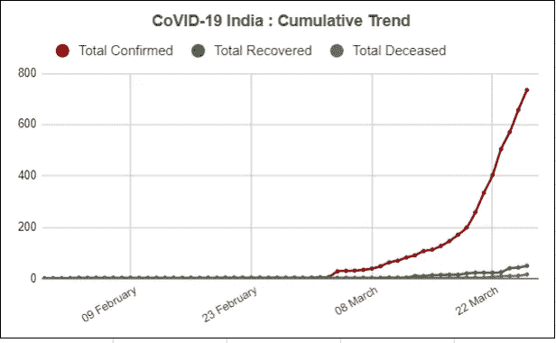
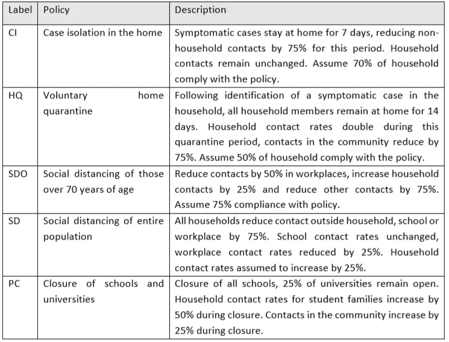

# 电晕危机:第二部分

> 原文：<https://medium.com/analytics-vidhya/corona-crisis-part-2-ca2ac0fb475f?source=collection_archive---------16----------------------->

# 流行病令人困惑

流行病很难理解。因为，在最初阶段，高度警戒措施和警告被认为是愚蠢和过分耸人听闻的。但是，当我们注意到并意识到病例增加，然后开始应对时，就太晚了。这被称为**疫情悖论。**在第 2 部分中，我们将讨论以下几点。

*   疫情悖论
*   阻止疫情病毒传播的方法(新冠肺炎)。

1.  检测:测试的类型以及假阳性和假阴性的影响。
2.  治疗:疫苗和方法。

*   为什么这个疫情会在未来几个月或几年改变我们的生活方式？

1.  隔离:使曲线变平，缓解和抑制措施。
2.  我们将进一步讨论帝国理工学院新冠肺炎响应团队的非药物干预(NPI)对降低 COVID19 死亡率和医疗保健需求的影响。

## 疫情悖论

什么是悖论？看似矛盾或荒谬但实际上有效或真实的陈述或情况，反之亦然。那么，在流行病的背景下，这个悖论在哪里呢？这是受感染的宿主增加的速度和性质决定的。我们都知道如何指数增长函数。让我们用一个简单的例子来理解这个疫情悖论。

想象一个拥有 **N** = 20 万人口的小镇。一条新闻报道，10 个人感染了病毒，并且有一个 **R0(繁殖率)=** 2。不间断的增长如下图所示。

感染病例的指数增长

*   从第 0 天到第 7 天，我们倾向于忽略新闻，认为他们过度炒作，继续业务，因为优先事项是显而易见的。
*   从第 8 天到第 10 天，我们会开始注意到形势的严重性，并倾向于重新调整优先级。健康第一，商业第二。
*   从第 11 天到第 13 天，那就太晚了，镇上几乎每个人都会生病。如果注意到的话，一天之内会有一半的城镇被感染，从第 12 天到第 13 天，也被称为**社区传播**。

**阻止疫情传播的方法(新冠肺炎)。**

**检测、隔离、治疗。**

**检测:**

为了检测，我们必须了解病毒的潜伏期，以及识别有症状和无症状的病例进行治疗。新冠肺炎在宿主体内的潜伏期为**2–14 天**，可能的异常值为**0–27 天。**有关详细信息，请在最后找到以下附加链接。

检测:可进行 **RT-PCR** 、**抗体**和**抗原**检测，检测感染病例。

**RT-PCR** :实时逆转录聚合酶链反应(rRT-PCR)检测。PCR 正在制作数百万份样本核酸，以放大和研究样本核酸，用于检测目的。样本可以从鼻腔、喉咙和痰液中收集。由于病毒是新的，测试必须经过多次迭代，以提高速度和质量。PCR 测试导致假阴性，并且在阳性之前还有多个阴性结果。这也使卫生工作者面临感染的风险。

**抗体检测**:可通过抽取血液和痰液样本进行。抗体通常在感染新冠肺炎病毒后 9-11 天在我们体内产生。这有助于通过记录客户的接触时间来追踪联系人。此外，随机抗体检测将有助于政府发现免疫力低下的“热点”人群。可以对这样的人群采取更多的措施。

**抗原检测**:样本可取自血液和痰液。它检测病毒的蛋白质含量。所有这些测试都可以检测正在进行和已感染病例中的病毒。也就是说，病人必须被感染一段时间。

新冠肺炎的症状很棘手，因为它们伴随着季节性流感。因此，我们很有可能将季节性流感或普通流感误认为新冠肺炎。将在文章末尾附上详细信息的链接。

**假阳性(第一类错误)和假阴性(第二类错误)的影响。**

图片提供:[https://www.abtasty.com/blog/type-1-and-type-2-errors/](https://www.abtasty.com/blog/type-1-and-type-2-errors/)

在医学领域，假阴性的代价更高。也就是说，把阳性新冠肺炎检测为阴性。他/她将病毒传播给人群中其他人的可能性很高，从而导致**社区传播**。另一方面，假阳性是将阴性新冠肺炎检测为阳性。这导致医疗保健系统的病人负担过重。

**请客:**

**疫苗**:疫苗一般是注射到宿主体内的弱病毒或死病毒，因为会产生抗体，万一病毒进入，宿主体内形成的抗体会将病毒击退。还有一种方法是将治愈宿主的抗体注射到感染宿主体内。

图片来源:[https://thenativeantigencompany . com/why-we-need-antigen-and-antibody-tests-for-新冠肺炎/](https://thenativeantigencompany.com/why-we-need-antigen-and-antibody-tests-for-covid-19/)

但是，据说制造一种新病毒的疫苗需要 12-18 个月。在大规模生产疫苗时会出现许多错误。请通过最后的链接，ISMP 国家疫苗错误报告计划。现在是著名的**拉平曲线**口号，我们已经在新闻和社交媒体中听到和看到，这引出了我们的下一个观点。

**为什么这个疫情会在未来几个月或几年改变我们的生活方式？**

没有关于疫情暂停的固定时间。这个疫情不会永远蔓延。即使我们什么都不做，等待这种病毒传播，给定新冠肺炎的 **R0** (R 零)= **繁殖数**，**R0 =**1.4–3.9，这种病毒将传播到世界上几乎 50%的人口，然后停止传播。因为，病毒会跑出宿主进行繁殖。人类将获得群体免疫力。因此，冠状病毒需要大约 50%的人口被感染才能停止传播(牵强的想法)。请查看以下可视化内容。

图片来源提供:[https://www . technology review . com/s/615375/what-is-herd-immunity-and-can-it-stop-the-corona virus/](https://www.technologyreview.com/s/615375/what-is-herd-immunity-and-can-it-stop-the-coronavirus/)。在一个简单的疫情模型中，每个病例会感染两个以上的病例，从而导致疾病呈指数增长。但是一旦一半的人口获得免疫，疾病爆发的规模就不再扩大。

但是，我们的目标是减少死亡人数，减轻医疗系统的负担。*拉平曲线。*'

图片提供:[https://www . health . Harvard . edu/diseases-and-conditions/coronavirus-resource-center](https://www.health.harvard.edu/diseases-and-conditions/coronavirus-resource-center)

## 孤立的

因此，帝国理工学院新冠肺炎响应团队提出了非药物干预(NPIs)的影响，以降低 COVID19 死亡率和医疗保健需求。除了接种疫苗和服药之外，非药物干预是人们和社区可以采取的有助于减缓病毒性疾病等疾病传播的行动。该团队正在英国和美国实施 NPI 模型。

两个基本策略:

## 抑制:

主要目的是实现低水平的病毒传播。消除人与人之间的传播。这涉及到大规模的检疫和隔离措施，直到我们有了疫苗(实际上不可能在 12-18 个月内完成这项工作)。像印度这样的国家现在正在进行镇压，他们封锁了整个国家，包括公共场所。几乎锁定 13 亿人，激活防御机制(暂时)。以下是印度目前的感染病例。感染病例与时间的对比。慢慢走向指数增长。这是实施战略的恰当时机。但是，后来我们甚至不得不用测试工具来对付病毒。

图片提供:covid 19-印度:患者数据库

## 缓解措施:

主要目的是减缓流行病的传播，减少高峰医疗需求，同时保护那些最有可能感染严重疾病的人。这种策略在一定程度上也依赖于群体免疫。像荷兰这样的国家对此颇有微词。甚至非洲国家也在寻求缓解策略。即使是英国，但他们的行为是间接的。

## 考虑的 NPI 干预措施摘要:

图片提供:帝国理工学院-covid 19-NPI-modeling-16–03–2020

外卖:

*   通过应用缓解和压制策略从顶部防御，通过测试和使敌人可见从底部攻击。
*   疫情可能会在四季中重现。
*   抑制和缓解战略正在各国实施 3 个月或最多 5 个月。解除策略后，感染可能会激增。
*   这些国家可能不得不不时地通过放松来实施这些战略。使得曲线变平，尽管该过程被延长。

结论:

*   我们将不得不使我们所有的非自愿行为，如触摸我们的脸，咳嗽没有过滤器是自愿的。在接下来的时间里，我们将不得不习惯洗手并保持物理距离。
*   如有必要，这些活动将被严格跟踪几个月。
*   从精神上来说，这会对平民造成伤害，最好培养一种坚忍的心态。最低限度的反应或试图了解我们在艰难情况下的最佳水平，将有助于我们更好地应对疫情的爆发。

参考链接:

[https://thenativeantigencompany . com/why-we-need-antigen-and-antibody-tests-for-新冠肺炎/](https://thenativeantigencompany.com/why-we-need-antigen-and-antibody-tests-for-covid-19/)

 [## 什么是群体免疫，能阻止冠状病毒吗？

### 基本上有三种方法可以永远阻止新冠肺炎病。一个是对自由的特别限制…

www.technologyreview.com](https://www.technologyreview.com/s/615375/what-is-herd-immunity-and-can-it-stop-the-coronavirus/)  [## 冠状病毒是如何传播的？(以及其他新冠肺炎常见问题)

### 有自己的问题吗？在这里给我们发邮件。新冠肺炎是一种呼吸道病毒，与流行性感冒和其他呼吸道病毒非常相似

www.wired.com](https://www.wired.com/story/whats-social-distancing-flattening-curve-covid-19-questions/)  [## ISMP 国家疫苗错误报告计划 2017 年分析(第一部分):疫苗错误继续与…

### 虽然疫苗接种是 20 世纪最伟大的公共卫生成就之一，但是…

www.ismp.org](https://www.ismp.org/resources/ismp-national-vaccine-errors-reporting-program-2017-analysis-part-i-vaccine-errors)  [## 什么是 1 型和 2 型错误？

### 统计假设检验意味着没有任何检验是 100%确定的:那是因为我们依赖概率来…

www.abtasty.com](https://www.abtasty.com/blog/type-1-and-type-2-errors/) 

[https://www.fda.gov/media/136151/download](https://www.fda.gov/media/136151/download)

[file:///F:/Imperial-College-covid 19-NPI-modeling-16–03–2020 . pdf](https://www.imperial.ac.uk/media/imperial-college/medicine/sph/ide/gida-fellowships/Imperial-College-COVID19-NPI-modelling-16-03-2020.pdf)