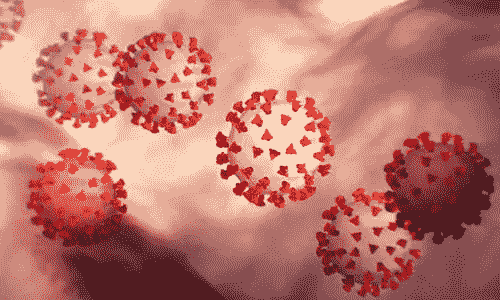
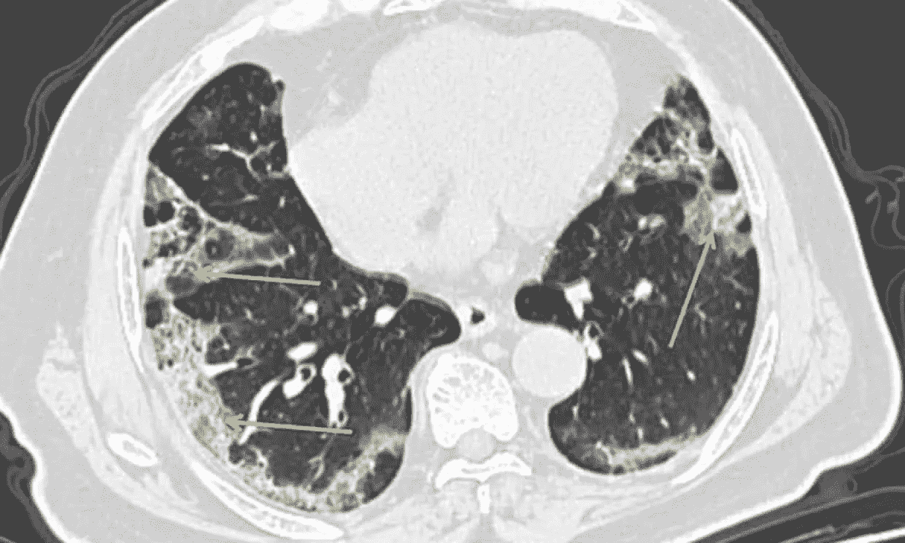
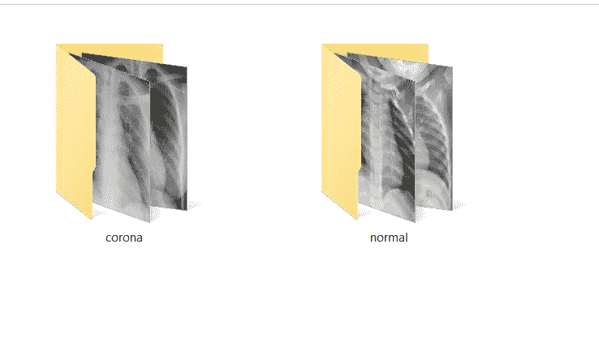
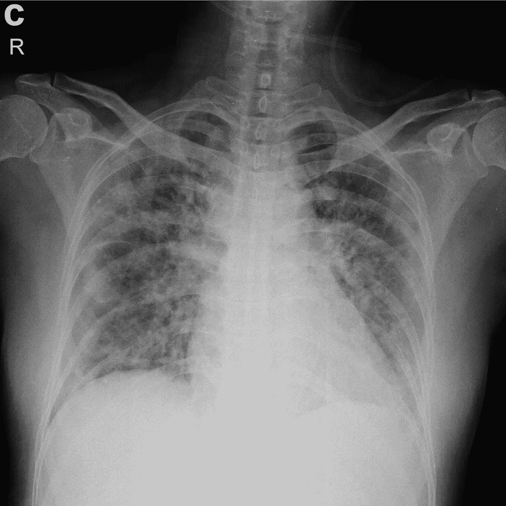
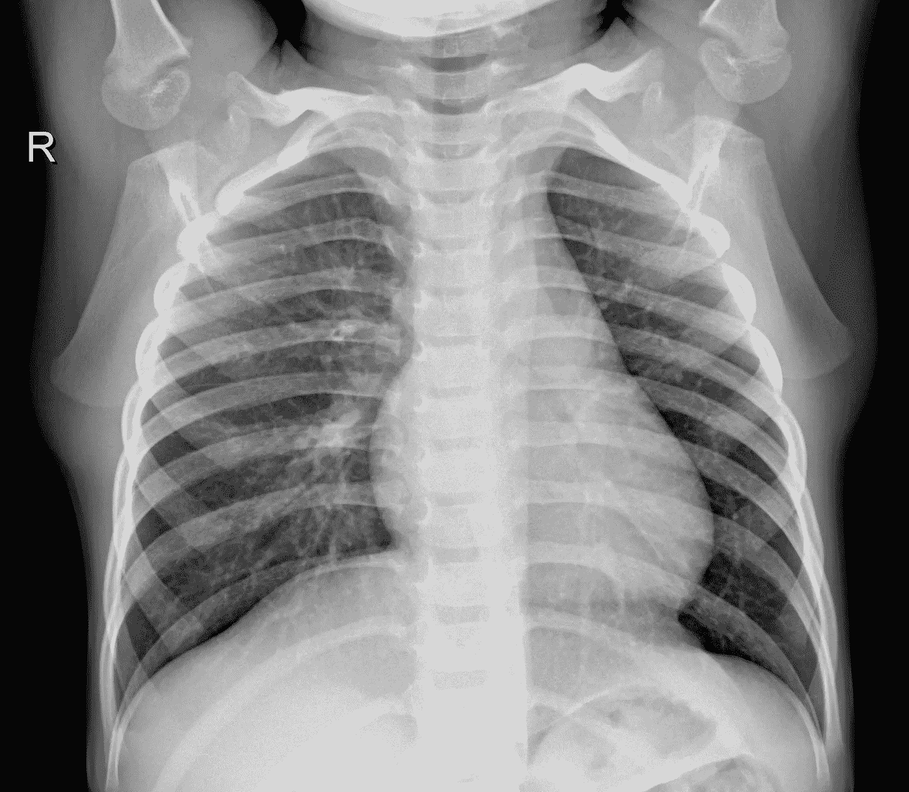
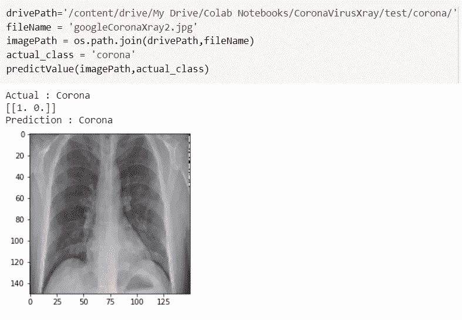
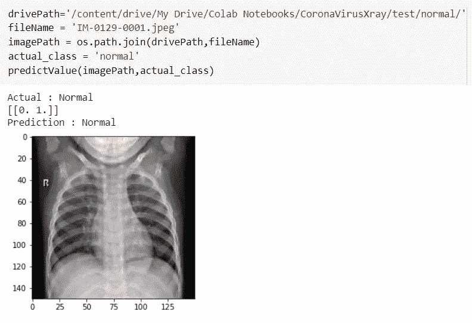

# 基于深度学习的 X 射线图像电晕检测

> 原文：<https://medium.com/analytics-vidhya/corona-detection-from-x-ray-images-using-deep-learning-72ba5db16608?source=collection_archive---------32----------------------->

来源:谷歌

# 让我们明白什么是新冠肺炎。

冠状病毒病(新冠肺炎)是一种由新型病毒引起的传染病。这种疾病导致呼吸道疾病(如流感)，症状包括咳嗽、发烧，在更严重的情况下，呼吸困难。

大多数感染新冠肺炎病毒的人会经历轻度至中度的呼吸道疾病，无需特殊治疗即可康复。老年人以及那些患有心血管疾病、糖尿病、慢性呼吸系统疾病和癌症等潜在疾病的人更有可能患上严重疾病。

当一个人感染新冠肺炎病毒时，他的肺会发生什么变化？

> 根据医生和专家的说法:“呼吸树的内层受到损伤，导致炎症。这反过来刺激气道内层的神经。仅仅一粒灰尘就能引起咳嗽。”
> 
> -约翰·威尔逊教授，皇家澳大拉西亚内科医学院当选院长和呼吸内科医生。

充满炎症物质的肺部无法获得足够的氧气进入血液，降低了身体吸收氧气和排出二氧化碳的能力。这就是导致死亡的原因。

呼吸内科医生 John Wilson 解释了新冠肺炎的影响范围。这张图片显示了一名新冠肺炎患者的 CT 扫描。由新型冠状病毒引起的肺炎可以表现为肺部外缘上独特的模糊斑块，如箭头所示。图片来源:美联社

# 在这种情况下，ML 如何提供帮助？

我们可以建立一个模型，该模型将在这些 X 射线图像中找到模式，并试图预测患者是被“冠状病毒”感染还是“正常”。

这将减少检测和推断患者是否被感染所需的时间。

# 数据集:

让我们看看数据集是什么样子的:

训练文件夹:两组图像，电晕和正常

数据完全平衡:电晕-120 和正常-124

让我们看一张日冕的图像:

受感染者 X 射线

让我们来看看正常的单一形象:

正常人 X 射线

## 文件夹结构:

基本上，有 3 个文件夹，每个文件夹包含 2 个子文件夹:

文件夹为 train、test 和 validation，每个主文件夹由名为 corona 和 normal 的子文件夹组成。

这是我们所有的。

> 你可以从 [***这里***](https://bit.ly/3dvXVa0) 下载数据。这些数据是通过网站 [**收集到的，并放入一个驱动链接中**](https://aihubprojects.com/) **，**请查看它们，它们有很酷的东西和项目，还有许多博客可供阅读、探索和增加你的知识。

# 深度学习方法:

我们将使用 CNN 模型来找出图像中包含的模式。你可以在 [***这里***](https://towardsdatascience.com/applied-deep-learning-part-4-convolutional-neural-networks-584bc134c1e2) 阅读 CNN。您将在参考博客中找到大量关于 CNN 模型的信息。

# 数据预处理:

## 分离数据

一旦我们有了数据，我们就可以创建类，并将它们放入每个类的单独文件夹中，例如:corona 图像应该在 corona 文件夹中，normal 图像应该在 normal 文件夹中。但是不用担心，积累数据的人已经处理好了。

**为什么放在不同的文件夹里？**

这样我们就可以教我们的模型，哪个图像属于哪个类别。

## 扩充数据

我们都知道，图像可以被增强，我们可以人为地增加模型的数据量，为什么不呢？

你可以在这里 ***阅读关于图像增强 [***。*** 它由不同类型的增强组成，借助代码和图像很容易解释。](https://machinelearningmastery.com/how-to-configure-image-data-augmentation-when-training-deep-learning-neural-networks/)***

我执行的增强如下:

1.  重新缩放:创建不同大小的图像的新版本。

2.剪切范围:执行图像的剪切变换。

3.缩放范围:缩放图像。

3.旋转范围:图像旋转的角度。

4.宽度移动范围:根据宽度移动宽度。

5.高度移动范围:根据高度移动高度。

6.水平翻转:创建一个水平翻转的新图像。

7.垂直翻转:创建一个垂直翻转的新图像

## 正在创建 ImageDataGenerator 对象:

我们将使用上面提到的增强，用于发电机对象，然后传递包含火车图像的主文件夹的目录(记住火车文件夹已经包含两个子文件夹 corona 和 normal)。这些文件夹将帮助 put model 了解哪个图像属于哪个类别。

我们将目标尺寸设置为 300 x 300，实际图像的尺寸更大，大约为 1400 x 1200，这可能需要很长时间来训练，因此我们缩小了图像尺寸。

我们将批量大小设置为 32，将类别模式设置为分类。

我们还为我们的模型创建图像的输入大小，即:

(300 x 300 x 3)，其中 3 是图像的尺寸 RGB : 3

## 模型架构:

我们使用了一个序列模型，它由 Conv2D 层、BatchNorm 层、MaxPooling 层、Flatten 层、Dropout 层和 Dense 层组成，作为输出。

输出分为 2 类，电晕或正常。

有 6 个 Conv2D 层，每个层的内核大小为(3x3)，激活为 ReLU，内核初始化器和内核正则化器为 L2。

CNN 层的激活单位在 2 — 2⁶.之间

MaxPooling 层的池大小为(2x2)。

丢弃层丢弃该层 0.5%的神经元。

## 模型编译参数:

该模型使用“二进制交叉熵”的损失。

“二进制精度”的度量。

使用的优化器是 Adagrad，学习率为 0.001，衰减为 0.9

## 训练模型:

以 10 为纪元，我们训练该模型，它给出了最终的训练损失为 0.27，训练精度为 0.93，测试损失为 0.28，测试精度为 0.95。这对于简单的模型来说是不错的。

# 让我们看看一些结果:

用于测试的图像来自模型尚未看到的测试文件夹。

电晕 x 射线图像的预测

正常 x 射线图像的预测

# 结论:

1.  该模型似乎工作良好，但仍需要改进，以便我们可以达到更高的准确性。
2.  如果数据更多，我们的模型可能会更复杂，可能会有更多的参数需要训练，可能会取得更好的结果。

# 参考资料:

来源:[https://www . the guardian . com/world/2020/mar/28/what-occass-to-the-people-lungs-what-ochaps-when-when-then-when-they-theguardian . com/world/2020/mar/28/what-goes-to-people-when-then-get-coronavirus](https://www.theguardian.com/world/2020/mar/28/what-happens-to-peoples-lungs-when-they-get-coronavirus)

> **感谢阅读！**
> 
> 如果你想了解更多类似的话题或者看看我还能提供什么，一定要访问我的网站:[所有关于东西](https://digital.allaboutstuffs.com/)
> 
> 准备好让你的学习更上一层楼了吗？查看我提供的课程:[课程](https://digital.allaboutstuffs.com/courses/)
> 
> 生活工作压力大？花一点时间来放松和放松我的舒缓和放松的视频！现在就去我的频道，开始你的内心平和与宁静之旅吧