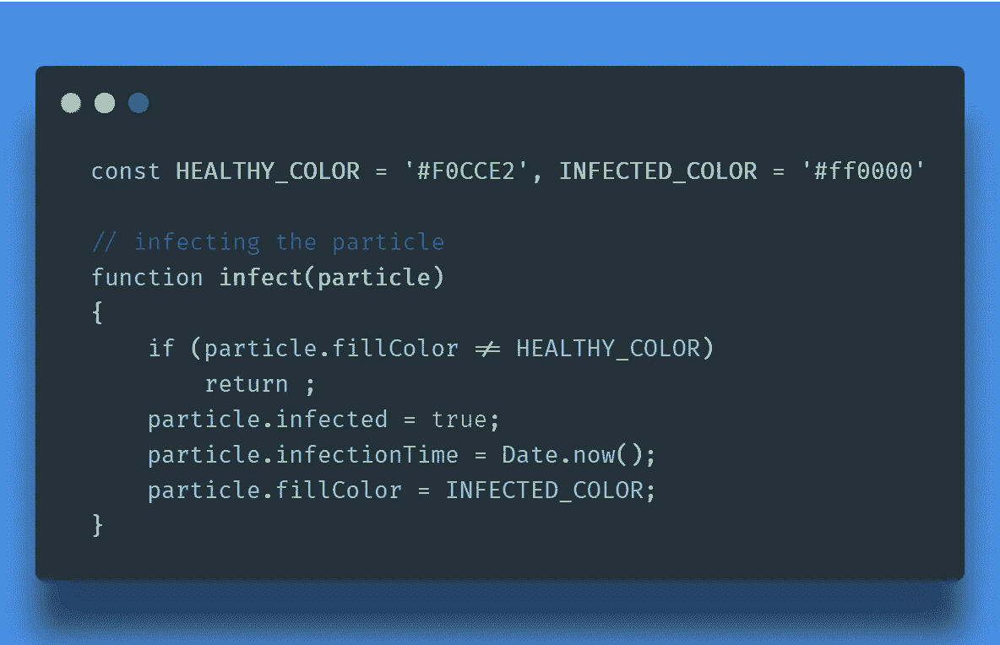
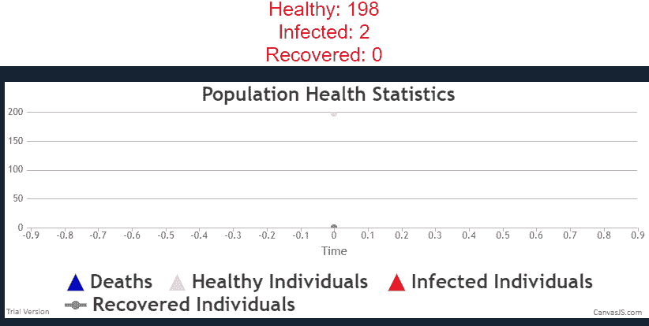
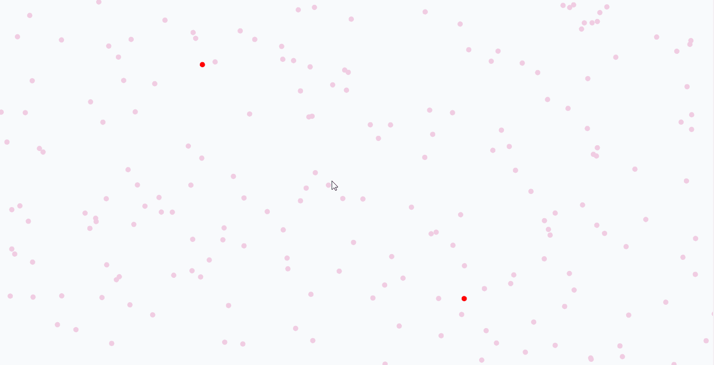
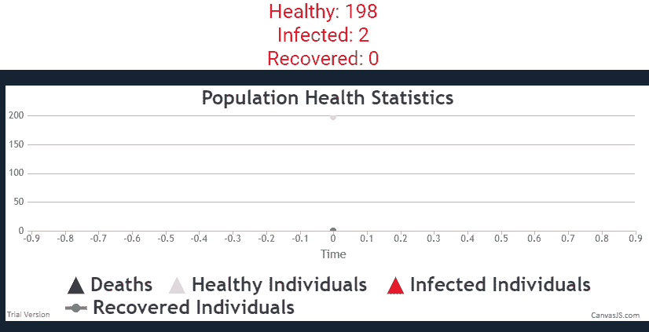
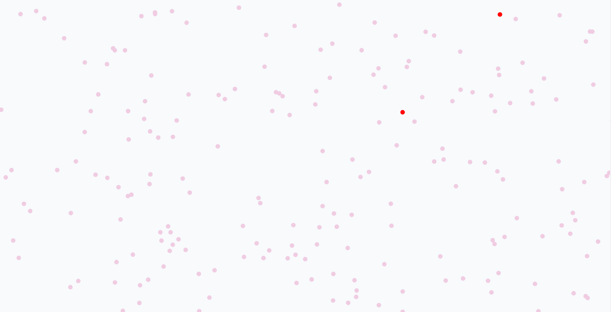
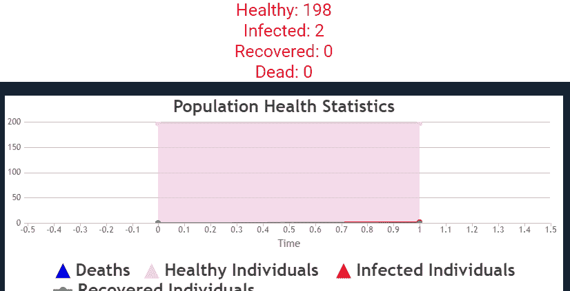

# 为什么“社会距离”会在我们对抗冠状病毒的斗争中起作用？—科罗纳吉斯

> 原文：<https://medium.com/analytics-vidhya/corona-js-20a6b84a454?source=collection_archive---------20----------------------->

## Javascript 证明了我们做的是对的！

这是一个尝试，不是回答，而是验证当前关于冠状病毒传播的常见问题的答案:

> **为什么我们要采用“社交距离”？实际有用吗？**
> 
> **为什么人口老龄化的国家风险更大？**

声明:这是《华盛顿邮报》的一个想法的延伸，唯一的目的是有效地消磨时间！(伪生产)

*在 Github 上找到这个项目:*[*https://github.com/parimatrix/coronaJS*](https://github.com/parimatrix/coronaJS) *现场演示:*[*https://social-distanding-works-agains-coronavirus . net lify . com/*](https://social-distancing-works-agains-coronavirus.netlify.com/)

为了回答这个问题，让我们模拟一下手头的整个情况。
我们有 200 个人。

# 场景 A: 没有社交距离

一群超级乐观的人。所有人都继续正常生活。每个个体都可以自由移动，并且能够与任意数量的个体相互作用的种群。

[https://github.com/parimatrix/coronaJS](https://github.com/parimatrix/coronaJS)

> *上面的情节中可以注意到两点:* ***a)感染病例数量出现突然急剧增加。【T31 b】发病高峰很早，在第一例感染病例之后。***

**没有社交距离的 200 人的人口(可能随机移动)**

为什么这两个问题很重要？这是因为这给了卫生和行政当局很少的时间来对新的情况作出反应。

# 场景 B:社交距离

一群有情境意识的个体。他们避免与他人不必要的接触。我们通过让 75%的人以非常慢的速度移动，其余的人像以前一样自由移动来模拟这种情况。

**斜率更小的较低峰值**

> *我们注意到上面图中的以下几点:* ***a)曲线较平坦，峰不太尖锐且较低。
> b)高峰的出现很晚。***

这为我们赢得了大量时间和资源来应对病毒的影响。

更多的社交距离让更多的人保持健康。减少人们之间社交和职业接触的广泛措施可以是减少地图上“红点”数量的简单措施之一。

# 越来越接近现实！

上述模拟忽略了问题的主要部分。
死亡事故。

随着我们深入研究，问题逐渐浮出水面。当前大约。死亡率仅为 0.2%。啊？对于 60 岁以上的人来说，这个数字增加到一个更成问题的数字→14%。

在下面的模拟中，**我们模拟了两个社会，年轻人和老年人**。我们对年轻人口使用 1%的死亡率，对老年人口使用 14%的死亡率。

**年轻人口的死亡人数较低**

死亡人数要高得多。

死亡人数的鲜明对比是一个显著的特征。仅占总人口 25%的人有 14%的死亡率，但它对总人口的约 30%来说是致命的。

这正是问题所在，也是为什么像意大利这样的国家处于这个巨大问题的前沿。更多的病例和死亡意味着解决问题的时间更少。

这是对真实世界情况的一个非常粗略的建模。这些国家处理这种情况的能力包括一系列不同的因素，从国家的经济状况到人们的普遍态度和人口统计数据。

这是一个有很多改进和分析的项目，需要很多人的很多努力，就像[这个](https://onezero.medium.com/you-can-help-fight-coronavirus-by-giving-scientists-access-to-your-computer-16c39c2e7164)可能！

**在 Github 上找到这个项目:**[**https://github.com/parimatrix/coronaJS**](https://github.com/parimatrix/coronaJS) **现场演示:**[**https://social-distanding-works-agains-coronavirus . netlify . com/**](https://social-distancing-works-agains-coronavirus.netlify.com/)

学分:
1。哈里·史蒂文斯在《华盛顿邮报》上的文章
2。[托多里斯·齐里迪斯](https://codepen.io/72lions)在画布上碰撞粒子