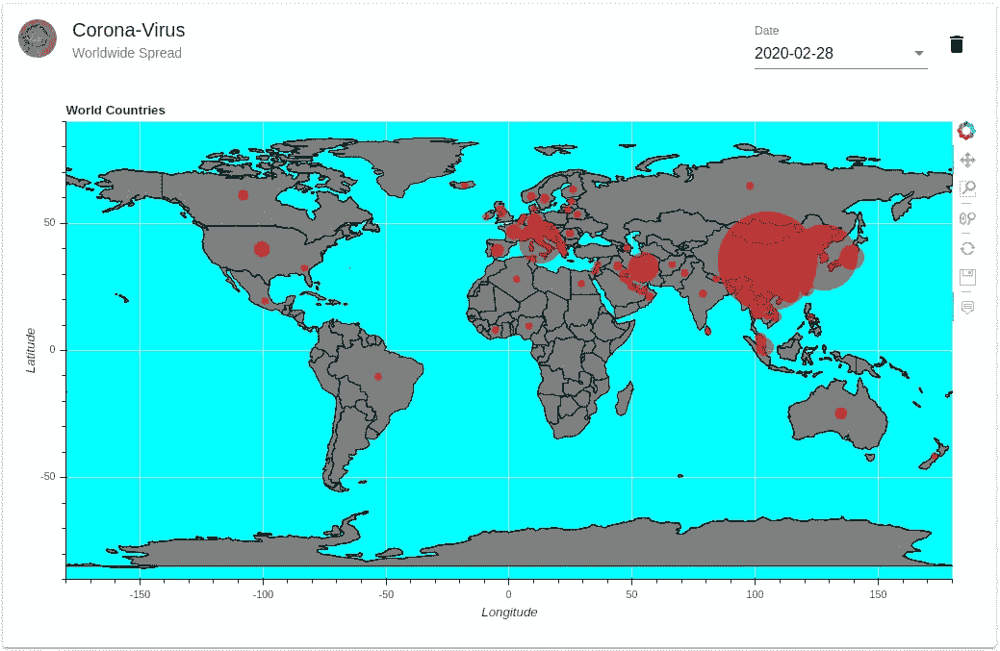
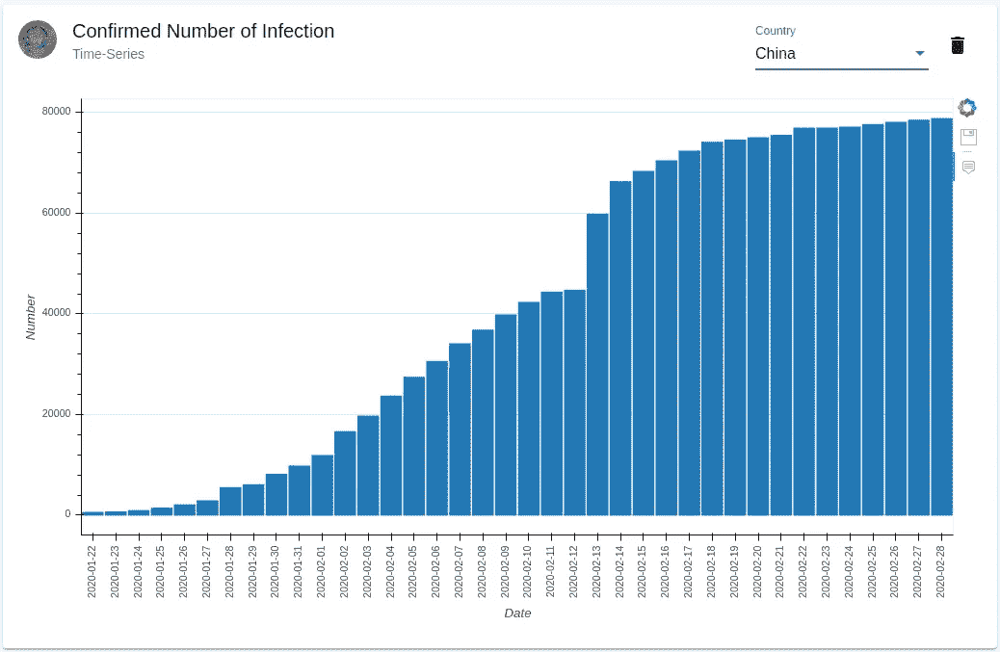

# 电晕病毒数据信息图

> 原文：<https://medium.com/analytics-vidhya/corona-virus-data-infographics-8bf835641ced?source=collection_archive---------20----------------------->

作为仪表板:

[http://infographics.quantecdc.es:8080/dashboard](http://infographics.quantecdc.es:8080/dashboard)

从 2020 年 1 月起，冠状病毒开始在中国出现一些报告的区域性病例。现在，在二月底，这种疾病显然被揭示为一种世界范围的现象，因为它很容易在我们相互联系的世界中传播，甚至最近还在以越来越快的速度传播。

本信息图表应用程序使用的数据源由链接[https://www . ka ggle . com/sudalairajkumar/novel-corona-virus-2019-dataset](https://www.kaggle.com/sudalairajkumar/novel-corona-virus-2019-dataset)提供，许可许可证为 CC0: Public Domain。数据首先由约翰·霍普金斯大学和世卫组织、疾病预防控制中心、NHC 和 DXY 收集。感谢定期更新。

# 展示世界地理数据

为了呈现数据，例如全球传播，我们使用了我们最近提出的 python 中的散景模块框架以及反应式角度前端。后端和前端完美地结合在一起。数据处理在 python 后端非常方便地完成，图表可以很容易地在 Bokeh 模块中创建，然后嵌入前端，具有更好的数据控制，因为任何事件现在都可以导致所呈现数据的重新绘制。

电晕病毒在世界范围内传播的一个有趣的方面是地理位置。幸运的是，所有国家的轮廓都可以在 github 上获得，没有任何限制性许可(【https://github.com/johan/world.geo.json】T4)。然后可以将轮廓绘制成面片。在散景中，这是通过几行代码完成的:

我们用红色半透明圆圈显示了冠状病毒感染的确认数量。面积应该主要与统计的数字成比例，但是由于与其他地方报道的小于 10 的数字相比，中国几万例感染的令人发指的数字，我们必须做出妥协:最小半径是 1，最大半径是 20(在内部数据空间单位中)。

圆圈的位置与号码所属的国家有关。我们从名为 geopy.geocoders 的 python 模块中提供的*nominam*中获得的国家坐标。

由于数据固有的时间依赖性，我们将日期作为用户可选择的参数。因此，用户可以通过从数据开始的 1 月 22 日到今天连续地改变日期，至少粗略地跟踪世界范围。正如之前已经说过的:由于中国的感染人数太多，这个观察有点偏颇。所以让我们仔细看看每个国家。

# 关注每个国家确诊的感染人数

通过分别提取每个国家的数据，可以更好地观察时间相关性。这在下面的条形图中完成。

在这里，我们想介绍一些关于熊猫的技术，这些技术可能有助于处理这类数据。在熊猫体内读取 csv 数据就像

第二行将观察数据列转换成 python *datetime* 格式，这最终是一个与字符串日期相对比的可比较对象。因为我们对每个城市或省份的数据不感兴趣，所以我们积累了关于国家列和观察日期列的数据。

为了重新排列索引并再次创建一个单独的国家和日期列，我们使用了最后三行，这对于熊猫来说也不是很明显。用户现在可以选择其中一个国家，并立即收到条形图。

# Angular 和 Python 中的事件

Angular 已经实现并建立在一个固有的事件驱动机制之上，这就是为什么将 Python 的*异步*范例与 Angular 事件检测结合起来显然是非常有吸引力的。

在 Python 方面，处理*异步*的最成熟的 web 服务器是 *aiohttp* 。它还提供了一种简单的可能性，即打开一个 websocket 服务器，Angular 客户机可以连接到这个服务器上。

上次我们发布了 angular 和 Bokeh 图表的组合，我们通过 *websocket* 连接将 json 格式的图表发送到 Angular。但是我们依赖于 ajax 调用来更新，因为 BokehJS API 主要提供了嵌入图表的黑盒嵌入方法。在更深入地研究了 API 之后，不使用 embed 方法而是一步一步地进行嵌入似乎是非常可行的。因此，我们能够提取 bokeh 文档对象，并从该对象中访问数据源。

由于互联网上有很多可用的视图示例，我们决定提供一点见解，让您了解可以对源对象做些什么，以及我们实际上如何使用它来将更新范例更改为事件驱动。

# 源对象更新

我们现在把重点放在有角的一面。首先，我们创建一个连接到全局散景对象的服务

散景库包含在 html 文件中，有以下两行:

在接收到 Python 中以 *json* 格式生成的图表项作为项后，我们可以生成一个*散景*文档对象，从中我们可以提取最相关的文档源

其中在数据模型的后端使用相同的名称“map-circles”是很重要的。实际的嵌入现在像这样工作

第三行是悬停工具正常工作所必需的。既然我们已经访问了源代码，那么继续我们通常的事件驱动更新就不那么困难了。

每当相关的 *websocket* 消息到达 *MessageService* 时，就会发出 source change 事件，这将导致一个固有的图表重绘事件。对于任何新源，该订阅必须只进行一次，并且应该确保当图表组件被移除时，订阅被取消订阅。

在我们的下一篇文章中，我们将给出更多关于事件的 python 后端处理的见解。我们认为，从我们的角度来看，使用 *websocket* 连接有一些优势，因为它还提供了显示后端事件的可能性，而这在纯 web api 中是不可能的。