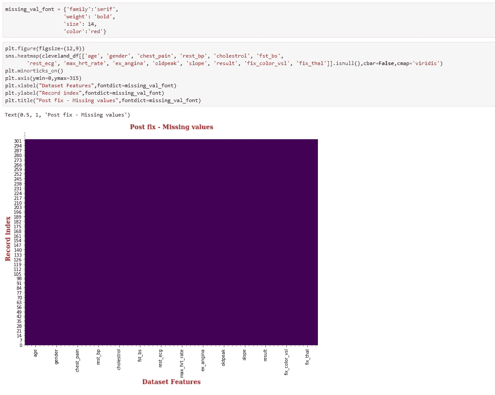
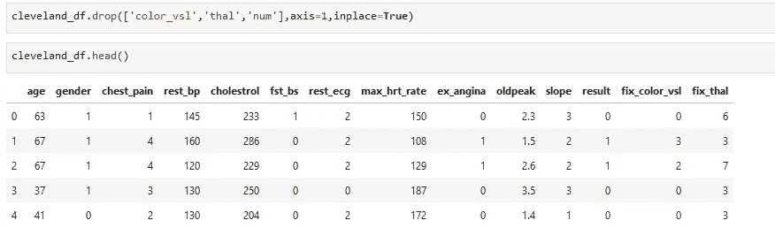
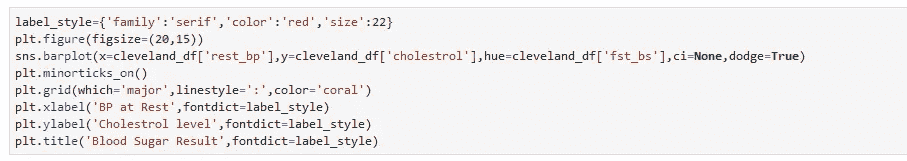
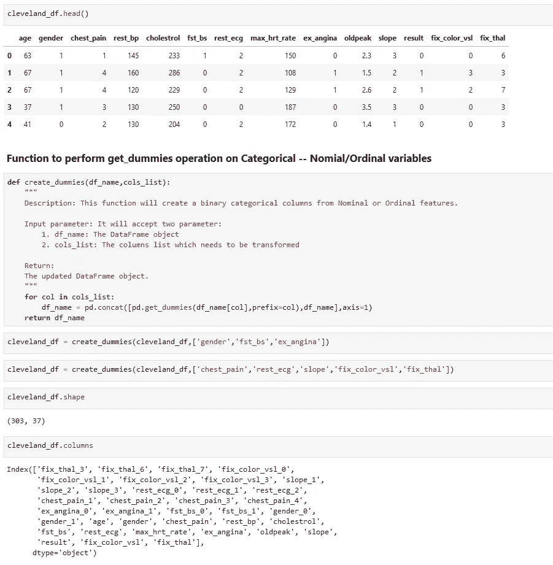
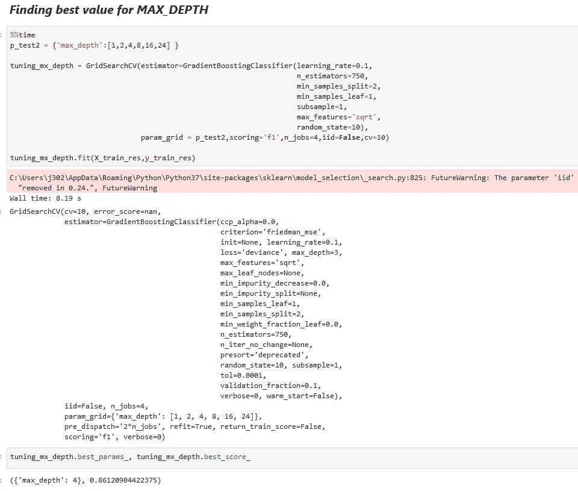

# 冠状动脉疾病预测

> 原文：<https://medium.com/analytics-vidhya/coronary-artery-disease-prediction-68a681bd7002?source=collection_archive---------6----------------------->

## 使用集合方法和推进技术


来自[疾病预防控制中心](https://www.cdc.gov/heartdisease/coronary_ad.htm)站点的图片

你听说过机器预测一个人的疾病吗？嗯，如果你有正确的数据集，那么就有可能建立一个智能系统，它可以预测疾病，甚至不需要人们通过侵入性疾病识别程序。

在这篇博客中，我将带你浏览预测一个人冠状动脉阻塞的机器学习模型。我所使用的数据集可在 [**UCI 机器学习库**](https://archive.ics.uci.edu/ml/machine-learning-databases/heart-disease/) 上获得，并由以下机构捐赠:

```
**1.** Hungarian Institute of Cardiology. Budapest: Andras Janosi,M.D.**2.** University Hospital, Zurich, Switzerland: William Steinbrunn,M.D.**3.** University Hospital, Basel, Switzerland: Matthias Pfisterer,M.D.**4.** V.A. Medical Center, Long Beach and Cleveland Clinic Foundation: Robert Detrano, M.D., Ph.D.
```

# 下载数据集

我们将使用**克利夫兰**数据集，因此从 UCI ML 资源库链接下载文件 **processed.cleveland.data** 。文件 **heart-disease.names** 中还提供了数据集特征的简要信息。

我还创建了一个单独的文档( [***特性详解 handbook.docx***](https://github.com/Rajesh-ML-Engg/Coronary_Artery_Disease/blob/master/Features%20detailed%20handbook.docx) 上传到[***GitHub***](https://github.com/Rajesh-ML-Engg/Coronary_Artery_Disease))供您参考，以深入了解数据集特性。


# 什么是冠状动脉疾病？

冠状动脉疾病(CAD)是最常见的心脏病类型，当为你的心脏提供血液、氧气和营养的主要血管(**冠状动脉**动脉)受损或患病时，就会发生这种疾病。也就是俗称的冠心病或缺血性心脏病。

# 什么导致冠状动脉疾病？

动脉中含胆固醇的沉积物(斑块)和炎症通常是冠状动脉疾病的罪魁祸首。

斑块是由动脉中的胆固醇和其他物质沉积而成的。随着时间的推移，斑块的堆积会导致动脉内部变窄，这可能会部分或阻碍血液流动。

# 导入克利夫兰数据集


导入了克利夫兰数据集


根据数据集为要素指定名称

# 数据预处理

这是我们在创建任何 ML 模型之前执行的第一步。在此步骤中，我们执行各种活动，如数据类型处理、填充缺失值、要素缩放、要素变换、异常值处理等，以清理数据集并移除不需要的噪声。

## 步骤 1:在“num”中处理类

处理多变量预测属性，即' **num** '，其中值为> 1 的记录受 CAD 影响，< 1 为非 CAD。

**在应用任何操作之前检查计数**


步骤 1.1

**查找堵塞记录的数量> 50%**


步骤 1.2

**将“数字”特征分为两类 0(堵塞< 50%)和 1(堵塞> 50%)**


步骤 1.3

## 可视化 CAD 和非 CAD 记录


## 发现缺少值('？'))在数据集中


找出要素中缺失值的计数

## 可视化丢失的记录


数据集要素中缺少值可视化

## 具有空颜色 _vsl 的记录


## 填充彩色 VSL 特征中缺失的值


修复了彩色 VSL 中缺失的值

## 填充 THAL 特征中缺失的值


修复了 THAL 中缺失的值

## 再次可视化丢失的值



这一次，我们得到了清晰的热图，任何特性都没有缺失值。

## 数据类型处理


列数据类型


UDF 更改列数据类型

## 删除不需要的列



因为我们已经为 COLOR_VSL、THAL 和 NUM 创建了更新的列，因此删除了它们的早期版本。

# 探索性数据分析

EDA 是一种主要使用可视化方法来分析数据集并总结其主要特征的方法。对数据集执行 EDA 的最佳方式是向自己提问，并尝试找到答案。EDA 的主要目标是启用数据，以便它可以告诉你超越正式建模或假设测试的见解。

## 问题 1:29-48 岁年龄组中有多少人阻塞率超过 50%？


## 问题 2:48-56 岁年龄组中有多少人阻塞率超过 50%？


## 问题 3:56-77 岁年龄组中有多少人阻塞率超过 50%？


## 问题 4:多少男性和女性有心脏病？


## 问题 5:有多少病人患有各种胸痛？


## 问题 6:静息状态下的高血压是否对应于冠心病？


**BP 组 1:[94–120]**


**BP 组 2:[120–130]**


**BP 组 3:[130–140]**


**血压组别 4: 140 或以上**


## 问题 7:高血压是否与高血清胆固醇相对应，也会导致冠心病？


## 问题 8:高血压是否对应高血清胆固醇，并导致高血糖？



## 问题 9:高血压是否与高血糖相对应，也会导致冠心病？


## 问题 10:ST 段异常对应导致冠心病吗？


解决方案-10.1


解决方案-10.2

## 问题 11:左心室肥厚与血压和胆固醇有关吗？


解决方案-11.1


解决方案-11.2

## 问题 12:左心室肥厚是否与高血糖有关，也会导致冠心病？


# 问题 13:最大心率对应于静止时的血压吗，也会导致冠心病吗？


解决方案-13.1


解决方案-13.2

## 问题 14:运动诱发的心绞痛与冠心病对应吗？


## 问题 15:运动诱发的心绞痛和老年峰如何与冠心病结果相对应？


## 问题-16:运动试验中什么样的 ST 斜率更对应 CAD？


## 问题 17:ST 段斜率与旧峰值和最大心率有关系吗？


解决方案-17.1


解决方案-17.2

## 问题-18:地中海贫血与年龄或最大心率/血压/胆固醇有关系吗？


## 处理分类变量



使用 **get_dummies** 处理分类变量

## 数据分布和异常值检测图


**功能:REST_BP**


**功能:REST_BP**


## 特征缩放和变换


## 定量(原始、缩放和转换)特征中的异常值可视化


原始要素和缩放要素中的异常值


变换后的要素中没有异常值

# 特征相关图


# 模型选择和评估


**分叉特征和标签**

## 导入所需的包并执行数据过采样


**朴素贝叶斯**


**梯度提升分类器**


# 模型超参数化/调整


**学习率和 N 估计量**



**最大深度**


**最小样本 _ 叶和最小样本 _ 分割**


**MAX_FEATURES**


**子样本**

## 超参数化后的结果


恭喜你，我们已经到了这个博客的结尾。总之，我们使用心脏病数据集来确定对一个人的心脏病进行分类的最佳分类算法。此外，我使用了各种机器学习模型来最准确地预测结果。

> **如果你想下载这个博客的 Jupyter 笔记本，请访问下面的 GitHub 库:**
> 
> [**https://github.com/Rajesh-ML-Engg/Coronary_Artery_Disease**](https://github.com/Rajesh-ML-Engg/Coronary_Artery_Disease)

谢谢你，祝你学习愉快！！！！