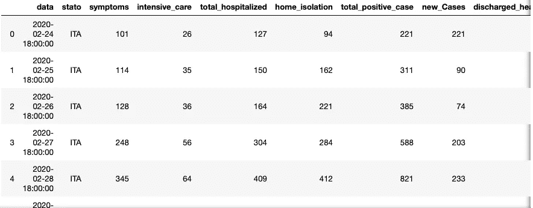
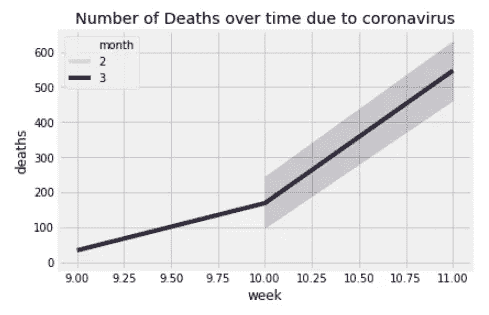
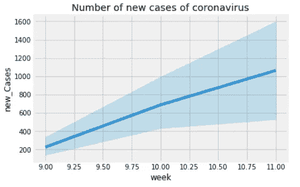
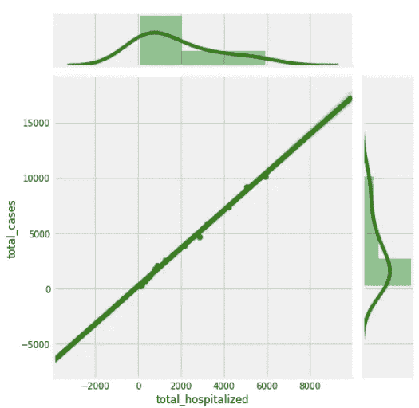
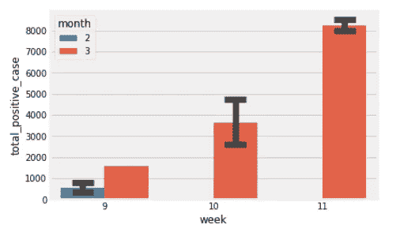

# 使用 Python 数据可视化对意大利数据集进行冠状病毒分析

> 原文：<https://medium.com/analytics-vidhya/coronavirus-analysis-for-italy-dataset-using-python-data-visualization-eceea6a64840?source=collection_archive---------22----------------------->

我最近在意大利用 python 熊猫做了一些分析冠状病毒的可视化。使用的数据集是意大利的新冠肺炎趋势，可从 Kaggle 获得。考虑了国家数据，在重命名列名后，如下所示:



任务是使用机器学习算法预测未来几周冠状病毒导致的死亡人数。遵循 KDD 方法来实现最终目标。在进行探索性数据分析时，我使用 Python 数据可视化(如 seaborn)绘制了几幅图。为了更好的可视化，我从数据栏中分别提取了日、月和年。

我们可以看到，死亡人数以及冠状病毒新病例的数量每周都在增加，预计还会增加更多。

# 一周内死亡人数和新报告的冠状病毒病例:



为了研究两个数值变量之间的关系，我们可以使用 seaborn 的 jointplot()函数绘制图表来显示相关性。

## 例子

```
import pandas as pd
import numpy as np
from matplotlib import pyplot as pltimport seaborn as sns
%matplotlib inlinesns.jointplot(x=”total_hospitalized”, y=”total_cases”, data=df_National , kind=”reg”,height=6.5, color=”g”)
```

## 总病例数和总住院数之间的线性关系:



该图显示了冠状病毒报告病例总数和住院人数之间的相关性。这之间存在线性关系，数据点非常接近回归线，这表明预测的误差幅度非常小，相关性非常强，这表明随着总病例数的增加，大多数人正在住院治疗，这是一个积极的迹象。

## 一周内冠状病毒阳性病例总数:



本周和上周的阳性病例总数

```
sns.barplot(x="week", y="total_positive_case", data=df_National , capsize=.2,hue="month",ci=68)
```

该图清楚地显示，在第十周和第十一周，冠状病毒阳性的人数一直在以几乎两倍的频率增加。可以通过 seaborn barplot 的“色调”参数对月份进行颜色编码。条形图上方的线条称为误差线，表示估计值的不确定性。

Seaborn visualisation 使绘制单变量和双变量以及它们之间的比较变得容易。显示线性关系(如上所示),并用调色板绘制各种模式的复杂数据。

快乐学习。保持观想！！