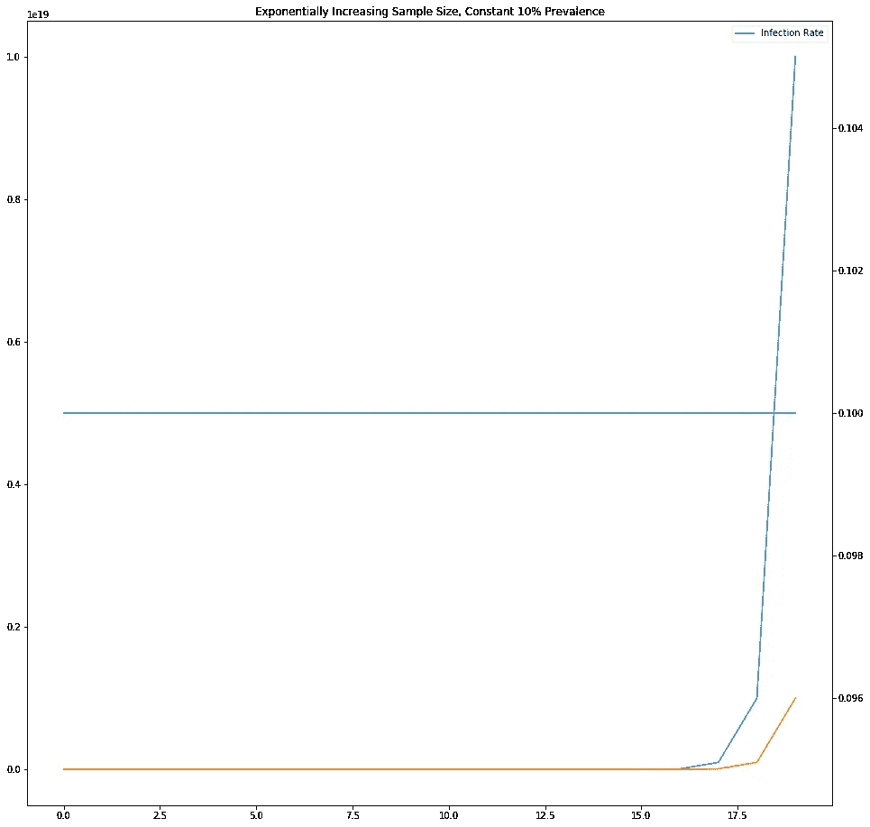
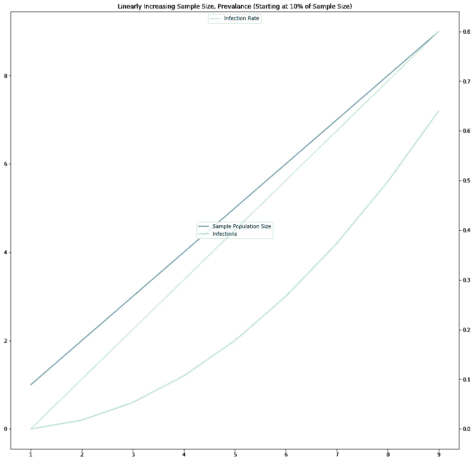

# 冠状病毒和增加样本量或发病率与患病率的谬误

> 原文：<https://medium.com/analytics-vidhya/coronavirus-and-the-fallacy-of-increasing-sample-sizes-or-incidence-versus-prevalence-50630a6f4f06?source=collection_archive---------18----------------------->

图片来自[像素](https://www.pexels.com/photo/grayscale-photography-of-people-walking-in-train-station-735795/?utm_content=attributionCopyText&utm_medium=referral&utm_source=pexels)

感染者总数的增加可能看起来像是一种流行病的迹象，它可能是，但它也可能只是反映了样本量的增加。

例如，如果一种疾病影响 10%的均匀分布的人口，那么 1000 人的样本可能显示大约 100 人被感染。

如果被检测者的样本数量增加，那么样本中受感染人数的增加速度可能与样本数量的变化速度相同。

从同样的 10%感染人群中，10，000 人的更大样本可能收集到大约 1，000 名感染者。50，000 个样本将收集 5，000 个感染者。因此，受感染的人数随着样本量的增加而增加。无论总体样本量是线性增长还是指数增长，还是以其他方式增长，这一点都适用。

因此，呈指数增长的受感染人数可能是呈指数增长的样本量的余数。虽然这些数字看起来似乎在快速增长——高发病率——但流行率——总人口中的总体感染率——可能是稳定的，甚至是下降的。

在这种情况下，发病率——样本人群中的事件/感染数量——可能是更有用的衡量标准，而不是总感染数。

发病率也可以看作是一个平均值，即样本人群中被感染的平均人数。如果每个样本的发病率都徘徊在一个共同的水平，如美国冠状病毒的 12%，那么根据中心极限定理，这些平均值的平均值将接近整个人口的平均值，即 12%。

比较两个样本，仍然有证据表明从一个样本到一个更大样本的感染率在增长，它必须大于样本大小的变化。如果样本量呈指数增长，那么感染的数量将需要比指数增长更多，以表明感染率的增长。

例如，下图显示了一个感染率恒定(10%)但样本量呈指数增长的人群。橙色部分显示的感染人数与样本量成正比。

这是另一个样本量随着感染率的增加而线性增加的例子。感染总数的增长速度超过了样本量的变化。

当然，感染率从来都不是完全一致的，因此发病率的变化可能是来自不同人口统计、高危人群或任何因素的样本偏差的结果。