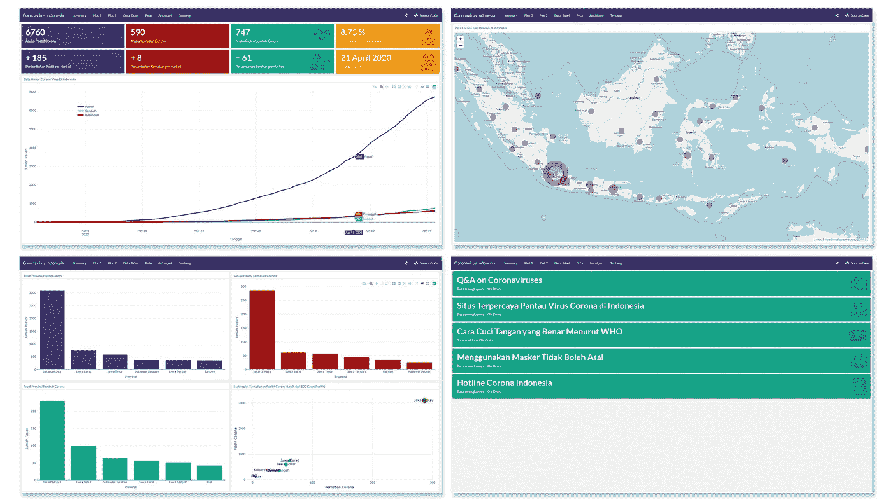
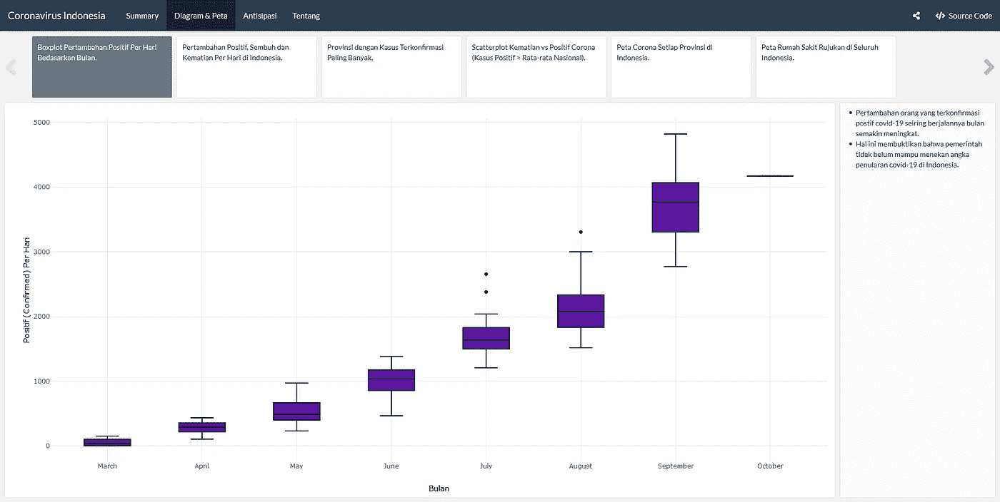
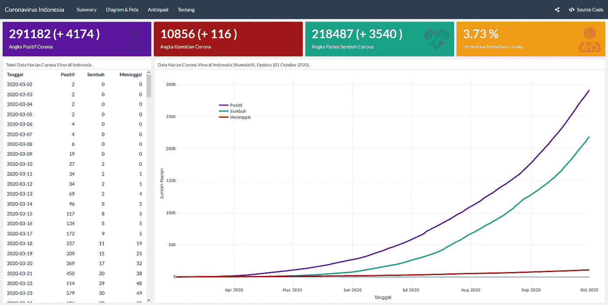

# 印度尼西亚冠状病毒仪表板使用 r。

> 原文：<https://medium.com/analytics-vidhya/coronavirus-indonesia-dashboard-6d7fe65d7973?source=collection_archive---------22----------------------->

大家好。在这篇文章中，我将向你展示我在印尼进行的关于疫情冠状病毒的项目。是啊。最后我用 R 和 flexdashboard 库做了 dashboard。我从 2020 年 4 月开始做这个仪表盘，4 天就完成了。我意识到这个仪表板并不完美，但我很自豪能完成这个仪表板。

# 概述。

**2019–20 冠状病毒疫情**是由[严重急性呼吸综合征冠状病毒 2](https://en.wikipedia.org/wiki/Severe_acute_respiratory_syndrome_coronavirus_2) (新型冠状病毒)引起的[冠状病毒病 2019](https://en.wikipedia.org/wiki/Coronavirus_disease_2019) (新冠肺炎)正在进行的[疫情](https://en.wikipedia.org/wiki/Pandemic)。2019 年 12 月在中国武汉[发现疫情。(来源:维基百科)。](https://en.wikipedia.org/wiki/Wuhan)

这种病毒于 3 月初进入印度尼西亚。这种病毒在这里传播很快。印度尼西亚是东南亚阳性病例最多的国家。

所以，我对制作一个简单的图表很感兴趣，这个图表很容易理解这种病毒在印度尼西亚的传播。

# 关于这个仪表板。

这个仪表板简单地解释了印度尼西亚冠状病毒的描述。这些数据是从 PNPB(https://BNP b-in acovid 19 . hub . ArcGIS . com/datasets/statistik-perkembangan-covid 19-Indonesia/geo Service)使用 API (Web Service)实时获取的。

我用 R 和一些帮助我完成这个仪表板的库做了这个，如下所示。

*   flexdashboard —创建具有闪亮运行时的仪表板
*   httr —通过 API 服务获取数据
*   jsonlite 将 json 格式的数据转换为数据框
*   tidyverse —更改/调整数据的形式
*   plottly—制作一个互动的情节
*   看门人-清理数据框
*   传单—创建地图

> 如果你想看这个仪表盘的结果，请访问[https://amrirohman.shinyapps.io/dashboard-coronavirus/](https://amrirohman.shinyapps.io/dashboard-coronavirus/)
> [https://amrirohman.shinyapps.io/dashboard-coronavirus/](https://amrirohman.shinyapps.io/dashboard-coronavirus/)
> [https://amrirohman.shinyapps.io/dashboard-coronavirus/](https://amrirohman.shinyapps.io/dashboard-coronavirus/)

# 总体特征。

这个仪表板的一些功能包括，实时更新，交互式绘图，绘图，日冕预测。

桌面视图的屏幕截图。21/04/2020.

## 更新功能 01/10/2020。

*   添加印度尼西亚每日逐月正增长的箱线图。
*   添加印度尼西亚每天正增长、治愈和死亡的折线图。
*   添加确诊病例最多的省份的条形图。
*   添加整个印度尼西亚的转诊医院地图，包括地址和电话。
*   更改印度尼西亚每个省的日冕地图的外观。
*   更改仪表板布局。

桌面视图的屏幕截图。01/10/2020 (1).

桌面视图的屏幕截图。01/10/2020 (2).

# 谢谢你。

阿姆里·罗曼。
西多阿茹，东爪哇，身份证。