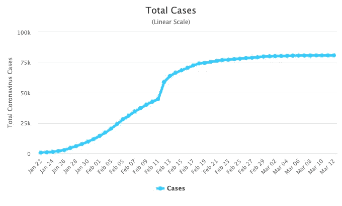

# 冠状病毒:它在减速吗？

> 原文：<https://medium.com/analytics-vidhya/coronavirus-is-it-slowing-down-b19e0f6270d3?source=collection_archive---------16----------------------->

## 这些数字如何帮助我们理解病毒的传播？遏制措施有效吗？

名为新冠肺炎的冠状病毒已经成为全世界的敌人。现在是我们一起行动，结束这种状况的时候了。

截至 3 月 13 日，共有

*   110 多个国家受到影响
*   13 万多个案例
*   接近 5000 人死亡

## 这些数字如何帮助我们理解病毒的传播？我们看到指数增长了吗？还是逻辑增长？

[疾控中心](https://unsplash.com/@cdc?utm_source=medium&utm_medium=referral)在 [Unsplash](https://unsplash.com?utm_source=medium&utm_medium=referral) 拍摄的照片

# 数据，数据和数据

如果我们看看患者的累计人数，就会发现这是一幅看不到尽头的可怕画面。看起来它在 2 月 23 日左右开始减速。但不幸的是，它在那个时候开始在其他国家传播。

来源:[https://www . worldometers . info/coronavirus/coronavirus-cases/](https://www.worldometers.info/coronavirus/coronavirus-cases/)

每个国家应对病毒的方式都不一样。每个国家在以下方面都不同

*   政府的回应
*   天气和其他因素
*   人们的行为

总的来说，如果每个国家都能消灭这种病毒，我们就能打败它。这使得了解一个国家的累计患者数变得至关重要。

让我们以韩国为例。起初，它看起来像一个指数增长，直到二月底。此外，与此同时，政府领导了大规模的打击病毒。这似乎减缓了增长速度。

现在，这似乎更像是一种逻辑增长。

来源:[https://www.worldometers.info/coronavirus/country/China](https://www.worldometers.info/coronavirus/country/China)

# 什么是逻辑增长？

假设你在你的办公室里散布了一个关于你老板的谣言。你告诉你的朋友，你的朋友又告诉另外两个人。这两个人告诉四个人。谣言呈指数级传播，但最终会趋于平稳(因为没有人没听过这个谣言)。

谣言的增长是逻辑增长(尽管它是以指数形式开始的)。

一些国家的人口也出现了同样的情况。最初，它开始呈指数增长，但随着资源的减少，它趋于平稳。

*   韩国人口曲线在 20 世纪 70 年代增长后似乎趋于平稳。

来源:[https://www . world ometers . info/world-population/south-Korea-population/](https://www.worldometers.info/world-population/south-korea-population/)

这里有一张来自可汗学院的图片，以便于理解

来源:[https://www . khanacademy . org/science/biology/ecology/population-growth-and-regulation/a/exponential-logistic-growth](https://www.khanacademy.org/science/biology/ecology/population-growth-and-regulation/a/exponential-logistic-growth)

作为参考，

*   人均增长=病毒增长
*   如何使其成为逻辑斯蒂曲线？世卫组织和其他国家建议的遏制和其他措施。

关于数学参考，可以参考这篇[文章](https://towardsdatascience.com/covid-19-infection-in-italy-mathematical-models-and-predictions-7784b4d7dd8d)

回到冠状病毒的传播，我们也可以看到中国在控制病毒方面的努力导致了逻辑增长。现在这种病毒在中国似乎趋于平稳。

来源:https://www.worldometers.info/coronavirus/country/China

# 如何判断何时从指数型向逻辑型转变？

我们都需要寻找拐点。

*   每天的生长开始变慢
*   如果昨天有 500 个病例，今天有 450 个，明天有 420 个——这是一个迹象，表明该国采取的所有措施正在取得成功。

正如我们在意大利看到的那样(截至 3 月 13 日)，它仍然呈指数增长。严厉的遏制措施应该有助于意大利实现物流增长。

来源:[https://www.worldometers.info/coronavirus/country/Italy](https://www.worldometers.info/coronavirus/country/Italy)

# 结论

每个国家的情况是怎样的？我们可以将它们分类为

*   初期阶段(受影响国家少于 1000 个)
*   受影响最大的国家(受影响国家超过 1000 个)

受影响最大的国家可进一步分为

*   指数增长阶段(不到一周病例翻倍)
*   减速(实现逻辑增长)

目前，在受影响最严重的国家中，中国和韩国的增速正在放缓(截至 3 月 13 日的数据)

*   中国:我们可以说它已经实现了逻辑增长并趋于平稳
*   韩国:病毒似乎正在实现逻辑增长，可能会稳定下来。

在其余受影响最严重的国家(伊朗、西班牙、法国、德国、美国)，它仍处于指数增长阶段。在意大利，我们看到政府采取了严厉的遏制措施。极端的遏制措施应该有助于意大利实现物流增长。

每个国家都应该效仿，学习意大利遏制措施的利弊，实现物流增长。如果他们仍然看到指数增长，可能会采取激烈的措施。

当有更多的数据时，我会及时通知你。