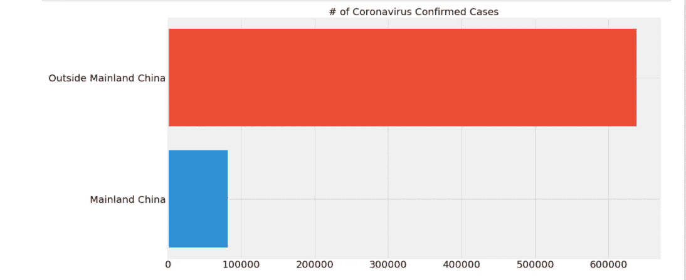
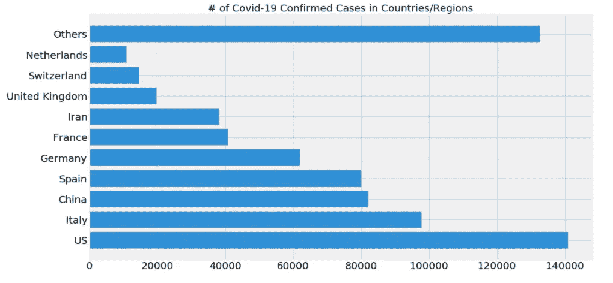

# 冠状病毒:脸书先知和时间序列分析预测 2020 年 4 月

> 原文：<https://medium.com/analytics-vidhya/coronavirus-predictions-support-vector-machine-facebook-prophet-8441ee95204?source=collection_archive---------20----------------------->

来源:https://dph.georgia.gov/novelcoronavirus

冠状病毒传播非常快，但太快了，无法预测未来的病例、康复和死亡。在这篇文章中，我分享了一些关于如何使用[脸书先知](https://facebook.github.io/prophet/)应用时间序列分析的技术，并且我应用了冠状病毒流行病的实时可视化。此分析仅用于教育目的，没有其他目的，只是为了展示如何将这些机器学习库和算法应用到现实世界中的见解。提供的数据将以 [Jupyter 笔记本](https://jupyter.org/)格式。

> 此分析仅用于教育目的，没有其他目的，只是为了展示如何将这些机器学习库和算法应用于现实世界现象的见解。

来源:[https://www.grammarly.com/blog/how-to-measure-goals/](https://www.grammarly.com/blog/how-to-measure-goals/)

# 目标

这个项目的目标是在没有所有媒体的情况下，帮助揭示冠状病毒在世界上到底发生了什么。围绕新冠肺炎有很多研究和数据。该分析旨在通过更新数据帮助提供有用的见解。

*   获取新冠肺炎的最新数据
*   应用支持向量机学习模型
*   应用多项式回归机器学习模型
*   应用时间序列分析
*   分析确诊、死亡和康复病例
*   在图表中可视化数据
*   从数据中得出结论

来源:[我的代码](https://github.com/Andre-Williams22/Coronavirus-Analysis)

# 数据源

来源:[https://github.com/CSSEGISandData/COVID-19](https://github.com/CSSEGISandData/COVID-19)

来源:[https://media . tenor . com/images/edee 3 F2 b 307 be 864038318 eafbc 7d 5 ad/tenor . png](https://media.tenor.com/images/edee3f2b307be864038318eafbc7d5ad/tenor.png)

# 边注

但是在我们开始之前，有一些基本的事情需要注意。

**数据少**:由于现在可用的数据没有那么多，我们的预测可能没那么准确。

**存在有效的治疗或疫苗或药物**:在存在有效的治疗或药物的情况下，疫情的结果将急剧下降，这可能会影响我们的预测。

> 这种分析完全是出于教育目的

# 脸书先知预测分析代码

## 工作流程(游戏计划)

*   获取和准备数据
*   将我们的数据按日期分组
*   为 FB Prophet 专门将我们的专栏重命名为 ds 和 y
*   将我们的数据集分成训练和测试两部分
*   建立我们的模型并做出预测
*   绘图预测

# 代码亮点

## 所有代码如下:

> 这种分析完全是出于教育目的

# 多项式回归、支持向量机和可视化代码

> 这种分析完全是出于教育目的

# 更多代码亮点:

来源:https://store.steampowered.com/app/497350/Conclusion/

# 结论

## 脸书先知

总之，我们可以看到我们的预测和测试数据与脸书先知和时间序列分析有一些相似之处。我们还可以使用 add_changepoints_to_plot 函数来检查趋势中发生变化的点。

## 支持向量机和多项式回归

看起来我们的测试数据很好地拟合了两个模型的数据，但是仍然需要更多的工作和调整来获得最佳的精度。我可以通过交叉验证来调整训练和测试划分，以获得更好的结果。然而，更多的数据将是理想的，以便在模型上产生更大的差异。

## 全部的

基于我们的预测和我们对测试数据集的绘图，我们可以在我们的绘图中看到一些相似之处。看起来我们的模型正在走上正轨，因为它显示了确诊病例数量的增加——正如我们的测试数据集显示的那样，这是一种上升趋势。

> 我希望这篇分析能帮助并激励你超越媒体，用可信的数据来源做你自己的分析。在外面注意安全！

# 更多关于我的事

 [## Andre Williams -数据分析和数据科学实习生-美国电话电报公司| LinkedIn

### 在全球最大的职业社区 LinkedIn 上查看 Andre Williams 的个人资料。Andre 在他们的清单上列出了 5 份工作…

www.linkedin.com](https://www.linkedin.com/in/andrewilliams22/)  [## 安德烈·威廉姆斯-中等

### 用户面试！听说过吗？这是花生酱和果冻三明治里的花生酱。许多人未能…

medium.com](/@andre_williams)  [## Andre-Williams22 -概述

### 在 GitHub 上注册你自己的个人资料，这是托管代码、管理项目和构建软件的最佳地方…

github.com](https://github.com/Andre-Williams22)