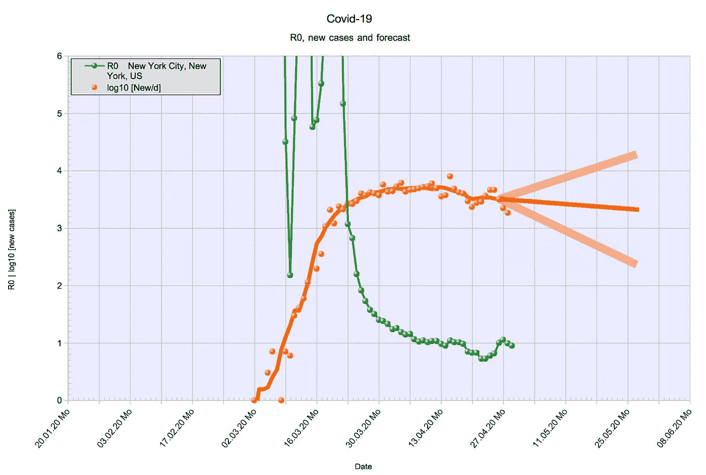

# 冠状病毒——R0 的非直观特性

> 原文：<https://medium.com/analytics-vidhya/coronavirus-the-non-intuitive-properties-of-r0-2ce1aaea09b5?source=collection_archive---------17----------------------->

2020 年 5 月 1 日 1.1 版

线条(照片 Falk Lumo —经许可使用)

当前对新型冠状病毒疫情的讨论让我们都成了高等数学专家。或者至少看起来是这样，因为每个人都在流利地谈论 R0:)

我想更深入地了解它是什么，它意味着什么，它是否重要。

# 1 基线，它是什么

这里我们讨论再生数 r，或者它的近亲，基础再生数 R0。或者人数，平均任何一个感染者都会感染。并且在某个平均时间(世代时间 G)之后，这些人会感染另外 R 个人，每个。因此，最初的人将在两倍的世代时间 2T 后感染 R*R(或 R^2)。或 3G 时代后的 R^3 等。你明白了。如果 R=3 人，G=4 天[ *RKI* ]，那么在 4、8、12、16、20 天或 3 周之后，将会有 3、9、27、81、243 人。平均来说。这并不意味着一个人不能直接感染 100 个人。不幸的是，它可以，而且有已知的例子。

生成时间 G 基本上是疾病的属性。新型冠状病毒病毒的潜伏期约为 3-14 天，平均为 5 天。潜伏期过后，症状出现。平均在症状出现前一天，此人似乎最具传染性。这解释了 G=4 天的生成时间。虽然 G 不太容易受到社会反应的影响，但 R 当然会。r 取决于病毒的传染性。以及我们如何通过隔离感染者来对抗。

**第一个惊人的性质**:I(t)多快，如果 R 保持不变，感染人数可能增长。在 R=3，G=4 的情况下，你认为从 1 个人开始感染 78 亿世界人口需要多少天？83 天。你会猜得更高吗？
这种增长被称为“指数增长”，写为

> I(t)= R * I(t-G)= I(0)* exp[log(R)* t/G]

函数 I(t)增长非常快，即指数增长。对 R 的微小改变会对以后的 I(t)产生巨大的影响。比如 28 天后 R=2 和 R=3 的差别不是 50%，而是 1700%！

**第二个令人惊讶的特性**是当 R 小于 1 时，I(t)下降到负 0 有多快。在 100 万人被感染且 R=0.5 的情况下(例如，平均而言，只有每隔一个人感染另一个新的人)，只需要 80 天就可以将病毒复制(没有人类宿主留给病毒存活)。因为指数函数不仅增长得非常快，而且收缩得也非常快。那是病毒害怕的事情……；)最初的 SARS 病毒就是这样在 2003 年灭绝的。在实践中，事情并不那么简单，稍后再详细介绍。

你会听到基本繁殖数 R0，它等于流行病早期的 R。然而，随着越来越多的人被感染并变得免疫，留给病毒感染的人越来越少。从 R0 中，我们必须减去已经感染的人数:

> r(t)= R0 *(1-I(t)/人口)

R(t)被称为“有效 R ”,它随时间而变化。R(0) = R0，这解释了它的名字；)有效 R 最终变为 1，感染达到 I(t)/人口= (1 - 1/R0)时 R(t)=1

在数字中，1–1/R0 在 R0=3.0 时为 67%，在 R0=2.4 时为 58%。如果这个百分比的人口已经被感染，那么有效 R 就自动变成 1.0，流行病就停止了。这种效应被称为“群体免疫”:虽然不是所有的个体都免疫，但病毒仍然无法再感染群体。

这是第三个令人惊讶的特性:流行病在每个人被感染之前就已经停止了。这是一个图表，显示了一种流行病如何在常数 R0=2.4 的情况下传播，从 1.7 亿人口中的一个病例开始:

12 周后一切都结束了。注意纵轴是对数。群体免疫的效果只在最后几周可见，然后阻止疫情。下面是 R0=2.4 的有效再生数的图表:

R0=2.4 时的 R eff (t)

这些图表是由我用来确定不同国家 R0 的工具生成的。该工具并不总是计算 R 的精确值，但它对统计波动具有鲁棒性。这足以说明我在这里提出的观点。

请同时注意，真正的流行病，即使没有得到控制，也不会像上面的图表所描述的那样发展。人们会注意到这一点，并改变他们的行为，减少 R 并“拉平曲线”。但是你明白了。

现在我们知道什么是 R，什么是 R0。

# 3 R 的标度性质

如果我们让世界慢下来会发生什么？说，把它减速到一半速度。凭直觉，我们会认为这种流行病的传播速度也会减半。然而，这根本不会发生！

会发生的是 R0 会变成一半。比如说 1.5 剩余部分将变成 0.75。这意味着这种流行病不是以一半的速度传播，而是实际上被终止了！

**第四个令人惊讶的特性**是流行病的传播与人类活动的速度不成正比。远非如此。

所以从理论上来说，在疫情被阻止之前，我们可以通过某种因素减缓所有人类活动，迫使 R0 低于 1。比如说，增加 3 倍。做我们做的任何事，但只是每三天一次。或者每天只有三分之一的人口。那真的会有用！工作时间、拜访朋友、聚会、薪水、购买、购物、房租、利率，所有的一切除以 3，病毒就消失了。只有一个警告:不是所有的机器都可以暂停，生物学不能暂停(我们仍然要吃饭、理发、需要医疗等等。以正常速度)、电力、水等。不能暂停等。而是因为这些活动(农业、水电生产等。)是高度自动化的活动，并且机器不会感染病毒，我们实际上离能够遵循“慢下来”而不是“锁定”的策略并没有那么远。至少在工业化国家是这样。这是可行的，因为这种病毒是生物性的，不能自我减速。

我觉得 R 的标度性质没有被完全理解，否则，社会普遍减速的想法会被考虑。

# R0 是否衡量群体的行为？

一个普遍的想法是 R 是一个群体中(传染性)活动的量度。即，如果 R 增加，那么人们已经变得更活跃或更不谨慎，以便感染比以前更多的人。

R 的第五个令人惊讶的特性是，它不是一个群体中可能的传染性活动的直接度量——至少不是以一种直接的方式。

更准确地说，R 可以在任何个体都不改变其行为的情况下改变。一般来说，即使人们保持完全相同的行为，R0 也会随着时间的推移而增加。下面是具有恒定行为(恒定行为随时间变化)的合成群体的 R 随时间变化的图:

非均匀总体的 r(t)——合成示例

R0 从 0.75 开始，增加到 1.5，稍后再次回落到 0.75。这是一个合成的例子，所以我们可以确切地知道为什么会发生这种情况:人口中有 99%的人繁殖数为 0.75，加上 1%的人繁殖数为 1.5，甚至两个亚人口之间没有任何相互作用。下面是一段时间内导致感染的图表:

较小亚群中的病例数增长更快，直到它在感染中占主导地位。并且只有在该亚群体内达到群体免疫后，整个群体(在本例中为 1 亿)才会将总体 R 降低到 1 以下并停止流行。这种 R 的增加是由受流行病影响的人群中较小但更具传染性的群体造成的。这导致了一个教训:

R 的第六个令人惊讶的特性是，在流行病的早期阶段，存在的病例(每个居民)越多，就越难降低 R(到低于 1 的值),也就是说，流行病持续的时间越长，控制它的时间越晚，速度越慢。早期阶段是群体中没有少数群体获得群体免疫的阶段。

这是任何群体都是异质的结果。事实上，人口比我们的 1%少数民族的例子要复杂得多。如果你将一个群体中的所有个体按照他们的联系次数排序，你会得到一个类似 Zipf 定律的分布:很少人有很多联系，大多数人只有很少的联系。在一场持续的流行病中，越来越少的个体(但接触越来越多)最终会被感染，R 必须改变。理论上，这些更少的个体实际上可以在早期被感染，超级传播者中的群体免疫可能会发展(没有超级传播者留下来感染)。那么 R 实际上会减少，如上图右半部分所示。在任何情况下，R 都是变化的，为了正确理解它，必须单独研究人口中的少数民族。我的工作实际上可能有助于提取子统计量，并对 R0 进行评估。

另一个典型的考虑是集群感染:一种感染被注入到一个具有潜在繁殖数 R 的同质群体中，会发生什么？嗯，如果 R>1，注射病例将在人群中造成不受控制的爆发。

但是，如果 R <1, the effect is more sophisticated: the injected case will, or will not create a few infections, which will infect a few more. R may appear to be > 1 代表一代人，或者两代人。但最终疫情会逐渐消失。让我们把这样一个集群想象成从边界注入的个体和案例的补丁:然后看起来好像注入从外部穿透补丁而不能到达深处。原来，then -1/log(R)是一种渗透深度，外界感染可以渗透人群多深。R 越小，外部感染造成的伤害越小。解除旅行禁令时，这是一个重要的考虑因素:R 必须低于 1，并与 1 保持安全距离。

最后一个细节:少数民族是否与其他人群有联系并不重要。如果它们是，并且一个的 R 高于 1，另一个低于 1，那么这种影响可以被认为是来自更具传染性的少数群体的渗透努力。

说了这么多，我们在下面仍然通常假设 R 是一个群体行为的量度。即 R 的变化是由集体行为的变化而不是流行病发展的动力学所主导的。但是我们必须保持警惕，我们可能会偶然发现例外。比如在工人宿舍、疗养院或医务人员中爆发。

# 5 如何根据公布的数据计算 R

这篇文章的一个主要目的是让“R0 数学”对更广泛的读者来说更容易理解。不仅要理解它的真正含义，还要进行自己的计算，也许是为了当地社区或人口中的弱势群体。

因此，我记录了从已发表的案例数中获得 R0 的方法。对于本文中出现的所有图表(除了综合思维实验)，数据来自约翰·霍普斯金大学[ *JHU* ]的 Corona 仪表板。算法如下:

1.  检索数据，每日报告病例的时间序列。
2.  计算每周新病例数，作为一天与前一周的差值(t 和 t-7)。除以 7，这是每日新病例的滚动平均值。我们称之为 *d(t-3 天)*。这及时调整平均窗口中间的 t。
    我们使用 7 天平均值，因为在许多国家/地区，每日病例对报告日期的依赖性太强。
3.  除以 *R0(t) = d(t-3 天)/d(t-7 天)*；使用 *d* 相差 *G=4 天*！

这是一个非常简单的方法。我尝试了更多的方法，其中一些在数学上相当复杂。但最终，以上简单的方法占了上风。该算法的部分灵感来自德国罗伯特·科赫研究所为其政府公报[RKI]使用的算法。稍后会详细介绍。此外，R0(t)的测量相对于在时刻 t 进行的实际感染延迟了很多。

# 6 如何将测得的 R 与现实世界联系起来

在任何给定的一天 *t* ，感染活动可以用该天 R 的真实值 R(t)来描述。每名已感染者当天的感染人数。然而，这个数字不能直接测量。有许多延迟:

1.  一个人被感染后，需要 *Ti=5 天*(平均)才会出现症状——潜伏期。
2.  有了症状，需要 *Tt* 天去看医生，做测试，得到测试结果，将结果报告/添加到数据库，并查询数据库。如果每一步都是另一天，我们将得到 *Tt=5 天*。
3.  我们需要几天时间来观察病例并计算出一个统计稳定值。这又是一个 *Tc* 天的延迟。

为了评估 *Tc* ，我们可以使用上述算法计算 R 的响应函数:

R(t)的边缘响应函数—真实 R 在 03.02 处改变。、24.02 和 16.03。

我们观察到在 *Tc=7 天*时对变化有 50%的响应。这并不奇怪，因为我们使用的是滚动周平均值。

上述 *Tt* 的值是一种推测，取决于国家和数据源。德国罗伯特·科赫研究所使用两个连续的 4 天时间窗来确定 R，忽略最后 3 天。但是他们使用报告的症状开始日期，这给出了 *Ti=0* 。但这些日期是不完整的，必须预测，这就是为什么他们忽略了最后 3 天。这种方法被称为临近预报。它产生较低的总延迟，但需要访问更详细的报告数据。RKI 方法的相应边缘响应函数为:

RKI 算法 R(t)的边缘响应函数—真实 R 在 03.02 处更改。、24.02 和 16.03。

这也对应于 *Tc=7 天*——尽管斜率稍陡。为了确定德国的 Tt，我比较了官方公布的 R0 [RKI]数据和我的方法得出的数据。

由于我们稍后会需要，我还会在图表中添加移动数据(GGL)和实际病例数。

德国 R0:由我的方法计算(绿色)，由德国 RKI 计算(深蓝色)，流动性指数(浅蓝色)和每日新增病例数的 log10(橙色)。

这张图表将在后面的章节中详细讨论，因为它在德国引发了一场政治讨论。这里我们只需要深蓝色和绿线之间的时间转换。这两条线并不完全匹配，但最接近的似乎是 7 天。留给我们的是 *Tt=7 天*德国。

那么德国的总延迟 *Td = Ti+Tt+Tc* 就是 *Td=19 天*(我的方法)和 *12 天* (RKI 方法)。

让我们在这里做一个快速的合理性检查——这可能吗？

我们看到真正的 R0 早在 2 月 29 日就在德国达到高峰，一个只有 79 例的星期六(3 月 10 日减去 12 天)。远在各州州长采取任何措施(从 3 月 9 日开始)之前。早在流动性开始下降之前。另一方面，德国人很好地注意到了当天来自法国和意大利的坏消息:“*在意大利，本周末有五场关键的足球比赛被推迟。这显然让欧洲其他国家的许多人感到震惊；)所以是的，R0 早在二月底在德国的反应实际上是可信的:人们没有立即取消他们的活动，但他们可能已经开始更加谨慎地行动(没有拥抱等)。).*

这是**第七个令人惊讶的特性**:在不受控制的流行病中，人们可能会根据感知到的威胁迅速调整自己的行为，并在 2-3 周后改变 R0，而没有明显的原因。R0 对即使很小的行为变化也很敏感，但有很大的时间延迟。这就像一个装有水容器的烧开的盘子:稍微转动一下旋钮确实会有影响——但前提是你有足够的耐心观察这种影响。试图对计算的 R0 的当前值采取行动就像使水沸腾或变冷。

R0=0.7 和 1.3 之间的差异是 19 倍的巨大差异，19 天后测量结果出来(12 天后是 6.4 倍)。因此，R0 不应下滑如此大的误差幅度。R0 为 0.9 和 1.1 之间的(不可避免的)差异仍然是无法避免的 2.6 倍。因此，试图控制 R0 值略低于 1 的疫情是一项困难的工作。

# 7 德国及其对 R0 的敌对讨论

上面展示的图表(确切地说，只是 RKI 出版物中的深蓝色曲线)引发了部分媒体的不友好反应，基本上是这样争论的:“*如果 R0 在 3 月 23 日德国封锁的那一天(参见红色箭头)之前跌破 1.0，那么封锁首先就没有必要了！-封锁应该立即解除。*“这是 R0 算法的一个严肃含义:公众舆论会得到它喜欢的部分。

但是，这个论点有什么错呢？Esp。因为德国医院实际上在疫情高峰期比正常情况下更空(由于采取了先发制人的措施来增加容量和成功的遏制)。

首先，RKI 应用的方法并不像图表(深蓝色线)显示的那样准确:它严重依赖于未报告的症状发作日期值的注入——这一值在疫情报告的早期肯定经常被遗漏。使用我的方法，我们获得了一个更精细的图像，尽管有一周多的延迟。不过，对于手头的问题来说，这不是问题。分析向左移动了 19 天的绿色曲线，我们看到:

1.  R0 在 3 月 9 日之后下降到 R0=1.5 左右，当天 1000 人以上的活动取消；在那里呆了一个星期。但人们似乎早在 2 月 29 日就开始根据感知到的威胁调整自己的行为。
2.  3 月 16 日之后，R0 开始进一步下降，当时各州与联邦政府达成了一项协议。在这一周，流动性开始急剧下降。可以说，人们在预料到封锁之后就已经预料到了。
3.  但只是在大约 3 月 23 日，也就是实际封锁的那一天之后，R0 实际上大大低于 1。

再往下，我们将看看几个国家。通过媒体宣传和自愿规则，R0 似乎可以降低到 1.5 左右。或许取消更大的活动。但是将它降低到 1 以下似乎实际上很困难。请注意，这不是 R 或值 1 的固有属性。但正如这种特殊的病毒一样。此外，当我们谈论如此接近 1 的区域时，一个微小的季节效应实际上也可能发挥重要作用。这对冬季来说是个坏消息。

因此，总的来说，德国公布的 R0 数据并不表明封锁无效或没有必要。但它表明，人们对这种流行病造成的实际威胁形成并保持现实的认识是多么重要。因为不是所有的规则都被遵守，也不是所有的规则都必须被强制遵守。

*旁注:*在有限的一段时间内，RKI 使用 3 天的滑动窗口来平均每天的新病例，但在 2020 年 4 月 29 日的数字中停止了这种做法【RKI 4 月 30 日的新闻发布会回答】。3 天的窗口用于进一步减少测得的 R0 的响应滞后。但是被逆转为 4 天，因为如好奇的公众所观察到的，所获得的值开始波动太大。德国公众对理解 R0 的数学很感兴趣，RKI 现在为感兴趣的记者提供研讨会。我推荐使用我的文章作为引子:)RKI 给出的一个提示是，如果绝对数字开始变小，则增加 N 天滑动窗口的 N。但是，对于我的方法，我不建议使用 N=7 以外的值。

# 8 风险:警戒值 A

在下一步讨论单个国家之前，我想再介绍一个超出基础再生产数字的概念:一个结合了多个指标的风险系数或警戒值。

例如，截至 2020 年 4 月 30 日，在美国，每 100，000 名居民的每日新增病例数为 8.9(每周平均)。每日新增死亡人数为每 10 万居民 0.59 人(周平均数)。

## 估计未识别病例的黑暗因子 U

平均死亡时间是感染后的第 19 天[来源于一项已发表的中国调查]。我们可以使用 R0 的当前值(有类似的滞后)从当前死亡人数 d(t):I(t)~ d(t)/CFR * r^(*TD*/4 来猜测当前感染人数；其中 *Td* = 13 天= 19–5–1 为测试后死亡的延迟时间。然而，我们可以做得更好，我们可以看到观察到的感染和死亡高峰发生了多大的变化。我发现对德国和奥地利来说，最合适的是 13 天的轮班——但误差幅度为 1-2 天。

我们不需要使用 R0 来猜测死亡人数，我们可以使用感染的先验值:I(t) ~ D(t+ *Td* )/CFR，可以用 *t ≤ -Td* 来评估。

13 天前，即 4 月 17 日，每日新增感染人数为每 10 万居民 8.8 人(每周平均)。由于 R0 约为 1，几乎不变。

但是当 CFR=1%时，我们得到 I(t-Td) = 0.59/1% = 59。因子 U = 59/8.8 或 6.7x 将测量未知病例的因子。从未被检测过的病例，或者非常轻微或无症状的病例。

> 暗因子 U =死亡人数(t)/CFR/I(t-Td)；Td=13 天；CFR=1%

注意:估计的感染死亡率 CFR(每个感染病例的死亡病例)范围从 0.4%[海因斯伯格研究]到 1.6%[西部人口统计的广东省，自我评估]。对于猜测工作来说，1%似乎是一个合理的值。合理性检查应检查 U 随着每个居民进行的测试的增加而减少。

## 警报级别

根据国家及其能力，每天新增病例的数量不得超过一个阈值。超过该阈值，将不再追踪新病例，并且不再有效地隔离接触者，导致一旦流行病超过该阈值，R0 立即增加。

当然，这种能力包括检测能力(必须立即检测所有接触者)、追踪能力(卫生当局的人员必须给接触者打电话等)。)和 app 支持(认可度较好的寻人 app)。通过有效的跟踪，U 可以下降到接近 1。就像早期伟巴斯特在德国或中国一些省份的出风头一样。如果对所有接触者进行检测，甚至会检测无症状或无症状的病例。这就是为什么我使用 *U* 作为风险评估的一部分。

对于组织良好的国家，I(t)的一个较好的阈值是 1.0(每 10 万居民每日新增病例)。把这个阈值称为 C，例如 C = 1.0/天/10 万。

如果:繁殖因子 R0>1，新感染太多，或者 U 太大(一个社会是飞盲)，风险就高；或者所有这些的组合。

> 警戒值 A = 4 * log10(R0)+log10(I(t)/C)+0.5 * log10(U)

根据上面给出的数字，我们得到美国的 *A = 1.4* 。

> 警戒级别:
> A < -2 表示无风险
> A < -1 表示完全控制
> A < -0.25 表示低风险
> A < +0.25 表示中度风险
> A≥+0.25 表示高风险
> A≥+1 表示非常高风险
> A≥+2 表示失控

当然，以上是一个甩手的公式和解读。但是它引起了对这样一个事实的注意，焦点不应该仅仅集中在 R0 上，还应该集中在新案例的数量和测试覆盖率上。

像 *A* 这样的值可以在比州或国家更小的区域边界上进行评估，并用于有条件地应用或解除封锁或其他措施，而不会在讨论中浪费太多时间。

旁注:如果一个社会从零例跳到一例死亡(那么也意味着一例感染)，那么 *A* 跳到 *A=-1* (在 1000 万人口中)。第二次死亡使其跳至 *A=0.5* —高风险(假设 R0=2)。这是适当的，因为它表明一个未被发现的社区传播的开始。

# 9 几个国家的案例研究和建议

## 9.1 美国

我们从美国开始，因为它在许多案例中设法领先于世界。

> 新增病例 **29.04.2020** : 27084
> 周均值:29114
> **R0: 0，97 (0，92–1，04)** 预测 27.05:33335(20808–53402)
> 预警值 A: 1.4

蓝色方块是确诊病例总数(刚刚超过 100 万)，棕色线是活动病例(从报告日期开始计算)，橙色线是滑动的周平均值，蓝色圆圈是每日报告的新确诊病例。标度是对数的。一会儿再讲预测的方法。我们先来看看 R0 的演变:

美国:R0 的演变(绿色)，新病例(橙色，log10)，4 周预测

绿色曲线是如上所述计算的 R0。橙色线绘制每日新病例(其 log10，所以 0=1，1=10，2=100，3=1000，4 = 10000，5 = 100000，6 = 100000):已报告(点)，滑动周平均值，预测。

在美国，R0 测量值相当大(3 月 22 日为 4.0)，然后稳步下降到 1.0 左右，并在过去 3 周保持不变。开始时的大峰值当然也是由于不同程度的测试覆盖率。更多的测试导致更多的确诊病例，并导致 R0 测量值暂时增加。然而，总的来说，我认为这种影响很小，在更大范围内可以忽略不计。然而，让我们看看测试覆盖率。

测试覆盖率【累计测试数/1000 人】来源:[ourworldindata.org](https://ourworldindata.org/grapher/full-list-cumulative-total-tests-per-thousand?time=2020-02-24..&country=FRA+DEU+ITA+JPN+SGP+KOR+ESP+GBR+USA)在 CC BY 下使用。

虽然韩国最初是测试次数最多的国家(人均)，但它被德国超过了，现在德国在测试中领先。意大利大幅提高了测试力度，现在美国也是如此。曲线表示测试可能对 R0 的测量值有一些影响。在美国，这种影响在 3 月的下半月肯定是显著的，这可以解释 R0 飙升至 5 以上的原因。

为了计算预测，我使用 R0 的加权周平均值及其两倍标准差(95%置信区间)。对于加权周平均值，我对第 X 天使用 7-X 的权重(X=0，… 6)。没有尝试预测 R0 的趋势，因为它被认为是统计上不稳定的。

纽约市:R0 的演变(绿色)，新病例(橙色，log10)，4 周预测

LA:R0 的演变(绿色)，新病例(橙色，log10)，4 周预测

.

.

.

.

.

.

.

.

正如你所看到的，洛杉矶的发展目前很难预测——但最近肯定有一个高峰。

.

.

.

## 9.2 中国湖北省

中国:R0 的演变(绿色)，新病例(橙色，log10)，4 周预测

中国是一个有趣的例子，因为(如果我们相信这些数字只是由某些因素伪造的)它们显示了 R0 的演变，每天的病例下降到 0。

2 月 16 日左右有一个中间峰值，这是由于 2 月 13 日的报告发生了变化。除此之外，R0 从 3.0 一直降低到 0.3。并且在病例数约为 400 的情况下，经历了 R0 约为 1 的短尖峰，再次将其降低到 0.3，直到没有病例留下。从那时起，R0 只测量单一感染事件和报告中的另一个近期变化。

这里的教训是，新情况越少，降低 R0 似乎变得越来越简单。这已经反映在我们针对 *A* 的警报值公式中。这可能有两个原因:较高的传染性亚人群在较少的病例中起较小的作用。接触追踪的效率更高。

## 9.3 德国

德国:R0 的演变(绿色)，新病例(橙色，log10)，4 周预测

德国很有趣，因为它测试了很多。

> 新增病例 29.04.2020: 1627
> 周均值:1556
> **R0: 0，83 (0，74–0，93)** 预测 27.05:303(127–723)

人口为 8300 万，因此每日病例为 1.9/d/10 万。本周死亡人数是 1188。这导致
U = 4.5x(未知情况)。

当前警戒值(2020 年 4 月 29 日)为 *A = 0.28* ，表示风险为中高。为了使 A 降至零，R0 必须变为 0.7。在只有 1 种情况而没有未知情况的情况下，R0 可能高达 5.4，以保持 A 为零。这是 1 月份德国伟巴斯特事件期间发生的情况(R0 变为 3)，但当时疫情完全得到控制，A 接近 0，但没有变为阳性。这表明 A 的规模经受住了现实世界的考验。

## 9.4 奥地利

奥地利:R0 的演变(绿色)，新病例(橙色，log10)，4 周预测

奥地利被认为“领先于”德国，因为它也经历了类似的演变，但更接近意大利，病例出现得更早。

> 新增病例 29.04.2020: 45
> 周均值:68
> R0:1，00 (0，68–1，47)
> 预测 27.05:26(1–528)

人口 886 万，每周死亡 70 人。日例数 0.76/d/10 万。u 为 8.1x(使用 R0 的加权周平均值)。报警值为 *A = 0.12* 。奥地利总体上进展良好，将每日新增病例数降至 100 例以下。但是情况还不稳定，警报值确实正确地反映了这一点。

## 9.5 瑞士

瑞士:R0 的演变(绿色)，新病例(橙色，log10)，4 周预测

> 新增病例 29.04.2020: 143
> 周均值:163
> **R0: 0，76 (0，70–0，84)** 预测 27.05:13(6–28)

人口 857 万，每周死亡人数 207 人。日例 1.9/d/10 万。u 为 3.9x(使用 R0 的加权周平均值)。警戒值为 *A = 0.02* (中度风险)。

瑞士目前有更多的病例和死亡，但 R0 的发展比奥地利更积极。

## 9.6 意大利

意大利:R0 的演变(绿色)，新病例(橙色，log10)，4 周预测

在减少新病例数量方面，意大利似乎比西班牙做得好一点，使 R0 低于零。

> 新增病例 29.04.2020: 2086
> 周均值:2323
> **R0: 0，84 (0，76–0，92)** 预测 27.05:750(348–1617)

.

## 9.7 西班牙

西班牙:R0 的演变(绿色)，新病例(橙色，log10)，4 周预测

最近，西班牙似乎在努力将 R0 保持在 1 以下。尽管付出了巨大的努力。

> 新增病例 29.04.2020: 4771
> 周均值:4073
> **R0: 0，89 (0，78–1，01)** 预测 27.05:2786(1035–7499)

这凸显了在病例数量激增时控制疾病的难度。

## 9.8 法国

法国:R0 的演变(绿色)，新病例(橙色，log10)，4 周预测

法国对他们的报告进行了多次修改，使得事情变得困难。

> 新增病例 29.04.2020: -2512
> 周均值:1483
> **R0: 0，78 (0，35–1，69)** 预测 27.05:58(0–24887)

尽管如此，法国似乎仍在缓慢降低感染率。

.

## 9.9 英国

英国:R0 的演变(绿色)，新病例(橙色，log10)，4 周预测

英国已设法将 R0 降至 1。但不在下面，这还不够。

> 新增病例 29.04.2020: 4076
> 周平均:4532
> **R0: 0，93 (0，88–0，98)** 预测 27.05:2730(1871–3984)

.

## 9.10 瑞典

瑞典:R0 的演变(绿色)，新病例(橙色，log10)，4 周预测

瑞典被许多人观察，因为它在封锁措施方面做得很晚。他们现在似乎付出了代价，因为 R0 没有低于 1。

> 新增病例 29.04.2020: 681
> 周平均:614
> **R0: 0，99 (0，87–1，12)** 预测 27.05:727(277–1909)

.

## 9.11 澳大利亚

澳大利亚新南威尔士州:R0 的演变(绿色)，新病例(橙色，log10)，4 周预测

新南威尔士州的报道。疫情似乎将在未来 3 周内基本结束。

> 新增病例 29.04.2020: 0
> 周均值:6
> R0:0，78 (0，51–1，18)
> 预测 27.05:0(0–6)

好的工作和 R0=1 的值不再重要。

## 9.12 加拿大

加拿大魁北克省:R0 的演变(绿色)，新病例(橙色，log10)，4 周预测

报告是给魁北克的。类似于美国或英国的情况:R0 为 1 不够好。

> 新增病例 29.04.2020: 849
> 周均值:806
> **R0: 0，98 (0，85–1，13)** 预测 27.05:713(239–2126)

.

.

## 9.13 韩国

韩国:R0 的演变(绿色)，新病例(橙色，log10)，4 周预测

韩国似乎继续控制着疫情。

> 新增病例 29.04.2020: 4
> 周均值:10
> R0:0，95 (0，65–1，38)
> 预测 27.05:2(0–39)

.

.

## 9.14 新加坡

新加坡:R0 的演变(绿色)，新病例(橙色，log10)，4 周预测

新加坡很有趣。因为它在 R0 已经达到 1 和病例低于 100 之后出现了疫情。

> 新增病例 29.04.2020: 690
> 周均值:786
> **R0: 0，82 (0，49–1，39)** 预测 27.05:618(11–35679)

这表明考虑所有风险是多么重要:新加坡设法增加了措施，使 R0 回到现在的 1 以下。但它也表明，在许多感染正在发生的情况下，将 R0 保持在 1 左右是多么危险。

## 9.15 泰国

泰国:R0 的演变(绿色)，新病例(橙色，log10)，4 周预测

如果数字准确，那么泰国可能很快就战胜了当前的疫情。

> 新增病例 29.04.2020: 9
> 周均值:17
> **R0: 0，70 (0，51–0，95)** 预测 27.05:2(0–23)

这表明纪律至少和强大的经济一样重要。

## 9.16 巴西

巴西:R0 的演变(绿色)，新病例(橙色，log10)，4 周预测

巴西是一个悲剧性的反例，疫情几乎失控。

> 新增病例 29.04.2020: 6450
> 周均值:4847
> **R0: 1，50 (1，23–1，82)** 预测 27.05:63529(13834–291735)

巴西表明 R0 值在 1 和 1.5 之间是*不好的。仅仅拉平曲线是不够的。我真的很关心巴西人民。*

# 10 结论

我已经描述了每个人如何从公开可用的数据中计算 R0。或者拥有用于评估特定情况的数据源:一个地区、养老院、医院工作人员、老年人、有孩子在上学的家庭等。

此外，我已经给出了几条线索来正确地解释从这些度量中获得的 R0:如果值发生了变化，这意味着什么。以及在哪里及时寻找可能的原因。或者当由于统计波动或受影响的亚人群的移动，变化可能是人为的。

最后，我给出了一个衡量一个国家现状的可能方法，不仅考虑了基本繁殖率 R0，还考虑了实际感染率和测试覆盖率。我引入了严重依赖于 R0 的报警值 A。

考虑到几个国家的现状，我总结如下:东南亚的一些国家将控制当前的疫情浪潮(对他们来说，这是旅行禁令仍然有效的唯一浪潮)。另一个群体正在取得良好进展，但这种进展是脆弱的。这是以瑞士和西班牙为首的中欧国家，落后一点。然而，盎格鲁-撒克逊国家，英国、美国、加拿大成功地使曲线变平，但目前未能控制疾病，使 R0 降至 1 以下。这很可悲，因为这是所有选项中最昂贵的。甚至纽约市也没有取得应有的进步。由于新病例仍在上升，瑞典现在似乎为不够积极地在早期降低 R0 而付出了代价。不幸的是，像巴西这样的少数国家已经采取了远远不够的措施。在这些国家，疫情似乎已经失控。

对于监测良好的国家，我建议计算一个类似于这里所述的 *A* 的警戒值，也许是在一个更区域的水平上。就像美国或德国的一个州。并根据在 *A* 上取得的进展制定衡量标准，并将这些依赖关系公之于众，以获得最大的透明度。为了更好地激励人们尽最大努力。

感谢您的宝贵时间！

***重要提示*** : **对这个故事的更新**写在这篇文章的回复部分作为回应！

# 参考

【JHU】约翰·霍普斯金大学仪表盘数据，可从这里获得:[github . com/CSSEGISandData/新冠肺炎/tree/master/csse _ covid _ 19 _ data](https://github.com/CSSEGISandData/COVID-19/tree/master/csse_covid_19_data)

德国罗伯特·科赫学院。epidemiologisches Bulletin 18/2020(德语):[www . rki . DE/DE/Content/infe kt/epi dbull/Archiv/2020/ausg aben/18 _ 20 . pdf？__blob=publicationFile](https://www.rki.de/DE/Content/Infekt/EpidBull/Archiv/2020/Ausgaben/18_20.pdf?__blob=publicationFile)

[海因斯伯格研究]未发表，中间结果(德语):[www . land . nrw/sites/default/files/asset/document/zwischenergebnis _ covid 19 _ case _ study _ gangelt _ 0 . pdf](https://www.land.nrw/sites/default/files/asset/document/zwischenergebnis_covid19_case_study_gangelt_0.pdf)

# 修订

**v1.0** 2020 年 4 月 30 日。原始出版物。

**v1.1** 2020 年 5 月 1 日。关于计算 u 的公式的修订部分。早期版本使用 R0 来推断 u。现在，使用早期(时移)感染率。将关于警报值 A 的小节移动到它自己的小节中。将我的方法的时间转换(绿色曲线)修改为 19 天。

另外，请参考**更新**文章的各种回复。