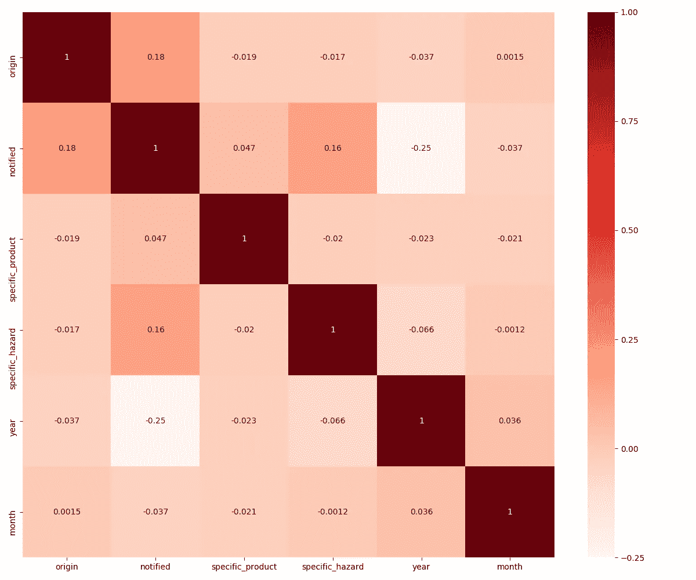
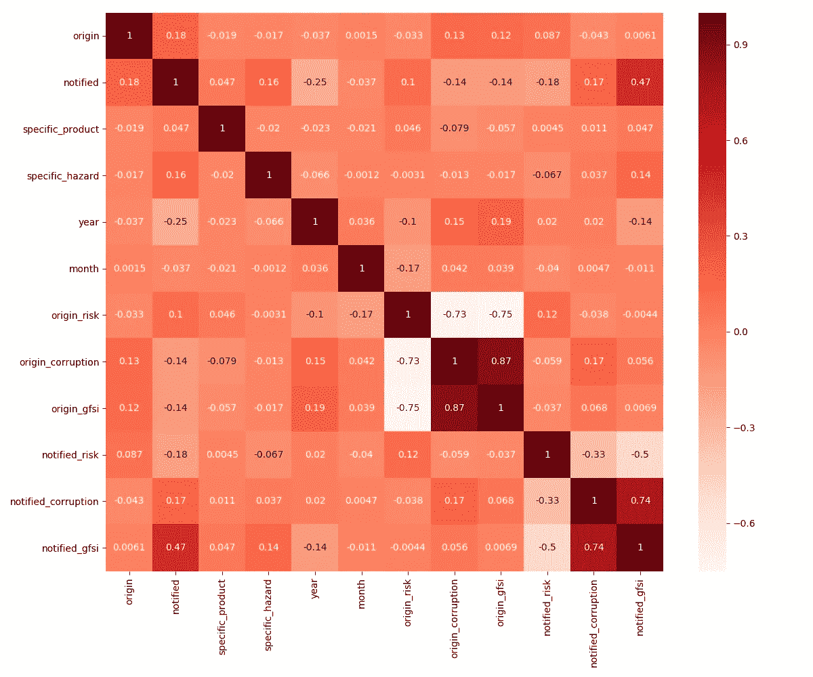
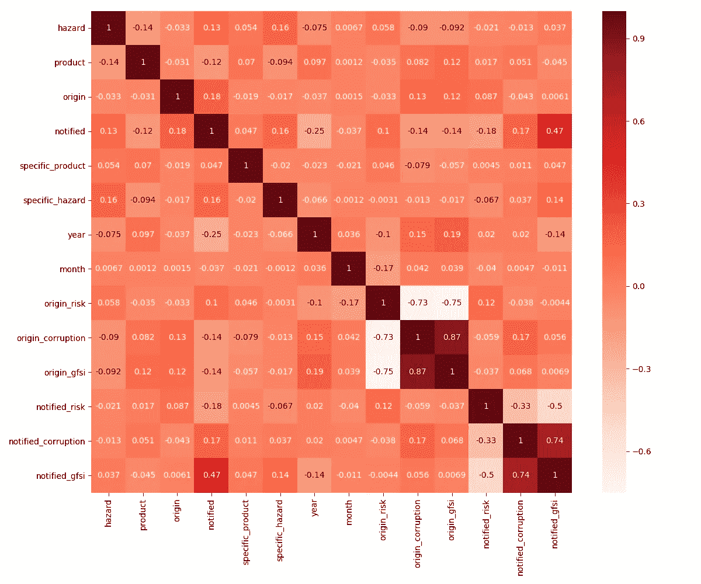
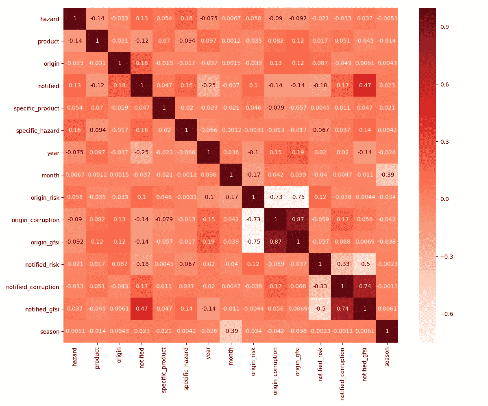
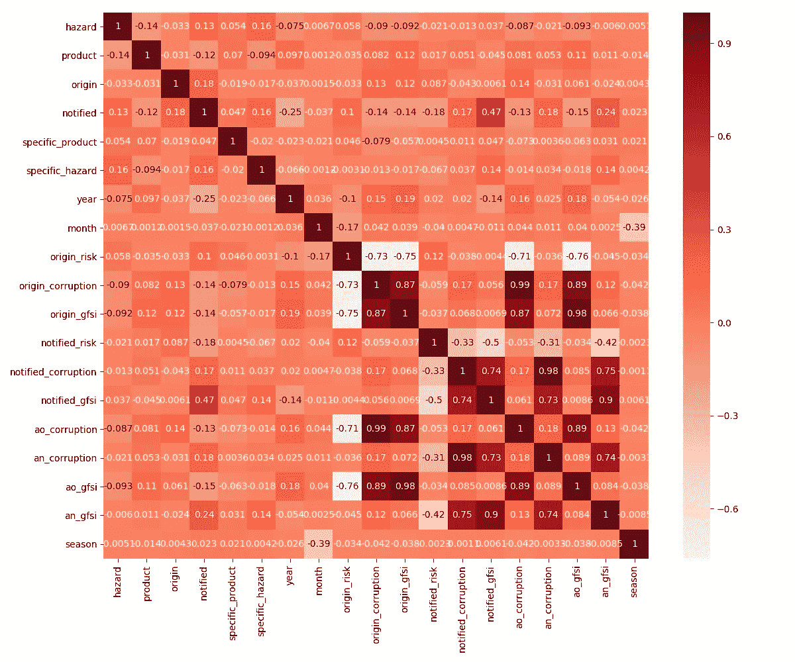

# 关联食品安全数据

> 原文：<https://medium.com/analytics-vidhya/correlating-food-safety-data-cf88364aedf2?source=collection_archive---------27----------------------->

由 [Unsplash](https://unsplash.com/?utm_source=unsplash&utm_medium=referral&utm_content=creditCopyText) 上的 [Pietro Jeng](https://unsplash.com/@pietrozj?utm_source=unsplash&utm_medium=referral&utm_content=creditCopyText) 拍摄

在之前的[帖子](/@mihalispapak/data-empowering-the-food-safety-sector-8e20d18c81d1?source=friends_link&sk=3115cf3e0a15052f12343db4d6d33fc6)中，我们谈到了收集和分析食品安全数据的困难。该扇区具有许多不同的数据类型(包括 [3](https://hackernoon.com/the-3-vs-of-big-data-analytics-1afd59692adb) 、 [5](https://www.geeksforgeeks.org/5-vs-of-big-data/) 、 [7](https://dataconomy.com/2014/05/seven-vs-big-data/) 或任何当前的 V 计数)。

所以这里的主要问题是:

> 我们能收集所有这些数据吗？如果收集到了，我们能不能把它和其他的联系起来，这样我们就能做决定了？

## 我们将重点尝试确定召回背后的原因(即危害)与食品安全数据中存在的各种因素(如召回中涉及的成分)之间的相关性。

外面是什么？

*   市场层面发生的食品召回；
*   边境拒绝；
*   国家指标(风险、腐败和全球粮食安全指数)。

> 让我们后退一步，开始钻研我们的数据。我们能支配什么？

**食品召回&边境拒收**。如果对这些数据进行全面分析，可以得出:

*   *召回日期*；
*   *召回背后的原因(即危害)*；
*   *被召回的主要成分(产品)*；
*   *原产国*的主要成分；
*   *产品被*分销到*的国家*。

我们将使用 FOODAKAI 导出的食品召回和边境拒收数据集样本

国家指标。这些指标涉及每个国家的风险、腐败和全球粮食安全指数。它们是在考虑到各种其他指标的基础上制定的，包含以下内容:

*   *国家*各指；
*   *有效期的*日期从/到；
*   指示器的*值*。

我们的数据平台 API 导出的损坏值示例

API 采用的风险值样本

全球粮食安全指数样本

## 关联发生的时间

让我们首先尝试一个关联矩阵，首先创建完整的数据集，对日期列执行一些小的预处理(将其分为年份和月份)，加载到数据帧中，让 python 处理剩下的工作。完整的代码可以在这篇文章的结尾找到。

我们的数据集(目前为止)

第一次尝试生成相关矩阵的时间到了。

我们第一次尝试关联数据，并不乐观

好吧，对第一次尝试来说还不错，但似乎还有很长的路要走。让我们再添加一些数据吧！[风险](http://www.oecd.org/trade/topics/export-credits/documents/cre-crc-historical-internet-english.pdf)、[腐败](https://www.transparency.org/en/cpi/2019/results)、[全球粮食安全指标](https://foodsecurityindex.eiu.com/Home/DownloadResource?fileName=Global%20Food%20Security%20Index%202019%20report.pdf)公开；是时候将它们整合到我们的关联矩阵中了。

为了做到这一点，我们必须进一步深入我们的数据。我们有原产地和分销国。一个直观的决定是整合这两个国家(可能不同)各自的风险、腐败和全球食品安全指标，当然要考虑召回日期，即当时有效的指标值。

我们的数据集增加了国家指标

是时候重新进行我们的实验了！

我们的相关矩阵是通过添加国家指标产生的

好吧，这看起来好点了，但离可操作的结果还有很长的路要走。然而，有些数据我们还没有考虑进去。

如果我们把我们的成分和危害(即召回背后的原因)放在一个更广泛的类别中会怎么样？FOODAKAI 对这两者进行了详细的分类！上面描绘的形象会有怎样的变化？

通过添加危险和产品类别扩展我们的数据集

以及各自的相关结果

看起来我们走在正确的道路上，是时候让一些直觉发生了。农产品有些季节性。这种直觉能整合到我们的关联矩阵中并以积极的方式影响它吗？让我们来了解一下！

使用召回日期的时间结束，并根据召回发生的季节进行分组。这将如何影响我们的矩阵？

看起来是个正确的决定。太好了，但是让我们再往前走一步。我们在国家指标上有很高的多样性，这可能会给我们的数据集增加噪声。

> 如果我们将这些指标值分组到类中会怎么样？

这可能有助于我们的相关矩阵。让我们将腐败和全球食品安全指数分成 10 类，看看这在我们的相关性分析中表现如何。

我们的最终相关结果是增加了指数类

很好，我们可以看到在原产地和分布国以及危险和产品类别方面存在一些相关性。这是一个很好的基础和知识，可以用来训练机器学习或深度学习模型，以便根据上述指标和特征预测世界各地的食品安全案例！

## 结论

如果你在这篇文章中向上滚动，比较最初产生的相关矩阵和最终的相关矩阵，你会发现进步是显而易见的。

> 一个人应该记住什么？

**预处理**你的数据和**特征扩展**是任何严肃的数据科学尝试中最重要的两项任务。

**了解你的数据**。为了产生任何一种可操作的结果，人们应该了解手边数据集背后的领域。只有这样，直觉才能显示出它的全部潜力。

**永远尝试挑战自己(和数据)**。以上分析并不完美(也永远不会完美)。例如，它没有考虑到国家一级的生产指标和消费信息。更不用说影响农产品的价格或天气数据，或影响肉类生产的动物疾病(如非洲猪瘟)。

> 如果我们也将这些数据添加到我们的模型中会怎么样？它是否有助于在一个像食品安全这样多样化(就数据类型而言)的部门中确定关系？

我们计划在未来讨论这个问题；如前所述，食品安全部门提供各种各样的数据(大数据 Vs 当心！)那么为什么不进一步增加呢？

## 分析统计和完整的代码

用于相关性分析的数据集包括:

*   **98.281** 食品召回和边境拒收，
*   **2.418** 明显的危险，
*   **14.291** 不同的产品和成分，
*   **208 个**国家。

上述分析的完整代码可以在下面找到。