# 使用 Python 关联 ArcSight SIEM 事件中的 Tor 源

> 原文：<https://medium.com/analytics-vidhya/correlating-tor-sources-in-arcsight-siem-events-using-python-92750617227a?source=collection_archive---------2----------------------->

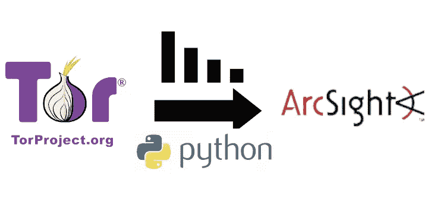

> 巴西的葡萄牙语。

# 介绍

尽管匿名化目前是互联网上的一种有价值的资源，但最终被滥用为许多利用和安全攻击的工具。因此，整合 Tor 网络(目前主要/最大的匿名化网络)的使用信息，并使用 SIEM 对主机/Web 服务环境的访问事件进行分类，评估这些访问的动机，是一种重要的策略。

本文展示了一个使用 Python 和请求库的用例，使用 Linux 环境，将 SIEM ArcSight ESM API 与活动列表集成，以对来自 Tor 网络的事件进行分类。

# 概念回顾

## 扫描免疫电子显微镜检查

日志是计算机系统事件记录。例如，Ubuntu Linux 软件包安装系统有三个日志:

```
$ tail -3 /var/log/dpkg.log
2020–10–04 17:24:52 status unpacked gcc: amd64 4: 7.4.0–1ubuntu2.3
2020–10–10 13:25:09 startup archives unpack
2020–10–10 13:25:13 status installed mime-support: all
```

Syslog 工具是一种软件，它从环境中不同硬件和/或软件的日志中聚合信息。在下面的示例中，Linux Syslogd 聚合了来自 Ubuntu Linux 操作系统的 CRON、systemd 和 anacron 应用程序的日志:

```
$ tail -5 /var/log/syslog.1
Oct 10 23:59:01 ubuntu-desktop **CRON[**3344]: (root) CMD (command -v debian-sa1> / dev / null && debian-sa1 60 2)
Oct 11 00:02:46 ubuntu-desktop **systemd**[1]: Started Run anacron jobs.
Oct 11 00:02:46 ubuntu-desktop **anacron**[3430]: Anacron 2.3 started on 2020–10–11
Oct 11 00:02:46 ubuntu-desktop **anacron**[3430]: Will run job `cron.daily ‘in 5 min.
Oct 11 00:02:46 ubuntu-desktop **anacron**[3430]: Jobs will be executed sequentially
```

互联网提供商和托管 IT 基础设施拥有来自整个计算基础设施中各种资产的日志，从路由器到交换机，包括防火墙、IPSs / IDSs，甚至到达应用服务器和数据库。Syslog 服务器将这些信息加入到该环境中所有事件的中央数据库中。

充当安全信息和事件管理(SIEM)的工具集，其工作类似于 Syslog 服务器，但具有安全功能。这意味着日志经过智能分类，根据定义的标准生成安全警报，还具有研究和报告生成界面。还可以在支持外部集成的防火墙和/或 IPS 上触发自动操作。

> 警报示例:SIEM 可以有一个规则来检查 Web 服务器上的一系列 404 错误日志，如果它在短时间内发现对几个不存在的应用程序目录的访问，它可以为尝试的应用程序扫描生成警报(例如，使用像 [dirb](https://tools.kali.org/web-applications/dirb) 这样的工具的攻击示例)。

在本文中，[微焦点的 ArcSight ESM](https://www.microfocus.com/pt-br/products/siem-security-information-event-management/overview) 将成为 SIEM 工具。

## 突岩

Tor 的工作原理是，用户可以使用或充当随机加密节点，在所有网络参与者之间形成一条路径。因此，从网络连接的目的地的角度来看，源机器不是正在访问资源的机器。

使用下面的[官方示例](https://2019.www.torproject.org/about/overview.html.en), Alice 的计算机使用网络“节点”之间的随机路径，然后到达“出口节点”,并且只有它们访问目的地服务器 Bob，由于 Bob 不知道 Alice，他只看到出口节点的请求。

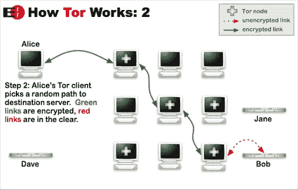

官方文件图片:【https://2019.www.torproject.org/about/overview.html.en 

本文对来自 Tor 网络的流量进行分类的原始资料是，Tor 提供了用于结束访问连接目的地的所有出口节点的列表。该名单[经常更新，可在 Tor 网站](https://check.torproject.org/torbulkexitlist)上查阅。

> 作为参考，还有另外两个关于 Tor 网络节点的更多信息的列表没有在本文的范围内使用:
> - [每 30 分钟更新一次的出口节点](https://www.dan.me.uk/torlist/?exit)-
> -[所有节点(入口/守卫、中间和出口)，每 30 分钟分类和更新一次](https://www.dan.me.uk/torlist)

# 此案例实施遵循的步骤

为避免管理大量 ArcSight 连接器，选择直接与工具的应用程序编程接口(API)进行交互，具体步骤如下:

*   使用 Python 和请求库获得 Tor 出口节点的 IP 列表。
*   将这些 IP 导入 ArcSight 的活动列表，并保持其更新(时间表)。
*   在 ArcSight 中创建一个规则来标记活动列表中具有源 IP 的事件。

# 先决条件

## Python + PIP

在这个用例中，Python 用于其版本 3(语言)和版本 3 的 Pip 语言库安装程序。

```
sudo apt update && sudo apt install python3 python3-pip
```

然后，通过在终端中执行测试，确认操作系统中的 Python 是版本 3:

```
~ $ python -V
Python 3.6.9
~ $ pip -V
pip 20.1.1 from /home/isaque/.local/lib/python3.6/site-packages/pip (python 3.6)
```

## 要求

对出口节点存储库数据的访问以及与 ArcSight API 的集成是通过使用 Python 请求库来执行的。安装可以在 Pip 的帮助下完成。

```
pip install requests
```

## 现役军人名册

Arcsight ESM 中的活动列表是一个数据集，就像数据库的表或 Excel 电子表格一样。该数据集用于存储可与其他 SIEM 资源进行比较的值。在本文中，它将保存 IP 的出口节点列表。

为此，在 Arcsight ESM 控制台中，创建的活动列表仅包含一个基于字段的列，名为 ip 地址类型的“Ip ”,有效期为一小时，容量为一万个结果。特别重要的是**注意活动列表资源 ID** ，这将是脚本所需要的。

> 注意:还为此自动化创建了一个独占用户，该用户被配置为在此活动列表中具有写权限。

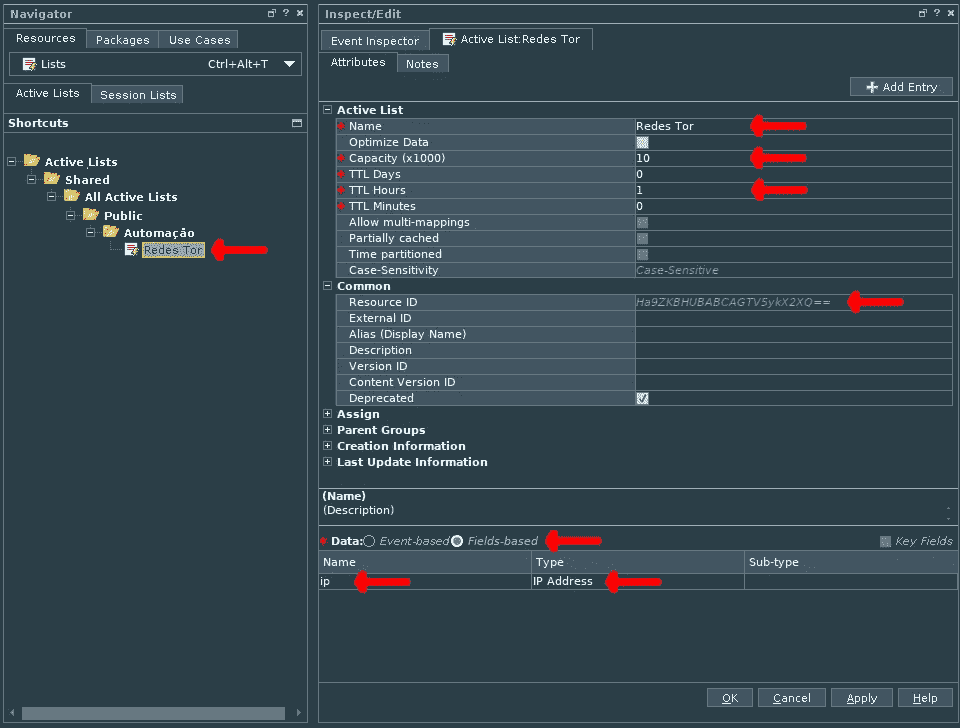

在 ArcSight ESM 7.2 中创建活动列表

# 获取 Tor 出口节点的 IP 列表

## 获取网络列表

创建了一个名为“tor”的文件夹来存储项目，并在其中创建了文件“tor.py”。

```
mkdir ./tor
touch ./tor/tor.py
```

从“tor.py”本身的代码开始，第一步是导入请求库，然后调用 GET 在源代码中搜索关于出口节点的信息。然后，可以使用“print()”功能查看结果:

```
**import** requests
tor_networks = requests.**get**(
    '[https://check.torproject.org/torbulkexitlist'](https://check.torproject.org/torbulkexitlist')
)
**print**(tor_networks.text)
```

> IP 地址的结果数据是文本格式的正文响应。这就是为什么需要使用“tor_networks.text”的原因，因为“requests.get()”的结果是一个响应类型的对象，该对象具有包含所需数据的 Response.text 属性。

这样，内容就可以在终端中进行测试了:

```
python3 ./tor.py
```

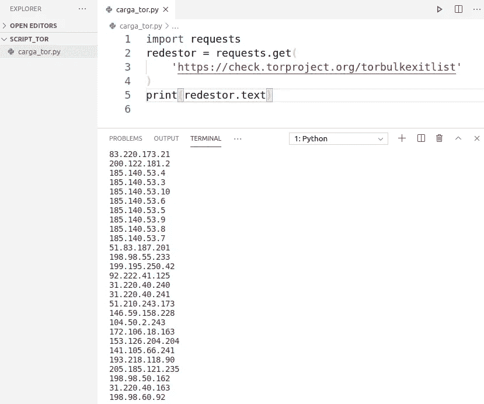

在 VSCode 中获取数据的第一个测试

在这个测试之后，“print()”被 Python 的 list 变量所替换，在 string 的“split()”函数的帮助下，使用换行符“\n”解析正文文本响应:

```
**import** requests
tor_networks = requests.**get**(
    '[https://check.torproject.org/torbulkexitlist'](https://check.torproject.org/torbulkexitlist')
)
**exit_nodes_data** = tor_networks.text.**split**('\n')
```

完成数据收集后，是时候研究 ArcSight 进行集成了。

# 将 IP 导入 ArcSight 的活动列表

## 与 ArcSight 的 API 交互

现在是最复杂的问题，因为在与 arc sight API 相关的文档中找不到很多好的示例(在此使用案例中是 ArcSight ESM 的 7.2 版本)。XML / SOAP 对 Java 模型有一个微妙的偏好，这使得用 JSON / REST 在其他语言中实现 API 的方法和属性变得很困难。

经过学习和研究，发现以下资源是有用的:

*   [PDF 的演示](https://h41382.www4.hpe.com/gfs-shared/downloads-273.pdf)关于自动化。
*   [ESM 服务层](https://www.microfocus.com/documentation/arcsight/arcsight-esm-7.3/pdfdoc/ESM_ServiceLayer_DevGuide/ESM_ServiceLayer_DevGuide.pdf) (Web 服务)开发者指南。
*   微焦点官方论坛的讨论(引用: [1](https://community.microfocus.com/t5/Archive-Discussion-Board/Full-REST-API-Documentation-For-ESM/td-p/1538807) 、 [2](https://community.microfocus.com/t5/ArcSight-User-Discussions/Understanding-ESM-API-documentation/td-p/1657890) 、 [3](https://community.microfocus.com/t5/ArcSight-User-Discussions/Execute-Query-via-ESM-REST-API/td-p/1791726) 、 [4](https://community.microfocus.com/t5/ArcSight-User-Discussions/ArcSight-ESM-API-for-Getting-the-Query-Viewer-Data/td-p/1687030) )。

即便如此，官方文档还是留下了一些漏洞，论坛的回应也依然含糊不清。对 GitHub 上的一些项目进行逆向工程有助于产生以下用于 JSON / REST 的 API 的解决方案:

**1:** 在 ArcSight ESM 安装的*列表服务*中确定需要使用哪些 API 功能(*服务*和*操作*)。这个*列表服务*位于下面的 URL(除了管理和登录操作，因为在这些情况下，URL 中的*管理器-服务*被替换为 c *或服务*)。

> https://URL-arc sight-ESM:8443/www/manager-service/services/list services

**2:** 在这个页面上访问服务的 WSDL (XML 描述符)，在链接内有文本:“*参见 Web 服务描述语言(WSDL)这里*

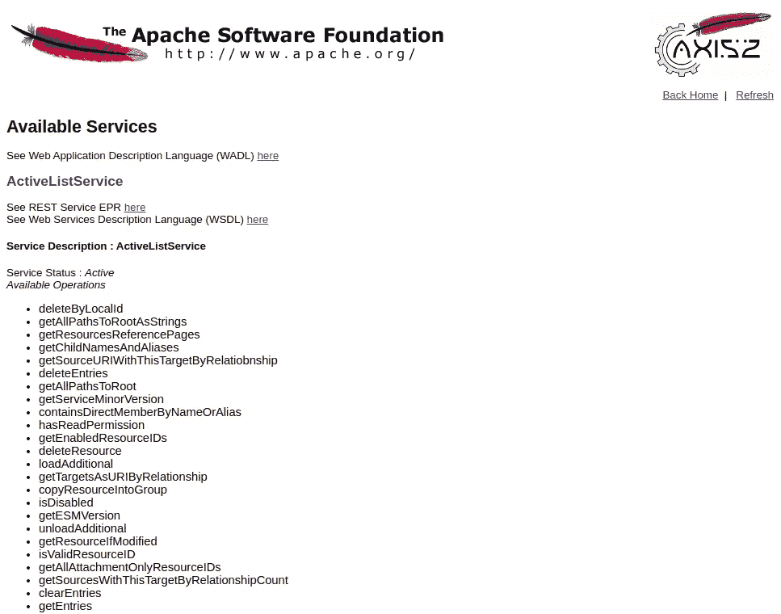

ESM 安装的列表服务

**3:** 在 XML 描述符中搜索所选的*操作*，并确定搜索参数

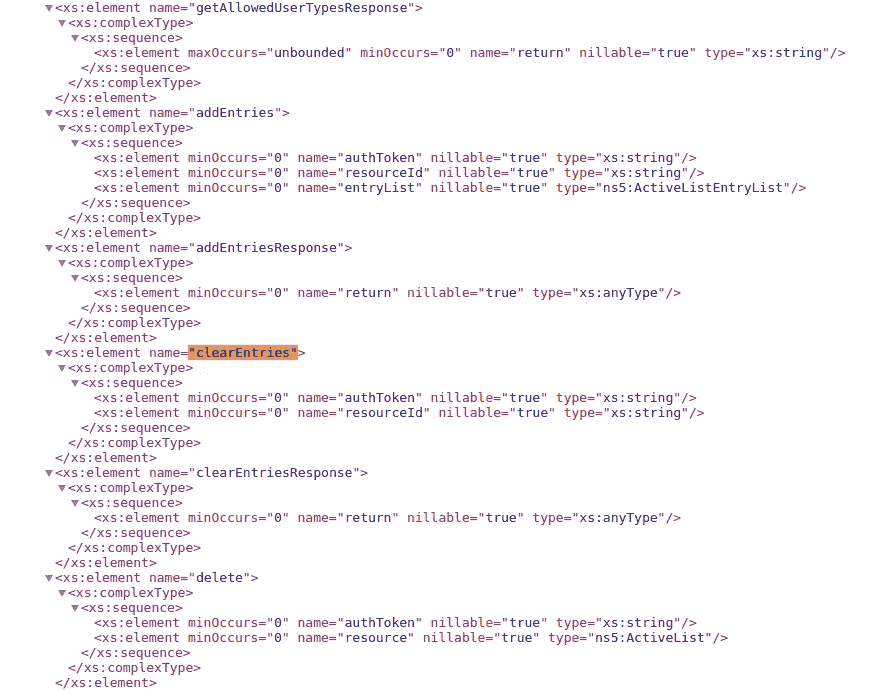

元素，序列是用于搜索的参数

> 对于 JSON，文档中缺少的东西之一是对 HTTP 调用所必需的“资源缩写”的描述。为此，在第四步参考资料中包含的 [pyaesm](https://github.com/dawid-czarnecki/pyasesm/) 项目(也与活动列表交互)的描述中找到了一个功能列表。

**4:** 根据下表选择服务的*资源缩写*:

```
“act” = “resource.manager / activeListService /”
“arc” = “resource.manager / archiveReportService /”
“cas” = “resource.manager / caseService /”
“cap” = “resource.manager / conAppService /”
“con” = “resource.manager / connectorService /”
“das” = “resource.manager / dashboardService /”
“dmq” = “resource.manager / dataMonitorQoSService /”
“dat” = “resource.manager / dataMonitorService /”
“drl” = “resource.manager / drilldownListService /”
“dri” = “resource.manager / drilldownService /”
“fie” = “resource.manager / fieldSetService /”
“fil” = “resource.manager / fileResourceService /”
“gra” = “resource.manager / graphService /”
“gro” = “resource.manager / groupService /”
“int” = “resource.manager / internalService /”
“man” = “resource.manager / managerAuthenticationService /”
“net” = “resource.manager / networkService /”
“by” = “resource.manager / portletService /”
“que” = “resource.manager / queryService /”
“qvs” = “resource.manager / queryViewerService /”
“rep” = “resource.manager / reportService /”
“res” = “resource.manager / resourceService /”
“sei” = “resource.manager / securityEventIntrospectorService /”
“sev” = “resource.manager / securityEventService /”
“ser” = “resource.manager / serverConfigurationService /”
“use” = “resource.manager / userResourceService /”
“vie” = “resource.manager / viewerConfigurationService /”
“inf” = “manager / infoService /”
“mss” = “manager / managerSearchService /”
```

**5:** 用下面的格式定义端点 API 消费的 URL，用上面选择的替换*服务*和*操作*:

> https://URL-arc sight-ESM:8443/www/manager-Service/rest/' Service '/' Operation '

示例:

> 使用 API 清除活动列表:
> 
> 1:搜索*列表服务*并找到服务“*活动列表服务*”，然后研究其操作，选择测试“clearEntries”服务。
> 
> 2:访问 WSDL 链接以验证必要的属性。
> 
> 3:在 XML 描述符中找到了" *clearEntries* "的*操作*的必要属性，即" *authToken* "和" *resourceId* "。
> 
> 4:在引用中找到“ *ActiveListService* ”的资源缩写为“ *act* ”。
> 
> 调用的最终 JSON 负载:

```
{
 “**act.clearEntries**”: {
 “act.**authToken**”: AUTHENTICATION_TOKEN,
 “act.**resourceId**”: RESOURCE_ID_OF_ACTIVE_LIST
 }
}
```

> **5:** 格式化的端点为:https://URL-arc sight-ESM:8443/www/manager-service/rest/ActiveListService/clear entries

了解这种结构对于导航和轻描淡写哪些调用以及哪些参数可能与它们一起使用是很关键的。

## 脚本支持代码的组织

首先，有必要在 Python 中创建一个函数，请求执行登录并拥有一个认证令牌，只有这样才有可能执行与 API 方法的交互。

我们决定将这个函数放在另一个文件(本地库)中，以避免重复的代码。而且，为了不将凭证留在代码文件中，在同一个文件夹中创建了一个配置文件。

```
touch __init__.py
touch config.ini
touch api_arcsight.py
```

“__init__”。py "文件保持为空，简化了项目中的导入过程," config.ini "文件存储了将用于通过 Python 的 *configparser* 模块访问 ArcSight 的凭据，该文件以以下格式编写:

```
**[arcsight]
user**=arcsight_user
**password**=arcsight_password
**server**=https://url-of-arcsight-esm:8443
```

该文件具有用于自动化的特定用户的凭证，这种数据绝不应该存储在版本控制工具中，最多只是一个模型示例，例如称为“config.ini.example”。

现在，在“api_arcsight.py”文件中，使用*“config parser”*对象并使用“read()”和“get()”方法创建对凭证的访问，这将读取“config.ini”数据:

```
import requests
import configparserconfig = **configparser.ConfigParser**()
config.**read**("config.ini")USER = config.**get**('arcsight', 'user')
PASSWORD = config.**get**('arcsight', 'password')
SERVER = config.**get**('arcsight', 'server')
```

## 登录功能

“登录”函数设置在“api_arcsight.py”文件的第一个函数中。在这种情况下，首先，在 ArcSight 的“核心服务”中定义登录端点，然后配置 HTTP 头以将格式设置为 JSON，最后，按照登录端点预期的格式定义一个包含用户和密码的有效负载。

```
def login():
  """
  Connects to arcsight and returns an API token
  """
  **login_endpoint** = (
    SERVER + '/www/**core-service**/rest/**LoginService**/**login**'
  )  
  **headers** = {
    'accept': 'application/**json**',
    'content-type': 'application/**json**'
  }  
  **payload** = {
    'log.login': {
      'log.**login'**: USER,
      'log.**password'**: PASSWORD
    }
  }
```

在此之后，为核心服务的已定义端点创建了一个 POST 请求，该请求包含有效负载和报头。然后，从“Response.json()”字典的路径解析令牌，并在函数的结尾返回相同的内容:

```
try:
    resp = requests.**post**(
      **login_endpoint**,
      json=**payload**,
      headers=**headers**,
      verify=False
    )
    token = resp.json()['log.loginResponse']['log.return']
  except Exception as e:
    print('Login error: {e}')

 **return token**
```

> 当 ArcSight 的安装配置了自签名证书时,“requests.post”中的“verify=False”选项非常有用，相当于访问同一站点的浏览器的“接受风险并继续”选项。

现在，可以使用这两行代码执行登录功能:

```
**import** api_arcsight
AUTHENTICATION_TOKEN = **api_arcsight.login**()
```

## 执行 API 搜索的包装函数

为了避免在 ArcSight 的 API 中执行查询时出现代码重复，设置了一个名为“execute”的包装函数。

对于这个函数，HTTP 头再次被设置为 JSON 格式，然后是端点，在这个函数中使用了 *manage-service* 和 Python 的 f-string 特性，由函数接收的第二个参数完成。

```
def execute(payload, service_endpoint):
  """
  Call arcsight API for data from Operation Services
  """
  **headers** = {
    'accept': 'application/**json**'
  }

  **endpoint** = (
    SERVER + f'/www/**manager-service**/rest/**{service_endpoint}**'
  )
```

使用请求，使用定义的端点和头，以及由函数的第一个参数传递的有效负载，设置了一个 POST。最后，返回 API 响应的响应对象。

```
 try:
    resp = requests.**post**(
      **endpoint**,
      json=**payload**,
      headers=**headers**,
      verify=False
    )
  except Exception as e:
    print(f'API Query error: {e}') **return** resp
```

因此，可以使用以下格式通过登录功能执行搜索:

```
api_arcsight.execute(
  **payload**={
    "resource.function": {
      "resource.first_parameter": PARAMETER_VALUE_1,
      "resource.second_parameter": PARAMETER_VALUE_2
    }
  },
 **service_endpoint**='Resource/resourceFunction'
)
```

## 注销功能

在这个文件中，创建了最后一个“注销”函数，它接收要从系统中“注销”的令牌。

为此，需要使用核心服务端点、JSON 格式的头和注销有效负载。

```
def logout(authtoken): 
  """
  Revoke the token's API access
  """ **login_endpoint** = (
    SERVER + '/www/**core-service**/rest/**LoginService**/**logout**'
  )  **headers** = {
    'accept': 'application/**json**',
    'content-type': 'application/**json**'
  }    **payload** = {
    'log.logout': {
       'log.authToken': authtoken
    }
  }
```

最后，执行了另一个 POST，请求带有定义的数据:

```
 try:
    requests.**post**(
      **login_endpoint**,
      json=**payload**,
      headers=**headers**,
      verify=False
    )
  except Exception as e:
    print(f'Logout error: {e}') return True
```

因此，可以使用以下代码行执行登录功能:

```
api_arcsight.logout(AUTHENTICATION_TOKEN)
```

准备好本地库后，您可以返回主脚本并添加缺少逻辑。

## 导入支持库

在“tor.py”文件的顶部，已经可以从“api_arcsight.py”导入先前创建的模块:

```
import requests
import **api_arcsight**
```

现在，使用 login 函数，检索令牌以执行查询，并为操作定义活动列表资源 ID。

```
AUTHENTICATION_TOKEN = api_arcsight.**login**()
ACTIVE_LIST = '**Ha9ZKBHUBABCAGTV5ykX2XQ=='**
```

## 清除活动列表

需要保持活动列表最新，决定完全清除列表，然后导入所有新记录。为此，首先使用传递正确端点和有效载荷的*执行*函数清理活动列表:

```
api_arcsight.execute(
  **payload**={
    'act.**clearEntries**': {
      'act.authToken': AUTHENTICATION_TOKEN,
      'act.resourceId': ACTIVE_LIST
    }
  },
  **service_endpoint**='ActiveListService/clearEntries'
)
```

## 将数据放入活动列表

由于活动列表为空，因此可以再次插入使用执行功能收集的新数据。

为此，所选的 *addEntries* 操作的有效负载需要两个参数:一个带有一个列列表(*列*)和一个 *entryList* ，这是一个 IP 条目列表，每个条目都用一个名为 *{'entry': []}* 的 JSON 对象格式化，该对象按列顺序排列数据列表。

在这种情况下，活动列表只有一个“ip”列，因此更容易使用 Python list-comprehension 来填充这个条目:

```
api_arcsight.execute(
  **payload**={
    'act.**addEntries**': {
      'act.authToken': AUTHENTICATION_TOKEN,
      'act.resourceId': ACTIVE_LIST,
      'act.**entryList**': {
        '**columns'**: **['ip']**,
        '**entryList'**: **[ {'entry': [reg]} for reg in registros ]**
      }
    }
  },
  **endpoint_servico**='ActiveListService/addEntries'
)
```

## 注销

使用“注销”功能是为了避免孤立会话使数据库过载:

```
api_arcsight.logout(AUTHENTICATION_TOKEN)
```

## 行程安排

最后，可以使用 crontab 安排脚本每小时搜索和更新信息:

```
0 * * * * cd / path / script / script_tor; / usr / bin / python3 /path/script/script_tor/load_tor.py
```

> 其他选项将是来自使用 Python + Celery 管理 Python 脚本调度任务的 *systemd* 或[*isaqueprofeta/pylineup*](https://github.com/isaqueprofeta/pylineup)项目的 *systemd* 计时器

进入 ArcSight ESM 控制台，运行脚本后，可以在活动列表中看到结果:

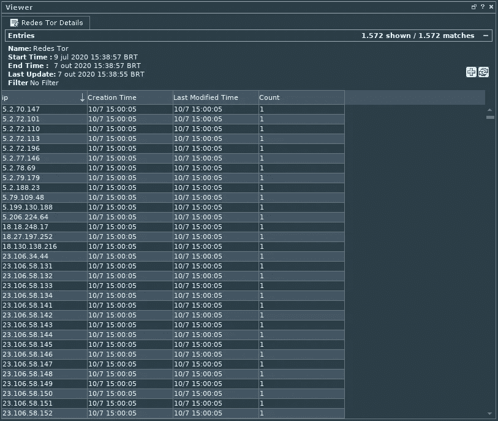

通过带有 Tor 网络出口节点的 API 加载的活动列表

# 活动列表与事件分类规则的集成

## 规则的创建

加载活动列表后，创建了一个*预持久化规则*，该规则根据条件用额外信息标记事件，以便稍后过滤它们进行分析:

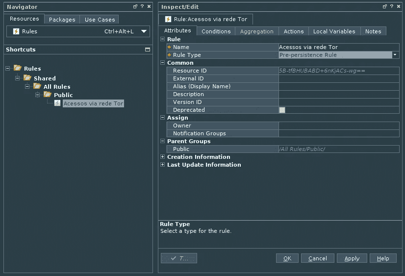

在*条件*中，添加了一个*和规则*以及一个*不活动列表*条件，将事件的*攻击者地址*字段(源 IP)与活动列表的“*IP”**列*进行比较。

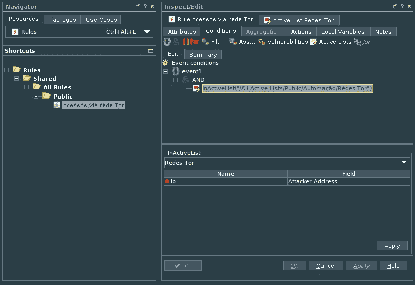

规则条件创建

在该关联条件之后，在规则中创建了一个*动作*，这样每个通过该条件的事件都会收到 3 个*事件字段*:一个名称和另外两个类别，后者一个用于行为(/Access)，一个用于技术(/Access/anonymouzed):

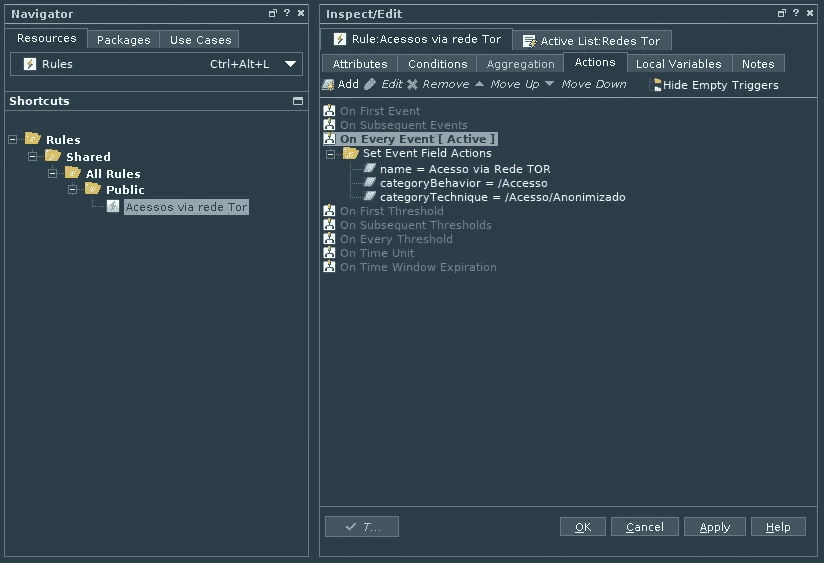

添加事件分类操作

## 活动通道中数据的可视化

最后，使用*过滤器*为插入到*规则的动作*中的一个标签信息创建了一个活动通道(ArcSight ESM 中的可视化通道)。这样，就可以查看事件并确认它们已被标记:

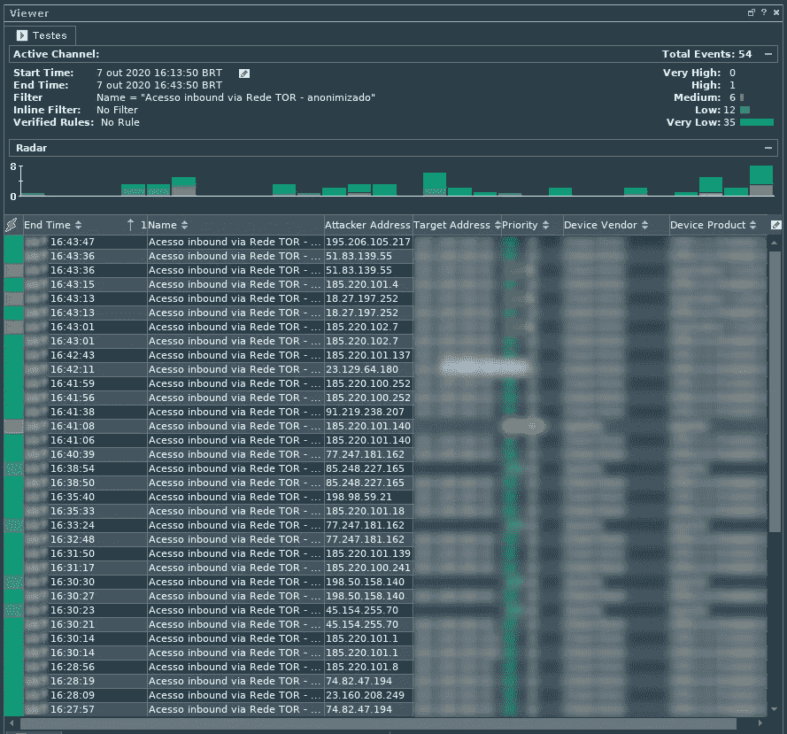

查看标记为匿名访问的事件

# 结论

例如，该用例允许分析应用程序匿名接收的流量类型，从而为事件处理和预防提供重要数据。这是通过与 Python 和 requests 库集成，在 Linux 环境中搜索 Tor 网络出口节点的信息，并通过 ArcSight ESM API 将它们添加到活动列表中以进行关联而实现的。

在访问没有显示恶意活动，没有在 SIEM 中触发其他关联的情况下，可以得出结论，源只想匿名访问该内容，这是合法的情况。

在应用程序通过 Tor 来源接收恶意活动的情况下，有必要考虑阻止或重定向对质询解决方案(如 CAPTCHA)的访问。

匿名流量情况下的另一个例子是论坛滥用活动:有了这些流量信息，就有可能阻止包含匿名来源的评论，以避免攻击性消息和垃圾邮件行为。