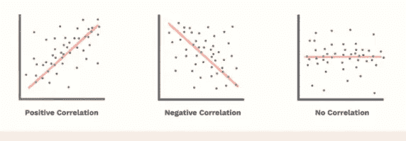
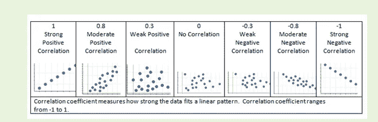
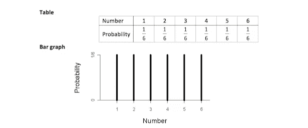
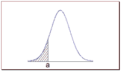
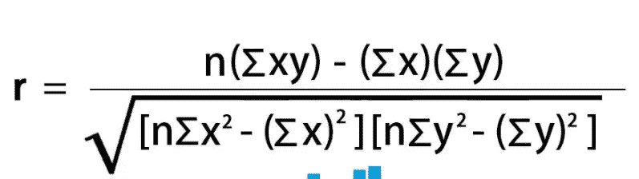
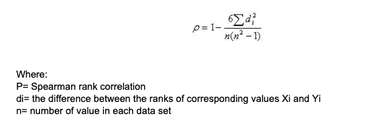
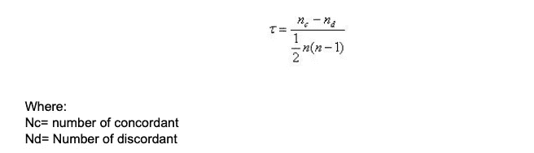

# 相互关系

> 原文：<https://medium.com/analytics-vidhya/correlation-8f848d6d0368?source=collection_archive---------15----------------------->

相关性解释了两个变量之间的关系。这是数据科学中双变量分析的重要统计工具。相关性并不意味着这两个变量的因果关系，这意味着一个变量不会引起另一个变量，可能有另一个因素影响变量。例如，(维基百科的例子)，在夏天，冰淇淋的销量会增加，人们会去海滩被鲨鱼吃掉。这并不意味着吃冰淇淋会导致鲨鱼吃人。因为几个人参观海滩，鲨鱼吃他们。

使用散点图可以更好地解释相关性。

[来源](https://www.investopedia.com/ask/answers/032515/what-does-it-mean-if-correlation-coefficient-positive-negative-or-zero.asp)

在上图中，第一个散点图指的是完全正相关。比方说，有两个变量，它们分别标绘在 X 轴和 Y 轴上。如果 X 增加，Y 也增加，因此它们是正相关的。第二个散点图具有负相关性，这意味着当一个变量增加时，另一个变量减少。第三个图表示没有相关性，因为在点的方向上没有相干性。因此，散点图决定了两个变量之间关系的方向。在数据科学项目中，这将有助于理解两个变量是如何相关的。

**相关系数**:散点图讲的是变量的方向，也要讲变量的强度。使用数值表达式可以做到这一点。任何相关性都可以在 1 到-1 之间。1 是强正相关，-1 是强负相关，任何接近 0.5 的数字将是正或负幅度的较弱相关。最后，任何趋向于零的东西都意味着，这两个变量之间没有相关性。

[来源](https://www.cpalms.org/Public/PreviewAccessPoint/Preview/16200)

**相关计算**:最常见的计算相关系数(用 r 表示)的方法有**皮尔逊**相关系数、**斯皮尔曼**相关系数、**肯德尔秩**相关。

## **重要提示**:

在解释如何计算相关系数之前，我们需要理解以下概念:

**概率分布**:概率分布是一个数学函数，提供了实验结果的概率。这为随机变量提供了一个范围内所有可能的值。该分布将具有以下性质 a)所有概率将在 0 和 1 之间 b)互斥 c)所有概率之和等于 1 的集合穷举。

例如，如果掷骰子，得到从 1 到 6 的任何数字的概率是 1/6 => 0.1667。所有结果 1 到 6 是互斥的，因为当我们掷骰子时，我们可以得到范围内的任何结果。

所有结果之和:滚 a 1 => 1/6，滚 a 2 =>1/6，滚 a 3=>1/6，滚 a 4=>1/6，滚 a 5=>1/6，滚 a 6=>1/6 的概率。当我们把所有的结果加起来= > 1/6+1/6+1/6+1/6+1/6+1/6 = > 6/6 = > 1

[来源](https://seniorsecondary.tki.org.nz/Mathematics-and-statistics/Glossary/Glossary-page-T)

有两种类型的概率分布->离散和连续概率分布。**离散概率分布**当变量离散时，如上面提供的例子，掷骰子或掷硬币。概率分布是一个数学函数，它提供了实验结果的概率。这为随机变量提供了一个范围内所有可能的值。该分布将具有以下性质 a)所有概率将在 0 和 1 之间 b)互斥 c)所有概率之和等于 1 的集合穷举。

例如，如果掷骰子，得到从 1 到 6 的任何数字的概率是 1/6 => 0.1667。所有结果 1 到 6 是互斥的，因为当我们掷骰子时，我们可以得到范围内的任何结果。

所有结果之和:滚 a 1 => 1/6，滚 a 2 =>1/6，滚 a 3=>1/6，滚 a 4=>1/6，滚 a 5=>1/6，滚 a 6=>1/6 的概率。当我们把所有的结果加起来= > 1/6+1/6+1/6+1/6+1/6+1/6 = > 6/6 = > 1

[来源](https://seniorsecondary.tki.org.nz/Mathematics-and-statistics/Glossary/Glossary-page-T)

**连续概率分布**当所讨论的变量是连续随机变量时，单个值的概率为零，因此我们不能像对离散概率分布那样列出任何频率。因此，它被表示为密度函数(曲线下的面积),并假定值在 2 个点之间。

[来源](https://stattrek.com/probability-distributions/discrete-continuous.aspx):比如考虑下图所示的概率密度函数。

假设我们想知道随机变量 *X* 小于或等于 *a* 的概率。 *X* 小于或等于 *a* 的概率等于由 *a* 和负无穷大界定的曲线下的面积——如阴影区域所示。**注:**图中阴影区域表示随机变量 *X* 小于等于 *a* 的概率。这是一个累积概率。然而， *X* 恰好*等于 *a* 的概率为零。一个连续的随机变量可以取无限多的值。它等于特定值(如 *a* )的概率始终为零。*

**正态分布(** [**来源**](https://stattrek.com/probability-distributions/normal.aspx) **):** 这是一种连续概率分布的类型。正态分布图取决于平均值和标准差。以下是正态曲线的属性

*   正常曲线下的总面积等于 1。
*   正态随机变量 *X* 等于任意特定值的概率为 0。
*   *X* 大于 *a* 的概率等于由 *a* 包围的正态曲线下的面积加上无穷大(如下图*非阴影*区域所示)。
*   *X* 小于 *a* 的概率等于由 *a* 和负无穷大围成的正态曲线下的面积(如下图*阴影*区域所示)。

此外，每条正态曲线(不考虑其均值或标准差)都符合以下“规则”。

*   曲线下约 68%的面积落在平均值的 1 个标准偏差内。
*   曲线下约 95%的面积落在平均值的 2 个标准偏差内。
*   曲线下约 99.7%的面积落在平均值的 3 个标准偏差内。

**皮尔逊相关:**如果数据集遵循以下假设，则可以计算皮尔逊相关系数

a)当数据被称为**正态分布**时

b) **线性-** 当两个变量线性相关时

c) **同质性** —当回归线和数据点之间的距离在整个数据集中相似时

[来源](https://www.wallstreetmojo.com/pearson-correlation-coefficient/)

*   r =皮尔逊相关系数
*   n=股票的对数
*   ∑xy =成对股票的乘积之和
*   ∑x = x 个分数的总和
*   ∑y = y 分数的总和
*   ∑x2 = x 分数的平方和
*   ∑y2 = y 分数的平方和

**斯皮尔曼相关:**当数据不符合正态分布时，可以使用这种相关。当变量本质上是序数时，可以使用这种方法。因此，它是一个非参数检验，测量两个变量之间的关联程度。下面是公式:

[来源](https://www.statisticssolutions.com/wp-content/uploads/wp-post-to-pdf-enhanced-cache/1/correlation-pearson-kendall-spearman.pdf)

**肯德尔秩相关(** [**来源**](https://www.statisticssolutions.com/wp-content/uploads/wp-post-to-pdf-enhanced-cache/1/correlation-pearson-kendall-spearman.pdf) **)** :与斯皮尔曼相关一样，肯德尔相关是一种非参数检验，衡量 2 个变量之间的依赖强度。如果我们考虑两个样本 a 和 b，其中每个样本大小为 n，我们知道与 a b 配对的总数为 n(n-1)/2。以下公式用于计算肯德尔等级相关值:

和谐的:以同样的方式排列的，不和谐的:排列不同的。