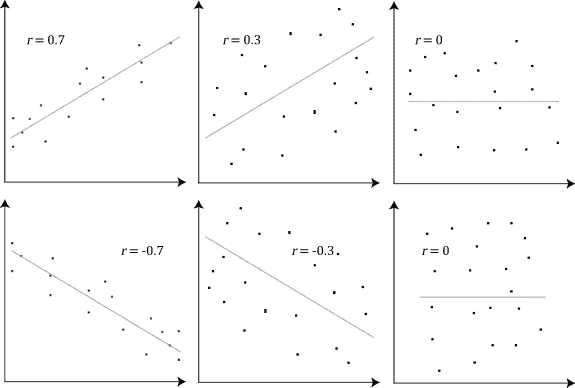
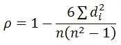
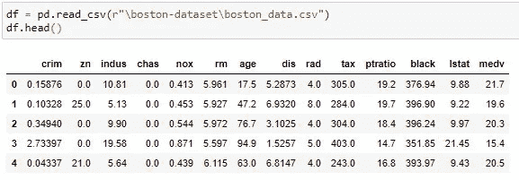
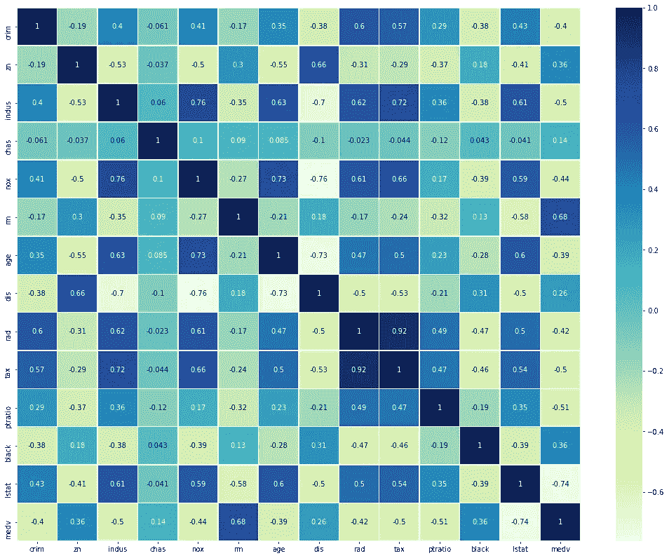
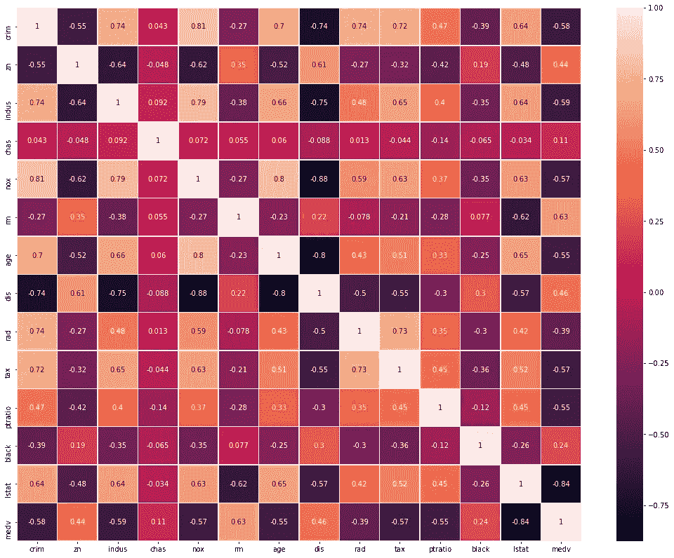

# 相关性和机器学习

> 原文：<https://medium.com/analytics-vidhya/correlation-and-machine-learning-fee0ffc5faac?source=collection_archive---------0----------------------->

在统计研究中，可能是科学、经济、社会研究或机器学习，有时我们会遇到许多涉及使用两个或更多变量的问题。比如:

1.  个人的收入和支出
2.  商品的需求和价格

由两个变量(x，y)生成的数据称为双变量数据，这种双变量分析对于找到它们之间的关系至关重要。

# 什么是相关性？

两个或多个变量之间的相互关系、协变或关联称为相关性。它与 x 或 y 的单独变化无关，而是与两个变量同时变化的测量有关。

# 相关性与因果性？

这两个系列之间的相关性并不一定意味着它们之间的因果关系。相关性意味着两个或多个变量之间的相互关系、共变或关联。它与一个连续变量的变化无关。它只问变量是否一起变化。比如:

父亲和子女的身高是相关的，但不能说父亲的身高是在遗传因素的唯一假设下决定子女身高造成的。还有其他几个因素，如环境、遗传等。

因果关系是功能性的，自然会反映相关性，但它并不表示因果关系，因为它没有超出对协变的研究。

# 相关性度量

## 1.皮尔逊系数相关

皮尔逊相关系数是衡量两个变量之间线性关联强度的指标，用 r 表示。基本上，皮尔逊相关试图通过两个变量的数据绘制一条最佳拟合线。皮尔逊相关系数 r 表示所有这些数据点离这条最佳拟合线有多远。

1.  在皮尔逊相关系数中，变量可以用完全不同的单位来衡量。例如，我们可以把一个人的身高和体重联系起来。它被设计成测量单位不能影响协变的研究。
2.  皮尔逊相关系数(r)是一种无单位的相关性度量，不会因原点或标度变换度量的影响而改变。
3.  它不考虑一个变量是被归类为因变量还是自变量。它平等地对待所有变量。我们可能想知道篮球成绩是否与一个人的身高有关。但如果我们确定一个人的身高是否是由他们的篮球表现决定的(这毫无意义)，结果将是一样的。

皮尔逊相关系数公式

其中，yi 是变量，xbar、ybar 是平均值

## 属性:

1.  r 的取值范围在[-1，1]之间。
2.  r 的计算与测量的原点和标度的变化无关。
3.  r = 1(完全正相关)，r =-1(完全负相关)
    r = 0(不相关)

r 与线性关系图

## 2.斯皮尔曼系数相关

Spearman 的相关系数是一个非参数的测量强度和方向的关联存在于两个变量之间的测量至少在一个序数规模。符号 rs 或ρ表示它。如:
我们可能想找出面试中两个评委给候选人的评分，一组学生在五个科目上得到的分数等之间的相关性。

斯皮尔曼相关系数公式

其中 n =观测值的总数，di = (xi-Yi)其中和 Yi 是观测值

Spearman 相关性决定了两个变量之间单调关系的强度和方向，而不是你的两个变量之间线性关系的强度和方向，这是 Pearson 相关性决定的。

ρ，带单调图

## 属性:

1.  r 的取值范围在[-1，1]之间。
2.  保留 r 的所有性质。
3.  由于这是基于有序数据，它不依赖于任何特定的分布(这就是为什么我们称之为非参数测量)

***注:当皮尔逊相关的假设被明显违反时，可以使用斯皮尔曼相关。***

## 3.系数的肯德尔τ相关

Kendall 的 Tau 是对已排序数据列之间关系的非参数度量。τ相关系数返回值 0 到 1，其中:

0 是没有关系，
1 是完美关系。

这个测试的一个奇怪之处也可能产生负值(从-1 到 0)。与线性图不同，负关系对已排序的列没有太大意义(除了你可能调换了列)，所以在解释 Tau 时去掉负号。

[***肯德尔的τ=(C—D/C+D)***](https://www.statisticshowto.com/kendalls-tau/)***，*** 其中 C 为和谐对的个数，D 为不和谐对的个数。

# 机器学习中的应用

在数据分析和数据挖掘期间，相关性是机器学习中高度应用的技术。它可以从一组给定的特征中提取关键问题，这些问题稍后会在拟合模型时造成重大损坏。
具有不相关特征的数据有很多好处。如:
1。算法的学习会更快
2。可解释性将会很高。偏见会更少

***注:这里，我用波士顿房价数据集做了一个小分析。***

存在 13 个数字和一个分类(chas)特征

皮尔逊相关系数热图

## 观察

1.  “税”和“拉德”列与 0.92 的值高度相关(正相关)。
2.  一些特征是负相关的，并且它们的相关值是负的高。比如" lstat "对" medv "，" dis "，对" indus "，" dis "，对" age "

从以上观察，我们可以得出结论，税率和放射状公路可达性指数之间存在隐性协变。我们可以推导出这样一个关系:如果房屋靠近高速公路的可达性高，那么全价值财产税税率也会更高。这听起来像是真的，因为价格高的房子通常离市场、良好的生活设施、高速公路等更近。

斯皮尔曼相关系数热图

## 观察

1.  “chas”是一个分类特征，当我们考虑 Spearman 相关系数时，它也被包含在相关性中。

# 多重共线性的影响

机器学习中回归分析的一个关键目标是隔离每个自变量的关系和因变量。因此，一个独立变量的变化不应该影响给定数据中的任何其他变量。然而，当独立变量相关时，它表明一个变量的变化与另一个变量的变化相关。随着多重共线性的严重程度增加，这些有问题的影响也会增加。
因此，在模型拟合过程中，一个变量的微小变化会导致模型输出的大幅波动。然而，这些问题只影响那些相关的独立变量。

## 解决方案:

1.  问题的严重性随着多重共线性的程度而增加。因此，如果只有中度多重共线性，则可能不需要解决它。
2.  多重共线性仅影响相关的特定独立变量。因此，如果您特别感兴趣的独立变量不存在多重共线性，您可能不需要解决它。假设您的模型包含感兴趣的实验变量和一些控制变量。
    如果控制变量而非实验变量存在高度多重共线性，您可以毫无问题地解释实验变量。
3.  如果其中一个共线要素对基于距离的最大似然算法的预测或分类贡献不大，我们可以删除分析要素。

请在这里找到完整的代码[。](https://github.com/MaverickMonk/Machine-Learning-Methods/blob/main/Correlation%20and%20Machine%20Learning.ipynb)

## 参考:

 [## 皮尔逊积矩相关

### 皮尔逊积差相关系数(或简称为皮尔逊相关系数)是一种度量…

statistics.laerd.com](https://statistics.laerd.com/statistical-guides/pearson-correlation-coefficient-statistical-guide.php)  [## 斯皮尔曼秩序相关

### 本指南将告诉你什么时候应该使用 Spearman 的等级-顺序相关性来分析你的数据，什么假设…

statistics.laerd.com](https://statistics.laerd.com/statistical-guides/spearmans-rank-order-correlation-statistical-guide.php)  [## 回归分析中的多重共线性:问题、检测和解决方案

### 由吉姆，弗罗斯特多重共线性发生时，独立变量在一个回归模型是相关的。这种相关性…

statisticsbyjim.com](https://statisticsbyjim.com/regression/multicollinearity-in-regression-analysis/)