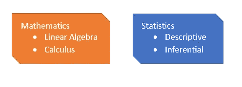
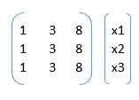
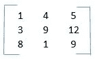
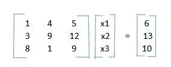
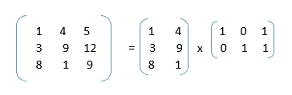
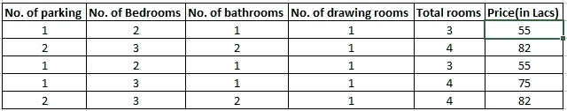
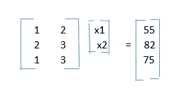

# 线性代数与数据科学的相关性

> 原文：<https://medium.com/analytics-vidhya/correlation-between-linear-algebra-and-data-science-8f269ec0e047?source=collection_archive---------15----------------------->

自从我的数据科学之旅开始以来，我一直试图想象数学(这里是线性代数)在数据科学领域的**重要性。经过大量的研究和内容学习，我已经慢慢开始想象数学。这篇文章将尝试奠定数据科学旅程中所需的数学基础。**

数据科学所需的数学工具

这个故事集中在数学的线性代数部分

***线性代数***:——这个数学题目主要涉及矩阵及其运算。在数据科学中，我们也使用矩阵形式的原始数据(行和列)。列由目标变量和自变量组成，而行由记录或观察值组成。这个类比帮助我们使用所有的数学运算来找出数据科学问题的适当解决方案。

1.  **矩阵的秩**

现在让我们来理解列空间或俗称为“**秩**的矩阵。矩阵的列间距决定了矩阵在空间中的扩散或延伸。

**秩= 1，**例

矩阵 ***B*** 和 ***x*** 的乘法运算

对于 x1、x2 和 x3 的所有可能值，矩阵相乘(***【Bx】***)的结果将落在 x1+3x2+8x3 上。因此，我们可以说矩阵 B 的秩为 1，因为 Bx 的范围的维数为 1(在这种情况下为线)。

**Rank = 2** ，举例

再者我们如果这个矩阵*乘以一个向量*【x1，x2，x3】，那么( ***Ax*** )，对于 x1，x2，x3 的所有可能值会覆盖空间的什么维度。在这种情况下，我们如果观察矩阵的第 3 列(col3)，我们会看到 **col3 =col2 + col1** 。因此矩阵 A 的秩为 2，列间距为 ***A*** 将覆盖一个 2D 表面。**

****2。线性方程组****

****

**遵循从上述矩阵乘法生成的线性方程组，**

****x1 + 4x2 + 5x3 = 6****

****3x1 + 9x2 + 12 x3 = 13****

****8x1 + x2 + 9x3 = 10****

****3。基本矢量****

**现在让我们理解基向量。基向量是独立的向量，使用基向量，我们可以生成依赖于基向量的矩阵的其他元素。在矩阵 ***A、*** 的情况下让我们看看基向量是什么。**

****

**A = C x R**

**由于可以使用 2 个列向量和 2 个行向量来生成*，因此我们可以说，列 1 [1，3，8]中向量和列 2 [4，9，1]中的向量是矩阵 ***A* 的 [**基向量**](https://en.wikipedia.org/wiki/Basis_(linear_algebra)) 。*****

****数据科学中上述逻辑的相关性****

**现在我们如何在数据科学中联系这一点，**

****

**假设数据**

**假设我们手头有一个基于上述参数(停车位数量、卧室数量、浴室数量、客厅数量、房间总数、价格)预测房价的问题。我们可以形成一个考虑所有参数的矩阵，矩阵的行将是观测值。由于总房间数=卧室数+客厅数，因此我们可以删除总房间数列，因为它是线性相关的。列 1 和列 3 也是相同的，因此我们可以删除其中任何一列。删除后，我们假设有 4 列(停车位数量、卧室数量、客厅数量、价格)。我们可以进一步观察到，在所有的观察中，客厅的数量= 1，并且它不提供数据中的方差。因此，我们可以删除“客厅数量”列。在所有这些操作之后，我们剩下 3 列(停车位数量、卧室数量、价格)。作为目标列的价格列将使用两个独立的列导出，即卧室数量和停车位数量。现在我们可以关联卧室数量和停车位数量是否是整个数据集的基本向量。此外，行 2 和行 5 可以删除，因为它有重复的记录。所以这一切都归结为求解以下矩阵运算:**

****

**从上面我们可以推断出什么:**

1.  **寻找矩阵的基本向量，因为这些是决定目标变量的属性。在确定基向量的过程中，无论我们做什么操作，都类似于消除[多重共线性](https://en.wikipedia.org/wiki/Multicollinearity)和数据科学的特征选择。**
2.  **删除重复行很重要，这类似于数据科学中的数据清理部分。**
3.  **求解 x1 和 x2，将得到下面的等式:**

**Price ~= (x1)*(停车位数量)+ (x2)*(卧室数量)。**