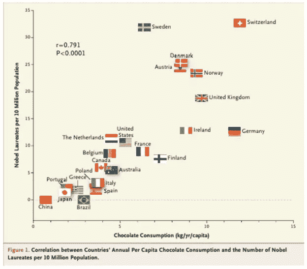

# 相关性并不意味着因果关系

> 原文：<https://medium.com/analytics-vidhya/correlation-doesnt-imply-causation-8b393fc82835?source=collection_archive---------28----------------------->

## 相关性概念有时被误解为因果关系

统计学上有一句非常著名的话，就是**相关并不意味着因果**。让我们用下面的图表例子来理解这种说法。

图片来自[https://stats . stack exchange . com/questions/36/examples-for-teaching-correlation-does-not-mean-cause](https://stats.stackexchange.com/questions/36/examples-for-teaching-correlation-does-not-mean-causation)

这个图表有两个随机变量 X 和 y。

第一个随机变量 X 是人均巧克力消费量，这意味着一个国家的人均巧克力消费量。

我们以国家为例，计算出 X 是每人每年的巧克力消耗量，以千克为单位。

y 轴是一定数量的诺贝尔奖获得者，诺贝尔奖获得者为 10 万人。

现在给出上面的数据，如果我们计算等级相关系数，你得到的值是 0.791，大约接近 0.8(非常高)。

我还可以观察到，随着 X 的增加，Y 也在增加。没错。

但是我可以这样陈述吗，X 导致 Y？或者说白了，随着巧克力消费的增加，你的国家可以产生更多的诺贝尔奖获得者。

这是不正确的，对不对？

## 结论

仅仅因为这里的两个随机变量 X 和 Y 有很高的秩相关系数 0.8，这并不一定意味着 X 导致 Y 或者 Y 导致 X。

这是绝对错误的结论。这是一个荒谬的结论。

为了理解因果关系，应用数学中有一整个领域叫做因果模型，这是统计学和应用数学中非常高级的领域。但是和相关性相比，这是一个完全不同的话题。请不要混淆相关性和因果性。在你做出这样的结论之前，这个巧克力的例子应该一直记在心里。

感谢阅读。

参考:[https://stats . stack exchange . com/questions/36/examples-for-teaching-correlation-does-not-mean-cause](https://stats.stackexchange.com/questions/36/examples-for-teaching-correlation-does-not-mean-causation)