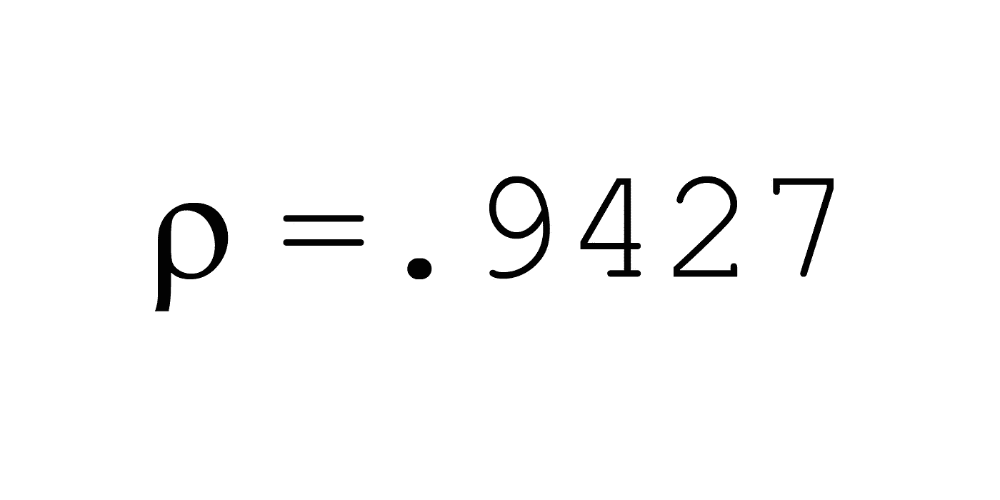
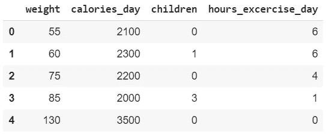
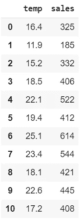
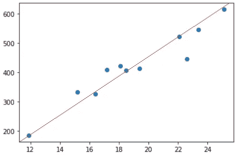
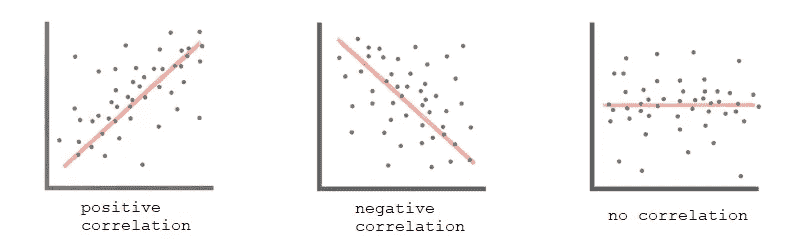
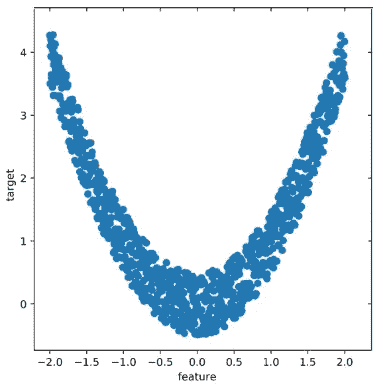

# 相关性很容易解释

> 原文：<https://medium.com/analytics-vidhya/correlation-explained-easily-678179326135?source=collection_archive---------27----------------------->

相关性可能是统计学中最常用的量度。你可以把它应用到每一个不同的领域，快速了解事物是如何联系在一起的。然而，我有太多的朋友在大学里学过，但不知道它的用途。我会试着唤起他们的记忆！



字母ρ测量相关性的一个例子

# 你能用相关性做什么？

相关性解释 ***两组数据(变量)之间的关系有多强。*** 三言两语，用一个数字就能看出两组数据有没有共同点，共同点有多强: ***它们链接的强度*** 。

相关性用一个数字来解释，即希腊字母 rho，其值的范围在[-1，1]之间。

## 在图表和解释之前，我们需要两列数据来计算相关性。



不是真实数据

在这种情况下，我测量了 5 个不同的人，考虑了以下变量:体重，每天的卡路里，孩子的数量和每天锻炼的时间。相关性可以有三种，具体取决于数字:

# 正相关

```
correlation between: weight and calories_day = .8640
```

体重越重，摄入的热量就越多:这种相关性是正相关的，而且非常强。**如果相关性接近 1，则认为是正的。**

# 相关性不存在

```
correlation between: weight and children = -.0577
```

从我们所看到的结果来看，人们的体重和他们有多少孩子之间并不存在相关性(非常接近于 0)。**如果接近 0，则认为不存在相关性。**

# **负相关**

```
correlation between: weight and hours_exercise_training = -.9048
```

这是有道理的:你的体重越重，你每天的运动时间就越少，所以有很强的负相关性。

* * *如我所说，这不是真实的数据。还有很多其他因素可以考虑:美国橄榄球运动员整天锻炼，他们很重。当然，这个列表是为了让你更容易理解这个概念。**如果相关性接近-1，则认为是负的。**

# 实际应用

相关性的美妙之处在于，你可以在任何事情上使用它来显示两组数据之间的关系有多强，它让你对事物之间的联系有一个精确的概念。

一些实际应用是在**心理测量**中，在那里你可以找到不同的个性特征和智力之间的联系。

另一个是**金融**:你通过充分利用相关性来选择投资哪些股票。如果我们选择同时购买苹果和谷歌(这两家公司的相关性最高可达 0.80)，这就像选择一只股票而不是两只，因为它们的联系如此紧密，它们的股价表现就像一只股票一样: **RIP 投资组合多样化**。如果科技股碰巧处于熊市，你在两只股票上都将亏损:那么为什么不干脆购买谷歌 100%的股份，而不是两只？反正结果一样。

# 如何计算相关性

现在你已经熟悉了一些例子，你仍然不确定它如何证明是有用的。你可以很容易地通过谷歌搜索或使用 Excel 来计算相关性(如果你想知道的话)。

我们需要的是:

*   两列数据

第一列显示当天的温度，第二列显示当天的冰淇淋销售额。



www.mathisfun.com

我们通过画一条遵循点的模式的线来获得相关性。这显示了正相关。



```
Correlation = .9576
```

从这个数据我们立刻明白，温度越高，冰淇淋的销量越高。反过来的逻辑也成立，冰淇淋销量越高，温度一定越高。



# 相关性问题:非线性

让我们假设两列数据产生了下图。正如你亲眼所见，有一个清晰的模式。



然而，如果我们测量这两组信息(特征和目标)的相关性，结果是:

```
0.00
```

根据相关系数，这两列之间没有明显的关系。这是因为相关系数只在**线性**关系中起作用。

为了表示更复杂的模式，我们不使用相关系数，而是使用**多元线性关系。**该方法的一个实际实现可以在中找到[。](https://us.hidester.com/proxy.php?u=eJwBZgCZ%2F3M6OTQ6IgGZllKsmdvaox2yqJ6JCoVyuHvHMINryeHk6AMm45f3EIsSxf8cgzihoJFo4zFp5oIN72JRR2zKwUKhnDbFvLEJ0wZvR71dOxuNPzgbFfX%2FQ%2B2OftwAIk3HmTSQaHMiO%2FvRMKs%3D&b=7&f=norefer)