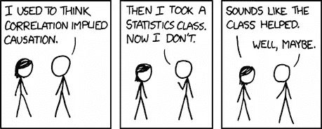

# 相关性与因果关系

> 原文：<https://medium.com/analytics-vidhya/correlation-vs-causation-1caad5abfd06?source=collection_archive---------13----------------------->

*为什么曲解这两个概念会产生严重的影响？*

**“相关性并不意味着因果关系”——**我们可能都遇到过这句话，但它实际上是什么意思呢？相关性和因果关系是最容易被误解的术语，经常被互换使用。我仍然记得我的概率和统计教授讨论，在大学时了解这两个术语之间的区别是多么重要。这两个术语总是出现在我的生活中，无论是在研究中，在工作中，还是最近在参加一些数据科学课程时。理解这两个统计术语不仅对做出结论非常重要，更重要的是，最终做出正确的结论。

来源:XKCD 漫画(【https://xkcd.com/】T4)

要理解这些概念，我们先从基本定义开始。

# 什么是相关性？

**相关性**是统计学中的一个术语，指两个随机变量之间的关联程度。它没有告诉我们这种关系背后的原因和方式，只是说这种关系是存在的。

例如，如果随机变量 A 和 B 倾向于同时被观察到，这里我们暗示 A 和 B 之间的相关性。我们并不暗示 A 和 B 之间的关系，或者 A 导致 B，反之亦然。我们只是说随机变量 A 被观察到，是 B，它们一起移动(或者正或者负)或者只是在给定的时间出现。

有三种类型的相关性:

1.  **正相关**是指存在正比关系，即 A 增加，B 增加，A 减少，B 减少。
2.  **负相关**是指存在正比关系，即 A 的增加导致 B 的减少，反之亦然。
3.  **无相关性**是指两个变量之间不存在关系，即 A 的变化不会导致 B 的变化，反之亦然。

来源:虚假相关([https://www.tylervigen.com/spurious-correlations](https://www.tylervigen.com/spurious-correlations))

美国在科学、空间和技术上的花费与上吊、勒死和窒息自杀之间似乎存在着正相关关系。这是否意味着一个导致另一个？绝对不行！

记住，**相关性并不意味着因果关系！**

# 什么是因果关系？

因果关系(也称为因果关系)表明一个事件会影响一个结果。

如果我们有两个变量 A 和 B，我们说 A 导致 B，反之亦然。这意味着它们之间存在因果关系。

比如我们都知道“**吸烟致癌**”。吸烟和癌症互有因果关系。前者导致了后者的发生。

值得注意的是，因果关系只能通过适当设计的实验来确定。**实验**让你谈论因果，没有它们，你所拥有的只是一种关联。

# 相关性不是因果关系

(*因果关系只能推断，永远无法确切知道)*

查看相关数据并得出 A 导致 b 的结论总是很容易。这是因为作为人类，我们的大脑偏向于因果关系。这种相关性有时可能是巧合，或者是由于第三个未被观察到的变量的影响。有时这种相关性可能是虚假的，比如销售额和剃光头之间的联系。

与寻找相关性相比，确定因果关系需要实验和研究，因为它需要得到适当的发现/证据的支持。

理解这些概念以及相关性和因果关系之间的区别会对你如何得出结论产生重大影响。

# 在你下结论之前想一想！

我过去曾犯过这样的错误:在我的数据中找到相关性后就匆忙下结论。我强烈建议花时间分析潜在因素并验证你的步骤。而你总是需要精心设计的实验来谈论因果。实验让你谈论因果，没有它们，你所拥有的只是一种关联。