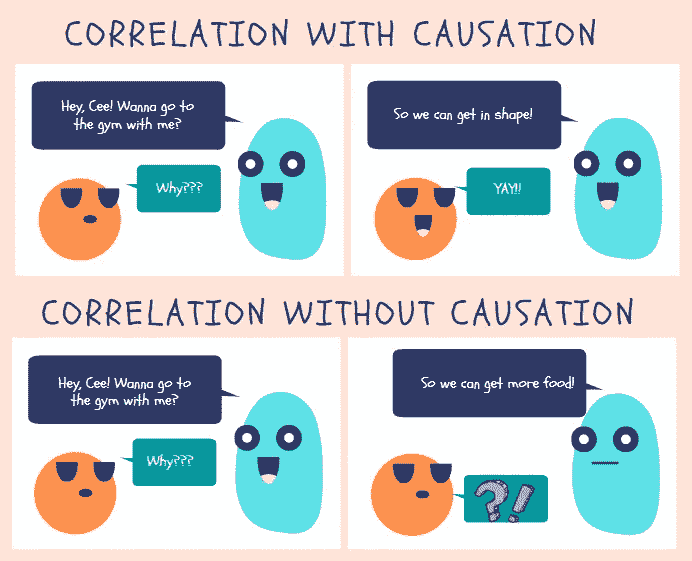
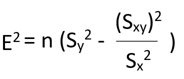

# 相关性与因果性

> 原文：<https://medium.com/analytics-vidhya/correlation-vs-causation-56c884874a74?source=collection_archive---------15----------------------->

我们知道，相关性和因果关系是指两个变量之间的关系，但有一点不同。

作者使用 Canva.com 制作的图像

相关性是了解两个变量之间关系强度的统计方法。

它将使用下面的等式来测量。

要了解这个等式的更多信息，请查看文章[为什么相关系数 r 在-1 和+1 之间。？](https://devskrol.com/index.php/2020/07/16/why-the-correlation-coefficient-r-ranges-between-1-and-1/)

该公式描述了两个变量之间线性关系强度的度量。

我们可以认为，关系意味着一个变量对另一个变量产生影响。这就叫因果关系。

但这并不意味着每当相关系数高的时候，总会有因果关系。

> *相关并不意味着因果关系。*

# 与因果关系的相关性:

一个变量的变化会影响另一个变量。

例如身高和体重。

# 没有因果关系的相关性:

有时测量相关系数很高，但在现实世界中这并不意味着什么。意味着这些数据纯粹是巧合。

> *例如，著名演员的电影上映与上映时正在下雨的相关系数是 0.9。但我们知道这纯粹是巧合，那个演员或者电影和天气无关。*

在这种情况下，相关性并不意味着任何因果关系。如果我们使用相关系数，并根据这一统计数据建立任何模型，那么对于新的数据集来说，这将是失败的。

希望你明白相关不一定是因果关系。

谢谢大家！👍

喜欢支持？只需点击拍手图标👏想吃多少就吃多少。

编程快乐！🎈