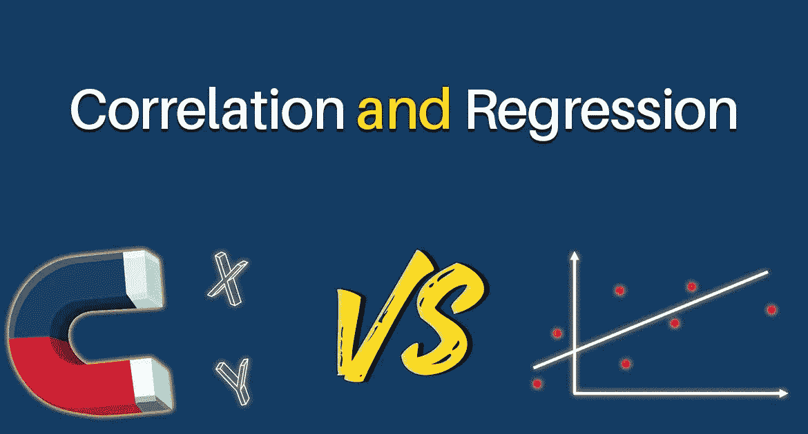
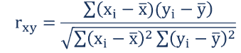
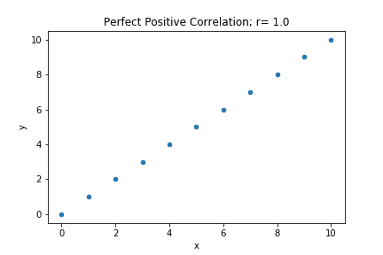
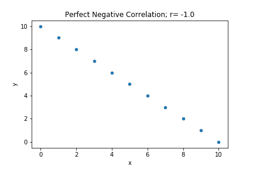
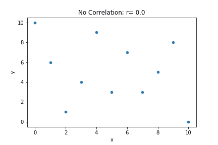
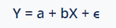

# 相关性与回归——统计术语之战

> 原文：<https://medium.com/analytics-vidhya/correlation-vs-regression-the-battle-of-statistics-terms-f3db85fef0a6?source=collection_archive---------3----------------------->

统计是复杂的。对于新手来说，如果没有合适的学习资源，开始学习统计学会很痛苦。这是我关于统计学的第三篇博客，我非常兴奋能够从相关性和回归性的概念开始。所以让我们先了解一下。

相关与回归这两个统计学术语用于测量和分析两个不同变量之间的联系，并用于进行预测。这种方法常用于各种行业；除此之外，它还用于日常生活中。

例如，你可能看到某人穿着昂贵的服装；你会自然而然地认为他/她可能在经济上很成功。另一个例子是，你认为通过早上锻炼来减肥，然后你从第二天早上开始跑步。

上述例子是现实生活中**相关与**回归的例子，因为一个变量，即昂贵的服装，与其他变量直接相关，即富有。因此，我们为您提供了**相关与回归**的异同列表。

# 有什么关联？

因为相关性本身给你的意思是“co”意味着在一起，而“relation”意味着两个量之间的联系或联系。或者我们可以说，如果一个变量发生变化，那么另一个变量也会自动发生变化，不管它是直接的还是间接的。

例如，假设我们有两个不同的变量 x 和 y，这两个变量的变化被认为是正的或负的。每当这两个变量的变化方向相同时。或者我们可以说，如果一个变量在增加，那么第二个变量也会增加，那么这个变化就被认为是正的。

# 相关公式

相关系数用于通过使用以下公式来表示两个变量之间关系的数据:

在哪里

*   **rxy**——变量 x 和 y 的相关系数
*   **Xi**—x 变量的值是一个表示。
*   **x̅**—x 变量的平均值。
*   **yi** —表示中 y 变量的值。
*   **ȳ**—y 变量的平均值。

有一些常见类型的测试来衡量相关性，这些是:皮尔逊，斯皮尔曼秩和肯德尔τ。每个人都有自己的关于数据的假设，为了使测试能够准确地测量相关性水平，需要满足这些假设。这些将在文章中进一步讨论。每种类型的相关性检验都是在检验以下假设。

**H0 假设:**变量 1 和变量 2 之间没有关系

**HA 假设:**变量 1 和变量 2 有关系

如果获得的 p 值小于测试值，那么可以说变量之间存在显著的关系。大多数领域使用的阿尔法水平为 0.05，我也将使用。

有几种类型的相关性:

*   **正相关**:一个变量增加，另一个也增加

*   **负(逆)相关**:一个变量增加，另一个变量减少

*   **无关联**:两个变量的变化之间没有关联

相关性的强弱很重要。绝对值越接近-1 或 1，相关性越强。

r 值强度 0.0–0.2 弱相关 0.3–0.6 中等相关 0.7–1.0 强相关

# 皮尔逊相关假设

皮尔逊相关检验是一种对数据做出假设的参数检验。为了使皮尔逊相关性检验的结果有效，数据必须满足以下假设:

*   样本是独立随机抽取的
*   这两个变量之间存在线性关系
*   绘制时，这些线形成一条线，而不是曲线
*   方差是同质的

相关性测试中使用的变量应该是连续的，并按比率或区间销售进行测量，每个变量必须具有相同数量的非缺失观察值，并且不应该存在异常值。

# 斯皮尔曼等级相关假设

Spearman 等级相关是一种非参数检验，它不对数据的分布做任何假设。Spearman 等级相关性检验的假设是:

*   被测试的变量之间存在单调关系
*   当一个变量增加时，另一个变量也增加，存在单调关系

对于 Spearman 等级相关，如果数据不是正态分布的，即使不存在方差齐性，数据也可以用于等级数据。

# 肯德尔τ相关假设

肯德尔τ相关是一种非参数检验，它不对数据的分布做任何假设。唯一的假设是:

*   被测试的变量之间应该有单调的关系

数据应该用序数、比率或区间尺度来衡量。

# 什么是回归？

回归表示单个变量如何影响另一个变量，或者单个变量可以对另一个变量的变化负责。这意味着结果取决于一个或多个变量。

例如，相关性用于定义两个变量之间的关系，而回归用于表示彼此的影响。一个例子是，由于暴雨，一些农作物会受到损害。这也可能导致洪水。

# 回归公式

回归用于表示变量和自变量之间的关系。所以可以表示为:

其中:

*   **Y** —因变量。
*   **X** —自变量。
*   **一个** —拦截。
*   **b** —斜率。
*   **ϵ** —误差(残差)。

现在，在继续讨论**相关性与回归**的区别之前，让我们找出两者的相似之处。

# 相关性与回归的相似性

*   这两个术语都用来量化两个变量之间关系的强度和方向。
*   当相关性和回归斜率分别为负时，存在某个点。
*   同样，相关性和回归斜率都可以为正。

# 相关与回归的区别

除了相似之处，还有一些不同之处，如下所示:

**相关回归参数:**

**定义:相关性**用于衡量决定两个变量之间联系的统计量。**回归**用来表示自变量和因变量之间的联系。

**用途:相关性用于**显示两个变量之间的线性关系。**回归用于**获得最佳数据，并在其他变量的基础上估计单个变量。

**自变量和因变量:在相关性中，t** 这里两个变量没有区别。在**回归**中，两个变量互不相同。

**表示:****相关系数**表示两个变量值一起移动的程度。**回归**表示被称为变量(X)的单位变化对估计变量(Y)的影响。

**目的:相关性有助于**获得变量之间的数值表达式关系。**回归有助于在固定变量的基础上确定选定变量的值。**

**数据表示:相关性**表示单个点。**回归**可以用线条表示数据。

**使用数学方程:**没有，**没有关联**数学方程之间没有直接联系。是的，**回归**中的数学方程之间是有直接联系的。

# 结论

上面关于**相关性 vs 回归**的讨论表明，这两个数学概念之间有相似之处，也有不同之处，尽管两者是一起研究的。当研究人员想知道研究中的变量是否相关时，他们使用相关性。那协会的实力是什么。然而，回归分析用于获得两个变量之间的函数关系，以进一步预测事件。

谢谢你的阅读。将来我也会写更多初学者友好的帖子。请关注我，了解他们的情况。

# 如果你喜欢这篇文章，请鼓掌！