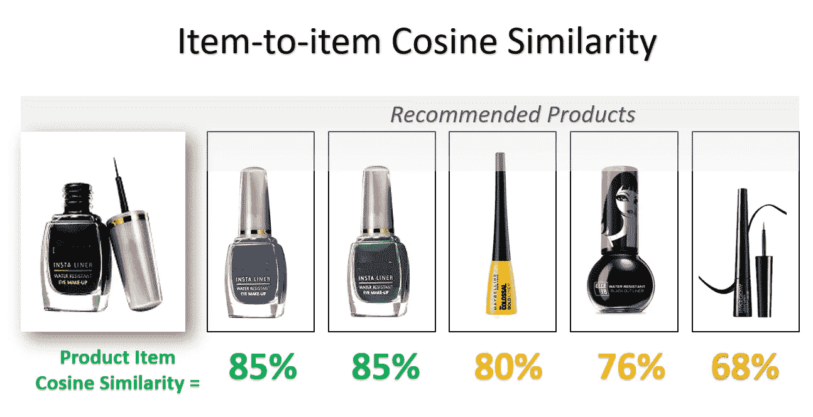
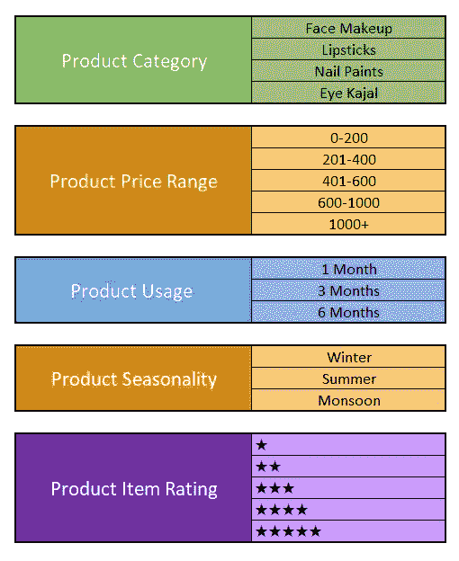
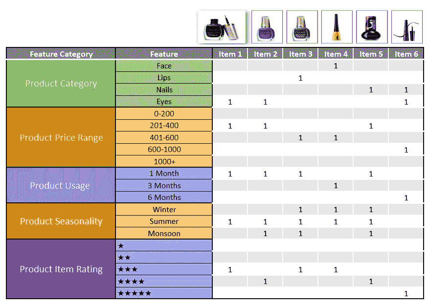
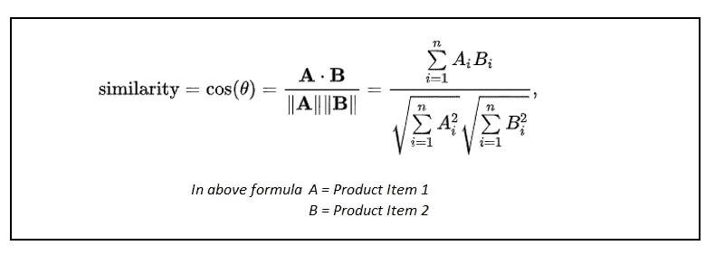
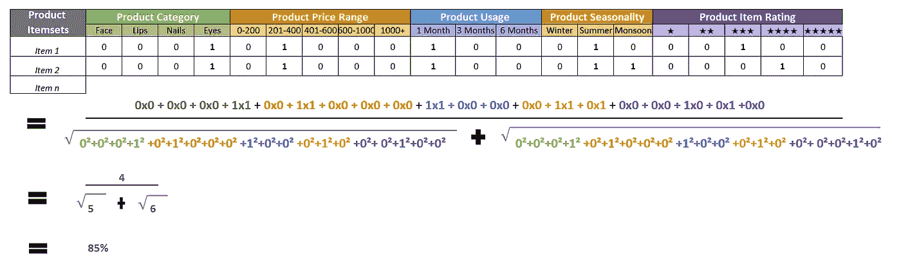
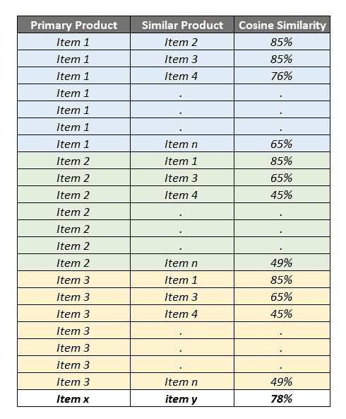

# 产品之间的余弦相似度来推荐相似的产品

> 原文：<https://medium.com/analytics-vidhya/cosine-similarity-between-products-to-recommend-similar-products-3b94bf6e30ba?source=collection_archive---------3----------------------->

使用余弦相似度为您的电子商务网站确定最佳相似产品。它也被称为项目到项目的相似性。

我想介绍一个非常简单，但是非常强大的推荐技术— **余弦相似度**。

左侧为产品，右侧为其相似产品项目(%表示最左侧产品和单个产品之间的余弦相似性)

**第一步:确定每个产品的特点。**

首先，您必须识别每个项目集的特性。

特征可以是一些重要的属性，有助于单独识别产品，并帮助您直观地对它们进行分类。

我以化妆品为例，对它们进行进一步分类，并根据它们的相似属性推荐其他化妆品。功能选择取决于您可以使用哪些数据点及其在产品项集之间的变化。让我们先确定几个特征。

化妆品特征选择的例子。

**第二步:给每件商品贴上标签。**

我们将根据产品的属性和数据点对产品进行分类。

为目录中的每个产品分配标签的示例

**第三步:根据特征找出每个产品的相似之处。**

我们将使用标准的余弦相似性，这是一种常用的方法，它基于计算产品之间公共属性的最大数量来匹配相似的产品项目集。

在数学上，它测量的是在多维空间中投影的两个向量之间的角度余弦。在这个上下文中，我所说的两个向量是包含两个产品的特征计数的数组。

余弦相似公式

让我们对***产品项目 1 &产品项目 2 进行计算。***

计算产品项目 1 和项目 2 余弦相似度

现在，我们知道两个产品之间的**相似度是 85%** 。同样，对于每个项目集，您可以对目录中所有可用的产品项目运行迭代次数。

> **第 1 项至第 2 项，**
> 
> **第 1 项至第 3 项，**
> 
> **项目 1 至项目 4**
> 
> **。**
> 
> **。**
> 
> **第 1 项至第 n 项**

然后是项目 2 到项目 1，项目 2 到项目 3，依此类推。

**成功使用余弦相似度后，您将根据购物者正在查看的产品向他们推荐产品数量。**

**请注意:**我使用的数据和产品图片仅供学习之用，无意做广告或推广。它们旨在增强**公众**对余弦相似性及其在推荐系统中的使用的信息的访问。