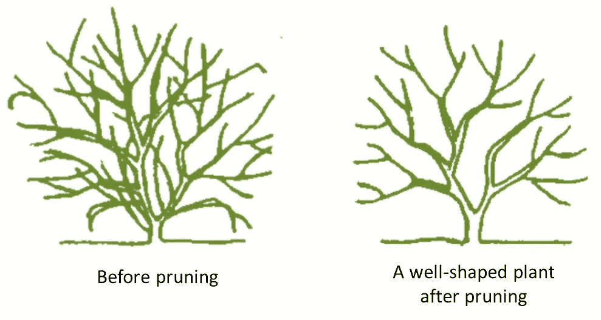
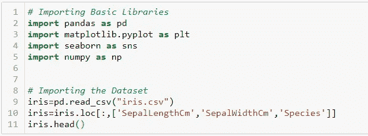
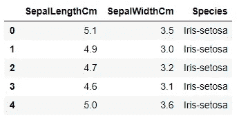
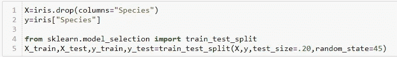
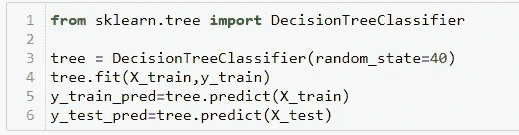
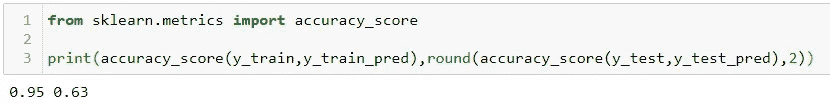
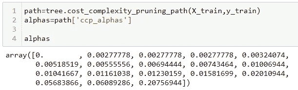
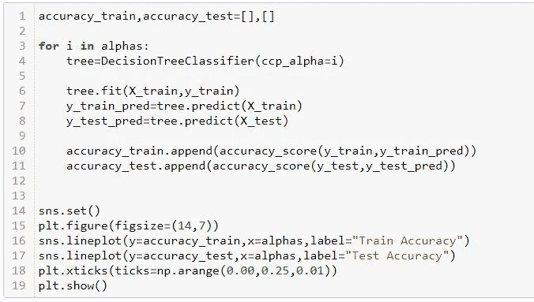
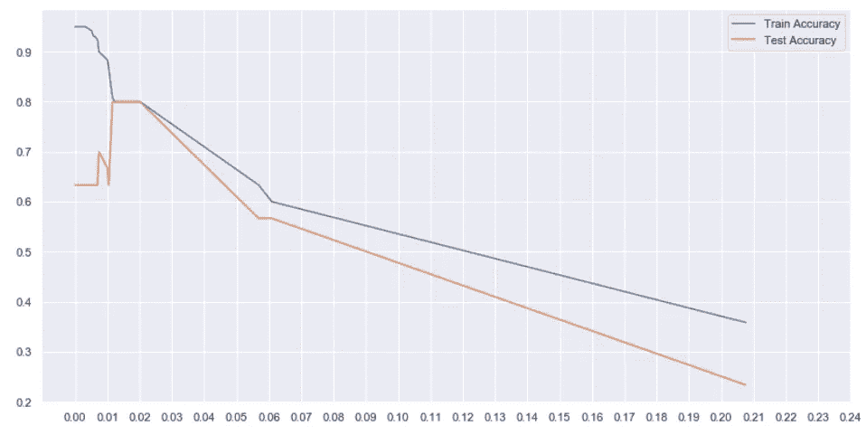
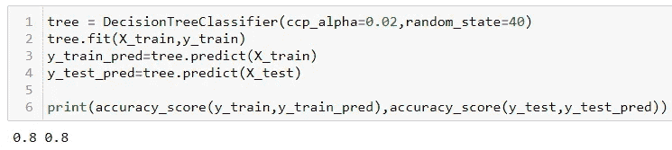

# 决策树中的成本复杂性修剪

> 原文：<https://medium.com/analytics-vidhya/cost-complexity-pruning-in-decision-trees-f82b14a7fe91?source=collection_archive---------14----------------------->

## 理解决策树中的过拟合问题，并使用 Python 中的 Scikit-Learn 通过最小成本复杂度剪枝解决该问题

决策树是数据科学家工具箱中最直观、最有效的工具之一。它有一个倒置的树状结构，曾经只用于决策分析，但现在也是一个出色的机器学习算法，尤其是当我们手中有一个分类问题时。

他们以捕捉数据模式的能力而闻名。但是，凡事过度都是有害的，对吗？决策树臭名昭著，因为它们太依赖于被训练的数据。
因此，你的树在部署上给出的结果很差，因为它不能处理一组新的值。

但是，你不用担心。就像一个熟练的机械师在他的工具箱里有各种尺寸的扳手一样，一个熟练的数据科学家也有他的一套技术来处理任何类型的问题。

修剪是用来克服过度拟合问题的技术之一。从字面上来看，修剪是一种有选择地去除树(或植物)的某些部分，如树枝、芽或根，以改善树的结构，促进健康生长的做法。这也正是修剪对我们的决策树所做的。它使它变得多才多艺，因此如果我们向它输入任何新类型的数据，它都能适应，从而解决了过度拟合的问题。

它减少了决策树的大小，这可能会稍微增加你的训练误差，但大大减少了你的测试误差，从而使它更具适应性。

**最小成本复杂度剪枝**是决策树剪枝的一种。

该算法由称为复杂度参数的 **α** (≥0 **)** 参数化。

复杂度参数用于定义给定树 T 的成本复杂度度量 Rα(T):**Rα(T)= R(T)+α|T|** 其中| T |是 T 中的终端节点的数量，R(T)传统上被定义为终端节点的总误分类率。

在其 0.22 版本中，Scikit-learn 引入了这个名为 ccp 阿尔法的参数(是的！它是**成本复杂性修剪- Alpha** 的缩写，可用于执行相同的操作。

我们将使用 **Iris 数据集**来拟合决策树。你可以点击下载数据集[。](https://github.com/iasarthak/My-Data-Logs/blob/master/Concepts/Iris.csv)

首先，让我们导入基本库和数据集

导入库和数据集

数据集看起来像这样-

我们数据集的一个片段

我们的目的是根据萼片的长度和宽度来预测花的种类。

我们将把数据集分成两部分——训练和测试，这样我们就可以看到我们的模型在看不见的数据上的表现。
(我们将使用 ***sklearn 的 **train_test_split** 函数。模型 _ 选择*** 来分割数据集)

将数据集拆分成训练和测试

现在，让我们为训练部分安装一个决策树，并对测试和训练进行预测。
(为此，我们将使用 ***sklearn.tree*** 中的**决策树分类器**)

决策树的实现

默认情况下，决策树函数不执行任何修剪，而是允许树尽可能地增长。我们在列车和测试部分分别得到了 **0.95** 和 **0.63** 的精度分数，如下所示。我们可以说我们的模型过拟合，即记忆训练部分，但不能在测试部分表现得同样好。

训练和测试精度分别为 0.95 和 0.63

sklearn 中的决策树有一个函数叫做 cost_complexity_pruning_path，它给出了剪枝时子树的有效 alphas，也给出了相应的杂质。换句话说，我们可以用这些α值来修剪我们的决策树-

成本复杂性修剪路径

我们将使用这些设置阿尔法的值，并将其传递给决策树分类器的 **ccp 阿尔法**参数。通过循环遍历**阿尔法**数组，我们将找到数据集的训练和测试部分的准确性。

循环遍历 alphas 并为相应的训练和测试精度绘制线图的代码，

精度 v/sα

从上面的图中我们可以看到，在 alpha=0.01 到 0.02 之间，我们得到了最大的测试精度。虽然我们的训练精度已经降低到 0.8，但我们的模型现在更加一般化，它将在看不见的数据上表现得更好。

α=0.02 时的训练和测试精度

我们还可以使用 K-fold 交叉验证来测试我们的模型，而不是使用训练测试分割。这将让我们更好地了解我们的模型在看不见的数据上的表现。

如果你想了解成本复杂性修剪背后的数学原理，点击[这里](https://online.stat.psu.edu/stat508/lesson/11/11.8/11.8.2)。点击[此处](https://scikit-learn.org/stable/modules/generated/sklearn.tree.DecisionTreeClassifier.html)查看决策树的 scikit-learn 文档。

你可以在[我的 GitHub](https://github.com/iasarthak/My-Data-Logs/blob/master/Concepts/Cost%20Complexity%20Pruning.ipynb) 上找到笔记本，仔细看看我都做了些什么。
另外，在 [LinkedIn](https://www.linkedin.com/in/iasarthak/) 上与我联系，让我们讨论数据！

感谢你坚持到最后！^_^

另外，请给我一个中等的。这将激励我经常为你创造内容。干杯！