# 纯 Kotlin 中的代价函数和梯度下降

> 原文：<https://medium.com/analytics-vidhya/cost-function-and-gradient-descent-in-pure-kotlin-169c14c0ec7?source=collection_archive---------21----------------------->

今年早些时候，我一直在 Coursera(来自斯坦福大学)学习一门著名的机器学习课程，有时我发现同时学习 octave 有点困难。因为这不是我喜欢的编程语言类型，所以我想用我在 Java 或 Kotlin 中学到的东西进行实验。最后，我决定使用 Kotlin，因为它更容易实现 matrix 及其函数，这主要是因为它支持 operator 霸王和中缀函数。

因此，我将从与 Couseara 课程相同的 leaner 回归开始，然后希望我会转到逻辑回归、神经网络、SVM 等，并对 Kotlin 做同样的事情。

让我们从成本函数开始..

## 什么是成本函数(损失函数或平方误差函数)

这里我不打算解释定义，但它做的是对预测值和期望值之间的误差进行量化。因此，一旦我们计算误差(图中的距离)并求和，我们将得到预测的损失。

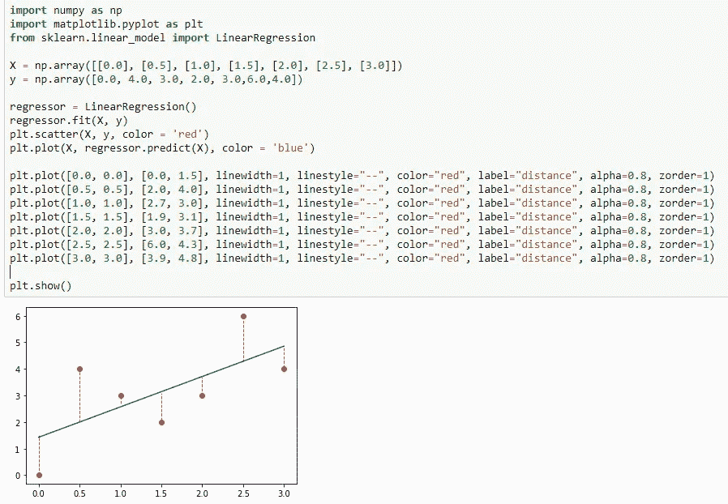

实际和预测之间的距离

让我们开始编码。

## 首先定义矩阵

没有什么复杂的只是保持行数和列数，并将所有数据保存在一个列表中。

Ex- if 矩阵是 2 x 3 [0，0] =第 1 个元素，[0，3] =第 3 个元素，[1，0] =第 4 个元素，[1，3] =第 6 个元素

我计划以列表形式检索所有特性和结果。所以需要一个方法把列表转换成这个矩阵。

在这里，它可以很容易地通过给定的列数将其转换为矩阵。确保列表的大小必须与列数兼容。

现在，我们需要做的就是实现成本函数。因为我在处理矩阵，所以我们不必担心特征的数量。一旦正确实现，它将工作任何数量的给定功能。无论如何，为了使这个形象化，我取一个有一个变量的数据集。但是我将运行一些具有两个或更多特性的数据集，并与 Python 库进行比较，以确保我们的实现工作正常。

成本函数是一个简单的等式。它的作用是，得到所有误差的总和，然后取平均值。

*注:对于未来的直觉，我建议跟随一个深入的教程。*

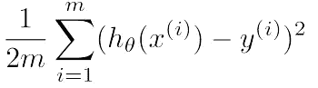

这是对多特征数据集的假设。

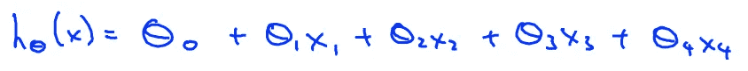

来源:Coursera 机器学习课程——斯坦福大学

“X Xθ”(X 乘以θ)到底是什么？。是的，这就是度量乘法，这就是科特林中缀函数的美妙之处。让我们实现这一点。

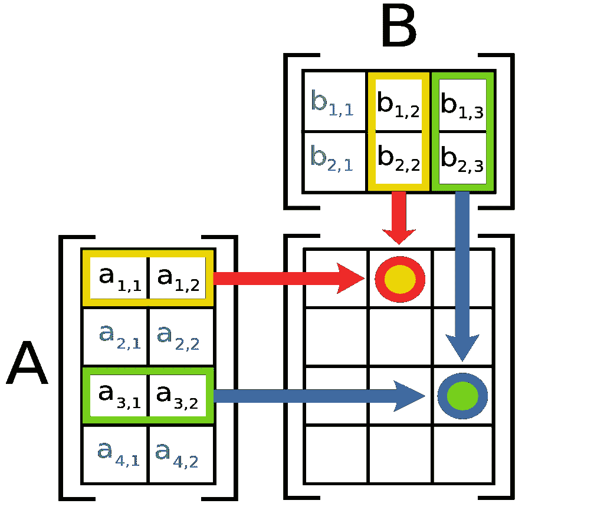

[4 x 2] x [ 2 x 3] = [4 x 3]矩阵(来源——维基)

好的，首先，我们需要实现矩阵乘法，这是乘法是如何实现的图示。

第一个矩阵的列和第二个矩阵的行必须相等。

所以基本上就是这样。现在你能够计算给定的成本。

但是，这里我们实现了没有矢量化的成本函数。我们所做的是迭代每个元素，并将累积误差存储在临时变量中。但是我们可以使用矢量化以更好的方式来实现。

矢量化和非矢量化实施

> 上面我已经添加了这两个实现，所以你可以检查不同之处。

但是，对于矢量化的实现，我们需要更多的运算符重载&矩阵函数，如下所示。

矩阵减运算符过载函数

矩阵幂扩展函数

矩阵求和

好了，我们完成了成本函数的实现。让我们加载一些数据集，并找出一些猜测的成本。

在这里，我使用 JMathPlot 来绘制数据集。

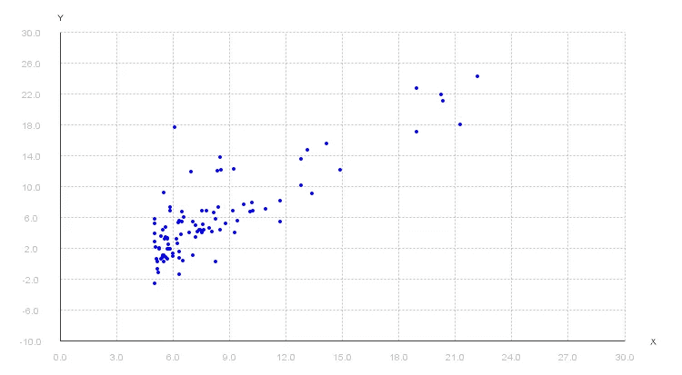

让我们猜猜看。😂 😂

经过一番猜测，我的最佳猜测是θ[-4.0，1.2]。(因为这是单变量数据集)让我们画出来。

> 注意:-为了考虑截距项(θ0)，我们添加一个附加列作为 X 的第一个索引，并将其设置为全 1(1 *θ0)。所以我们可以很容易地做乘法，找到假设

使用给定默认值为给定索引插入新列的函数

并在图中画线。

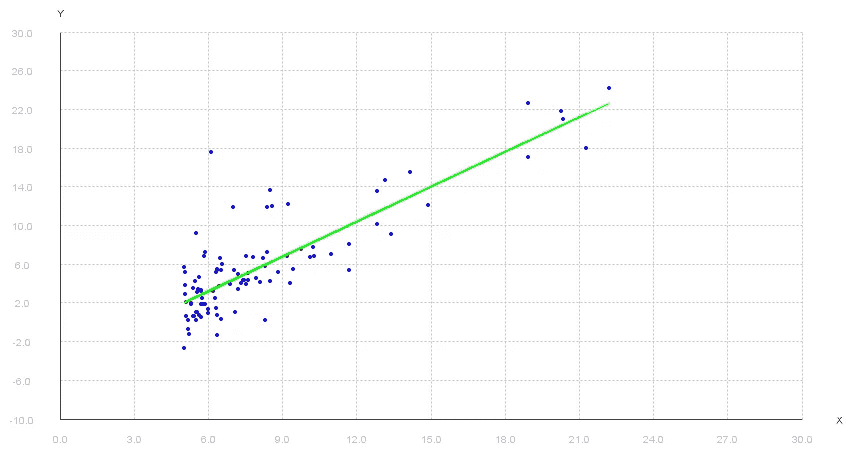

现在，让我们运行我们的实现，并找出猜测的成本。

```
4.478453220857733 (from non vectorized function)
4.478453220857733 (from vectorized function)
```

所以我得到了 4.4785 作为成本。从根本上来说，我们需要确保成本最小，以表明绘制的线最适合给定的数据集。

所以，我们要做的是，从一些θ值开始，不断改变它，以降低成本函数，直到我们找到最小值。这叫梯度下降。


来源—[https://ml-cheat sheet . readthedocs . io/en/latest/gradient _ descent . html](https://ml-cheatsheet.readthedocs.io/en/latest/gradient_descent.html)

换句话说..

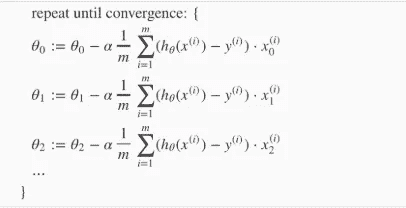

在实施梯度下降算法之前，我真的需要知道我的猜测是否正确😉。所以让我们做一个快速的 python 脚本来看看。

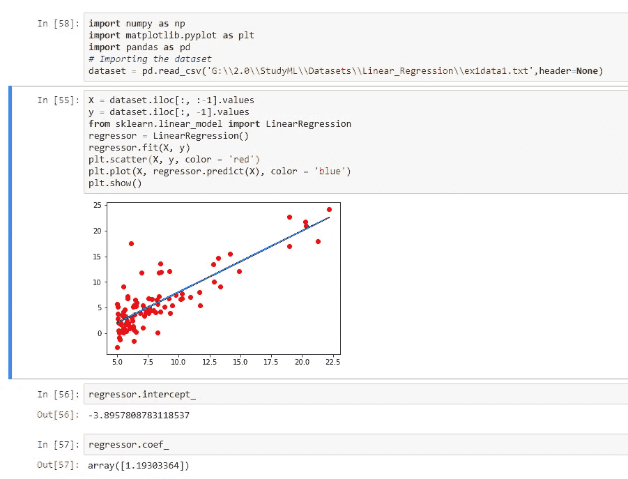

```
Intercept : -3.8957808783118537
Feature's coefficients are: [1.19303364]
So calculated cost is: 4.476971375975176
```

哈哈，太接近了😇 😎。

让我们现在做梯度下降代码。

我们需要实现更多的矩阵函数和运算符重载。(转置和矩阵*双精度)

转置函数

矩阵*双运算符重载

所以我们完成了✌️.让我们运行同样的例子，看看我们得到的结果是否和 Python 脚本一样。

```
With learning rate = 0.01 and iteration = 1000 i've gotIntercept: -3.241402144274422
Coefficients: [1.1272942024281842]
Cost: 4.515955503078912
```

哇…那太糟糕了😱。连我的猜测都比那好。那么有什么问题吗？。让我们画出收敛图，看看发生了什么。

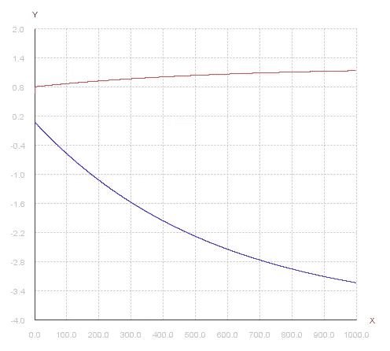

它的清晰，训练率是公平的，但它需要更多的迭代收敛更多。所以我们把迭代增加到 5000 看看。

```
With learning rate = 0.01 and iteration = 5000 i've gotIntercept: -3.895300510657168
Coefficients: [1.1929853860482198]
Cost: 4.47697139698281
```

收敛图也很好。

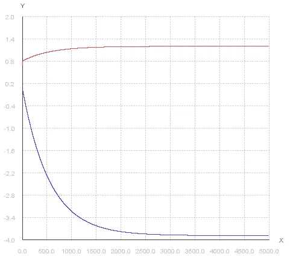

万岁…..😇 😇。成功了。现在，让我们画出结果。

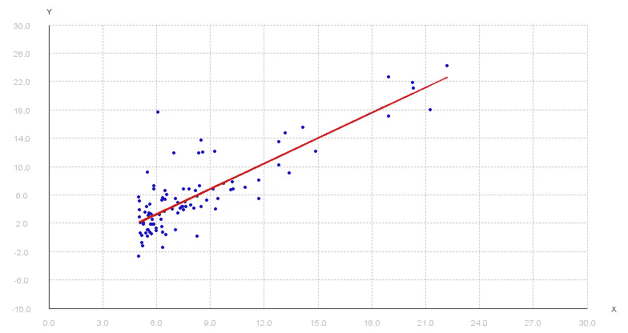

够公平吧？。现在我想形象化地展示θ值在每次迭代中是如何变化的。所以我要把所有的θ值保存在列表中并返回。然后用 thread.sleep()打印每一个

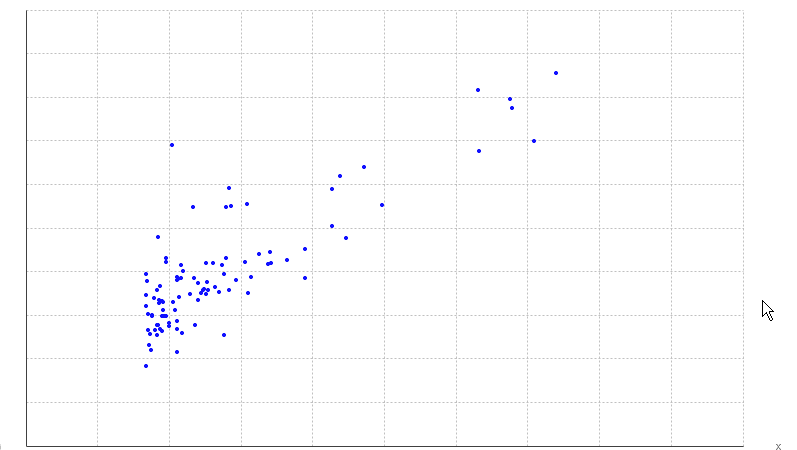

现在让我们从 Kaggle 获得另一个数据集，并评估我们的实现。

数据集—[https://www.kaggle.com/andonians/random-linear-regression](https://www.kaggle.com/andonians/random-linear-regression)

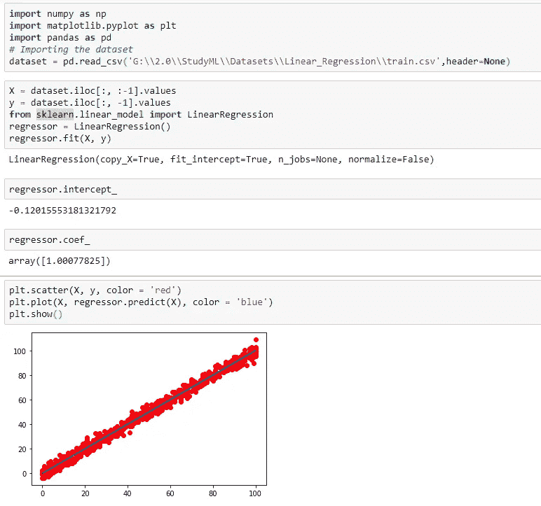

随着我们的实施，

> **学习率= 0.0005，迭代次数= 10000**

```
intercept: -0.08157245168346036
coefficients: [1.0001999306062792]
Cost: 3.944586551695178 
```

> **学习率= 0.0005，迭代次数= 100000**

```
intercept: -0.12015504504010248
coefficients: [1.0007782407846593]
Cost: 3.944399934788149
```

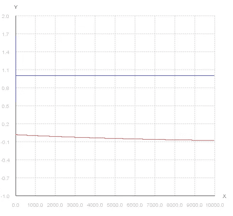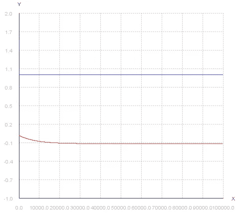

左:**学习率= 0.0005，迭代次数= 10000:收敛还需要更多的迭代次数**右:**学习率= 0.0005，迭代次数= 200000:似乎收敛正常**

出于好奇，让我们绘制前 100 次迭代(放大)并观察它的行为。

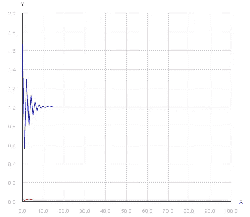

似乎最初，它很挣扎。不过，很快就恢复了。最初的挣扎表明学习率比我们想象的要高一点，所以只要把学习率降低到 0.0002，看看会发生什么。

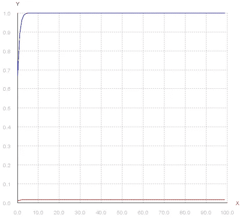

现在看起来很公平，但是这是以迭代次数为代价的。这意味着训练所需的时间。所以既然恢复的好，我觉得还是保持在 0.0005 比较好。

或者我应该再增加一点看看？好，让我们增加到 0.0006，看看它如何表现。

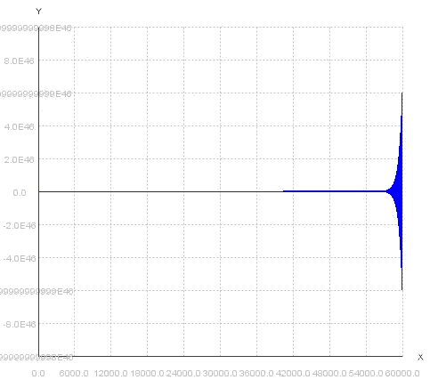

搞砸

阿哈哈哈太高了😬 😬，我们不要去那里😉。

## 多变量梯度下降

现在，让我们获取一个多特征数据集并运行我们的实现。数据集与“Coursera”作业中使用的数据集相同。

> 注意:两个特征，房子的大小(平方英尺)和卧室的数量。我们正在预测房子的价格。

首先，这里是计算截距和特征系数的 python 代码。

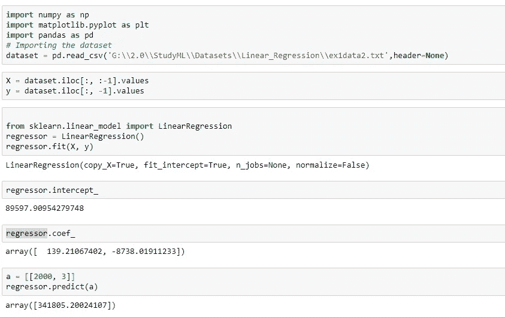

> 做了 2000 平方英尺和 3 间卧室的预测，答案是 341805.200

现在我们将运行我们的实现，看看我们是否得到相同的结果。

```
***1st attempt***
Learning Rate = 0.0000002
Iterations = 5000000***2nd attempt***
Learning Rate = 0.0000002
Iterations = 10000000***3rd attempt***
Learning Rate = 0.0000002
Iterations = 100000000
```

所有 3 次尝试都表明迭代远远不足以使θ最小化。你可以在下面的图表中看到。

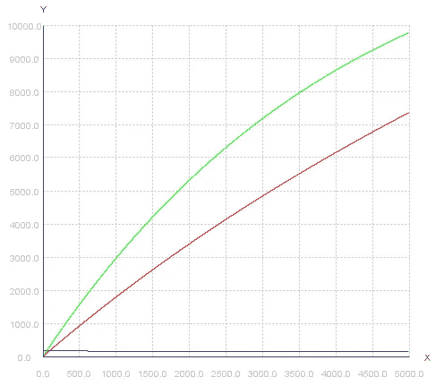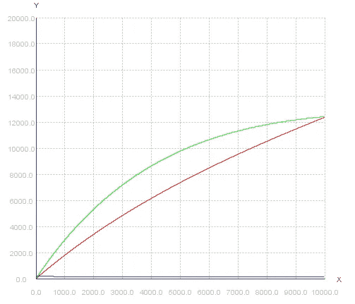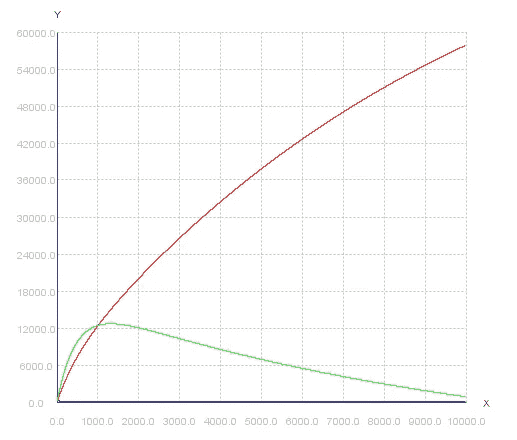

所以在我的第四次尝试中，我将迭代次数增加了 4 倍，希望它能给我一些最佳值。

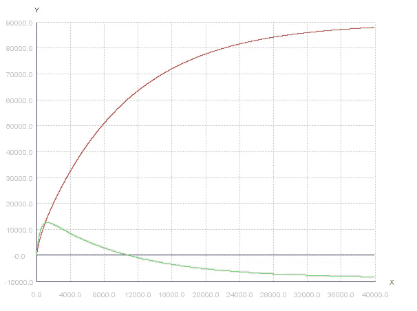

```
***4th attempt***
Learning Rate = 0.0000002
Iterations = 400000000
```

😱哦，伙计，你仍然可以看到红色和绿色的线不是最佳的。所以在最后一次尝试中，让我们将迭代次数增加到 550000000 次，看看它是如何工作的。

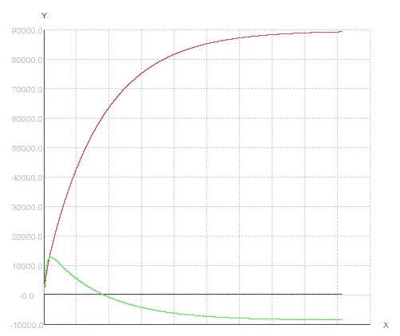

嗯，这花了大约 145 分钟来运行。但这也不是 100%准确。但是现在，我可以应付这些结果。还有，我受够了🙏。让我们用我在最后一次尝试中得到的结果来做预测。

```
***5th attempt***
Learning Rate = 0.0000002
Iterations = 550000000Intercept: 89211.91357108342
coefficients: [139.20934164431515, -8621.386066273524]]
Cost: 2.0432840334191492E9
```

所以，如果我们预测和 python 一样(2000 平方英尺& 3 间卧室)。

```
89211.916 + (2000 * 139.209) + (3 * -8621.386) = **341765.758**
```

预测值是 341，765.758 非常接近不是吗？👍

但是你可以看到红线，它还不稳定。所以仍然需要更多的迭代以获得更高的精度。但我已经受够了，因为这花了我两个半小时来执行。那么问题是什么呢？为什么花了这么长时间？

答案是我们没有扩展功能。我们来看一下数据集。

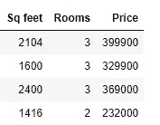

4 / 47

我们得到的特征是房子大小(平方英尺)和卧室数量。问题是，这些特征的尺度是如此的不同，并且不在一个相似的数值范围内。这让一切都变得缓慢。

因此，让我们首先缩放特征。想法是获取大约在-1 和+1 之间的所有特征数据。

这被称为均值归一化。基本上，特征值减去相同特征的平均值，然后除以范围。对于范围，我们可以使用最小-最大值或标准差。(或许你可以在这里找到更好的答案[https://sebastianraschka . com/Articles/2014 _ about _ feature _ scaling . html](https://sebastianraschka.com/Articles/2014_about_feature_scaling.html))

因为“Coursera”课程使用了标准差，所以我也要使用它。

均值、标准差扩展函数&返回给定列中所有值的方法

好了，我们实现了所有需要的功能。现在让我们把它们放在一起，实现“featureNormalize”方法。

现在，我们的梯度下降在一秒内完成🤘。

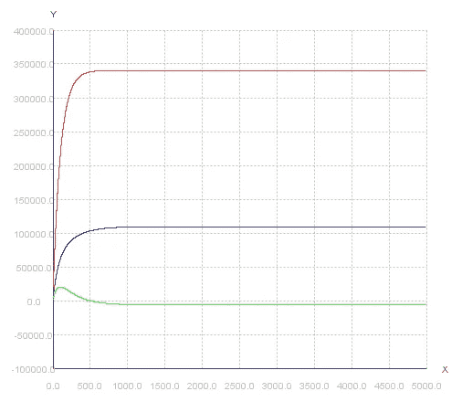

```
Intercept: 340412.659
coefficients: [109447.796,  -6578.354]]
Cost: 2.043280050602829E9
```

为了对 2000 平方英尺和 3 个房间进行预测，我们需要根据各自的平均值和标准偏差对这些值进行标准化。为此，我们需要从归一化方法中得到相同的均值和标准差。

```
Mean : [2000.680, 3.170])
Standed diviation : [786.203, 0.753]) Sq feet = (2000–2000.680) /786.203 = -0.000865
Rooms = (3 - 3.170)/0.753 = -0.226340412.659 + (109447.796 * -0.000865) + (-0.226 * -6578.354)
**= 341804.694**
```

结果是一样的。然而，在特征缩放之后，我们得到结果要快得多。

就这样，我们结束了。😇

以上所有代码你都可以在我的 [GITHUB](https://github.com/shehanmdev/MyML) repo 中找到。

直到下次..:)