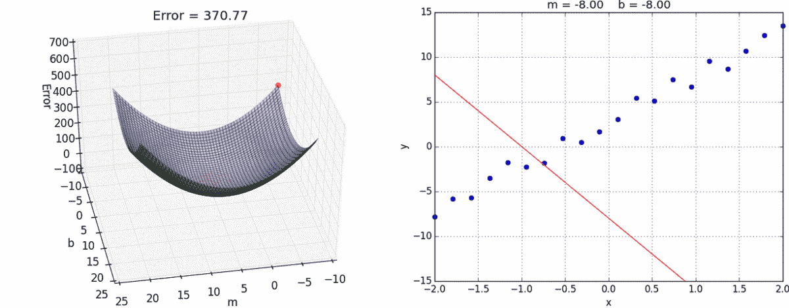

# 不到 5 分钟就解释了成本函数

> 原文：<https://medium.com/analytics-vidhya/cost-function-explained-in-less-than-5-minutes-c5d8a44b918c?source=collection_archive---------8----------------------->

最重要的一个 ***机器学习概念*** 不到 5 分钟讲解完毕…

GIF [这里](https://miro.medium.com/max/2400/1*gkl-HRUK35WejSqimAja1w.gif)

假设您刚刚训练了一个 ***线性回归模型*** 来预测芝加哥的房价(以英尺为单位),现在，您想知道您的模型在他的预测中表现如何。为此，您需要使用一个 ***成本函数*** ！