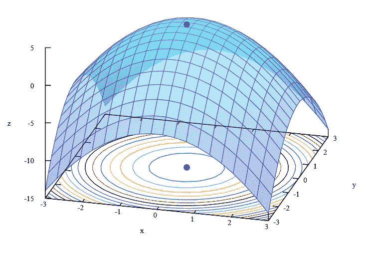

# 机器学习中的成本函数、学习速率和梯度下降

> 原文：<https://medium.com/analytics-vidhya/cost-function-learning-rate-and-gradient-descent-in-machine-learning-3dfd033e2d59?source=collection_archive---------1----------------------->

# 价值函数

我们在机器学习中最主要的目标是最小化成本函数，因此，优化过程被实现来最小化这个成本函数。根据我们对我之前关于简单线性回归的博文的理解，成本函数由下式给出: