# 脸书的 prophet 算法能预测全球气温趋势吗？

> 原文：<https://medium.com/analytics-vidhya/could-prophet-algorithms-from-facebook-forecast-global-temperature-tendency-e0f49b818abf?source=collection_archive---------22----------------------->

我们不知道，但我们尽力了。首先，我们准备一个包含几个温度机场的数据库。我对 10 个国际机场进行了采样，只记录了温度参数。为此，我从爱荷华州立大学读取了我需要的数据([链接](https://mesonet.agron.iastate.edu/request/download.phtml))。你需要知道机场的 ICAO 名称。这个[链接](https://www.windy.com/es/-Acumulaci%C3%B3n-de-lluvia-rainAccu?rainAccu,2020-02-15-18,41.444,-8.322,5,i:pressure,m:eQcafUA)将帮助您找到世界上所有机场的 ICAO 名称。

入选机场名单及其 ICAO 名称为:伦敦希思罗机场(EGLL)、约翰·肯尼迪国际机场(KJFK)、阿道夫·苏亚雷斯·马德里-巴拉哈斯(LEMD)、谢列梅捷沃·亚历山大·普希金国际机场(UUEE)、开普顿国际机场(FACT)、成田国际机场(RJAA)、皮斯塔里尼部长国际机场(SAEZ)、路易斯·穆尼奥斯·马林国际机场(TJSJ)、英迪拉·甘地国际机场(VIDP)、悉尼金斯福德·史密斯国际机场(YSSY)

我们读取包含两列的 CSV 文件:日期-时间列和以摄氏度为单位的温度。也许，有些温度是异常值或错误。避免错误的一个方法是计算日平均温度而不是日平均温度。然后我们画出一些结果:

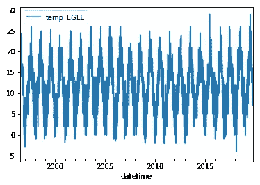

伦敦希思罗机场的日平均气温

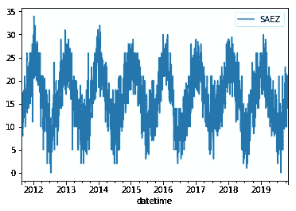

布宜诺斯艾利斯机场的日平均气温

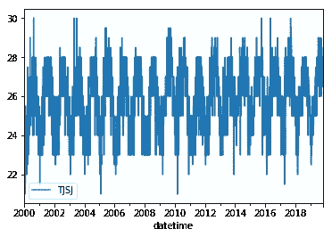

圣胡安机场的日平均温度

三个机场呈现出明显的季节性模式。我们可以将时间序列分解为趋势和年度季节性(假设没有每周成分)。南半球的机场在 1 月或 2 月达到高温值。北半球的机场在 7 月或 8 月获得高温值。离赤道越远，温度幅度越大。

我们可以应用 Prophet 算法来找出每个机场的趋势和季节性因素。在伦敦希思罗机场，我们用黑点标出观测数据，蓝线是预测温度。红线表示一种趋势。

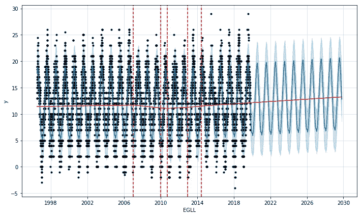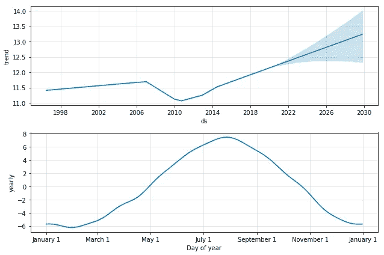

在这种情况下，我们可以看到一个明显的趋势。其他机场表现出负面趋势，如 KJFK

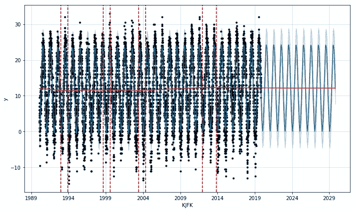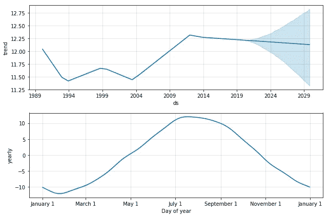

像圣胡安机场(TJSJ)这样的机场很难接待有明显倾向的客人。圣胡安机场靠近赤道(北纬 18.5 度)和大海。温度波动取决于纬度和离海洋的距离。

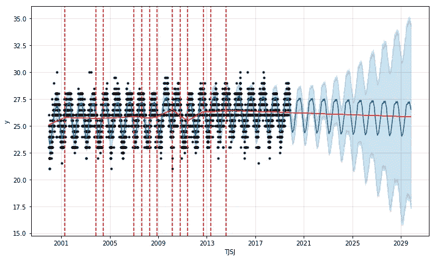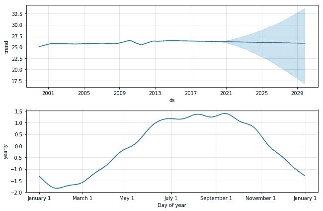

我们可以将全球定义为在十个选定机场获得的日平均温度。图形结果如下:

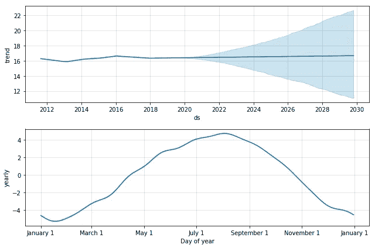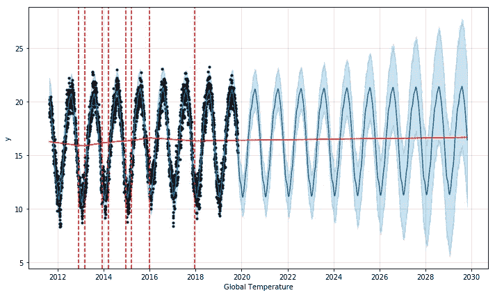

图中没有显示出实质性的趋势。结论:脸书的 prophet 算法不能给出清晰的全球气温趋势。可以按照笔记本上的代码:我在 Kaggle 贴的机场温度。

感谢您的关注。