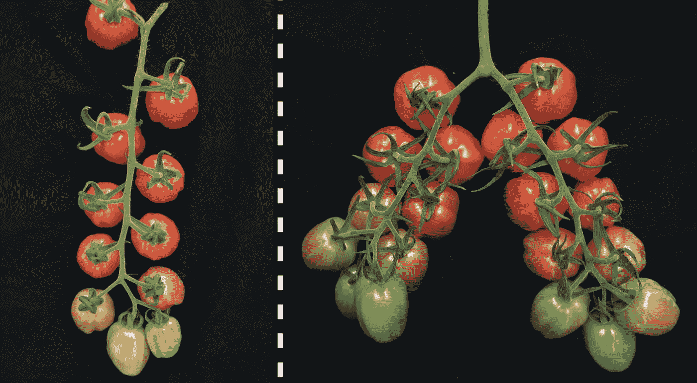
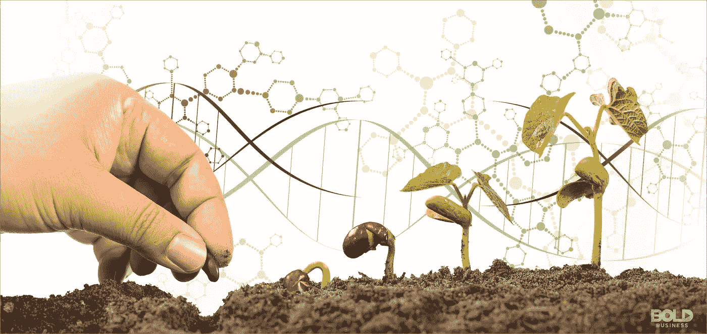

# 未来几年你吃的食物会是假的吗？

> 原文：<https://medium.com/analytics-vidhya/could-the-food-you-eat-in-the-next-couple-of-years-be-fake-70f136d51dce?source=collection_archive---------22----------------------->

如果你能拥有味道更好、更健康的食物，并有可能解决世界上没有足够食物的问题，会怎么样？

听起来很棒，对吧？那么，执行这些好处要付出什么代价呢？

基因编辑是发展最快的新兴技术之一，在过去的五年里，我们已经取得了很大的进步。研究人员现在可以切除 DNA 的某些区域来控制特征。当 DNA 被提取时，细胞的遗传结构将在没有或有新 DNA 的情况下再生。举个例子，如果研究人员真的想的话，他们可以让西红柿有两倍多的分枝，或者让香蕉没有种子也能生长。两倍的分枝意味着我们从一株植物中收获两倍的番茄。

原始(左)…编辑(右)

基因编辑正被用于许多其他形式，其中最受欢迎的是在医学中。基因编辑人类也越来越受欢迎，但是，它的工作方式与在西红柿中的工作方式略有不同，但概念是相同的。一个人可以通过基因编辑来继承被选择的基因，而不是那些可能对人类有害的基因。

## 好处:

回到西红柿，当改变 DNA 时，你可以实现很多事情，其中一些包括，更有营养的西红柿，更能适应气候模式。当西红柿不受恶劣条件的影响时，作物产量会更高，而且产量会翻倍，对健康也有好处...基因编辑我们吃的食物有很多好处，发现新的好处是研究人员一直在努力的。

## CRISPR:

研究主要集中在一种非常可靠和简单的基因编辑方法 CRISPR 上，CRISPR 代表**簇状规则间隔的短回文重复序列。**简单来说，CRISPR 是转基因工程的替代方案，是一种应用于选择性育种的基因编辑技术。科学家“编辑”植物的基因组以获得想要的特征。

## 风险:

因为这些食品受到监管，它们被贴上了转基因生物的标签。不能保证使用 CRISPR/任何类型的基因编辑突变的特定食物会发生什么。由于这种部分保证，我们不知道食物会发生什么，也许是一种新的病毒，甚至是一种通过基因编辑过程意外产生的新的有害细菌。

转基因食品在短期内可能是有益的，但长期问题可能是停止生产假冒食品的原因。

“假”食品这一术语与转基因生物直接相关，有趣的是，转基因生物可能非常健康，并且在商业应用中日益增多。现在地球上有如此多的人没有东西吃，随着像基因编辑这样的事情导致寿命的延长，需要更多的食物来养活地球上数十亿人。转基因生物有许多健康的替代品，但未来似乎将主要集中在确保每个人都有饭吃。

## 解决方案:

研究基因编辑是为了找到更有效的方法来提高作物产量，并不断得到该领域人士的支持。很长一段时间，商业番茄育种者更喜欢较少而不是过多的分枝，因为植物会被果实的重量压垮，或者无法将多余的花转化为果实，从而导致产量低于预期，使用基因编辑我们可以找到两种情况都满足的点。

通过基因编辑进行多次测试将是确保我们正在做的事情足以养活所有人，以及所有人都可以安全食用的最快和最好的方法。任何生物都可能发生突变，但谁能说这不会因为基因编辑而发生。多次测试将减少意外事件发生的几率，因为我们可以开始记录当时发生的事情。

## 农业/基因编辑:

与植物有关的遗传学家现在希望将基因编辑带给那些试图以低成本和低技术努力获得最大产量的农民。塞缪尔·阿切姆庞目前正在利用 Crispr 技术开发一种更大的红薯。他解释了他如何绘制他正在使用的美国培育的甘薯品种的基因组，以便确定一组名为 CWII 的基因的位置，这些基因调节叶片光合作用产生的糖向根和块茎的流动。

“维生素 A 缺乏是加纳的一个问题。所以你要通过提高β-胡萝卜素来帮助解决这个问题，”阿切姆庞说。“我们可以在两三年内做到这一点。无论我在这里学到什么，我都要带回加纳。”

基因编辑是否会成为下一件大事还有很多争论(在我看来，这将是件大事！-特别是在医学方面)因为在这个领域的进展不太稳定。有巨大的突破，也有稳定的增长。

缓慢但肯定的是，公司正在允许 Crispr 基因编辑的商业作物成为玉米、小麦、亚麻和油菜的原料。

很快我们就能吃到更甜、更有效、更实用的食物了。

**社交媒体:👤**

如果你喜欢这篇文章或有任何问题或顾虑，请联系我在 dexteralxbarahona@gmail.com

在 Linkedin 上联系我，地址是[https://www.linkedin.com/in/dexter-barahona-723314194](https://www.linkedin.com/in/dexter-barahona-723314194)

Instagram: DexterBarahona

# 资源:🙌🏼

 [## CRISPR 的新应用打破了作物中长期的产量壁垒

### CSHL 的李普曼实验室已经利用基因组编辑的未开发的力量来改善农业！用番茄作为…

www.google.com](https://www.google.com/url?sa=t&rct=j&q=&esrc=s&source=web&cd=3&cad=rja&uact=8&ved=2ahUKEwiHl7jw2oznAhVSx1kKHasID5MQtwIwAnoECAcQAQ&url=https%3A%2F%2Fwww.youtube.com%2Fwatch%3Fv%3Ds3Sya8MATeo&usg=AOvVaw1lL2RkTe4J9AmKHZzquujt)  [## 什么是基因编辑？

### 普渡大学农学院在农业、食品、生命和农业的科学和商业领域全球领先

www.google.com](https://www.google.com/url?sa=t&rct=j&q=&esrc=s&source=web&cd=2&cad=rja&uact=8&ved=2ahUKEwiE25PB3IznAhUrVt8KHdnYAi0QFjABegQIBBAB&url=https%3A%2F%2Fag.purdue.edu%2FGMOs%2FPages%2FGeneEditing.aspx&usg=AOvVaw373eLIN-ORoHRCN-T4uXSG)