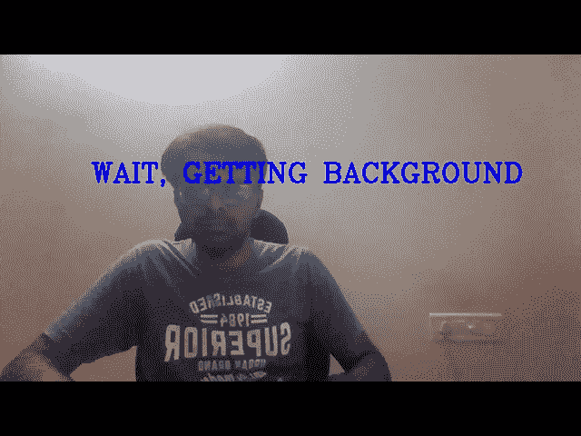
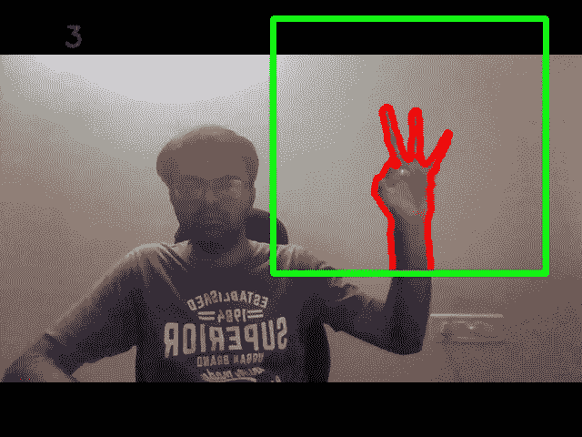

# 使用 OpenCV 计数手指

> 原文：<https://medium.com/analytics-vidhya/count-finger-using-opencv-c45e7339f167?source=collection_archive---------20----------------------->

在学习激励自己方面取得一些进步总是好的。我希望在我的系列文章中，我们能够读到一些非常基本的图像处理技术，如 Canny 边缘检测、形态学操作、分割、轮廓检测等。现在，它的时间向前移动一点，并尝试检测你的手指，数出你将要显示的数字。让我们试着动手做这件事。


这里我们有三个主要部分，首先尝试找到你的背景并积累背景值。第二步，我们必须使用轮廓检测来分割我们的手，最后找到手指的位置，并尝试分割图像中显示的手指数量。

# **背景检测**

在第一步中，我们将找到背景图像，并计算图像和目的地的加权和。因此目的地将是连续的帧序列。

```
def cal_accum_avg(frame,accumulated_weight):

 global background

 if background is None:
 background = frame.copy().astype(‘float’)
 return None

 cv2.accumulateWeighted(frame,background,accumulated_weight)
```

# **分割 ROI(手)**

第二步，从当前图像中减去背景图像。因此，将使用黑白图像中的轮廓来检测感兴趣的区域。

```
def segment(frame,threshold = 25):

 diff = cv2.absdiff(background.astype(‘uint8’),frame)

 ret,thresholded_img = cv2.threshold(diff,threshold,255,
 cv2.THRESH_BINARY)

 contours,hierarchy = cv2.findContours(thresholded_img.copy(),
 cv2.RETR_EXTERNAL,
 cv2.CHAIN_APPROX_SIMPLE)

 if len(contours) == 0:
  return None

 else:
  #Assuming the largest external contour in roi is the hand

  hand_segment = max(contours,key = cv2.contourArea)

  return (thresholded_img,hand_segment)
```

# **数手指**

主要棘手的部分是我们的最后阶段，现在你的手被检测到了，但基于你的手指来计数，我们仍然错过了分割单独的手指。只有当一个手指合拢时，我们才能跟踪并计算它。为此，我们将使用凸包函数。使用凸包，我们将能够找到你的检测手的极端点，然后根据轮廓和极端位置，我们的工作将变得更容易计数。

#使用凸包计数手指的函数

```
def count_fingers(thresholded_img,hand_segment):

 conv_hull = cv2.convexHull(hand_segment)

 #most extreme top,bottom,left and right points
 top = tuple(conv_hull[conv_hull[:, :, 1].argmin()][0])
 bottom = tuple(conv_hull[conv_hull[:, :, 1].argmax()][0])
 left = tuple(conv_hull[conv_hull[:, :, 0].argmin()][0])
 right = tuple(conv_hull[conv_hull[:, :, 0].argmax()][0])

 #finding center point
 cx = (left[0] + right[0]) // 2
 cy = (top[1] + bottom[1]) // 2

 #calculate distance from center to all extreme points
 distance = pairwise.euclidean_distances([(cx,cy)],
 Y=[left,right,top,bottom])[0]

 #calculate one of the max distance
 max_distance = distance.max()

 #create circle 
 radius = int(0.8 * max_distance)
 circumference = (2 * np.pi * radius)

 circular_roi = np.zeros(thresholded_img.shape[:2],dtype=’uint8')

 cv2.circle(circular_roi,(cx,cy),radius,255,10)

 circular_roi = cv2.bitwise_and(thresholded_img,thresholded_img,
 mask = circular_roi)

 contours,hierarchy= cv2.findContours(circular_roi.copy(),
 cv2.RETR_EXTERNAL,
 cv2.CHAIN_APPROX_NONE)

 count = 0

 for cnt in contours:
 (x,y,w,h) = cv2.boundingRect(cnt)

 out_of_wrist = ((cy + (cy * 0.25)) > (y + h))

 limit_points = ((circumference * 0.25) > cnt.shape[0])

 if out_of_wrist and limit_points:
 count += 1

 return count
```

我们有所有必要的模块来开始计数我们的手指，现在将开始捕捉我们自己的视频并开始计数。



```
cam = cv2.VideoCapture(0)num_frames = 0while True:

 ret,frame = cam.read()

 frame = cv2.flip(frame, 1)
 frame_copy = frame.copy()

 roi = frame[roi_top:roi_bottom,roi_right:roi_left]

 gray = cv2.cvtColor(roi,cv2.COLOR_BGR2GRAY)

 gray_blur = cv2.GaussianBlur(gray,(7,7),0)

 if num_frames < 60:
 cal_accum_avg(gray_blur,accumulated_weight)

 if num_frames <= 59:
 cv2.putText(frame_copy,’WAIT, GETTING BACKGROUND’,(200,300),
 cv2.FONT_HERSHEY_COMPLEX,1,(255,0,0),2)
 cv2.imshow(‘finger count’,frame_copy)

 else:
 hand = segment(gray_blur)

 if hand is not None:

 thresholded, hand_segment = hand

 #draw contours around real hand in live stream
 cv2.drawContours(frame_copy,
 [hand_segment+[roi_right,roi_top]],
 -1,
 (0,0,255),
 5)
 fingers = count_fingers(thresholded,hand_segment)cv2.putText(frame_copy,
 str(fingers),
 (70,50),
 cv2.FONT_HERSHEY_SIMPLEX,
 1,
 (255,0,0),
 2)

 cv2.imshow(‘thresholded’,thresholded)

 cv2.rectangle(frame_copy,
 (roi_left,roi_top),
 (roi_right,roi_bottom),
 (0,255,0),
 5)

 num_frames += 1

 cv2.imshow(‘finger count’, frame_copy)

 k = cv2.waitKey(1) & 0xFF

 if k == 27:
 break

cv2.destroyAllWindows()
cam.release()
```

快乐阅读！！！如果你喜欢这篇文章，请鼓掌！！

**Github:**

[https://github . com/RamjiB/Python-for-Computer-Vision-with-OpenCV-and-Deep-Learning/tree/master/8 _ Capston % 20 project](https://github.com/RamjiB/Python-for-Computer-Vision-with-OpenCV-and-Deep-Learning/tree/master/8_Capston%20Project)