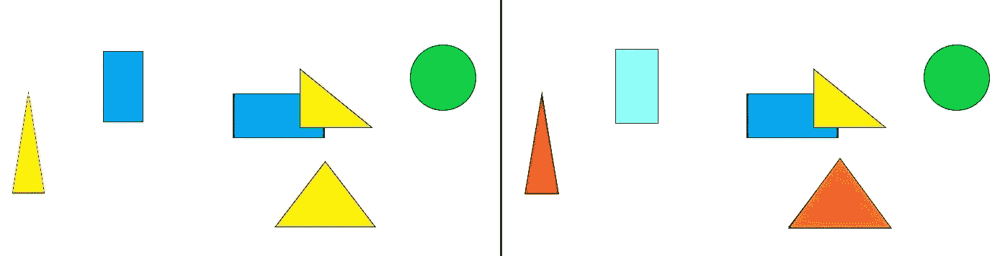
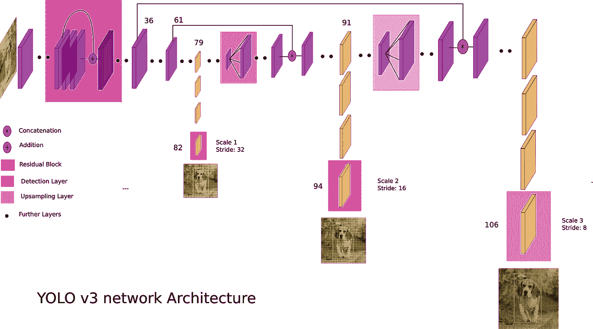
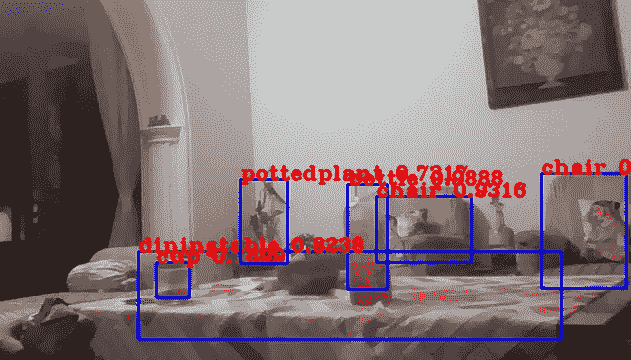

# 使用预先训练的 YOLOv3 计算网络摄像头中的人数

> 原文：<https://medium.com/analytics-vidhya/count-people-in-webcam-using-yolov3-tensorflow-f407679967d5?source=collection_archive---------1----------------------->

## 了解如何使用实例分段(YOLOv3)通过 python 中的 TensorFlow 和 OpenCV 使用其预训练的权重来统计人数。


丁满·斯图德勒在 [Unsplash](https://unsplash.com?utm_source=medium&utm_medium=referral) 上的照片

# 目录

*   **要求**
*   **简介**

1.  *实例切分 vs 语义切分*
2.  *YOLOv3 vs 更快的 RCNN vs SSD*
3.  *约洛夫 3*
4.  *锚箱*
5.  *非最大抑制*

*   **代码**

# 要求

对于这个项目，我们需要 Tensorflow、OpenCV 和 wget-python(来下载 YOLOv3 权重。您也可以手动下载它们。)

使用画中画:

```
pip install tensorflow-gpu # this is the gpu version
pip install tensorflow # if you don't have gpu like me 😥
pip install opencv-python
pip install wget
```

如果您使用 anaconda，那么使用 conda:

```
conda install -c anaconda tensorflow-gpu # this is the gpu version
conda install -c conda-forge tensorflow # if you don't have gpu version
conda install -c conda-forge opencv
conda install -c conda-forge python-wget
```

# 介绍

在这里，我将简要讨论与 YOLOv3 和实例分割相关的基本术语，并提供额外的阅读资源。如果您了解它们，并想跳过它们，请随意进入下一部分。

## 实例分割与语义分割

在语义分割中，基于各种标签(如人、狗、猫等)对图像进行分割，但是没有办法区分两个人物。这个缺点在实例分割中得到解决，其中除了区分不同的标签之外，我们还能够区分该标签的多个对象。



语义分段(左)与实例分段(右)如果按边数分段。

## YOLOv3 与更快的 RCNN 和 SSD

选择哪一个，为什么？

想要最好的精确度？更快的 RCNN

想要最快的速度？YOLOv3

想要在两者之间进行权衡吗？（同 solid-statedisk）固态（磁）盘

我试图通过 CPU (LOL)上的网络摄像头进行实时实现，所以我选择了 YOLOv3。我也尝试过微小的 YOLO，但它的预测不准确，所以我放弃了它。你可以选择最适合你的。

*深入了解这些模型的补充阅读*

fast RCNN—[https://towardsdatascience . com/fast-r-CNN-for-object-detection-a-technical-summary-474 C5 b 857 b 46](https://towardsdatascience.com/faster-r-cnn-for-object-detection-a-technical-summary-474c5b857b46)

SSD—[https://towards data science . com/understanding-SSD-multi box-real-time-object-detection-in-deep-learning-495 ef 744 fab](https://towardsdatascience.com/understanding-ssd-multibox-real-time-object-detection-in-deep-learning-495ef744fab)

他们之间的比较—[https://medium . com/@ Jonathan _ hui/object-detection-speed-and-accuracy-comparison-fast-r-CNN-r-fcn-SSD-and-yolo-5425656 AE 359](/@jonathan_hui/object-detection-speed-and-accuracy-comparison-faster-r-cnn-r-fcn-ssd-and-yolo-5425656ae359)

## YOLOv3



图片取自[这里](https://towardsdatascience.com/yolo-v3-object-detection-53fb7d3bfe6b)。

YOLOv3 预训练模型可用于分类 80 个对象，速度超快，几乎与 SSD 一样准确。它有 53 个卷积层，每个卷积层后面都有一个批量归一化层和一个泄漏 RELU 激活。为了下采样，他们在卷积层中使用了步长 2，而不是使用池。它的输入格式是图像应该是 RGB 格式(所以如果使用 OpenCV 记得转换)，输入类型是 float32，尺寸可以是 320x320 或 416x416 或 608x608。

补充阅读:[https://towards data science . com/yolo-v3-object-detection-53 FB 7d 3 bfe 6 b](https://towardsdatascience.com/yolo-v3-object-detection-53fb7d3bfe6b)

## 锚箱

锚盒有助于模型更好地专门化。举一个站着的人和汽车的例子。人需要一个高箱子，而汽车需要一个胖箱子。我们的模型如何知道这些？这是通过不同尺寸的锚箱实现的。这意味着所有对象都有不止一个边界框。为了决定保留哪个边界框，使用了非最大抑制。当不同对象的中心在同一位置时，锚定框也有助于预测这两个对象。

补充阅读:[https://medium . com/@ anderssac/anchor-boxes-the-key-to-quality-object-detection-ddf9d 612 D4 f 9](/@andersasac/anchor-boxes-the-key-to-quality-object-detection-ddf9d612d4f9)

## 非最大抑制

非最大抑制或 NMS 使用 IOU 工作。交集超过并集(IOU)顾名思义就是两个盒子的交集和并集之比。选择具有最高检测概率的盒子。然后，与该框具有高 IOU 的所有框被移除。

补充阅读:[https://medium . com/@ sarangzambare/object-detection-using-non-max-suppression-over-yolov 2-382 a 90212 b 51](/@sarangzambare/object-detection-using-non-max-supression-over-yolov2-382a90212b51)

# 密码

第一个任务是下载预训练的权重，这可以通过使用 wget 来完成。

```
import wgeturl = '[https://pjreddie.com/media/files/yolov3.weights'](https://pjreddie.com/media/files/yolov3.weights')
yolov3 = wget.download(url, out='yolov3.weights')
```

在您的工作目录中运行这段代码将会在那里保存权重。

现在，在展示和解释代码之前，我要感谢 Tensorflow 2 中 YOLO 实现的这个 [Github](https://github.com/zzh8829/yolov3-tf2/) 库，因为我大部分都是从这里复制的。

进行必要的进口

```
import tensorflow as tf
import numpy as np
import cv2
from tensorflow.keras import Model
from tensorflow.keras.layers import (
    Add,
    Concatenate,
    Conv2D,
    Input,
    Lambda,
    LeakyReLU,
    UpSampling2D,
    ZeroPadding2D,
    BatchNormalization
)
from tensorflow.keras.regularizers import l2
```

加载暗网权重，并将这些权重分配给模型的层。创建一个函数来定义卷积层以及是否对其应用批量归一化。

```
def load_darknet_weights(model, weights_file):
    '''
    Helper function used to load darknet weights.

    :param model: Object of the Yolo v3 model
    :param weights_file: Path to the file with Yolo V3 weights
    '''

    #Open the weights file
    wf = open(weights_file, 'rb')
    major, minor, revision, seen, _ = np.fromfile(wf, dtype=np.int32, count=5)#Define names of the Yolo layers (just for a reference)    
    layers = ['yolo_darknet',
            'yolo_conv_0',
            'yolo_output_0',
            'yolo_conv_1',
            'yolo_output_1',
            'yolo_conv_2',
            'yolo_output_2']for layer_name in layers:
        sub_model = model.get_layer(layer_name)
        for i, layer in enumerate(sub_model.layers):

            if not layer.name.startswith('conv2d'):
                continue

            #Handles the special, custom Batch normalization layer
            batch_norm = None
            if i + 1 < len(sub_model.layers) and \
                    sub_model.layers[i + 1].name.startswith('batch_norm'):
                batch_norm = sub_model.layers[i + 1]filters = layer.filters
            size = layer.kernel_size[0]
            in_dim = layer.input_shape[-1]if batch_norm is None:
                conv_bias = np.fromfile(wf, dtype=np.float32, count=filters)
            else:
                # darknet [beta, gamma, mean, variance]
                bn_weights = np.fromfile(
                    wf, dtype=np.float32, count=4 * filters)
                # tf [gamma, beta, mean, variance]
                bn_weights = bn_weights.reshape((4, filters))[[1, 0, 2, 3]]# darknet shape (out_dim, in_dim, height, width)
            conv_shape = (filters, in_dim, size, size)
            conv_weights = np.fromfile(
                wf, dtype=np.float32, count=np.product(conv_shape))
            # tf shape (height, width, in_dim, out_dim)
            conv_weights = conv_weights.reshape(
                conv_shape).transpose([2, 3, 1, 0])if batch_norm is None:
                layer.set_weights([conv_weights, conv_bias])
            else:
                layer.set_weights([conv_weights])
                batch_norm.set_weights(bn_weights)assert len(wf.read()) == 0, 'failed to read all data'
    wf.close()def DarknetConv(x, filters, kernel_size, strides=1, batch_norm=True):
    '''
    Call this function to define a single Darknet convolutional layer

    :param x: inputs
    :param filters: number of filters in the convolutional layer
    :param kernel_size: Size of kernel in the Conv layer
    :param strides: Conv layer strides
    :param batch_norm: Whether or not to use the custom batch norm layer.
    '''
    #Image padding
    if strides == 1:
        padding = 'same'
    else:
        x = ZeroPadding2D(((1, 0), (1, 0)))(x)  # top left half-padding
        padding = 'valid'

    #Defining the Conv layer
    x = Conv2D(filters=filters, kernel_size=kernel_size,
               strides=strides, padding=padding,
               use_bias=not batch_norm, kernel_regularizer=l2(0.0005))(x)

    if batch_norm:
        x = BatchNormalization()(x)
        x = LeakyReLU(alpha=0.1)(x)
    return x
```

创建函数来定义暗网残差层和暗网块，它们将你上面创建的卷积层，然后是一个函数来使用它们并创建整个暗网模型。

```
def DarknetResidual(x, filters):
    '''
    Call this function to define a single DarkNet Residual layer

    :param x: inputs
    :param filters: number of filters in each Conv layer.
    '''
    prev = x
    x = DarknetConv(x, filters // 2, 1)
    x = DarknetConv(x, filters, 3)
    x = Add()([prev, x])
    return x

def DarknetBlock(x, filters, blocks):
    '''
    Call this function to define a single DarkNet Block (made of multiple Residual layers)

    :param x: inputs
    :param filters: number of filters in each Residual layer
    :param blocks: number of Residual layers in the block
    '''
    x = DarknetConv(x, filters, 3, strides=2)
    for _ in range(blocks):
        x = DarknetResidual(x, filters)
    return xdef Darknet(name=None):
    '''
    The main function that creates the whole DarkNet.
    '''
    x = inputs = Input([None, None, 3])
    x = DarknetConv(x, 32, 3)
    x = DarknetBlock(x, 64, 1)
    x = DarknetBlock(x, 128, 2)  # skip connection
    x = x_36 = DarknetBlock(x, 256, 8)  # skip connection
    x = x_61 = DarknetBlock(x, 512, 8)
    x = DarknetBlock(x, 1024, 4)
    return tf.keras.Model(inputs, (x_36, x_61, x), name=name)
```

现在，我们需要为 YOLOv3 模型创建辅助函数，以定义 YOLOv3 卷积层、YOLO 模型的输出、绘制输出、根据预测创建边界框以及非最大抑制函数。我们还需要定义我们的锚盒，并最终创建一个函数来组合所有的锚盒，以生成我们的模型。

```
def draw_outputs(img, outputs, class_names):
    '''
    Helper, util, function that draws predictons on the image.

    :param img: Loaded image
    :param outputs: YoloV3 predictions
    :param class_names: list of all class names found in the dataset
    '''
    boxes, objectness, classes, nums = outputs
    boxes, objectness, classes, nums = boxes[0], objectness[0], classes[0], nums[0]
    wh = np.flip(img.shape[0:2])
    for i in range(nums):
        x1y1 = tuple((np.array(boxes[i][0:2]) * wh).astype(np.int32))
        x2y2 = tuple((np.array(boxes[i][2:4]) * wh).astype(np.int32))
        img = cv2.rectangle(img, x1y1, x2y2, (255, 0, 0), 2)
        img = cv2.putText(img, '{} {:.4f}'.format(
            class_names[int(classes[i])], objectness[i]),
            x1y1, cv2.FONT_HERSHEY_COMPLEX_SMALL, 1, (0, 0, 255), 2)
    return imgyolo_anchors = np.array([(10, 13), (16, 30), (33, 23), (30, 61), (62, 45),
                         (59, 119), (116, 90), (156, 198), (373, 326)],
                        np.float32) / 416yolo_anchor_masks = np.array([[6, 7, 8], [3, 4, 5], [0, 1, 2]])
def YoloConv(filters, name=None):
    '''
    Call this function to define the Yolo Conv layer.

    :param flters: number of filters for the conv layer
    :param name: name of the layer
    '''
    def yolo_conv(x_in):
        if isinstance(x_in, tuple):
            inputs = Input(x_in[0].shape[1:]), Input(x_in[1].shape[1:])
            x, x_skip = inputs# concat with skip connection
            x = DarknetConv(x, filters, 1)
            x = UpSampling2D(2)(x)
            x = Concatenate()([x, x_skip])
        else:
            x = inputs = Input(x_in.shape[1:])x = DarknetConv(x, filters, 1)
        x = DarknetConv(x, filters * 2, 3)
        x = DarknetConv(x, filters, 1)
        x = DarknetConv(x, filters * 2, 3)
        x = DarknetConv(x, filters, 1)
        return Model(inputs, x, name=name)(x_in)
    return yolo_convdef YoloOutput(filters, anchors, classes, name=None):
    '''
    This function defines outputs for the Yolo V3\. (Creates output projections)

    :param filters: number of filters for the conv layer
    :param anchors: anchors
    :param classes: list of classes in a dataset
    :param name: name of the layer
    '''
    def yolo_output(x_in):
        x = inputs = Input(x_in.shape[1:])
        x = DarknetConv(x, filters * 2, 3)
        x = DarknetConv(x, anchors * (classes + 5), 1, batch_norm=False)
        x = Lambda(lambda x: tf.reshape(x, (-1, tf.shape(x)[1], tf.shape(x)[2],
                                            anchors, classes + 5)))(x)
        return tf.keras.Model(inputs, x, name=name)(x_in)
    return yolo_outputdef yolo_boxes(pred, anchors, classes):
    '''
    Call this function to get bounding boxes from network predictions

    :param pred: Yolo predictions
    :param anchors: anchors
    :param classes: List of classes from the dataset
    '''

    # pred: (batch_size, grid, grid, anchors, (x, y, w, h, obj, ...classes))
    grid_size = tf.shape(pred)[1]
    #Extract box coortinates from prediction vectors
    box_xy, box_wh, objectness, class_probs = tf.split(
        pred, (2, 2, 1, classes), axis=-1)#Normalize coortinates
    box_xy = tf.sigmoid(box_xy)
    objectness = tf.sigmoid(objectness)
    class_probs = tf.sigmoid(class_probs)
    pred_box = tf.concat((box_xy, box_wh), axis=-1)  # original xywh for loss# !!! grid[x][y] == (y, x)
    grid = tf.meshgrid(tf.range(grid_size), tf.range(grid_size))
    grid = tf.expand_dims(tf.stack(grid, axis=-1), axis=2)  # [gx, gy, 1, 2]box_xy = (box_xy + tf.cast(grid, tf.float32)) / \
        tf.cast(grid_size, tf.float32)
    box_wh = tf.exp(box_wh) * anchorsbox_x1y1 = box_xy - box_wh / 2
    box_x2y2 = box_xy + box_wh / 2
    bbox = tf.concat([box_x1y1, box_x2y2], axis=-1)return bbox, objectness, class_probs, pred_boxdef yolo_nms(outputs, anchors, masks, classes):
    # boxes, conf, type
    b, c, t = [], [], []for o in outputs:
        b.append(tf.reshape(o[0], (tf.shape(o[0])[0], -1, tf.shape(o[0])[-1])))
        c.append(tf.reshape(o[1], (tf.shape(o[1])[0], -1, tf.shape(o[1])[-1])))
        t.append(tf.reshape(o[2], (tf.shape(o[2])[0], -1, tf.shape(o[2])[-1])))bbox = tf.concat(b, axis=1)
    confidence = tf.concat(c, axis=1)
    class_probs = tf.concat(t, axis=1)scores = confidence * class_probs
    boxes, scores, classes, valid_detections = tf.image.combined_non_max_suppression(
        boxes=tf.reshape(bbox, (tf.shape(bbox)[0], -1, 1, 4)),
        scores=tf.reshape(
        scores, (tf.shape(scores)[0], -1, tf.shape(scores)[-1])),
        max_output_size_per_class=100,
        max_total_size=100,
        iou_threshold=0.5,
        score_threshold=0.6
    )return boxes, scores, classes, valid_detectionsdef YoloV3(size=None, channels=3, anchors=yolo_anchors,
           masks=yolo_anchor_masks, classes=80):

    x = inputs = Input([size, size, channels], name='input')x_36, x_61, x = Darknet(name='yolo_darknet')(x)x = YoloConv(512, name='yolo_conv_0')(x)
    output_0 = YoloOutput(512, len(masks[0]), classes, name='yolo_output_0')(x)x = YoloConv(256, name='yolo_conv_1')((x, x_61))
    output_1 = YoloOutput(256, len(masks[1]), classes, name='yolo_output_1')(x)x = YoloConv(128, name='yolo_conv_2')((x, x_36))
    output_2 = YoloOutput(128, len(masks[2]), classes, name='yolo_output_2')(x)boxes_0 = Lambda(lambda x: yolo_boxes(x, anchors[masks[0]], classes),
                     name='yolo_boxes_0')(output_0)
    boxes_1 = Lambda(lambda x: yolo_boxes(x, anchors[masks[1]], classes),
                     name='yolo_boxes_1')(output_1)
    boxes_2 = Lambda(lambda x: yolo_boxes(x, anchors[masks[2]], classes),
                     name='yolo_boxes_2')(output_2)outputs = Lambda(lambda x: yolo_nms(x, anchors, masks, classes),
                     name='yolo_nms')((boxes_0[:3], boxes_1[:3], boxes_2[:3]))return Model(inputs, outputs, name='yolov3')
```

现在所有的函数都定义好了，是时候创建一个 YOLOv3 模型了，可以使用:

```
yolo = YoloV3()
load_darknet_weights(yolo, 'yolov3.weights')
```

启动网络摄像头，让每一帧都为预测做好准备。当我们使用 OpenCV 时，我们需要将我们的图像转换为 RGB，将它们的大小调整为 320x320 或 416x416 或 608x608，将它们的数据类型转换为 float32，将它们扩展为四维并除以 255。

```
cap = cv2.VideoCapture(0)
while(True):
    ret, image = cap.read()
    if ret==True:
        img = cv2.cvtColor(image, cv2.COLOR_BGR2RGB)
        img = cv2.resize(img, (320, 320))
        img = img.astype(np.float32)
        img = np.expand_dims(img, 0)
        img = img / 255
```

使用 yolo 获得图像上的预测。加载类名文件，其中包含为其训练模型的所有对象名。这里可以找到[。您可以绘制输出来检查模型是否工作。](https://github.com/vardanagarwal/Proctoring-AI/blob/master/models/classes.TXT)

```
boxes, scores, classes, nums = yolo(img)
class_names = [c.strip() for c in open("classes.txt").readlines()]
image = draw_outputs(image, (boxes, scores, classes, nums), class_names)
cv2.imshow('Prediction', image)
if cv2.waitKey(1) & 0xFF == ord('q'):
    break
```



使用 YOLOv3 进行预测

现在，为了统计 classes.txt 中的人员或任何内容，我们需要知道它在其中的索引。person 的索引是 0，所以我们需要检查预测的类是否是 0，然后我们增加一个计数器。

```
count=0
for i in range(nums[0]):
    if int(classes[0][i] == 0):
        count +=1print('Number of people:', count)
```

你可以在我的 [Github repo](https://github.com/vardanagarwal/Proctoring-AI) 上找到完整的代码。