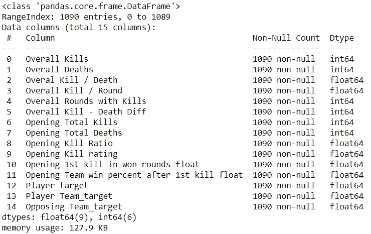
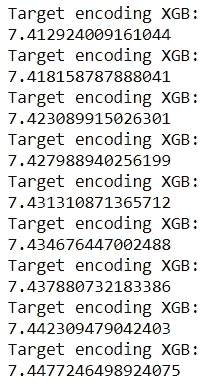

# 反恐精英比赛结果预测

> 原文：<https://medium.com/analytics-vidhya/counter-strike-matches-result-prediction-28a8ca076971?source=collection_archive---------12----------------------->

第 2 部分:机器学习模型

这是关于开发一个机器学习模型来预测在线反恐精英比赛结果的 3 篇系列文章中的第二篇。第一篇文章描述了我们如何从 hltv.org 的比赛和球员表现中收集历史数据。我们也描述了反恐精英的工作原理。你可以在这里阅读这个故事的开头[。](/@jefersonmsantos/counter-strike-matches-result-prediction-537f8648ee7f)

在第二篇文章中，我们将建立一个机器学习模型，根据我们在前一篇文章中收集的数据来预测反恐精英比赛的结果。

到上一篇文章结束时，已经生成了两个包含历史数据的数据库，一个是关于比赛的，另一个是关于每支球队的每个球员在这些比赛中的表现的。这是它们的结构。

匹配数据库

玩家数据库

我们的目标是从一场比赛中预测哪支队伍获胜。通过查看数据库，我们可以看到比赛数据库没有太多的信息，除了来自参赛队和最终结果。由于最终结果是我们打算预测的，我们将需要对球员的表现数据库进行工作，该数据库有比赛前的信息。如果你不想读完这篇文章，你可以在我的 github 上查看这个项目的全部 jupyter 笔记本，[这里](https://github.com/jefersonmsantos/counter_strike/tree/master/machine_learning_model)。

通过查看这个数据库，我们可以看到‘KD’(杀死/死亡)列和 ADR 列。KD 显示了每名玩家在那场比赛中的死亡人数，ADR 是两者之间的差异。理论上，杀死最多的队伍应该赢得这场比赛。因此，我们将交叉两个数据库，以合计每场比赛中每支球队球员的总杀伤差异，并检查它是否与每场比赛的获胜球队相关。

我们首先导入 pandas 库来处理数据帧和我们保存的文件。csv 并保存到名为' *matches_raw'* 和' *players_raw'* 的变量中。

有必要交叉两个数据库中的信息，以总结每队每个球员的杀伤差异(ADR)。我们将在每个数据库中创建一个新列，其中我们连接来自列“日期”、“团队 1”、“团队 2”、“最终结果 1”、“最终结果 2”和“锦标赛”的信息。因此，当我们需要从特定的比赛中查找球员时，我们可以在球员数据库中查找与比赛数据库中的这一列具有相同值的列。

现在我们有了一个跨越两个数据库的列，我们可以对每场比赛和比赛中每支球队的球员的杀伤差异进行求和。我们首先创建一个过滤器，在比赛数据库的“比赛列”中查找具有相同值的球员，并将其分配给第 6 行的“total1”。接下来，我们可以过滤“total1 ”,只对第 7 行第 1 队球员的 ADR 进行求和。我们可以将其附加到第 8 行的 total_adr_team1 列表中。然后，我们对第 10 到 12 行的团队 2 执行相同的步骤。最后，我们可以在 matches 数据库中创建每个队的总杀伤差异列。

此外，我们将添加一个名为“Team1 victory”的列，以方便地从数字上检查哪支球队赢得了比赛。我们将检查“matches_raw”上的所有行，并检查“最终结果 1”和“最终结果 2”，即比赛的最终得分。如果团队 1 的得分高于团队 2，我们会给它 1 的值。否则，将为 0。对于平局，我们也将给出值 2。

现在我们可以证明并证实我们最初的假设，即在一场比赛中总杀伤差异较大的队伍是赢家。正如我们在下面的分布图中看到的，大多数时候团队 1 是赢家团队，它有一个正的总杀伤差异，我们可以在团队 2 图上看到相同的效果，但在相反的一边。

为了实现我们预测反恐精英比赛结果的目标，我们将建立一个模型来预测比赛中每个玩家的杀伤差异(ADR)。有了这些数据，我们可以计算出每支队伍的所有杀伤差异，并预测出哪支队伍获胜。从现在开始，我们将主要致力于玩家数据库来构建我们的模型。

我们将 players_raw 数据库分配给 train_X，因为它将是用于训练模型的数据库。然后，我们创建一个对立球队列，因为我们只有球员数据库中的球员球队信息。一旦玩家在与特定球队的比赛中有更好或更差的表现，这些信息将对模型很重要。代码通过第 6 行的 while 循环遍历 train_X 上的所有行，并检查“玩家团队”上的值是否等于“团队 1”列上的值。如果是，对方队伍就是 1 队。否则就是 1 队。

使用 train_X.info()命令，我们可以看到数据库中所有列的详细信息。非空计数列显示我们没有丢失数据，因此我们可以避免数据清理的输入步骤。但是，我们有对模型没有用的数据。一旦我们在“球员队”和“对手队”栏中已经有了球队信息，日期对比赛结果以及第一队和第二队就不再重要了。最终结果是在比赛结束后才能得到的信息，所以我们不能用它来预测比赛结果。kill difference (ADR)是我们试图预测的，因此我们将它保留在模型之外，并将其赋给变量 train_y，因为它将是我们训练模型的结果数据集。KD、等级和地图也是指已经进行的比赛，不能用于预测。基本上，我们从历史表现、玩家本身、其团队和其对手团队中保留数据。

现在，我们只有想要保留在模型中的列，我们将关注数据类型为“object”的列，并尝试将其转换为 numeric，以便在模型中获得更好的性能。“第一次杀戮后开始团队获胜百分比”和“在获胜回合中开始第一次杀戮”只是对象，因为收集的数据在末尾保留了“%”字符。因此，我们将努力消除这个字符，并把这些列变成带有百分比的数字。

在第 3 行和第 4 行，我们创建了空列表，这些列表将存储数据库中每一行的新值。在第 6 行到第 13 行，我们遍历了 train 数据库的所有行，将列中的每个值都改为 float 类型，去掉了最后一个字符(%)。在第 15 到 20 行，我们将新的列添加到数据库中，并删除旧的列。现在我们可以看到这些列都是 float 格式的。

现在我们将处理剩余的对象数据，它们是“玩家”、“玩家团队”和“对手团队”，都是名称。为了处理它，我们可以使用编码器，它通常为每个不同的值分配一个数字代码，在这个例子中是 name，它在数据集上找到。

现在我们已经从数据库中获得了所有带有数值的列，我们可以从模型本身开始了。请记住，我们的目标是建立一个模型，根据我们刚刚清理和调整的数据预测杀伤差异。

为了评估模型，我们创建了一个函数，其中我们可以提供模型，它使用“cross_val_score”函数基于训练和验证数据集的不同模拟来计算平均绝对误差。在下面的单元格中，我们将评估两种算法的使用，随机森林回归器和 XGBoost 回归器。

我们还使用 for 循环来改变传递给 score 函数的模型的 n 估计量。正如您在结果中看到的，XGBoost 有一个好得多的平均误差结果，我们将继续使用它。下一步是找到 XGBoost 算法的最佳参数。为了做到这一点，我们遵循这个[帖子](https://www.analyticsvidhya.com/blog/2016/03/complete-guide-parameter-tuning-xgboost-with-codes-python/)上描述的过程。我不会介绍所有的步骤，但我们的最终模型将具有以下参数，它给出的平均误差为 7.37:

优化的最后一步是从我们的数据库中使用的所有列中选择最佳特征用于模型，以训练我们的模型。

在这种情况下，我们所有的列都被保留。最后，我们可以在最后一次运行我们的评分函数，以便找到具有这些特征和参数的模型的最佳 n 估计量。定义最佳的 n 估计量，我们可以存储我们的模型，进行最后的训练，并将其保存在 pickle 库中以备将来使用。

所以现在我们有了一个模型，可以预测反恐精英赛中每队每个球员的杀伤差异。如果我们对每场比赛中每支球队的所有球员的杀伤差异进行求和，我们可以检查哪支球队具有更高的杀伤差异预测，并且它是预测的获胜者。为了测试我们的模型，我使用我们第一篇文章中的 web 报废代码收集了一个新的匹配数据库，这篇文章没有涉及到。在数据库上做好所有准备后，我运行了模型，并将结果与比赛的真实结果进行了比较。

有了全新的数据库，绝大多数预测都是正确的。此外，当团队的总杀伤差异预测之间的差异高于 25 时，正确预测率会高得多。

这里我们实现了这个模型的目标，即根据 hltv.org 的历史数据预测反恐精英赛的结果。在下一篇帖子中，我将分享我们如何制作一个 web 报废算法来收集将要进行和预测的未来比赛的数据，以及我们如何调整这些文件，并在我们想要预测比赛的每一个时刻将它们部署到 jupyter 笔记本之外运行。