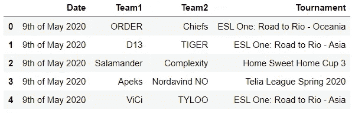
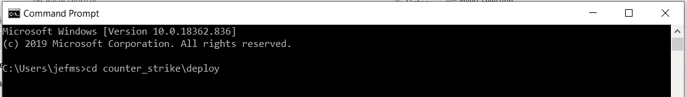
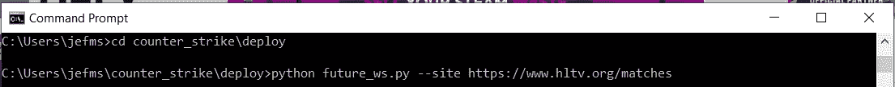
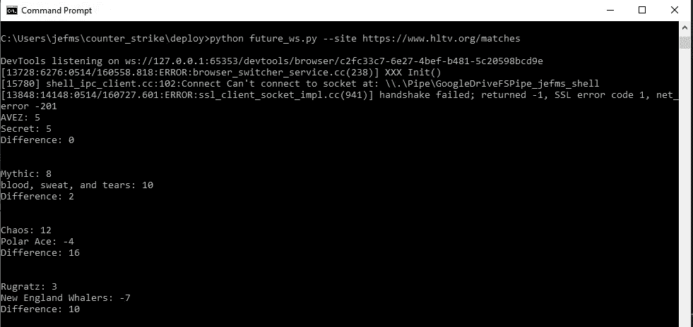
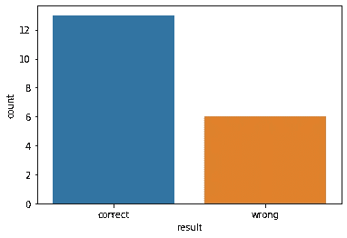

# 反恐精英比赛结果预测

> 原文：<https://medium.com/analytics-vidhya/counter-strike-matches-result-prediction-50636a8d0d96?source=collection_archive---------13----------------------->

第 3 部分:未来匹配数据和部署

这是关于开发一个机器学习模型来预测在线反恐精英比赛结果的 3 篇系列文章中的最后一篇。第一篇文章描述了我们如何从 hltv.org 的比赛和球员表现中收集历史数据。[第二篇文章](/@jefersonmsantos/counter-strike-matches-result-prediction-28a8ca076971)解释了如何使用机器学习建立和训练一个模型来预测比赛结果，也经历了数据清理的步骤。

在这最后一篇文章中，我们将看到如何从未来仍未进行的比赛中收集新数据来预测其结果，以及部署我们的项目并在不需要 jupyter notebook 的情况下运行它。

现在我们有了一个保存的模型，我们可以从未来的匹配中收集数据，将它们保存在一个. csv 文件中，准备数据并在我们的模型中运行以收集预测。首先，我们将创建两个新的 python 文件，分别命名为‘future _ ws . py’和‘adjust _ data . py’。我更喜欢使用 Visual Studio Code (VSC)来创建和编辑这些编码文件，但是您可以使用您习惯的代码编辑器。第一个代码将用于从未来的匹配中收集数据，从第一个文件中，我们将调用“adjust_data.py”中的一个函数来调整收集的数据，创建列并处理对象类型，就像我们在第二篇文章中所做的那样，然后我们可以运行我们的模型来进行预测。

你可以在 hltv.org/matches.找到关于未来几天比赛的信息，我们启动了“future_ws.py”文件，导入我们需要的所有库，我们已经在以前的帖子中解释过了。我们将导入“argparse ”,这样当我们从终端运行这个文件时，就可以通知参数。在第 11 行到第 14 行，我们创建了一个参数解析器，并解析代码将在 web 上废弃数据的网站的参数。在代码的后面，我们可以捕捉到这个网站将 args.site 赋值给一个变量。收集这些数据的想法是使用 web 报废技术，并为每场比赛和我们在第一篇文章中收集的球员收集相同的数据。你可以在我的 Github 上找到我完整的 jupyter 笔记本，上面有代码，可以从未来的比赛中收集数据[这里](https://github.com/jefersonmsantos/counter_strike/tree/master/future_matches)。我不会在这篇文章中重复所有这些步骤，因为它与我们在第一篇文章[中描述的非常相似。你也可以在我的 Github](/@jefersonmsantos/counter-strike-matches-result-prediction-537f8648ee7f) [这里](https://github.com/jefersonmsantos/counter_strike/tree/master/deploy)找到这个完整部署的最终文件。

在网上删除未来比赛的数据后，我们将有一个比赛信息数据库和一个球员信息数据库。它们与我们在第二篇文章中处理的数据库具有相同的结构，除了与比赛结果相关的数据，如球员的得分和杀球差异。

收集并保存这些数据库后，我们可以调用从“adjust_data.py”文件导入的 adjust_data 函数。该文件将对球员数据库执行的步骤是创建对手球队列，处理列上的“%”字符，将其转换为浮点类型，并对对象类型列进行编码。在模型开发期间，所有这些步骤在本系列的第二篇文章中都有很好的描述。

最后，“adjust_data”函数将在第 1 行和第 2 行导入模型。与我们在这里处理的两个文件保存在同一个文件夹中是很重要的。在第 4 行，训练好的模型进行预测，并将它们保存到变量‘final _ preds’。然后，我们可以返回球员数据库，并将列预测添加回我们的“future_ws.py”文件。

回到“future_ws.py”文件，代码将建立比赛和球员数据库的链接，因此我们可以对每支球队的每个球员的总杀伤差异预测进行求和。这个过程在第二篇文章中已经有了很好的解释。在那之后，我们将会有一个比赛的数据库，有每个队预测的总杀伤差异，以及他们之间的差异。我们可以将这个数据库保存到一个. csv 文件中，以便以后检查结果，并在我们的终端上打印每个队和比赛的预测结果，就像我们在第 6 到 10 行中所做的那样。

现在我们有了这些文件，我们可以打开您习惯使用的终端，并移动到保存您的文件和模型的目录。在我的情况下，它是'反恐精英\部署'文件夹。

接下来，我们将调用文件' future_ws.py '并通知网站' https://www.hltv.org/matches '作为参数。然后，代码将开始从这个页面上的未来匹配 web 废料数据，并将预测返回给我们。

然后，代码将在屏幕上输出每个团队的预测。它还会将文件保存在我们正在运行它的文件夹中。

我在 5 月 9 日至 10 日的周末对一些比赛运行了代码。正如你在下面看到的，这个模型保持了很高的正确预测水平，因为它非常简单。

在这 3 篇文章之后，你可以看到创建机器学习预测模型的完整项目，因为 web 废弃数据，清理和调整数据，并将其部署到日常使用中。我希望它是有用的，并给你新的思路来开发类似的项目。请随意评论，提问，批评，给话题带来新的想法。