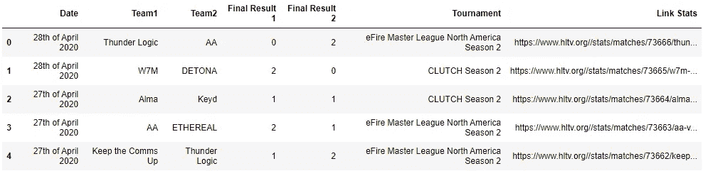
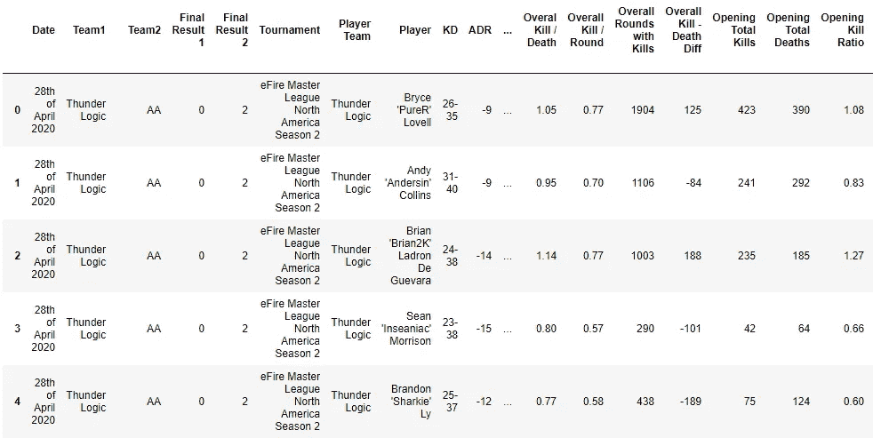

# 反恐精英比赛结果预测

> 原文：<https://medium.com/analytics-vidhya/counter-strike-matches-result-prediction-537f8648ee7f?source=collection_archive---------6----------------------->


第 1 部分:web 报废数据

我的一些朋友喜欢整晚在电脑上玩反恐精英。这个游戏也是由专业的电子玩家玩的，并且有非常有组织的比赛和比赛，这些数据可以在网上获得。一旦我开始研究数据科学，开发一个基于球员统计数据预测比赛结果的机器学习模型似乎是一个好主意。

根据它的维基百科页面 , *反恐精英*是一款基于目标的多人第一人称射击游戏。两个对立的团队——恐怖分子和反恐怖分子——在游戏模式中竞争以完成目标，例如确保放置或拆除炸弹的位置以及营救或保护人质。

HLTV.org 是一个收集所有结果，比赛，来自运动员和队的历史统计，未来比赛的时间表，以及比赛实况转播的网站。因此，这将是我们数据科学项目的来源。

这是关于收集数据、开发机器学习模型和部署它的 3 篇系列文章中的第一篇。在这篇文章中，我将描述我是如何使用 python 技术通过 hltv.org 网站从玩家和比赛中收集历史数据的。

在 hltv.org 的结果部分，我们可以找到 2012 年的比赛结果。当我们点击一个比赛链接时，我们看到的数据包括比赛日期、最终结果、队伍、时间、比赛地图，以及这场比赛中球员的个人统计数据。访问每个球员链接，我们可以看到球员比赛历史的统计数据。因此，这个 web 报废项目的想法是从结果页面访问每场比赛，从比赛中收集数据，然后访问参加比赛的每个球员的统计数据，并收集他们的历史统计数据，直到比赛日期的前一天。从机器学习模型的角度来看，比赛前一天的数据将是预测未来比赛的可用数据。到这个项目结束时，我们应该有一个比赛数据库和球员数据库的结构如下:



匹配数据库



这个项目是在 Jupyter 笔记本上开发的，如果你不想读这篇文章，你可以从我的 github 库[这里](https://github.com/jefersonmsantos/counter_strike/tree/master/web_scrapping)下载完整的笔记本。现在，我们将浏览用于 web scrap 数据的代码会话。

```
**from** selenium **import** webdriver
**from** bs4 **import** BeautifulSoup
**import** pandas **as** pd
```

从导入必要的资源和库开始，webdriver 将允许我们打开一个浏览器，并通过我们的 python 代码控制它。使用 BeautifulSoup，我们可以读取由 Webdriver 控制的网页内容，并遍历其内容。我们还需要熊猫来处理数据帧。

```
driver=webdriver.Chrome()date=[]
team1=[]
team2=[]
finalResult1=[]
finalResult2=[]
tournament=[]
linkStatsList=[]playersPlayers=[]
kdPlayers=[]
adrPlayers=[]
kastPlayers=[]
ratingPlayers=[]
datePlayers=[]
team1Players=[]
team2Players=[]
finalResult1Players=[]
finalResult2Players=[]
tournamentPlayers=[]
playerteamPlayers=[]
mapPlayers = []overallKillsPlayers = []
overallDeathsPlayers = []
overallKill_DeathPlayers = []
overallKill_RoundPlayers = []
overallRoundsWithKillsPlayers = []
overallKillDeathDiffPlayers = []
openingTotalKillsPlayers = []
openingTotalDeathsPlayers = []
openingKillRatioPlayers = []
openingKillRatingPlayers = []
openingTeamWinPercentAfterFirstKillPlayers = []
openingFirstKillInWonRoundsPlayers = []months = {
    'January':'01',
    'February':'02',
    'March':'03',
    'April':'04',
    'May':'05',
    'June':'06',
    'July':'07',
    'August':'08',
    'September':'09',
    'October':'10',
    'November':'11',
    'December':'12'
}
```

在开始适当的 web 报废之前，我们准备好了在此过程中需要的所有数据。我们通过 Google Chrome 定义 acesse 来启动 webdriver 工具，并将其赋给一个名为“driver”的变量。接下来，我们为最终数据帧上需要的所有列创建一个空列表，每个列对应一个我们想要收集的数据。当代码经过页面时，收集的数据将被追加到每个列表中。在该过程结束时，它们将被合并以形成数据帧。所有以“球员”结尾的列表都是指从球员统计页面收集的数据，而其他的则是从比赛中收集的。我们还创建了一个包含月份名称及其数字的字典，一旦我们需要它来读取比赛日期，然后搜索前一天的统计数据，它使用数字格式的月份。

```
page=0**while** page <=99: matchesLinks=[] driver.get('[https://www.hltv.org/results?offset='+str(page))](https://www.hltv.org/results?offset='+str(page))) content=driver.page_source
  soup=BeautifulSoup(content) **for** div **in** soup.findAll('div', attrs={'class':'results'}):
          **for** a in div.findAll('a', attrs={'class':'a-reset'}):
              link = a['href']
              matchesLinks.append(link) |
  |
  |  page**+=**100
```

我们首先定义一个变量“page ”,并将它的值赋为零。因为有许多结果页面的数据可以追溯到 2012 年，所以我们可以使用 while 循环遍历这些页面，在每次迭代中向页面变量添加 100。在这种情况下，我们将代码限制为当页面大于 99 时停止，因为我们希望只从第一页开始 web 废料数据。从现在开始所有的代码都将进入这个 while 循环。首先，创建一个名为“matchesLinks”的列表，它将存储每个匹配页面的所有链接，供以后访问。我们使用我们的“驱动程序”变量及其方法“获取”来访问谷歌 Chrome 上的 hltv 网站。在这里，我们形成了连接'[https://www.hltv.org/results?offset='](https://www.hltv.org/results?offset='+str(page)))和来自页面变量的值的网站地址，并将其转换为字符串。所以，每次我们给页面变量增加 100，我们就会打开一个不同的结果页面。

然后，我们将页面内容存储到一个变量“content”中，并用 BeautifulSoup 读取它，并将其存储到一个名为“Soup”的变量中。通过使用 browser inspector 分析页面，我们看到结果在一个带有“results”类的容器中，每个链接都有一个“a-reset”类。因此，我们的代码在存储在我们的变量“soup”中的内容中查找所有带有类“results”的 div，并且为每个 div 查找所有带有类“a-reset”的链接，然后我们收集每个“a”元素的“href”属性，这是正确的链接，并附加到列表“matchesLinks”中。

```
**for** link **in** matchesLinks: **if** (link[:8]=="/matches"): url='[https://www.hltv.org/'+link](https://www.hltv.org/'+link)

    driver.get(url) content=driver.page_source
    soup=BeautifulSoup(content) **for** div **in** soup.findAll('div', attrs={'class':'match-page'}):
        pageDate=div.find('div',attrs={'class':'date'}) 
        pageTournament=div.find('div',attrs={'class':'event text-ellipsis'})
        date.append(pageDate.text)
        tournament.append(pageTournament.text) **for** div **in** soup.findAll('div', attrs={'class':'team1-gradient'}):
        pageTeam1=div.find('div',attrs={'class':'teamName'})
        pageResult1=div.find('div',attrs={'class':['won','lost','tie']})
        team1.append(pageTeam1.text)
        finalResult1.append(pageResult1.text) **for** div **in** soup.findAll('div', attrs={'class':'team2-gradient'}):
        pageTeam2=div.find('div',attrs={'class':'teamName'})
        pageResult2=div.find('div',attrs={'class':['won','lost','tie']})
        team2.append(pageTeam2.text)
        finalResult2.append(pageResult2.text)
```

从现在开始，我们遍历存储在 matchesLinks 上的链接，像第一步一样使用 webdriver 和 BeautifulSoup 打开每个链接，并从页面中收集我们需要的数据。我们的代码将找到一个类为' match-page '的 div，在这里我们可以找到比赛日期和比赛的数据。这些数据将被添加到日期和锦标赛列表中。在接下来的几行中遵循相同的过程来收集比赛中各队的信息和最终结果。

```
**for** div **in** soup.findAll('div', attrs={'id':"all-content"}):
    team = pageTeam1.text
    **for** table **in** div.findAll(class_='table totalstats'):
        rows = table.find_all('tr')[1:] **for** row **in** rows:
            cell = [i.text for i in row.find_all('td')]
            playersPlayers.append(cell[0].split('\n')[2])
            kdPlayers.append(cell[1])
            adrPlayers.append(cell[2])
            kastPlayers.append(cell[3])
            ratingPlayers.append(cell[4])
            datePlayers.append(pageDate.text)
            team1Players.append(pageTeam1.text)
            team2Players.append(pageTeam2.textt)
            finalResult1Players.append(pageResult1.text)
            finalResult2Players.append(pageResult2.text)
            tournamentPlayers.append(pageTournament.text)
            playerteamPlayers.append(team)
            mapPlayers.append(maps[j]) team = pageTeam2.text
```

现在我们已经收集了关于这场比赛的一般信息，我们可以深入到关于这场比赛的球员统计数据的表格中。过程是一样的，但是这里的区别是 table 元素是一个字符串，所以我们必须使用不同的方法来过滤它的类，如上面的代码所示。之后，我们将每个玩家的统计数据添加到相关列表中。

```
**for** divl **in** soup.findAll('div',attrs={'class':'small-padding stats-detailed-stats'}):
    **for** a **in** divl.findAll('a'):
        link_stats = a['href']
        **break** url='[https://www.hltv.org/'+link_stats](https://www.hltv.org/'+link_stats)
    linkStatsList.append(url) driver.get(url)
    content=driver.page_source
    soup=BeautifulSoup(content)
```

在收集了这场特定比赛中每个球员的所有数据后，我们开始寻找比赛前每个球员的历史数据。在每个比赛页面都有一个名为“详细统计”的链接，我们可以在那里找到球员历史统计的链接。上面的代码在匹配页面上找到这个链接，并将受控页面指向它，这样代码就可以在接下来的步骤中开始收集这些数据。

```
**for** table **in** soup.findAll(class_='stats-table'):
    rows = table.find_all('tr')[1:]
    **for** row **in** rows:
        stats_auxiliary = {}
        link_player = [i['href'] for i in row.find_all('a')] dateStats = pageDate.text
        dateSplit = dateStats.split(' ')
        year = dateSplit[-1]
        month = months[dateSplit[-2]]
        **if** **len**(dateSplit[0])==3:
           toInt = int(dateSplit[0][0])
           day_aux = toInt-1
           day = '0'+str(day_aux)
        **else:** toInt = int(dateSplit[0][0:2])
           day_aux = toInt-1
           day = str(day_aux) url='[https://www.hltv.org'+link_player[0][:15]+'individual/'+link_player[0][15:]+'?startDate=2013-01-01&endDate='+year+'-'+month+'-'+day](https://www.hltv.org'+link_player[0][:15]+'individual/'+link_player[0][15:]+'?startDate=2013-01-01&endDate='+year+'-'+month+'-'+day) driver.get(url)
        content=driver.page_source
        soup=BeautifulSoup(content)
```

在“详细统计”页面上有一个新的表格，有每个球员历史统计的链接。我们遵循同样的过程在每一行上寻找链接。这里的区别是，我们将提供的开始日期和结束日期，以过滤每个球员的统计期。开始日期将始终是 2013 年 1 月 1 日，而结束日期将是比赛的前一天。为了调整结束日期，我们必须操作在代码的前面步骤中收集的匹配日期。然后，我们将按空格分割它，以分离日、月和年，并将它处理为 YYYY/MM/DD。

```
driver.get(url)
content=driver.page_source                                   soup=BeautifulSoup(content)**for** divpl **in** soup.findAll('div',attrs={'class','standard-box'}):
    **for** divst **in** divpl.findAll('div',attrs={'class','stats-row'}):
        stat = []
        **for** span **in** divst.findAll('span'):
            **if** (span.text != 'K - D diff.'):
               stat.append(span.text)s
               stats_auxiliary[stat[0]]=stat[1] overallKillsPlayers.append(stats_auxiliary['Kills'])                               overallDeathsPlayers.append(stats_auxiliary['Deaths'])                             overallKill_DeathPlayers.append(stats_auxiliary['Kill / Death'])                                  overallKill_RoundPlayers.append(stats_auxiliary['Kill / Round'])                                    ocerallRoundsWithKillsPlayers.append(stats_auxiliary['Rounds with kills'])                                    overallKillDeathDiffPlayers.append(stats_auxiliary['Kill - Death difference'])                                   openingTotalKillsPlayers.append(stats_auxiliary['Total opening kills'])                                   openingTotalDeathsPlayers.append(stats_auxiliary['Total opening deaths'])                                    openingKillRatioPlayers.append(stats_auxiliary['Opening kill ratio'])                                    openingKillRatingPlayers.append(stats_auxiliary['Opening kill rating'])                                    openingTeamWinPercentAfterFirstKillPlayers.append(stats_auxiliary['Team win percent after first kill'])                                    openingFirstKillInWonRoundsPlayers.append(stats_auxiliary['First kill in won rounds'])
```

一旦代码访问了每个玩家的历史统计数据，我们就按照相同的过程将数据添加到我们在代码开始时创建的每个数据的列表中。

```
players_auxdf=pd.DataFrame({'Date':datePlayers,'Team1':team1Players,'Team2':team2Players,'Final Result 1':finalResult1Players,'Final Result 2':finalResult2Players,'Tournament':tournamentPlayers,'Player Team':playerteamPlayers,'Player':playersPlayers,'KD':kdPlayers,'ADR':adrPlayers,'KAST':kastPlayers,'Rating':ratingPlayers,'Map':mapPlayers, 'Overall Kills':overallKillsPlayers,'Overall Deaths':overallDeathsPlayers,'Overal Kill / eath':overallKill_DeathPlayers,'Overall Kill / Round':overallKill_RoundPlayers,'Overall Rounds with Kills':overallRoundsWithKillsPlayers,'Overall Kill - Death Diff':overallKillDeathDiffPlayers,'Opening Total Kills':openingTotalKillsPlayers,'Opening Total Deaths':openingTotalDeathsPlayers,'Opening Kill Ratio':openingKillRatioPlayers,'Opening Kill rating':openingKillRatingPlayers,'Opening Team win percent after 1st kill':openingTeamWinPercentAfterFirstKillPlayers,'Opening 1st kill in won rounds':openingFirstKillInWonRoundsPlayers})playersdf=pd.concat([playersdf,players_auxdf])playersPlayers=[]
kdPlayers=[]
adrPlayers=[]
kastPlayers=[]
ratingPlayers=[]
datePlayers=[]
team1Players=[]
team2Players=[]
finalResult1Players=[]
finalResult2Players=[]
tournamentPlayers=[]
playerteamPlayers=[]
mapPlayers = []overallKillsPlayers = []
overallDeathsPlayers = []
overallKill_DeathPlayers = []
overallKill_RoundPlayers = []
overallRoundsWithKillsPlayers = []
overallKillDeathDiffPlayers = []
openingTotalKillsPlayers = []
openingTotalDeathsPlayers = []
openingKillRatioPlayers = []
openingKillRatingPlayers = []
openingTeamWinPercentAfterFirstKillPlayers = []
openingFirstKillInWonRoundsPlayers = []
```

在收集了这场比赛中涉及的所有球员的数据后，代码创建了一个名为' players_auxdf '的数据帧，将所有创建的列表联合起来，然后将它与一般的' playersdf '数据帧连接起来，该数据帧将沿着循环构造。之后，一旦数据已经存储在数据帧上，我们可以清除所有的列表，这样我们就可以从下一场比赛的球员那里收集数据。

根据我们名为“matchesLinks”的列表，所有这些代码将遍历一个页面中的所有匹配。

```
df=pd.DataFrame({'Date':date,'Team1':team1,'Team2':team2,'Final Result 1':finalResult1,'Final Result 2':finalResult2,'Tournament':tournament,'Link Stats':linkStatsList})
    df.to_csv('csMatches_nd_'+str(page)+'.csv',index=False)

    date=[]
    team1=[]
    team2=[]
    finalResult1=[]
    finalResult2=[]
    tournament=[]
    linkStatsList=[]

    playersdf.to_csv('csplayers_nd_'+str(page)+'.csv',index=False)

    playersdf = playersdf[0:0]

    page+=100
```

最后，我们可以将带有来自数据帧的匹配的一般数据的列表存储在一个. csv 文件中以备后用。我们还将球员数据帧保存到一个. csv 文件中。该代码还清除所有列表和“playersdf”数据帧，以便在新页面中重新开始作业。数据帧可以保存在另一种形式的存储上，比如 SQL 数据库，而不是。这里使用的 csv 文件。

这里完成了这个项目的 web 报废步骤。我们现在可以进入下一步，分析我们收集的数据，以便用它来建立一个机器学习模型，预测反恐精英比赛的获胜者。该项目将在下一篇文章中继续。