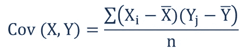

# 协方差和相关性

> 原文：<https://medium.com/analytics-vidhya/covariance-and-correlation-797ce877dffe?source=collection_archive---------9----------------------->


在本文中，我们将从统计学的角度讨论协方差和相关性的概念，并在 python 中实现它们。

C ***方差是一个度量，它给出了两个随机变量之间的关系。此指标评估变量一起变化的程度。它只不过是两个变量之间方差的度量。***

在深入协方差之前，我们需要了解均值和方差

M

考虑一个由 6 个值组成的随机变量 X

```
X = [96, 85,  2, 29, 31, 74]
```

所以根据定义

```
mean = (sum of values of X)/(number of values of X) 
```

*   **表示**

```
def mean(x):
    x = np.array(x)
    return sum(x)/len(x)mean = mean(X) = 52.83
```

***注意:*** *我使用了 Numpy 数组而不是 list 来使用广播，而不是使用 list comprehensions 来做同样的操作*

V ***方差无非是数据的离散性。这是一个度量标准，它给出了一个随机变量的数据点离它们的平均值有多远。***


差异

*   **差异**

```
def variance(x):
    x = np.array(x)
    x = x - mean(x)
    x = x**2
    return sum(x)/len(x),2X = [96, 85,  2, 29, 31, 74]variance = variance(X) = 1162.47
```

> 每个随机变量都有它自己的方差，而且它永远不会是负的

两个随机变量 X 和 Y 之间的协方差可以通过下式计算



X 和 Y 之间的协方差

> **X 对 X 的协方差不过是 X 的方差**

协方差衡量两个随机变量(本例中为 X 和 Y)相对于各自平均值的总变化。

使用协方差，我们可以得到随机变量之间关系的方向，即变量是倾向于同向移动还是表现出相反的关系

与方差不同，协方差可以取正值或负值

> **正协方差→说明两个随机变量趋向于同向运动。**
> 
> **负协方差→说明两个随机变量趋向于反向运动。**

我们将使用样本协方差，它与总体协方差有点不同

> **样本协方差测量两个随机变量样本之间关系的强度和方向，并推断出这两个随机变量的总体结果**


样本协方差

> **总体协方差衡量两个随机变量总体之间的关系。**

实际上，获取一个随机变量的所有总体值是不可行的，所以我们将使用样本协方差并通过使用它来推断我们得到的结果。


采样离散

*   **样本差异**

```
def sample_variance(x):
    x = np.array(x)
    x = x - mean(x)
    x = x**2
    return sum(x)/(len(x) - 1)
```

*   为什么我们除以(n-1)而不是 n？

当我们在计算样本方差时除以(n1)时，所有可能样本的样本方差的平均值等于总体方差。所以样本方差就是我们所说的总体方差的无偏估计。

如果在计算样本方差时除以 n 而不是(n-1 ),那么所有可能样本的平均值将不等于总体方差。

除以 n-1 满足无偏性，但除以 n 则不满足。因此，在计算样本方差时，我们倾向于除以 n-1。

*   **考虑两个随机变量 X 和 Y**

```
X = [16, 14, 19, 12, 19, 15]Y = [ 2,  1, 11,  1, 14, 18]
```

*   **X、Y 和 co 的平均值**

```
mean(X) = 15.83mean(Y) = 7.83
```

*   **X 和 Y 之间的协方差**

```
def covariance(x,y):
    x = np.array(x)
    y = np.array(y)
    x = x - mean(x)
    y = y - mean(y)
    temp = x * y
    temp = temp/(len(x) - 1)
    return sum(temp)covariance = covariance(X,Y) = 11.77
```

*正协方差表示 X 和 Y 倾向于向同一方向移动。*

> **协方差衡量两个随机变量的总变差。使用协方差，我们只能获得关系的方向。然而，它并不表示两个随机变量之间关系的强度。相关性提供了关系的强度**

C

相关性是协方差的扩展度量。

它总是在-1 和 1 之间。

相关性可以表示为


X 和 Y 之间的相关性

*   **X 和 Y 的相关性**

为了计算相关性，我们需要 X 的样本标准偏差和 Y 的样本标准偏差

S ***安普标准差是样本方差的平方根***

```
X = [16, 14, 19, 12, 19, 15]Y = [ 2,  1, 11,  1, 14, 18]
```

*   **样本标准偏差**

```
def sample_std(x):
    return sample_variance(x)**(0.5)
```

*   **X 和 Y 之间的相关性**

```
def correlation(x,y):
    cov = covariance(x,y)
    return cov/(sample_std(x) * sample_std(y))correlation(X,Y) = 0.565
```

相关系数显示了 X 和 y 之间关系的强度。

***一般假设是，相关系数大于 0.7 被认为是强相关。相关系数在 0.5 和 0.7 之间是中度相关，如果小于 0.4，则认为是弱相关。***

所以 X 和 Y 的相关性适中。