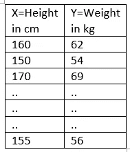
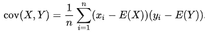
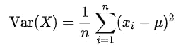
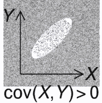
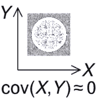
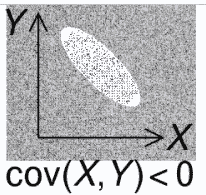

# 使用协方差理解相关性

> 原文：<https://medium.com/analytics-vidhya/covariance-c618c0099fc?source=collection_archive---------24----------------------->

在这篇博客中，我们将试图理解如何测量随机变量之间的关系。

让我解释一下我所说的**关系**是什么意思。

假设我有一个随机变量 X，它取一个班级中学生的身高值，还有一个变量 Y，它取学生的体重值。下面是例子。

如果我做了 n 次这样的观察。现在我脑子里的问题是，X 和 Y 之间有关系吗？

X 和 Y 之间的关系是什么意思？

为了回答这个问题，我们需要检查 X 是否增加，我能说 y 也增加吗？或者我可以说随着 X 增加，Y 减少？所以理解这些类型的关系很重要，因为它们告诉我们两个变量是否有任何联系。

现在，我们如何量化这种关系？

有三种方法可以量化这种关系。当然，它们各有利弊。

1.第一个度量叫做协方差。顾名思义，和方差有些关系。

2.第二个想法叫做皮尔逊相关系数。

3.第三种测量方法叫做 Spearman 等级相关系数。

所有这些想法都是相互关联的。在这个博客中，我们将讨论协方差

让我来定义两个随机变量之间协方差的数学方程。

e(X)= X = X 的平均值

e(Y)= Y = Y 的平均值

n =观察次数

和易都是个别观察。

上面的公式看起来非常类似于随机变量的方差公式。这是方差的公式。

所以看上面的公式，我们可以说协方差和方差有关系，方差是随机变量 X 的协方差，它本身就是 X 的方差。

现在，让我们来理解这个公式是如何工作的。它如何度量两个随机变量之间关系。

1.Cov(X，Y) =正那么我们可以说，随着 X 的增加，Y 也增加

2.Cov(X，Y) =负值我们可以说 X 增加，Y 减少。

这里是 cov(X，Y)的图形表示。

共方差的限制

1.协方差的值可以很负，也可以很正。但是如果有人说两个随机变量之间的协方差是+5，我不知道这是一个大数字还是一个小数字。所以协方差的值不会有助于解释关系的强度。

2.现在让我们举个例子。随机变量 X(学生的身高)以厘米为单位，Y(体重)以千克为单位，那么如果 X 和 Y 分别转换为不同的单位，如英寸和磅，协方差将不会相同。然而，数据集与之前的相同。

**解决上述限制的方法是使用皮尔逊相关系数，我们将在下一篇博客中看到。**

 [## 皮尔逊相关系数

### 在我之前的博客中，我们学习了协方差来衡量两个随机变量之间的关系。

medium.com](/analytics-vidhya/pearson-correlation-coefficient-c78033127629) 

[https://medium . com/analytics-vid hya/Pearson-correlation-coefficient-c 78033127629](/analytics-vidhya/pearson-correlation-coefficient-c78033127629)

参考:【https://en.wikipedia.org/wiki/Covariance 