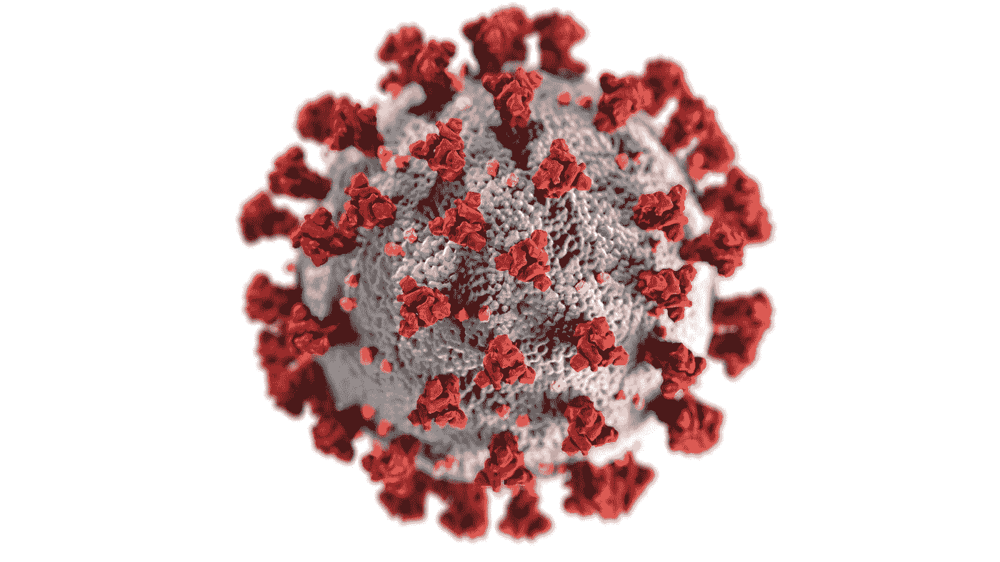

# 新冠肺炎:世纪疫情的深度探索

> 原文：<https://medium.com/analytics-vidhya/covid-19-a-deep-dive-into-the-pandemic-of-the-century-f1568f950240?source=collection_archive---------9----------------------->

[疾控中心](https://unsplash.com/@cdc?utm_source=medium&utm_medium=referral)在 [Unsplash](https://unsplash.com?utm_source=medium&utm_medium=referral) 拍摄的照片

# **目录**

*   关于工具、库和数据集来源的信息。
*   关于新冠肺炎的详细案例研究。
*   基于最近可用数据和信息的可视化和事实。
*   武汉病毒是如何跨越国界的？
*   封锁真的有助于减少新冠肺炎对人类的影响吗？
*   新冠肺炎引起的气候变化。
*   根据目前的情况得出结论。

就在几个月前，我们怀着无比兴奋的心情迎接新的十年，但我们几乎不知道今年第一季度为我们准备了什么。

好像澳大利亚的森林大火，世俗的 CAA 抗议暴力在印度国家的中心爆发，以及在全球政治紧张局势中酝酿的第三次世界大战的潜在可能性还不够——新冠肺炎来了。

> 众所周知，这种全球性的疫情病毒已经震撼了整个世界

# 用于分析目的的工具、库和数据集来源

> **工具:** Python 和 Tableau
> 
> **用于可视化的 Python 库** : Seaborn、Folium、Squarify、Plotly、Matplotlib、Calmap
> 
> **数据集参考链接** >**[https://www.tableau.com/covid-19-coronavirus-data-resources](https://www.tableau.com/covid-19-coronavirus-data-resources)
> >[https://github.com/datasets/covid-19](https://github.com/datasets/covid-19)
> >[https://datahub.io/core/covid-19](https://datahub.io/core/covid-19)**
> 
> ****用于获取数据的 API**:数据流**
> 
> ****用于取数据的 Python 库列表:**
> >**Covidify 1 . 0 . 0**([https://pypi.org/project/covidify/](https://pypi.org/project/covidify/))
> >**covid 19 py 0 . 3 . 0**([https://pypi.org/project/COVID19Py/](https://pypi.org/project/COVID19Py/))**
> 
> ****数据集****

****

****样本数据集****

> ****数据预处理****

**活动病例计算为，
**【活动病例=** 确诊病例-报告死亡病例-康复病例**

# ****关于新冠肺炎(冠状病毒)的概述****

*   ****来源**:电晕病毒的爆发被认为是中国**武汉**、**湖北**的一个“湿货市场”，出售包括鱼和有羽毛的生物在内的死的和活的生物。
    于 2019 年 11 月**首次报告症状**。**
*   ****起因**:最近一次爆发的生物源头还没有被区分出来，但是第一个宿主被认为是蝙蝠。武汉展览馆没有出售蝙蝠，但是可能有污染的活鸡或其他生物在那里出售。**
*   ****风险**:冠状病毒**也是无症状的**，意味着一个人可能是感染的携带者，但没有任何症状。**

****

****假设:电晕传播到人体的过程****

****症状****

*   **症状包括发烧、咳嗽、呼吸道症状和呼吸困难。**
*   **在严重的情况下，它会导致肺炎、严重急性呼吸系统综合症(SARS)、**
*   **肾衰竭甚至死亡。**

# ****新冠肺炎震中的形成****

*   **根据最近的更新，美国比地球上任何一个国家都有更多确认的冠状病毒，超过了中国。**

# **为什么致命的疫情的中心向西移动？**

**所有的大国，像欧洲和美国，都犯了和中国相似的错误:**

*   **低估了新冠肺炎造成的危险程度。**
*   **没有利用受害国的例子。**
*   **每个国家的政府官员对国家的错误希望。**
*   **锁定过程中的延迟。**
*   **延迟采取防电晕病毒措施。**
*   **医护人员面临的风险被轻视了。**

# **中国农历新年基本上增强了这种病毒**

****

**弗农·雷内尔·森松在 [Unsplash](https://unsplash.com?utm_source=medium&utm_medium=referral) 上拍摄的照片**

**创造新的热点，一路引领死亡之路。**

> ****武汉病毒如何跨越国界，传播到遥远的国家****

*   **第一个冠状病毒病例出现在 2019 年 11 月**。几周后，2020 年 1 月 23 日，中国出现了第一次封锁。到 2020 年 1 月 23 日，**500 万人**已经离开武汉市，有可能被感染。****
*   ****这件事发生在一个重要的中国节日，农历新年。在此期间进出武汉的数百万人成为了潜在的携带者。****

# ****世界上最大的人口迁徙发生在中国春节期间****

> ****正值武汉爆发冠状病毒期间。难怪，它像火一样蔓延。****

********

****照片由[徐](https://unsplash.com/@akuan5?utm_source=medium&utm_medium=referral)在 [Unsplash](https://unsplash.com?utm_source=medium&utm_medium=referral) 上拍摄****

****根据一些给定的数字:****

*   ****很难给出一个准确的数字，但有许多模式和趋势会很方便。**旅行医学杂志**于 2020 年年**月发表了一篇论文。******
*   ****今年中国游客预计将进行 4 . 15 亿次旅行，这些旅行包括国内和国际旅行。这些旅行安排在 2020 年 1 月 24 日至 1 月 30 日**。******
*   ****仅仅通过商业**航空旅行**，这项研究命名了 **20 个城市**，来自**武汉**的旅行者在**农历新年**期间经常光顾。****

********

******中国农历新年期间，武汉感染了前往其他国家的携带者******

> ******使用地理熊猫库进行可视化******

********

> ******出现确诊病例的国家******

****下图显示了 Covid 19 确诊病例数量的严重程度。截至目前，中国受影响最严重，已有 8 万例确诊病例。美国和欧洲落在后面，而世界其他地方也刚刚开始经历这一趋势。显然，到目前为止，疫情几乎没有让任何国家幸免于难。只有时间能告诉我们这些数字在全球范围内会变得多或少。****

****************

****上图是最近对确诊 Covid 19 病例数排名前 20 位的县的解释。虽然中国是病例最多的来源，但其他国家也在晚些时候赶上来。意大利、西班牙、德国和美国是疫情中心以外的前五大感染国。****

> ******一段时间内确诊病例的时序可视化******

********

> ******全球范围内:冠状病毒随时间呈指数增长******

****许多人可能存在误解，认为 Covid19 的 3.4%疲劳率是一个可以忽略的值。不幸的是，源于这“仅仅”3.4%的案件数量的绝对值令人难以理解。

在绘制时间线上报告的与确认的实际病例相对照的日期时，已经观察到实际病例的数量远远大于在任何给定时间报告的病例数量。当这个人被确诊时，他们可能已经接触了很多人并传播了病毒。这导致病例数呈指数增长曲线。****

********

> ******全球范围内:冠状病毒随时间呈指数增长(对数标度)******

********

> ******全球:2020 年 1 月确诊与痊愈病例******

********

> ******全球:2020 年 2 月确诊与治愈病例对比******

********

> ******全球:2020 年 3 月确诊与治愈病例对比******

********

> ******全球:全球确诊 vs 死亡病例******

********

# ******新冠肺炎(冠状病毒)对中国的影响******

****************

****2020 年 3 月，中国的病例突破了 8 万例****

> ******受灾最严重的城市湖北武汉******

****湖北是中国受影响最严重的州，几乎有 92%的病例被发现。人们一直担心中国湖北省武汉市会出现感染事件。****

********

> ******一段时间内中国的活跃案例**(封锁对电晕案例数量增加的影响)****

****封锁中国的主要城市，最终帮助国家对抗日益增多的病例。在 2020 年 2 月 16 日之后，可以清楚地看到新的电晕案例有了巨大的下降。****

****************

# ****新冠肺炎(冠状病毒)对欧洲国家的影响****

****************

****尽管意大利拥有全世界第二好的医疗设施，但它仍然是受害最深的国家。这背后的主要原因是意大利的平均年龄在 60 岁以上。****

********

****意大利政府的早期封锁行动本来可以挽救许多生命，这个冠状病毒链本来可以被打破，但不幸的是，根据目前的统计数据，这个国家正在努力奋斗。****

# ****新冠肺炎(冠状病毒)对印度的影响****

****根据最近的数据，印度的电晕病例正在以每天 10%的新病例的规模增加。印度政府的早期封锁行动。可以成为拯救数百万人生命非常关键的一步。****

****印度已经采取了一些预防措施，让我们看看这些措施能在多大程度上帮助印度抗击疫情。****

****************

****印度于 2020 年 1 月报告了首例病例，此后病例数量呈指数增长。****

****正是由于这个原因，印度和许多国家采取了全国范围的封锁，试图控制这些数字****

********

# ******封锁的影响******

********

*   ****封锁的方式是通过灌输社会距离或隔离来防止疾病的进一步传播。这种影响不会立即显现，因为在该特定时间点，早期确诊病例的报告仍将到期。然而，一旦这些被清除，新的病例就会出现。****
*   ****像中国、义大利和西班牙这样的国家是第一批实施全国封锁作为对新冠肺炎的反制措施的国家。然而，他们只是在病例数超过至少 1000 例后才意识到这一点。现有的数字已经开始传播，并导致病例和随后死亡人数的指数增长。****
*   ****因此，理想的结论应该是，鉴于这种疾病的广泛传播和传染性，应该在病例发现的最初阶段就实施封锁，管理机构不应该等到人数增加时才意识到封锁的必要性。****
*   ****新加坡是一个很好的例子，在那里，他们也是较早被感染的国家之一，但是他们没有走意大利、中国或西班牙的道路，而是在萌芽阶段就实施了社会距离措施。即使在今天，死亡人数也没有超过 1000 人，只有 2 人死亡。****

# ******死亡率******

*   ****Covid 19 在世界范围内的致死率为 0.5%至 4%。根据人口和现有的医疗设施，这一比例可能会有所不同。由于医疗资源有限，无法治疗所有病例，因此在疫情疫情平息之前，必须保持隔离生活方式，以尽可能减少病例在任何国家的传播和进一步增加。****
*   ******按年龄划分的新冠肺炎病死率。******

********

*   ****因此，如果不实施封锁或所有人都依法遵守封锁，死亡率必然会达到更高的水平。医疗保健系统将只能处理有限数量的病例。****

# ******气候变化:新冠肺炎前后******

> ****中国:当病毒主宰人类生活时，这就是污染程度大幅度降低的原因****

********

> ******意大利的气候变化******

********

# ******总有一线希望******

*   ****他们说，据观察，疫情每 100 年发生一次。上一次疫情是西班牙流感，当时地球人口为 20 亿。这场流感持续了 2.5 年之久，在科技和医学进步有限的情况下，它影响了多达 5 亿人。****
*   ****100 年后的今天，全球人口已达 70 亿，这个星球的人口密度也变得更大了。尽管人类在过去的一个世纪里取得了所有的技术和医学进步，但在短短 5 个月内，Covid 19 已经感染了 50 万人。****
*   ****中国最终禁止了野生动物的非法贸易和消费。以疫情为例，随着禽流感、猪流感和其他疾病的爆发，人们开始意识到吃素对个人和环境的好处。动物和植物能够在它们的庇护所中找到安宁，稀有的鱼类和鸟类物种正在返回它们的自然栖息地。****
*   ****作为预防措施，封锁/隔离/社会距离措施已经在全球范围内实施，这给了大自然恢复的时间。由于没有人在路上，通勤受到限制，使用技术在家工作，以及对陆地、空中和海上交通工具的使用进行控制，全球的污染水平已经显著下降。据观察，空气正在清除有害的有毒化学物质。****
*   ****它也给了我们，作为一个社区，反思我们不断对环境造成的破坏和错误的机会。我们忽视了警告信号，今天，当疫情掌权时，我们别无选择，只能站出来做我们一直应该做的事情。让这也成为从新十年伊始的新冠肺炎故事中汲取的一个教训。****