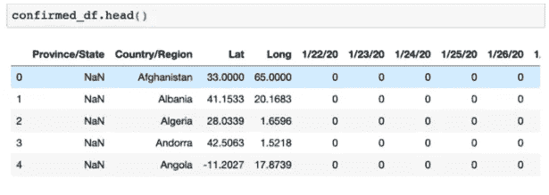
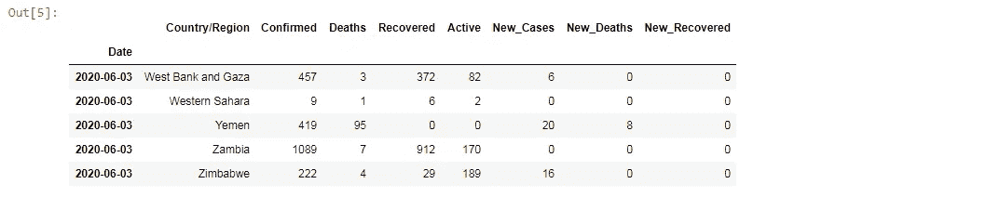
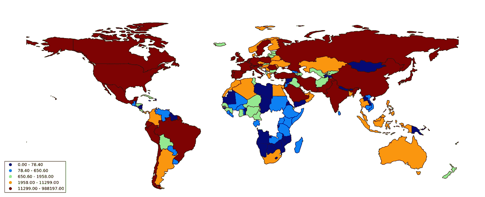
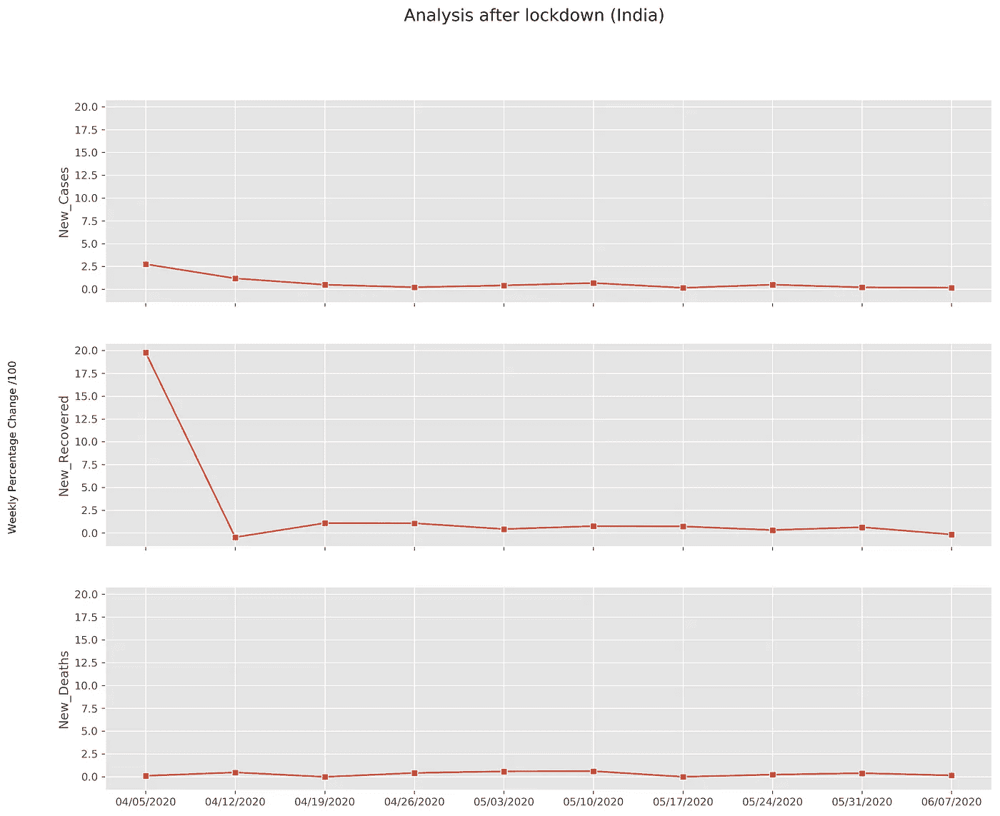
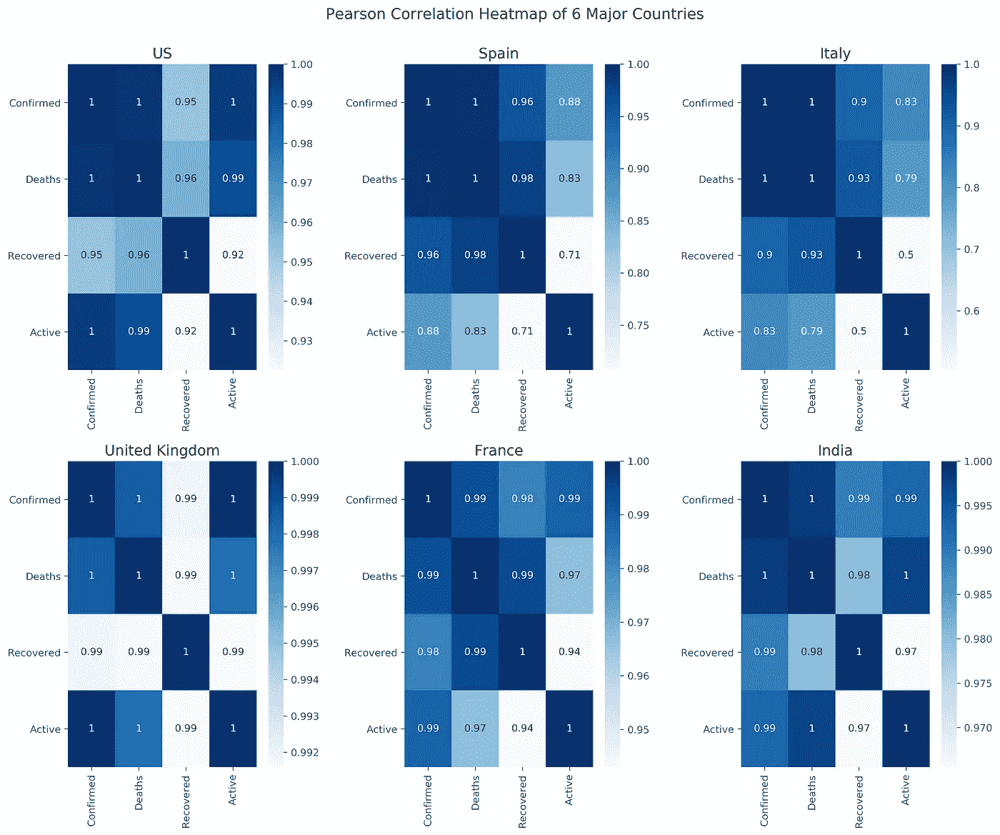
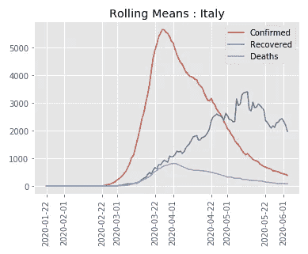
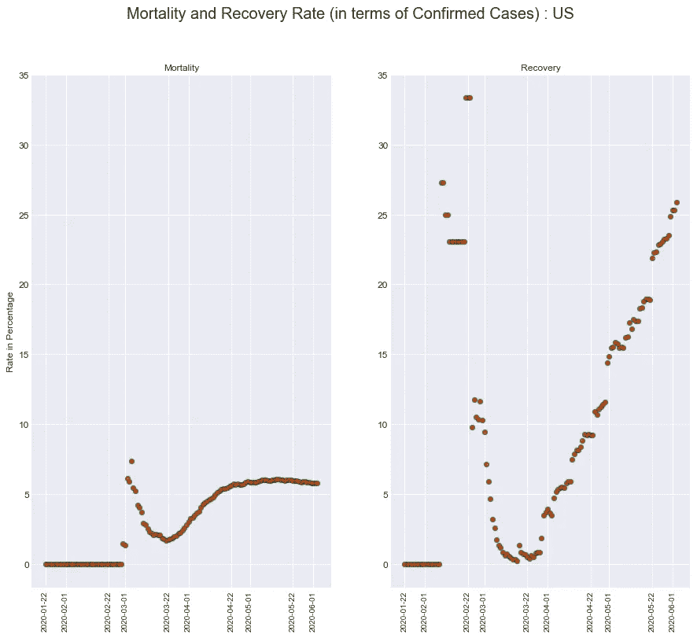

# 新冠肺炎:对山峰的一瞥

> 原文：<https://medium.com/analytics-vidhya/covid-19-a-quick-peek-on-the-peaks-fa5f4e7b4e89?source=collection_archive---------16----------------------->

通过使用 Python 可视化全球数据，对(新型冠状病毒)进行简短而全面的分析。


[图像来源](https://www.google.com/imgres?imgurl=https%3A%2F%2Fmiro.medium.com%2Fmax%2F1000%2F0*_NiZ9ixMajXPZR1k.jpg&imgrefurl=https%3A%2F%2Ftowardsdatascience.com%2Fgetting-started-with-internet-data-analysis-traffic-analysis-594144ba2b52&tbnid=V8sxOVdISTZ5jM&vet=12ahUKEwi8tPWXzfHpAhVTFHIKHfK5BIYQMygTegUIARDKAQ..i&docid=wZ75BIyOMESFUM&w=1000&h=564&q=data%20analysis%20pencil&ved=2ahUKEwi8tPWXzfHpAhVTFHIKHfK5BIYQMygTegUIARDKAQ)

随着世界各地新冠肺炎病例的增加，在这种封锁下，像我的数据科学爱好者同伴一样，我也决定看看由[约翰霍普金斯大学](https://github.com/CSSEGISandData/COVID-19)提供的每日数据，并根据我头脑中的好奇心驱动的问题，通过收集、争论和可视化情况进行一些分析。

我们开始吧！

***目录:***
1。收集数据
2。数据角力
3。数据分析和可视化:
a)为确诊病例创建世界地图的图谱。
b)印度封锁的影响。
c)生成几个国家的皮尔逊相关热图。
d)绘制任何国家数据的滚动平均值。绘制任何国家的死亡率和恢复率。

# 收集并首先查看数据

*从 pywget 导入 wget*

这将为您获取可下载的文件，并将它们保存在本地系统中。现在，您已经在原始 CSV 中获得了数据。

```
urls = [
 ‘[https://raw.githubusercontent.com/CSSEGISandData/COVID-19/master/csse_covid_19_data/csse_covid_19_time_series/time_series_covid19_confirmed_global.csv'](https://raw.githubusercontent.com/CSSEGISandData/COVID-19/master/csse_covid_19_data/csse_covid_19_time_series/time_series_covid19_confirmed_global.csv%27),
 ‘[https://raw.githubusercontent.com/CSSEGISandData/COVID-19/master/csse_covid_19_data/csse_covid_19_time_series/time_series_covid19_deaths_global.csv'](https://raw.githubusercontent.com/CSSEGISandData/COVID-19/master/csse_covid_19_data/csse_covid_19_time_series/time_series_covid19_deaths_global.csv%27),
 ‘[https://raw.githubusercontent.com/CSSEGISandData/COVID-19/master/csse_covid_19_data/csse_covid_19_time_series/time_series_covid19_recovered_global.csv'](https://raw.githubusercontent.com/CSSEGISandData/COVID-19/master/csse_covid_19_data/csse_covid_19_time_series/time_series_covid19_recovered_global.csv%27)]
 [wget.download(url) for url in urls]
```

*进口熊猫做 pd*

下一步是使用 *pandas read_csv()* 函数读取您的 csv 并生成数据帧。

```
confirmed_df = pd.read_csv('time_series_covid19_confirmed_global.csv')deaths_df = pd.read_csv('time_series_covid19_deaths_global.csv')recovered_df = pd.read_csv('time_series_covid19_recovered_global.csv')
```

通过打印任一数据帧的前五行，我们将会找到如下的国家每日数据:



# 争论数据

*导入 numpy 作为 np*

现在，我们希望我们的数据是纵向格式的，这样我们就可以得到一天格式的数据。为此，我们在每个数据帧上使用pd.melt() ，最后使用 pd.merge()将所有三个数据帧合并成一个别名为 *complete_df* 的数据帧。此外，我们使用 *pd.to_datetime()将我们的“Date”列转换为 DateTime 对象。*这将有助于时间序列分析。

```
confirmed_df_melted = confirmed_df.melt(
    id_vars=['Province/State', 'Country/Region', 'Lat', 'Long'], 
    var_name='Date', 
    value_name='Confirmed')deaths_df_melted = deaths_df.melt(
    id_vars=['Province/State', 'Country/Region', 'Lat', 'Long'], 
    var_name='Date', 
    value_name='Deaths')recovered_df_melted = recovered_df.melt(
    id_vars=['Province/State', 'Country/Region', 'Lat', 'Long'],  
    var_name='Date', 
    value_name='Recovered')complete_df = confirmed_df_melted.merge(
  right=deaths_df_melted, 
  how='left',
  on=['Province/State', 'Country/Region', 'Date', 'Lat', 'Long'] )complete_df = complete_df.merge(
  right=recovered_df_melted, 
  how='left',
  on=['Province/State', 'Country/Region', 'Date', 'Lat', 'Long'] )complete_df['Date']=pd.to_datetime(complete_df['Date'])
```

接下来，我们通过从*确认的*列中减去*死亡*和*康复*列来找到活跃病例的数量，并将该系列作为别名为*活跃*的列添加到我们的数据框中。按*日期*和*国家/地区*对数据帧进行分组并应用。对*求和()。groupby()* 对象，它将为我们提供每列中案例的总数。

为了找到每个类别中案例的每日变化，我们创建一个临时数据框 temp 并应用。diff()函数并添加单独的列 *New_Cases，New_Deaths，New_Recovered。*进一步，我们将 *temp* 和 *complete_df* 合并，并将 *Date* 列设置为索引。我们的数据框现在已经准备好进行一些可视化和分析了！

```
complete_df['Active'] = complete_df['Confirmed'] - complete_df['Deaths'] - complete_df['Recovered']
complete_df = complete_df.groupby(['Date', 'Country/Region'])['Confirmed', 'Deaths', 'Recovered', 'Active'].sum().reset_index()temp = complete_df.groupby(['Country/Region', 'Date', ])['Confirmed', 'Deaths', 'Recovered']
temp = temp.sum().diff().reset_index()mask = temp['Country/Region'] != temp['Country/Region'].shift(1)
temp.loc[mask, 'Confirmed'] = np.nan
temp.loc[mask, 'Deaths'] = np.nan
temp.loc[mask, 'Recovered'] = np.nantemp.columns = ['Country/Region', 'Date', 'New_Cases', 'New_Deaths', 'New_Recovered']
complete_df = pd.merge(complete_df, temp, on=['Country/Region', 'Date'])
complete_df = complete_df.fillna(0)
cols = ['Confirmed','Active','Recovered','New_Cases', 'New_Deaths', 'New_Recovered']
complete_df[cols] = complete_df[cols].astype('int')complete_df['New_Cases'] = complete_df['New_Cases'].apply(lambda x: 0 if x<0 else x)complete_df=complete_df.set_index(complete_df['Date'])
complete_df.drop('Date',axis=1,inplace=True)df_India = complete_df.loc[complete_df['Country/Region']=='India']complete_df.tail()
```



comlete_df 数据帧的最后 5 行

# 分析和可视化

> **一张世界地图！**

*导入 geopandas 作为 gpd，导入 mapclassify，导入 descartes*

首先，我们从*GPD . datasets . get _ path()*加载一个 geopandas 数据帧，合并两个数据帧: *world* 和 *complete_df。*此后，我们使用[‘分位数’](http://wiki.gis.com/wiki/index.php/Quantile#:~:text=Quantile%20classification%20is%20a%20data,makes%20the%20intervals%20uneven%20sizes.)分类方案对我们的数字进行分类，绘制出*确认的*列的数据。

```
world = gpd.read_file(gpd.datasets.get_path('naturalearth_lowres'))
world.at[4,'name']='US'
total_conf_cd = complete_df.loc['2020-04-27'][['Country/Region','Confirmed']]
plot_data = pd.merge(world, total_conf_cd, how='inner', right_on = 'Country/Region', left_on= 'name')
plot_data=gpd.GeoDataFrame(plot_data)fig = plt.figure()
ax = plot_data.plot(column='Confirmed', scheme='quantiles',legend=True,legend_kwds={'loc': 'lower left'},figsize=(30,30))
ax.set_axis_off()
plt.style.use('classic')
```



一些国家缺少的数据用白色表示。

> **印度封锁的影响！**

*将 seaborn 导入为 sns，从日期时间导入日期时间*

自 2020 年 3 月 25 日起，印度被完全封锁。让我们看看它对每天报告的病例率的影响。为此，我们在封锁开始后对印度的数据进行了子集划分。我们通过*计算变化率。pct_change()* 并使用*。seaborn 的 lineplot()* 来绘制我们的数据。

```
df_india_ld = df_India['2020-03-25':]df_india_ld = df_india_ld.mask(df_india_ld==0).fillna(df_india_ld.mean())
df_india_ld_ncases = df_india_ld.New_Cases.resample('W').mean().pct_change().to_frame()
df_india_ld_nrecov = df_india_ld.New_Recovered.resample('W').mean().pct_change().to_frame()
df_india_ld_ndeath = df_india_ld.New_Deaths.resample('W').mean().pct_change().to_frame()x = [x.date().strftime("%m/%d/%Y") for x in df_india_ld_ncases.index]plt.style.use('ggplot')
fig, ax = plt.subplots(nrows=3,sharey=True,sharex=True, figsize = (15,12))
fig.text(0.04,0.5,'Weekly Percentage Change /100', va='center', rotation='vertical')
fig.suptitle("Analysis after lockdown (India)", fontsize=16)
sns.lineplot(data = df_india_ld_ncases, x = x, y= df_india_ld_ncases['New_Cases'], marker = 's' , ax=ax[0])
sns.lineplot(data = df_india_ld_nrecov, x = x, y= df_india_ld_nrecov['New_Recovered'], marker = 's' , ax=ax[1])
sns.lineplot(data = df_india_ld_ndeath, x = x, y= df_india_ld_ndeath['New_Deaths'], marker = 's' , ax=ax[2])
```



正如图表所示，这一时期的利率相当稳定。

> **一些主要国家的皮尔逊相关热图！**

在这里，我们试图了解不同指标参数之间的相关性，并与其他国家的指标进行比较。通过*计算数据帧列的相关矩阵。corr()* 熊猫的方法这里我们通过‘皮尔逊’作为计算系数的方法。可以使用其他[相关系数](https://www.statisticssolutions.com/correlation-pearson-kendall-spearman/)，如“肯德尔”或“斯皮尔曼”。随后，该关联矩阵用于生成所需的热图。

例如，我们会发现，在一些国家，恢复的*与活跃的*之间的相关性与其他国家相比相对较低。这说明了一些事情！**

*注意:假设变量之间是线性关系。*

```
top_5_and_india = ['US','Spain','Italy','United Kingdom','France','India']complete_df_corr = complete_df.loc[complete_df['Country/Region'].isin(top_5_and_india)].iloc[:,:5]fig , ax = plt.subplots(nrows=2,ncols=3,figsize=(15,12))
fig.tight_layout(pad = 7.0)
fig.suptitle("Pearson Correlation Heatmap of 6 Major Countries" , fontsize = 15)
def plot_corr(m,i,j,t):
    sns.heatmap(m,ax=ax[i,j], cmap= 'Blues',annot = True)
    ax[i,j].set_title(t)
    ax[i,j].tick_params(axis='x', rotation=90)
    ax[i,j].tick_params(axis='y', rotation=0)

l = [[0,0],[0,1],[0,2],[1,0],[1,1],[1,2]]
for i in range(6):
    data = complete_df_corr[complete_df_corr['Country/Region']==top_5_and_india[i]]
    mat = data.corr(method='pearson')
    x,y = l[i]
    plot_corr(mat,x,y,top_5_and_india[i])
```



> **密谋任何国家数据的滚动手段！**

在这一分析中，我们感兴趣地看到全世界疫情的确诊病例、死亡病例和康复病例的数量的总体每日上升/下降。为了平滑我们的情节，我们使用了一个 7 天的[滚动窗口平均](https://pandas.pydata.org/pandas-docs/stable/reference/api/pandas.DataFrame.rolling.html)技术和*。seaborn 图书馆的 lineplot()* 。

```
def plot_rolling_means(country):
    country_c = country['New_Cases'].rolling('7D').mean()
    country_r = country['New_Recovered'].rolling('7D').mean()
    country_d = country['New_Deaths'].rolling('7D').mean()
    sns.lineplot(data = country_c)
    sns.lineplot(data = country_r)
    sns.lineplot(data = country_d)
    plt.xticks(rotation = 90)
    plt.legend(['Confirmed','Recovered','Deaths'])
    plt.title("Rolling Means : " + s)s = input("Enter any country as input like : India, US, China, France, etc. : ")
df_country = complete_df.loc[complete_df['Country/Region']==s]
plot_rolling_means(df_country)
```



信息丰富的可视化。

> **任何国家的死亡率和恢复率！**

在本笔记本的最后一次分析中，我们根据总确诊病例绘制了死亡率和恢复率，并了解了这些数据每天是如何变化的。我们希望看到复苏趋势持续增长，而死亡率则相反。观察你的国家的表现。手指交叉！

```
country = input("Enter any country as input like : India, US, China, France, etc. to show their Mortality and Death Rate : ")
df_country = complete_df.loc[complete_df['Country/Region']==country]
fig , ax = plt.subplots(ncols = 2,figsize=(15,12))
plt.style.use('seaborn-darkgrid')
def rates(data):
    mortality = data['Deaths']/data['Confirmed'] * 100
    recovery = data['Recovered']/data['Confirmed'] * 100
    ax1 = plt.subplot(1,2,1)
    plt.plot(data.index,mortality , marker = 'o' , linewidth = 0 , alpha = 0.7 , markersize = 6 , 
             markeredgecolor = 'g' , markeredgewidth = 1.2 , markerfacecolor='r')
    plt.xticks(rotation = 90)
    plt.yticks(size = 12)
    plt.ylabel("Rate in Percentage" , fontsize = 12)
    plt.title("Mortality")
    ax2 = plt.subplot(1,2,2 ,sharey = ax1)
    plt.plot(data.index, recovery , marker = 'o' , linewidth = 0 , alpha = 0.7 , markersize = 6 ,
             markeredgecolor = 'g' , markeredgewidth = 1.2 , markerfacecolor='r')
    plt.xticks(rotation = 90)
    plt.yticks(size = 12)
    plt.title("Recovery")
    fig.suptitle("Mortality and Recovery Rate (in terms of Confirmed Cases) : " + country , fontsize = 20)
    plt.show()
rates(df_country)
```



总而言之，我们可以说冠状病毒的爆发在世界各地产生了不同的影响，不同的国家以他们的方式处理这种情况，但关注的问题仍然是一样的:每个人的安全。看起来发达国家和发展中国家受疫情的影响更大。在这场自然秀中，我们人类需要学习很多东西，我们不能对我们所目睹的一无所知。让我们期待最好的结果吧！这一切都会过去的。

***注:*** 好吧，这是我作为学生的第一篇文章，我觉得很得意！你可以在我的 Github 上找到这个笔记本。

[](https://www.linkedin.com/in/swarn6/) [## Swarnim Pandey - SRM 大学-印度北方邦勒克瑙| LinkedIn

### 查看世界上最大的职业社区 LinkedIn 上的 Swarnim Pandey 的个人资料。Swarnim 有 2 份工作列在…

www.linkedin.com](https://www.linkedin.com/in/swarn6/)