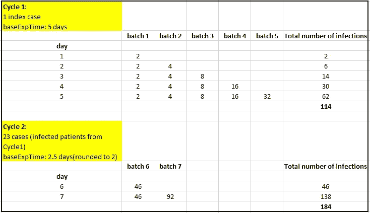
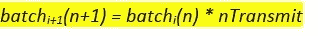
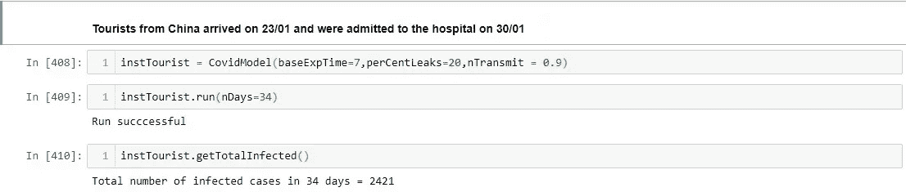
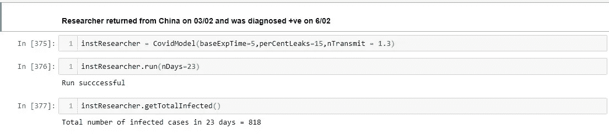
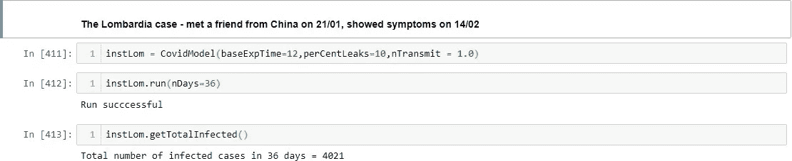
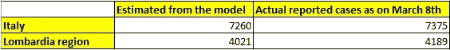

# 新冠肺炎:一个非专家用 Python 编写的简单预测模型

> 原文：<https://medium.com/analytics-vidhya/covid-19-a-simple-predictive-model-in-python-by-a-non-expert-be07b7ae7d22?source=collection_archive---------14----------------------->

**目的**:从单个输入性病例中预测个体入境 n 天后*的新冠肺炎病例数(称为指标)。这将适用于除中国以外目前受疫情影响的所有国家，因为中国是该疾病的发源地。这里假设 *n* 天是在封锁和广泛的社会距离措施实施之前。*

**控制变量**:从指示病例进入(DOE)之日起的给定时期内发生的感染病例总数取决于 3 个因素/参数:-

*   **基础暴露时间( *baseExpTime* )** :从人被感染(或 DOE 视情况而定)到出现症状的平均天数，构成一个周期。
*   **传染率(*n 传播* )** 从感染者到易感者:这将作为一个感染者一天内传播疾病的平均人数。
*   **泄漏百分比(*percent leaks***)**:**由于接触者追踪过程中的缺陷而未被检测到的感染病例的平均百分比，从而设法“泄漏”到下一个周期。这也可能包括有可能传染他人的无症状病例。这些人构成了下一个周期的新一批指标案例。

**假设:**

*   指标病例在被确认为阳性后立即被隔离。同样，所有被指示病例感染的人(不包括泄漏的百分比)也会被立即追踪和隔离。这显然是一个理想化的场景。
*   暴露时间(以天为单位)四舍五入为最接近的整数。
*   为了计算连续周期的暴露时间，假定感染病例发生在周期的中间。为了简化计算，这只是一个粗略的近似值。

**程序:**

用于计算给定天数内总感染数的 Python 程序

根据传染率/天( *nTransmit* 变量)，从指示病例引发的病例开始的每一批受感染病例，从个体感染病毒的第二天起，将传染传播给下一批。这种现象以递归方式传播，直到周期结束，此时指标患者显示症状或被诊断为阳性。

如表所示，该程序计算每批中每天的感染病例数(结果在 *dWiseAg[]* 中更新)。以下计算适用于以下控制变量组合。

baseExpTime = 5 天，nTransmit = 2，perCentleaks =20%。

第 2 周期的指标病例数为 114 例(第 1 周期的总感染数)的 20%，约为 23 例。

在下面的等式中，对于给定周期的一批感染的规模，下标' *i* 是从指示病例感染病毒(或 DOE)的时间起的一天，而' *n'* 是被感染病例的批号。

递归方法计算每个连续周期的感染数，并在从开始算起的给定天数(“run”方法的参数)结束时终止。

**限制:**

*   理所当然的是，后续周期的暴露时间会更长，因为病例的最大数量会在周期结束前几天出现，即使未检测到的病例在该数量中所占的百分比很小，也会比前几天产生更大的影响。
*   随着时间的推移，发现和隔离受感染病例的时间(由泄漏百分比控制)可能会更长，因为病例数量会显著增加，尽管这可以通过部署更大的追踪接触者工作队来弥补。
*   传输速率不可能在整个周期内保持不变。当症状出现时，传染性预计会增加。
*   指数案例的曝光时间可能很长，但这可能不适用于连续的世代/周期。可以引入一个单独的控制变量来解决这个问题。

**意大利案例研究:**

1 月 1 日，30ᵗʰ确诊了首例新冠肺炎病例，患者是两名中国游客，他们于 1 月 1 日抵达 23ʳᵈ.第二个病例是一名从中国返回的研究人员，他在 2 月 6ᵗʰ.被诊断为阳性第三个病例是在伦巴第的那个，他在 1 月 21ˢᵗ号上遇到了一位来自中国的朋友，并在 2 月 14ᵗʰ.得到确认这些被认为是计算的索引案例。2 月 21ˢᵗ对伦巴第省进行了部分封锁，2 月 27ᵗʰ.对伦巴第大部分地区进行了相当全面的封锁让我们运行从 1 月 23ʳᵈ到 2 月 27ᵗʰ期间的模型，以估计由这些指标病例引起的感染病例数。这个想法是为了达到控制变量的最佳组合。我们有感染病例数量的实际数据(来源:Kaggle)。我们将采用 8ᵗʰ3 月的报告病例总数，因为时间间隔预计会更好地反映前一周的真实病例数。Tomas Pueyo 在他的博客“冠状病毒:为什么你必须现在行动”中令人信服地解释了这一点。

在每种情况下都给出了 Jupyter 笔记本中程序执行的截图。

1.  **中国游客**

我们将把游客视为单一指标案例，因为合理的假设是他们在一起，没有分道扬镳。传播率取为 0.9，因为他们只是游客，不会有太多的社交活动。另一方面，追踪他们可能接触过的人比他们是意大利居民要困难得多。

**2。** **武汉研究员**

预计接触追踪已得到改善，因此“泄漏百分比”会减少。

**3。** **伦巴第案件**

尽管该患者的潜伏期明显长达 23 天，但根据一些专家的说法，最初一周的传染性预计可以忽略不计。因此，基准暴露时间取为 15 天。此外，平均潜伏期为 8 至 10 天。

**合并数字:**

下表列出了这些数字，并与实际数字进行了比较。

**外卖:**

这是一个练习，目的是让你的头脑适应媒体上喧嚣的天文数字。它旨在提供一个关于感染病例总数所依赖的关键控制变量(参数)的视角，以及一种利用现有数据集计算出参数的不同可行组合的方法。意大利的案例研究就是基于这样一组数据。这绝不是说给定的价值观是神圣不可侵犯的。例如，如果受感染的个人要参加社区活动，则必须用更大的值' *nTransmit* '来模拟。有趣的是，在中国游客的情况下，将 *nTransmit* 从 0.9 更改为 1.0 会导致从 2，421 到 10，348 的大幅增长！

作为进一步的步骤，人们可以看到有关时期的增长轨迹，而不仅仅是病例总数。人们可以应用数值分析技术，从不同地区和国家的数据集中寻找“最佳”的参数。