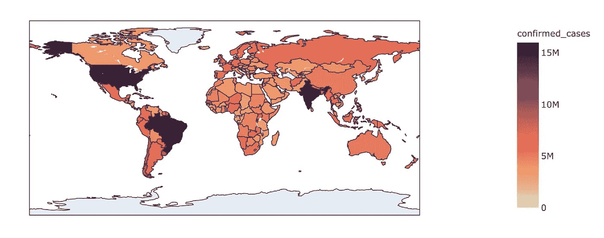

# 使用深度学习的新冠肺炎分析和预测

> 原文：<https://medium.com/analytics-vidhya/covid-19-analysis-and-forecasting-using-deep-learning-be154ef553bf?source=collection_archive---------11----------------------->

# 介绍

截至 2020 年 10 月，新冠肺炎疫情已在世界各地夺去了 100 多万人的生命，超过 4100 万人受到感染。了解影响病毒传播的因素和政策可以帮助政府做出明智的决定，以便在疫苗广泛可用之前控制感染和死亡。