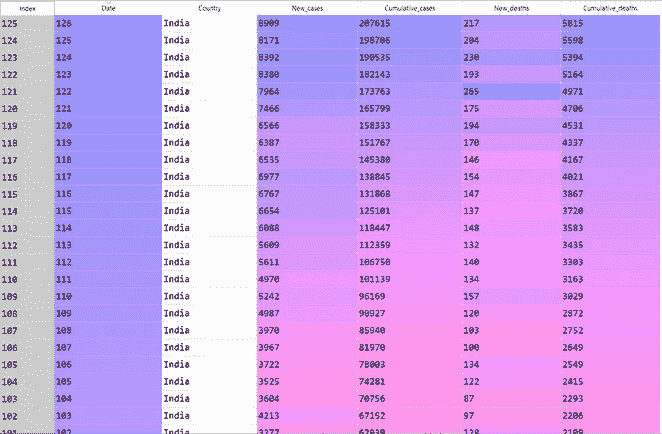

# 使用机器学习在印度进行新冠肺炎分析

> 原文：<https://medium.com/analytics-vidhya/covid-19-analysis-in-india-using-machine-learning-38919edb53b0?source=collection_archive---------22----------------------->

冠状病毒新冠肺炎疫情是我们这个时代决定性的全球健康危机，也是我们自二战以来面临的最大挑战。自从去年年底在亚洲出现以来，这种病毒已经扩散到除南极洲以外的每一个大陆。全世界的病例每天都在增加，印度也不例外。印度一直在通过检测和治疗患者、开展接触者追踪、限制旅行、隔离公民以及取消大型集会(如体育和宗教活动、音乐会和学校)来不断努力减缓病毒的传播。机器学习总是为我们的计划方式提供新的视角，并帮助我们预见各种情况，让国家和公民做好更好的准备。

它侧重于使用不同的回归模型对全国阳性病例和死亡人数的新上升进行建模，并使用 R 平方参数和绝对误差值比较它们的性能。然后，可以使用最佳回归模型来训练全国不同州的数据，并根据病例上升的速度来预测未来需要的病床数量。对患者数据集使用分类模型，如 K 最近邻、核 SVM 等。使用这些模型，我们预测给定一个新冠肺炎阳性患者，他的年龄和性别，他康复或死亡的概率是多少。

> **数据集**

来源:https://covid19.who.int/region/searo/country/in

该数据集用于建立不同的回归模型并比较它们的性能。它包含一些列，这些列包含有关每日新增病例和死亡的信息，以及病例数和死亡数的累积值。日期已转换为天数，第 1 天从 2020 年 1 月 30 日开始，第 126 天从 2020 年 6 月 3 日开始。使用的 Python 模块:Sklean，Pandas，Numpy。使用的回归模型:线性回归、多项式回归、支持向量回归、决策树回归、随机森林回归。

来源:https://www.mohfw.gov.in/

患者数据集，用于建立不同的分类模型，根据患者的性别和年龄预测患者康复的几率，并比较不同模型的性能。使用的分类模型:逻辑回归、朴素贝叶斯、K 近邻、SVM、核 SVM、决策树分类和随机森林分类。

> 第一条:回归模型

## **线性回归**

线性回归试图通过将线性方程拟合到观察到的数据来模拟两个变量之间的关系。一个变量被认为是解释变量/自变量，另一个被认为是因变量。线性回归线具有形式为 **Y = a + bX** 的方程，其中 **X** 是解释变量或自变量，而 **Y** 是因变量。直线的斜率为 **b** ， **a** 为截距(当 **x** = 0 时 **y** 的值)。

让我们从导入库和数据集开始

将数据集分为训练集和测试集。测试集大小通常小于整个数据的 50%(小于 0.5)。这里我认为 20%是测试集的大小。在训练集上拟合模型，然后在测试集上比较其性能。

分析输出

r 的平方值= 0.4576186267429674

R-squared 在 0-100%范围内测量模型和因变量之间的关系强度。(0–1)该值越接近 1，预测就越准确。在这里，模型的表现极差。

## 多项式回归

多项式回归拟合 x 的值和 y 的相应条件均值之间的非线性关系。多项式回归的一般方程是> y = b0 + b1 x + b2 x^2 + ……。+ bn x^n.在我们的模型中，我们使用了 5 次多项式回归。

分析输出

r 平方值-

r 的平方值= 0.9877159855716007(非常接近 1，因此是一个很好的预测值)

## **决策树回归**

决策树以树结构的形式建立回归或分类模型。它将一个数据集分解成越来越小的子集，与此同时，一个相关的决策树被增量开发。最终结果是一个有决策节点和叶节点的树。

分析输出

r 的平方值= 0.911354267886

## **随机森林回归**

随机森林是一种集成技术，能够通过使用多个决策树和一种称为 Bootstrap and Aggregation 的技术来执行回归和分类任务，通常称为 **bagging** 。这背后的基本思想是在确定最终输出时结合多个决策树，而不是依赖单个决策树。随机森林有多个决策树作为基本学习模型。这里，为了获得更好的性能，估计器的数量被认为是 10。

分析输出-

r 的平方值:0.9844844

结论

多项式回归在训练数据集和测试集上表现最佳，R 平方值为 0.9877，非常接近 1，因此对病例和死亡人数的上升做出了极好的预测。随机森林回归几乎具有相同的性能。R 平方值最小的线性回归表现最差。因此，对于未来估计所需的病床数量，应使用多项式回归或随机森林回归进行建模。

> **第二部分:分类模型**

患者数据集包含两个分类变量性别(男/女)和状态(死亡/康复)。这些分类变量首先使用 sklearn.preprocessing 的 OneHotEncoder 和 LinearEncoder 类进行编码。

这里 0 列和 1 列一起代表性别，其中 1 0 代表 F，0 1 代表 m。

类似地，患者的状态是康复还是死亡是分类变量，并且已经被编码，其中 0 表示死亡，1 表示康复的患者。

## **朴素贝叶斯分类**

朴素贝叶斯分类器是一种用于分类任务的概率机器学习模型。分类器的关键是基于贝叶斯定理。使用贝叶斯定理，该算法首先计算 2 个概率值

I)给定一个具有特征 x(在这种情况下是年龄和性别)的新数据点，这个人康复的概率是多少

ii)给定一个具有特征 x(在这种情况下是年龄和性别)的新数据点，该人无法恢复的概率是多少。

然后，它比较这两个概率，以决定新数据点将被分类到哪个组。

贝叶斯定理-

混乱矩阵-

准确度得分= 0.8

## **K 近邻分类**

在散点图中的所有数据点中，K 最近邻算法的工作方式是根据各种距离公式(如欧几里德距离、曼哈顿距离)选择给定数据点的“K”个最近邻，然后比较所有 K 个最近邻所属的类。获得多数邻居的类获胜，该类被分配给新的数据点。如果 k = 1，那么该对象被简单地分配给该单个最近邻的类。在我的模型中，我选择了 k 值为 10，并通过设置度量值为 minkowski 和 p 值为 2 来使用欧几里得距离。

混乱矩阵

准确度得分= 0.8

**内核 SVM 分类** 我已经为我的模型使用了高斯径向基函数。它的基本工作原理是将二维平面上非线性分布的点映射到由内核决定的三维平面，然后将包含分离点的二维投影映射回二维平面。在现实生活应用中，我们不会有简单的直线，但我们会有很多曲线和高维度。

混乱矩阵-

准确度得分= 0.72

## **逻辑回归分类**

当因变量为二分变量(二元变量)时，逻辑回归是进行回归分析的合适方法。在考虑的数据集中，因变量有 2 个值(死亡和恢复)，因此是二进制的。像所有回归分析一样，逻辑回归是一种预测分析。它使用由- y = e^(b0 + b1*x) / (1 + e^(b0 + b1*x)给出的 sigmoid 函数

混乱矩阵-

准确度得分= 0.82

结论

逻辑回归模型表现最好，准确率为 0.82，其次是朴素贝叶斯和 K 近邻分类。