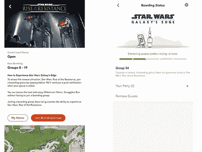
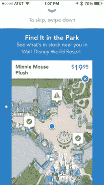

# Covid 19 和移动迪士尼世界应用程序。如何改进界面以适应当前环境

> 原文：<https://medium.com/analytics-vidhya/covid-19-and-the-mobile-disney-world-application-f943dc8ee1a0?source=collection_archive---------31----------------------->

今年夏天，在 Covid 19 危机期间，我一直在学习一门人机交互课程，作为我计算机科学硕士学位的一部分。随着迪士尼世界今天开始开放，重要的是要看看迪士尼在开发迪士尼世界移动应用程序方面的投资将如何改变持卡人的体验。在此期间，很明显迪士尼在移动开发上的投资获得了回报，并将成为他们未来的一个关键因素。该应用程序将成为帮助迪士尼度过新冠肺炎危机的关键支柱。

# 应用程序的背景知识，以及它如何在使用迪士尼乐园应用程序时增加限制或挑战

迪士尼世界移动应用程序中约束的使用允许应用程序界面适应用户所处的环境。应用程序中约束的一个示例是当您位于好莱坞电影制片厂公园时；你可以选择一个上升阻力的登机组(图 1)。该应用具有内置的约束，其中用户必须以电子方式被允许进入公园，并且物理上位于公园内，才能被添加到搭乘组以乘坐景点。公园外的用户不能获得登机组号码。

***图 1 —***
反抗组织登船界面示例

该应用程序的另一个考虑到约束的特性是，购物体验如何在整个应用程序中受到约束，这取决于您在寻找商品时所处的环境。迪士尼世界应用程序内置的购物体验将适应您所处的位置。如果你在迪斯尼世界之外，你会看到可以购买并运送给你的产品。当您在迪士尼度假区时，我们会为您提供产品，这些产品可以运送到您的度假酒店，只供迪士尼主题公园使用。当您在一个实体主题公园的环境中时，约束变得更加细化，您可以使用应用程序来定位产品所在的商店(图 2)。

***图 2—*** 公园功能中的产品示例

就在最近，一个新的约束被引入到应用程序中，要求在 Covid 19 危机期间保持社交距离。这种社会距离的要求影响了登机团体和虚拟排队控制人群的方式。迪斯尼世界应用程序内置的功能可以帮助分散人群和控制公园的人流。

# 如何对接口进行修改，以解决向前发展的新约束。

随着新冠肺炎的出现，我们为迪士尼世界应用程序引入了一个难以想象的约束。主题公园游客需要遵守社交距离要求和主题公园容量限制。需要对现有应用程序进行修改，以帮助解决这一限制。利用公园内的位置和将社交距离保持为最小的目标，可以修改应用程序界面，以允许在公园内虚拟排队乘车。可以为公园的不同部分添加登机组，以允许在指定时间访问公园的各个部分，通过应用程序控制用户体验和人群控制。通过在您的应用程序上显示登机牌，可以扫描登机牌让您进入公园的某些区域，利用登机组可以控制公园部分区域的容量。

当我们从用户在公园之外的上下文来看应用程序时，需要对门票的分发方式进行修改。通过应用程序的售票过程将需要修改，以控制门票分配，并允许到达时间得到控制。它将考虑尊重社会距离以及容量限制。票务的重新设计可能需要用户选择指定进入组的到达时间，这将允许迪士尼控制用户首次进入公园的方式。迪士尼可以借鉴类似的排队方法，如吉米·法伦的“今夜秀”观众队列，该队列通过引导用户进入场馆不同区域的门票和到达时间进行类似的管理。根据您在购买门票时确定的群组颜色，人们被移动到场地的不同部分，并最终到达他们需要的位置，同时为用户创造非常好的体验。