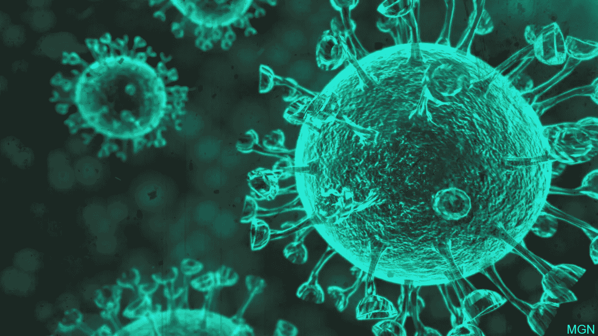

# 冠状病毒爆发及其流行情况。

> 原文：<https://medium.com/analytics-vidhya/covid-19-corona-virus-outbreak-and-its-prevailing-situation-aba563b12476?source=collection_archive---------26----------------------->

写这篇文章的目的是激励那些有潜力在数据科学方面为规范新冠肺炎疫情做出贡献的研究人员。这项研究的所有实验结果都是基于一个*的数据集，这个数据集在这个环节[就可以得到。](https://www.kaggle.com/sudalairajkumar/novel-corona-virus-2019-dataset/tasks?taskId=508&utm_medium=email&utm_source=intercom&utm_campaign=tasks-award-march-2020)*

> *请注意，目前我们确实有 2020 年 1 月 22 日至 2020 年 3 月 15 日期间的数据。*

# *新冠肺炎（新型冠状病毒肺炎）*

*截至今天，新冠肺炎已经影响了 160 多个国家，世界卫生组织(世卫组织)已经宣布其为全球疫情，原因是这种疾病的传播。在中国和中国以外的世界各地，已报告超过 189，000 例病例，超过 7500 例死亡。*

# *受影响最大的国家*

*新冠肺炎疫情最严重的前 10 个国家可以列为 ***中国、义大利、伊朗、西班牙、南韩、德国、法国、美国、瑞士和挪威*** 确诊病例超过 16 万例，死亡人数超过 7000 人。虽然这种病毒的来源是中国-胡白，但现在中国以外已经报告了更多的新确诊病例。*

*下表显示了排名前 10 位的国家的统计数据，以便按从高到低的顺序分析确诊病例、痊愈病例和死亡人数。*

*****

图 1 统计数据较高的前 10 个国家* 

*尽管就确诊病例而言，10 个国家已被确定为受影响最严重的国家，但痊愈和死亡病例的顺序并不相同，如图 1 所示。尽管中国在每个类别的所有最高统计数据中占据主导地位，但可以从意大利观察到第二高的死亡人数，而伊朗也获得了相同的痊愈人数。*

# *基于确诊病例的分组痊愈率和死亡率。*

*已根据确诊病例的数量计算出痊愈和死亡病例，并将其分为以下 5 组，以便以分类方式确定疫情的模式。*

1.  *不到 50*
2.  *50–150*
3.  *150–500*
4.  *500–1000*
5.  *1000 以上*

## *回收比率汇总*

*以下结果说明了根据上述类别基于确诊病例的已恢复病例的比率。*

**

*图 2 确诊病例≤ 50 时的治愈率。*

*当确诊病例少于 50 例时，澳门、直布罗陀和尼泊尔的治愈率记录为 100%，因为除澳门外，这些国家仅发现一例确诊病例，如图 2 所示*

**

*图 3 50-150 岁确诊病例的治愈率。*

*如图 3 所示，在 50-150 的范围内，香港报告的最高康复率为 145 名患者中有 82 名康复，平均有 12 名康复病例。*

**

*图 4 150-500 确诊病例的治愈率。*

*然而，这个平均值在 150- 500 的范围内减少到 7。此外，新加坡在 150-500 的范围内以 46%的回收率位居第一。*

***

图 5 确诊病例在 500–1000 或> 1000 时的治愈率。* 

*当确诊病例超过 1000 例时，中国以 83%的最高百分比成为治愈率第一名。虽然超过 40%的确诊病例来自中国，但在中国也可以看到最高的康复趋势。在 2200 例确诊病例中，只有 4 例在瑞士治愈，这导致 1000 多个类别的治愈率非常低。*

## *死亡比率汇总*

*********

图 6 基于确诊病例的死亡比率模式。* 

*根据每个类别的死亡率，死亡病例的最低平均值记录在 150-500 范围内，最小标准偏差为 0.02，而超过 1000 类别的平均值最高。在不到 50 岁的人群中，苏丹的死亡比例最高，因为唯一的确诊病例是一例死亡。然而，在伊拉克获得最高值的所有其他类别中，死亡率都很低，尽管低至 9%。虽然中国的死亡人数较高，但按比例来说，它低于意大利和伊朗，这清楚地表明了中国如何在医疗稳定性和医疗意识方面控制如此庞大的人口中的病毒。*

# *摘要*

*总体而言，每个类别的回收率接近 50%或以上，但可以观察到死亡比率的显著变化。当确诊病例较少时，死亡比率略高。当确诊病例数小于 150 和 50 时，标准差和均值相对较高。因此，在这一范围内出现确诊病例的国家应提高警惕。*