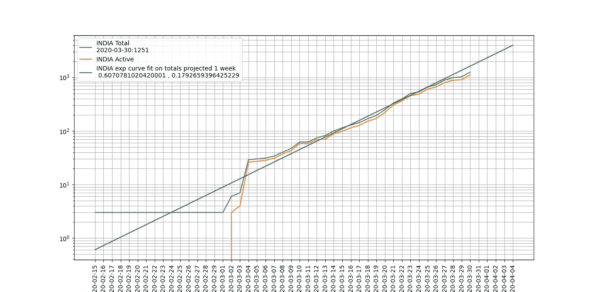

# 新冠肺炎曲线拟合和未来预测

> 原文：<https://medium.com/analytics-vidhya/covid-19-curve-fitting-and-future-projections-a4ffdb2e17e7?source=collection_archive---------17----------------------->

从这里的文章[继续](/@vaibhavgarg1982/charting-spread-of-covid-19-using-worldometers-info-data-6a918969c324)，让我们试着预测未来。

基于从 worldometers.info 网站上各个国家页面的 html 中抓取的数据，我们想知道最适合的*曲线，并推断未来。让我们看看这是如何工作的:*

```
import requests
import matplotlib.pyplot as plt
from scipy.optimize import curve_fit
import numpy as np
from datetime import datetime, timedeltadef test(x, a, b): 
    return a * np.exp(b * x)plt.rcParams["figure.figsize"] = (20,10)
countries = ['india']
for country in countries:
    data = requests.get("[https://www.worldometers.info/coronavirus/country/](https://www.worldometers.info/coronavirus/country/)"+ country)
    data = data.text
    active = data[data.find("data: [")+len("data: ["):data.find("]", data.find("data: [")+len("data: ["))]
    tot = data[data.find("data: [", data.find("name: \'Cases\'"))+len("data: ["):data.find("]", data.find("data: [", data.find("name: \'Cases\'"))+len("data: ["))]active = [int(i) for i in active.split(',')]
    tot = [int(i) for i in tot.split(',')]
    print(active)
    print(tot)dates = data [data.find("categories: [")+len("categories: [") : data.find("]" , data.find("categories: [")+len("categories: ["))]
    dates = [date for date in dates.split(",")]print(len(tot))#use only the exponential part to fit the curve, not the whole data
    finish = 40
    start = 0
    span = finish-start
    param, param_cov = curve_fit(test, np.linspace(0, span-1, span) , tot[start:finish])

    clean_dates = [datetime.strptime(str(date) + " 2020", '\"%b %d\" %Y') for date in dates]
    plt.plot(clean_dates, tot ,  label = country.upper() +" Total \n" + clean_dates[-1].strftime('%Y-%m-%d') + ":" + str(tot[-1]))
    plt.plot(clean_dates, active ,  label = country.upper() +" Active" )
    lobf = []
    cleandates_lobf = []for i in range(len(tot)+5):
        lobf.append(test(i, param[0], param[1]))
        cleandates_lobf.append(min(clean_dates)+ timedelta(days = i))print(lobf)
    plt.plot(cleandates_lobf, lobf, label = country.upper() + " exp curve fit on totals projected 1 week \n " + str(param[0]) + " , " + str(param[1]))plt.legend()
plt.grid(which = "both")
plt.yscale("log")
plt.xticks(rotation=90)
plt.xticks(cleandates_lobf)
plt.show()
```

让我们来看看代码的关键部分，以了解它是如何工作的:

# 曲线拟合

该功能

```
def test(x, a, b): 
    return a * np.exp(b * x)
```

定义指数函数的基本形式，由 *a* 和*b*参数化。我们需要找到最符合我们数据的值。为此，我们使用优秀的 scipy.optimize 库中的 [curve_fit](https://docs.scipy.org/doc/scipy/reference/generated/scipy.optimize.curve_fit.html) 函数。从文件上看，签名是:

> `scipy.optimize.**curve_fit**` ( *f* ， *xdata* ， *ydata* ， *p0=None* ， *sigma=None* ， *absolute_sigma=False* ， *check_finite=True* ， *bounds=(-inf* ， *inf)* ， *method=None* ，
> 
> 使用非线性最小二乘法将函数 f 拟合到数据。

这就是我们的功能*测试*的用武之地。我们在下面的代码中使用了相同的代码:

```
#use only the exponential part to fit the curve, not the whole data
    finish = 40
    start = 0
    span = finish-start
    param, param_cov = curve_fit(test, np.linspace(0, span-1, span) , tot[start:finish])
```

其中 tot 是要拟合的数据，np.linspace 生成要传递给函数的 x 值。

一旦我们有了参数，我们就用它们来预测未来 5 天

```
for i in range(len(tot)+5):
        lobf.append(test(i, param[0], param[1]))
        cleandates_lobf.append(min(clean_dates)+ timedelta(days = i))
```

瞧，我们得到了我们想要的。我们可以使用 matplotlib 绘制这些，我们得到:



模型参数和最新值位于图例中，以避免弄乱线条。