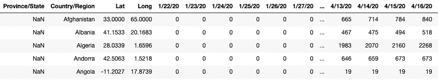
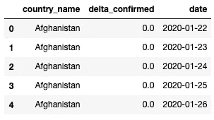
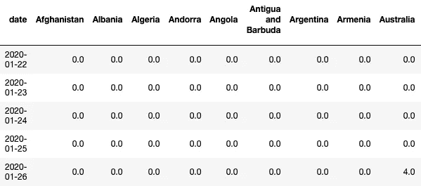

# 使用 Streamlit 的 Python 中的新冠肺炎仪表盘

> 原文：<https://medium.com/analytics-vidhya/covid-19-dashboard-in-python-using-streamlit-aa58581e5a7f?source=collection_archive---------7----------------------->

## 使用 Python 创建你自己的新冠肺炎跟踪器(如果像我一样，你总是希望用户界面看起来干净美观，还需要一点 HTML-CSS)

冠状病毒的爆发让整个世界陷入了停滞。这为我们提供了一个机会，去做我们一直想做却因为没有时间而不能做的事情。由于我对计算机的兴趣，我一直想创造一些在现实生活中真正有用的东西，并能产生影响。因此，在这个封锁期，当我学习数据分析和机器学习时，我想把我的技能付诸实践，开发一个仪表板，可以帮助人们提高意识，帮助他们了解疫情的强度，并激励他们呆在家里，帮助世界走出这个悲惨的时代。


在这篇博客中，我将带您浏览我在创建仪表板时遵循的完整过程。

要在进入流程之前查看最终结果，请查看下面的链接:

 [## 新冠肺炎-仪表板-赫塔夫-德赛

covid19dashboard-hetavdesai.herokuapp.com](https://covid19dashboard-hetavdesai.herokuapp.com/) 

# 步伐

1.  收集数据。使用可靠且经常更新最新数据的数据源。
2.  处理数据。根据分析需要组织数据。
3.  清理数据。删除不必要的、重复的和离群的数据。基本上任何种类的数据都有可能在分析中产生错误。
4.  分析数据。从数据中创建有意义的可视化。
5.  以易于阅读和理解的方式呈现分析的解释。

# 使用的包

1.  熊猫——分析和处理数据
2.  NumPy —使用数组并执行基本的数学运算
3.  创造视觉效果
4.  Streamlit —增加交互性，并以仪表板格式呈现可视化效果

```
import pandas as pd
import numpy as np
import plotly.graph_objects as go
import streamlit as st
```

# 数据收集

我在他们定期更新的 GIT 存储库上使用了约翰·霍普斯金大学 CSSE 发布的数据集。下面是[环节](https://github.com/CSSEGISandData/COVID-19)。

pandas 库中的`read_csv()`函数用于将`.csv`数据读入数据帧。

```
death_df = pd.read_csv('https://raw.githubusercontent.com/CSSEGISandData/COVID-19/master/csse_covid_19_data/csse_covid_19_time_series/time_series_covid19_deaths_global.csv')confirmed_df = pd.read_csv('https://raw.githubusercontent.com/CSSEGISandData/COVID-19/master/csse_covid_19_data/csse_covid_19_time_series/time_series_covid19_confirmed_global.csv')recovered_df = pd.read_csv('https://raw.githubusercontent.com/CSSEGISandData/COVID-19/master/csse_covid_19_data/csse_covid_19_time_series/time_series_covid19_recovered_global.csv')country_df = pd.read_csv('https://raw.githubusercontent.com/CSSEGISandData/COVID-19/web-data/data/cases_country.csv')delta_df = pd.read_csv('https://raw.githubusercontent.com/CSSEGISandData/COVID-19/web-data/data/cases_time.csv', parse_dates=['Last_Update'])
```

让我们来看看这些数据帧的结构。`confirmed_df.head()`给出以下输出。



数据框由从 1 月 22 日到当前日期的列组成。其他三个数据帧的结构与此类似。

# 数据处理和清理

让我们把所有的列名都转换成小写，这样更容易访问它们。此外，我们将把`Province/State`转换为`state`，把`Country/Region`转换为`country`，以获得更好的可访问性。

```
country_df.columns = map(str.lower, country_df.columns)confirmed_df.columns = map(str.lower, confirmed_df.columns)death_df.columns = map(str.lower, death_df.columns)recovered_df.columns = map(str.lower, recovered_df.columns)delta_df.columns = map(str.lower, delta_df.columns)confirmed_df = confirmed_df.rename(columns={'province/state': 'state', 'country/region': 'country', 'lat': 'lat', 'long': 'lon'})recovered_df = recovered_df.rename(columns={'province/state': 'state', 'country/region': 'country'})death_df = death_df.rename(columns={'province/state': 'state', 'country/region': 'country'})country_df = country_df.rename(columns={'country_region': 'country'})delta_df = delta_df.rename(columns={'last_update': 'date', 'country_region': 'country_name'})
```

# 数据分析

既然我们已经从可靠的来源获得了频繁更新的数据，并将其转换为易于访问的格式，那么让我们开始分析这些数据。

## 计算全球确诊、死亡和康复病例总数

`country_df`列有每个国家的确诊、死亡和康复病例。对每个国家的各个案例求和(即各个列中的值求和)，得出全球各个案例的总数。

```
confirmed_total = int(country_df['confirmed'].sum())
deaths_total = int(country_df['deaths'].sum())
recovered_total = int(country_df['recovered'].sum())
```

## 在各种情况下计算当天的增加/减少

`confirmed_df`、`death_df`和`recovered_df`最后一列中的值之和给出了当天相应病例的总数。

```
confirmed_df[confirmed_df.columns[-1]].sum()
death_df[death_df.columns[-1]].sum()
recovered_df[recovered_df.columns[-1]].sum()
```

并且，`confirmed_df`、`death_df`和`recovered_df`的倒数第二列中的值之和给出了前一天相应病例的总数。

```
confirmed_df[confirmed_df.columns[-2]].sum()
death_df[death_df.columns[-2]].sum()
recovered_df[recovered_df.columns[-2]].sum()
```

将各种情况下的这两个值相减，得到各种情况下美国当天的增加或减少。

```
confirmed_today = int(confirmed_df[confirmed_df.columns[-1]].sum() - confirmed_df[confirmed_df.columns[-2]].sum())death_today = int(death_df[death_df.columns[-1]].sum() - death_df[death_df.columns[-2]].sum())recovered_today = int(recovered_df[recovered_df.columns[-1]].sum() - recovered_df[recovered_df.columns[-2]].sum())
```

## 显示病例数最多的 20 个国家的表格

我们将在表格中显示国家名称、最后更新时间、确诊病例、死亡病例和必需病例。`country_df`具有将在表格中显示的所需数据。让我们从中提取所需的数据。

```
country_stats_df = 
country_df[[‘country’, ‘last_update’,’confirmed’, ‘deaths’, ‘recovered’]].sort_values('confirmed', ascending=False)
             .reset_index(drop=True)
             .head(20)
```

这将从`country_df`中提取所需的列，按照已确认病例的降序对表格进行排序，并将前 20 行返回到名为`country_stats_df`的新数据框中

现在我们已经有了需要在表中显示的确切数据，我们将为它添加一些样式，使它更具可读性和更容易解释。我们将把死亡病例列的字体颜色改为红色，恢复病例列的字体颜色改为绿色。

```
def highlight_col(x):
  red = 'color: #e73631'
  black = 'color: #000'
  green = 'color: #70a82c'
  df1 = pd.DataFrame('', index=x.index, columns=x.columns)
  df1.iloc[:, 2] = black
  df1.iloc[:, 3] = red
  df1.iloc[:, 4] = green
  return df1
```

我们将数据帧`x`传递给函数，并将其复制到`df1`。函数中定义了三种颜色。`iloc`功能用于选择数据框中的行和列。第一个参数用于选择行，第二个参数用于选择列。使用`:`作为参数表示所有的行/列都被选中。

在上面的函数中，为索引为 2、3 和 4 的列的所有行分配各自的颜色。

让我们将这种样式应用到我们的数据框，并将其传递给 Streamlit 库的`st.table()`函数，以显示表格。

```
st.table(country_stats_df.style.apply(highlight_col, axis=None).set_properties(**{‘text-align’: ‘left’, ‘font-size’: ‘15px’}))
```

## 为病例数最多的 10 个国家创建条形图竞赛

一个名为“繁荣工作室”的在线工具让创建条形图竞赛变得非常容易。我们需要做的就是将一个`.csv`文件加载到工具中，并选择哪一列用作 Y 轴上的标签，哪一列用作 X 轴上的值。下面这段代码可以用来将数据导出到名为`latest_confirmed.csv`的`.csv`文件中，这是 fluorescent Studio 所要求的。

```
latest_confirmed = confirmed_df.groupby(['Country/Region']).sum()
latest_confirmed.to_csv('latest_confirmed.csv')
```

[链接到兴旺工作室。](https://app.flourish.studio/)

# 特定国家的统计数据

## 为国家选择创建下拉列表

`list_all_countries = list(confirmed_df[‘country’].unique())`创建我们拥有数据的所有国家的列表。

`country_name = st.selectbox(‘’, list_all_countries, 71)`用于创建下拉列表。从下拉列表中选择的任何值都被分配给`country_name`。

`st.selectbox()`接受 3 个参数。下拉列表的标签、下拉列表的值列表和默认值的索引。我将 71 作为默认值指数，因为它是印度的指数值。

## 计算选定国家的确诊、死亡和康复病例总数

首先，我们从`confirmed_df`、`death_df`和`recovered_df`创建三个新的数据帧，其中仅包含特定国家的数据。

然后，我们计算所有三种情况下的当天总计、前一天总计及其当天变化的差异(与之前对世界数据所做的完全一样)。

## 绘制选定国家的确诊、死亡和康复病例趋势图

我们将选定的国家作为参数传递到函数中。标签、颜色、标记尺寸和线条尺寸根据每种情况进行定义。

X 轴的标签是日期，即从 index=4 开始的列，Y 轴上绘制的值是这些列中所选国家值的总和。

由于我们在`df_list`中有 3 个数据帧，for 循环对所有 3 个数据帧运行，在每次迭代结束时绘制相应情况的图形。

## 绘制选定国家确诊病例数的每日增长图

我们将使用`delta_df`来绘制每日确诊病例数的增加情况。

我们首先从`delta_df`中提取所需的列:

```
delta_df = delta_df[['Country_Region', 'Delta_Confirmed', 'Last_Update']]
```

`delta_df`目前的结构如下图所示:



delta_df 的结构

这种结构对创造任何情节都毫无用处。我们要么需要日期作为列，要么需要日期作为索引，反之亦然。因此，我们将根据需要旋转桌子。我们将日期设置为索引，国家名称设置为列。

```
delta_pivoted_df = delta_df.pivot_table(index='date', columns='country_name', values='delta_confirmed', aggfunc=np.sum)delta_pivoted_df.reset_index(level=0, inplace=True)
```

`delta_df`重组后，如下图所示:



改变了 delta_df 的结构

我们添加了一个名为“世界”的新列，其中包含所有国家的确诊病例总数。

```
delta_world_df['World'] = delta_pivoted_df[delta_pivoted_df.columns].sum(axis=1)
```

现在，我们可以使用此数据框绘制一个条形图，其中日期列中的值构成 X 轴，所选国家/地区列中的值构成 Y 轴。

# 结论

为了让它简单易懂，我把重点放在了项目的数据科学方面。使用 HTML 和 CSS (Bootstrap)的设计部分不在本博客讨论。你可以在这里查看[的源代码。](https://github.com/desaihetav/Streamlit-COVID-19-Dashboard/blob/master/app.py)

非常感谢您阅读这篇文章，如果您发现它有用，请与您的朋友或任何可能从中受益的人分享。

*在* [*Twitter*](https://www.twitter.com/desaihetav) *，*[*LinkedIn*](https://www.linkedin.com/in/desaihetav/)*或*[*insta gram*](https://www.instagram.com/desaihetav/)*上与我取得联系。*