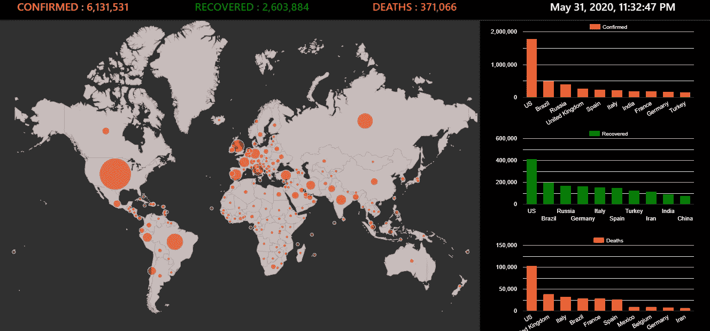
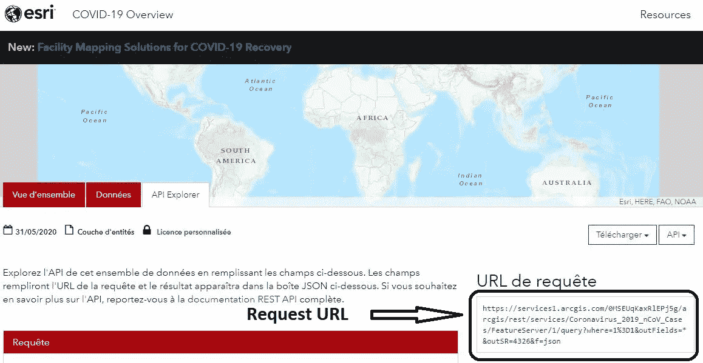
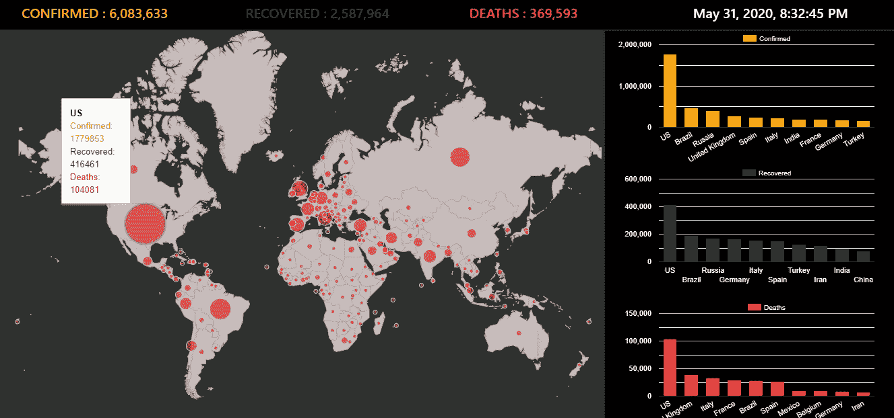
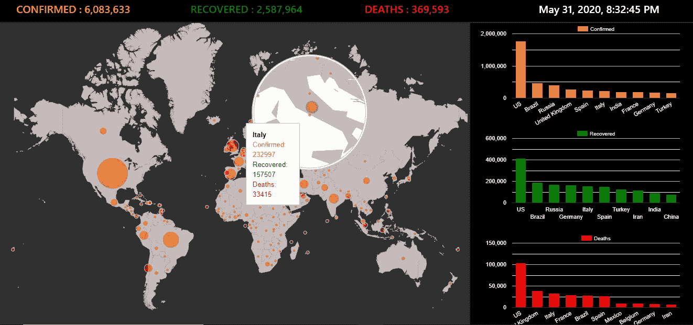
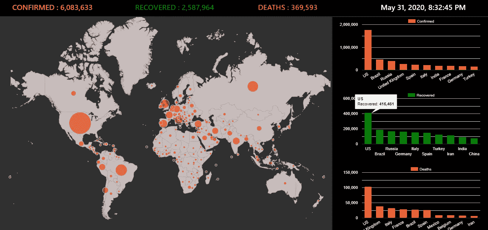

# 使用角度和谷歌图表的 Covid 19 仪表板

> 原文：<https://medium.com/analytics-vidhya/covid-19-dashboard-using-angular-and-google-charts-a61f15593bc3?source=collection_archive---------19----------------------->

新冠肺炎仪表板

在封锁期间，我致力于开发一个 web 应用程序，该应用程序提供有关世界各地疫情的实时数据。这个应用程序是基于角度技术和谷歌图表。该应用程序包括一个仪表板，在地图上显示每个国家的新冠肺炎数据，以及其他图表，列出十个受影响最严重的国家。在这篇文章中，我将介绍应用程序开发的主要步骤。

# **采集新冠肺炎数据**

要开发实时应用程序，需要使用更新的数据源而不是静态数据源。我的源代码是一个使用 http 请求和响应提供数据的 web 服务。

许多 web 服务器可用于导入新冠肺炎数据。我采用了 [Esri](https://coronavirus-resources.esri.com/datasets/bbb2e4f589ba40d692fab712ae37b9ac_1/geoservice?geometry=34.182%2C-38.069%2C-16.794%2C63.033&orderBy=Country_Region&selectedAttribute=Confirmed&where=Last_Update%20%3E%3D%20TIMESTAMP%20%272020-02-23%2000%3A00%3A00%27%20AND%20Last_Update%20%3C%3D%20TIMESTAMP%20%272020-04-25%2023%3A59%3A59%27) web 服务，数据每天更新。

# **谷歌图表**

Dashboard 是一种以交互方式呈现某些数据的主要发现的方法。它需要结合多种类型的图表(条形图、饼图、地图……)来突出数据特征。

Google charts 是强大的工具，允许使用多种类型的图表构建交互式仪表板。

# 主要依赖关系

*   角度 CLI 9
*   角度 9
*   自举 4

# **从 Github 下载源代码**

由于我在本文中没有展示完整的代码，我提供了源代码，您可以从我的 Github 库 [**下载。**](https://github.com/khaled-kch/coviddashboard)

# **新冠肺炎仪表板开发**

## 步骤 1:创建角度项目

在创建 angular 项目之前，确保您已经使用 **npm** 包管理器安装了 **Angular CLI** 。完成后，您可以通过键入下面的命令来创建项目。

→ ng 新型 covid 19 仪表板

## 步骤 2:创建新冠肺炎数据服务

正如我上面提到的，我使用 web 服务下载新冠肺炎数据。事实上，我在我的 angular 项目中创建了一个新服务，实现了一个向 [Esri](https://coronavirus-resources.esri.com/datasets/bbb2e4f589ba40d692fab712ae37b9ac_1/geoservice?geometry=34.182%2C-38.069%2C-16.794%2C63.033&orderBy=Country_Region&selectedAttribute=Confirmed&where=Last_Update%20%3E%3D%20TIMESTAMP%20%272020-02-23%2000%3A00%3A00%27%20AND%20Last_Update%20%3C%3D%20TIMESTAMP%20%272020-04-25%2023%3A59%3A59%27) 服务器发送 HTTP 请求的方法。访问网站复制使用的网址。

Esri 请求 URL

以下简称 covid 数据服务[**covid-data . service . ts**](https://gist.github.com/khaled-kch/7886b36ad6c1f3bb413cfb6d6bef473b):

[covid-data.service.ts](https://gist.github.com/khaled-kch/7886b36ad6c1f3bb413cfb6d6bef473b)

## 第三步:整合谷歌图表

要使用 Google Charts，一个必要的步骤是在 index.html 文件中包含 **gstatic** 库。

index.html

完成后，我创建了组件 **g-chart.component** ，它有四个输入(类型、数据、元素 Id、数据)。该组件在一个 id 为 elementId 的 HTML 元素上显示图表。

我在 g-chart.component 内部注入了一个服务，该服务实现所请求的方法来绘制一个特定的图表，如下所示。

[g-chart.component.ts](https://gist.github.com/khaled-kch/d5dc4ef8c7a6c25d24e3a7fd45738c80)

[g 图表.组件。](https://gist.github.com/khaled-kch/d5dc4ef8c7a6c25d24e3a7fd45738c80) html

现在让我们解释一下 **GoogleChartService** 的作用。

首先，我将详细介绍如何用 javascript 创建 google 图表。

要绘制谷歌图表，我们需要遵循 3 个步骤:
1。加载所需的包
2。通过传递一个绘制函数
3 来调用 setOnLoadCallback 方法。创建绘图功能

draw 函数必须包括以下元素:
-数据和选项对象
-通过传递 HTML 元素 id 创建的图表对象，其中图表将被显示
-调用方法 chart.draw(data，options)

查看以下示例，了解如何用 javascript 创建 google 图表。

[Google-typical-chart . js](https://gist.github.com/khaled-kch/15dfac2ffd877c9f92da1359ed251047)

上面提到的步骤在服务 **GoogleChartService** 内部实现，该服务从服务**Google chartservice 扩展而来。**父类定义了创建 google 图表的所有步骤，除了在子类中执行的图表对象定义。

以下是每项服务的代码。

[谷歌图表服务](https://gist.github.com/khaled-kch/f6aeb918f7b43c27f318398ce268320b#file-google-chart-service-ts)

[Google-chart-base . service . ts](https://gist.github.com/khaled-kch/eba363c27502164f6cc0b1d242107ad7)

## 步骤 4:创建主组件

在这个阶段，我创建了可以导入新冠肺炎数据和绘制图表的服务。现在，我将展示将使用这些服务并显示 HTML 页面的主要应用程序组件。

我已经使用 bootstrap 库构建了应用程序组件，如下面的代码所示。

app.component.html

**app.component.html**文件包括四个**GChartComponent**s:
1。**【地理图表】**显示数据图
2。第一个**“柱形图”**显示确诊病例最多的前 10 个国家
3。第二个**“柱形图”**显示恢复案例最多的前 10 个国家
4。第三个**“柱形图”**显示死亡率最高的前 10 个国家

在文件 **app.component.ts** 中，我创建了显示四个图表和全局指示器对象所需的数组。

为了绘制地理图表，我创建了一个包含 4 列的数据数组。
1。国家纬度:编号
2。国家经度:数字
3。确诊病例:编号
4。工具提示:HTML
国家地理数据(纬度，经度)从一个单独的文件 **country-coords.ts** 导入。

为了绘制柱形图，我创建了三个包含前 10 个受影响国家的数组。每个数组由两列组成。
1。国家名称:字符串
2。案例号:编号

我还在 app.component.ts 中定义了用于每个图表的选项。此后，用于 geochart 的选项。

地理图表-选项

为了让这篇文章足够短，我没有解释 **app.components.ts** 的一些细节。如果你有任何问题，请发表评论让我知道。

# 新冠肺炎仪表板用户体验

工具提示

要查看单个国家的新冠肺炎，我们可以将光标放在显示确诊、康复和死亡病例的国家标记上。

放大和工具提示

一些区域叠加了许多标记。在这种情况下，当光标经过它们时，显示区域的缩放，这使得选择特定标记变得容易。

柱形图注释

上图显示了将光标放在柱形图上时发布的注释。注释显示国家和值。

# 最后的想法

在这个应用程序中，我注意到 Angular 技术是多么灵活，它使得创建可重用的组件变得容易。此外，我可以试验谷歌图表，允许建立交互式仪表板。

为了使 dashboard 实时，我使用了 web 服务驱动的数据。这是使用 HTTP 请求和角度观测值执行的，它们将新冠肺炎数据传递给应用程序组件。

我希望这篇文章能帮助您回答一些关于所用技术的问题，并启发您构建其他有趣的仪表板。

# 参考

1.  [https://developers.google.com/chart](https://developers.google.com/chart)
2.  https://coronavirus-resources.esri.com/