# 新冠肺炎数据分析

> 原文：<https://medium.com/analytics-vidhya/covid-19-data-analysis-e9cb652e8c10?source=collection_archive---------8----------------------->

## 新冠肺炎疫情数据的可视化和预测

新型冠状病毒结构结构(来源:[CC 许可下的科学动画](https://www.scientificanimations.com/wiki-images/)

# 介绍

新冠肺炎疫情也称为冠状病毒疫情是正在爆发的冠状病毒疾病(新冠肺炎)。它是由一种名为[严重急性呼吸综合征冠状病毒 2](https://en.wikipedia.org/wiki/Severe_acute_respiratory_syndrome_coronavirus_2)(SARS-CoV-2)的冠状病毒引起的。

2019 年 12 月在中国[武汉](https://en.wikipedia.org/wiki/Wuhan)发现疫情。世界卫生组织于 1 月 30 日宣布此次爆发为国际关注的突发公共卫生事件，并于 3 月 11 日宣布为疫情。

这是一种呼吸系统疾病，被认为主要通过人与人之间的密切接触，通过受感染者的呼吸道飞沫传播。被感染的人通常有生病的症状。一些没有症状的人可能会传播病毒。人们也可能通过触摸被污染的表面，然后触摸他们的脸而被感染。

常见症状包括发烧、咳嗽、疲劳、呼吸急促和嗅觉丧失。并发症可能包括肺炎和急性呼吸窘迫综合征。从接触到出现症状的时间通常在 5 天左右，但也可能在 2 到 14 天的范围内。没有已知的疫苗或特定的抗病毒治疗。主要治疗是对症和支持疗法。

这个博客展示了对新冠肺炎·疫情数据的分析、可视化和预测。

本分析分为三个部分:

1.  数据准备
2.  形象化
3.  预言；预测；预告

要跟进，请查看我的 [GitHub](https://github.com/chaitanyakasaraneni/covid19_analysis) 档案中的代码。

# 数据准备

由于网上有许多可用的数据源，本博客中使用的数据源由[约翰霍普金斯大学系统科学与工程中心(JHU CSSE)](https://github.com/CSSEGISandData/COVID-19) 提供。*这些数据每天都会更新，对于当前的可视化，请运行笔记本。*

由于数据每天更新，为了方便起见，不用下载文件，而是直接从网上下载。

从在线来源加载数据

加载数据后，出于可视化和预测的目的，数据基于列进行排序并存储到列表中。

将数据存储到各种数据结构中，用于可视化和预测

在不同的列表中，一个用于存储死亡率，另一个用于存储恢复率。

死亡率可以定义为记录的死亡人数与记录的病例总数之比，使用以下公式计算:

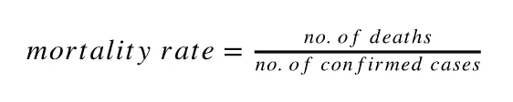

死亡率公式

康复率可定义为记录的康复患者人数与记录的病例总数之比，其计算公式如下:

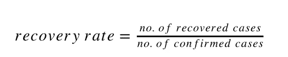

回收率公式

现在，随着数据被分类到不同的列表中并存储，是时候进行可视化了。

# 形象化

当数据被加载、准备和存储时；首先绘制全球统计数据。这里使用的数据是从 2020 年 1 月 22 日记录的(并且每天都在更新)。

## 全球统计

让我们从显示所有案例总体情况的两个图表开始。

这些图像与 2020 年 5 月 5 日更新的数据相关。

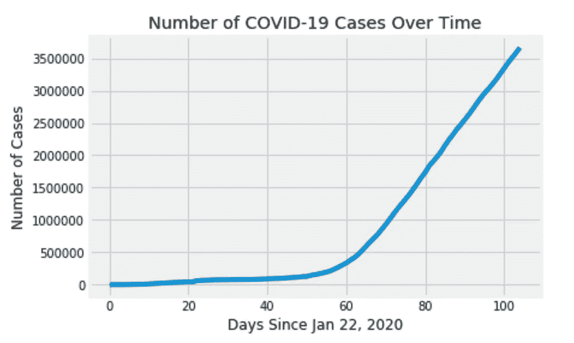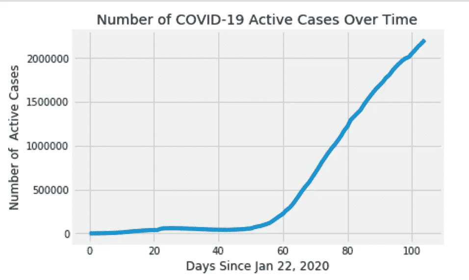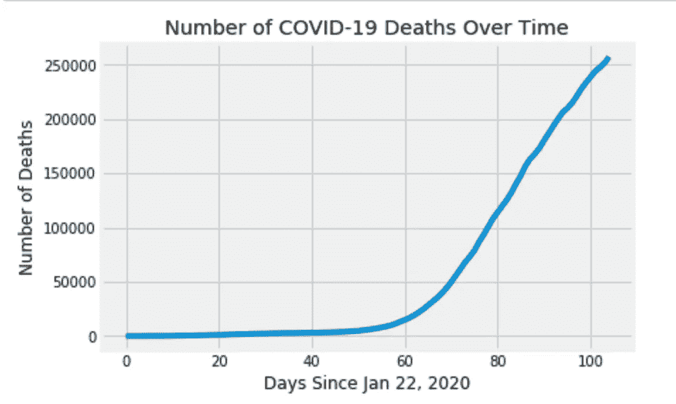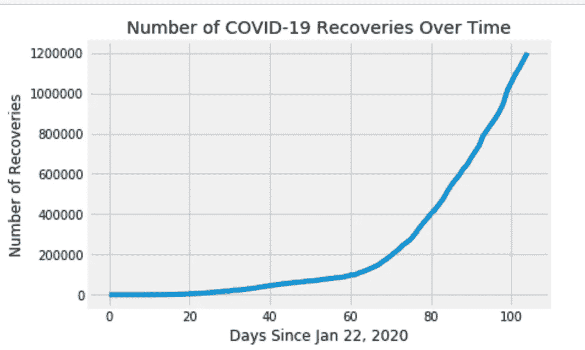

全球图(a)总病例数(b)当前活跃病例数(c)死亡数(d)恢复数

这就是疫情的样子，阳性病例和相关结果大幅增长，幸运的是死亡人数少于康复人数。

现在，让我们来看看每日计数的明细。

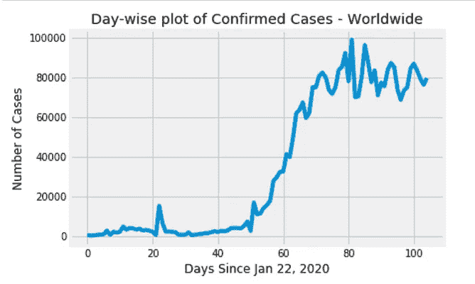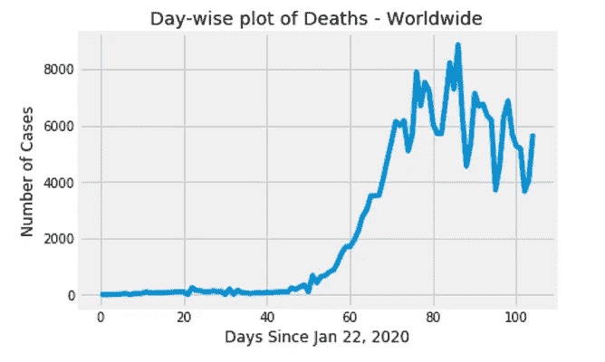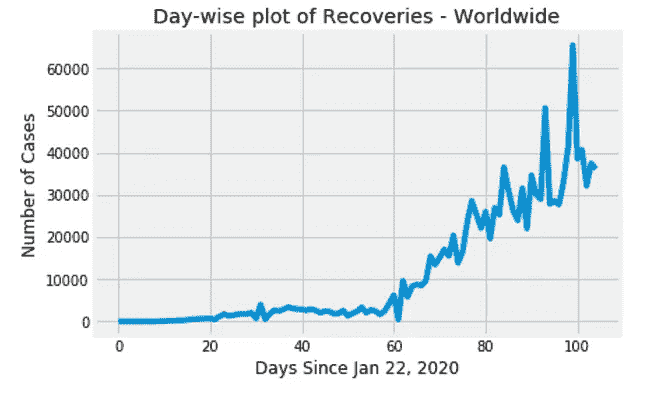

每日图表(a)确诊病例(b)死亡(c)恢复——全球

这表明病例和相对结果的每日增长是多么随机。让我们看看致命的新冠肺炎·疫情的死亡率和恢复率的变化。

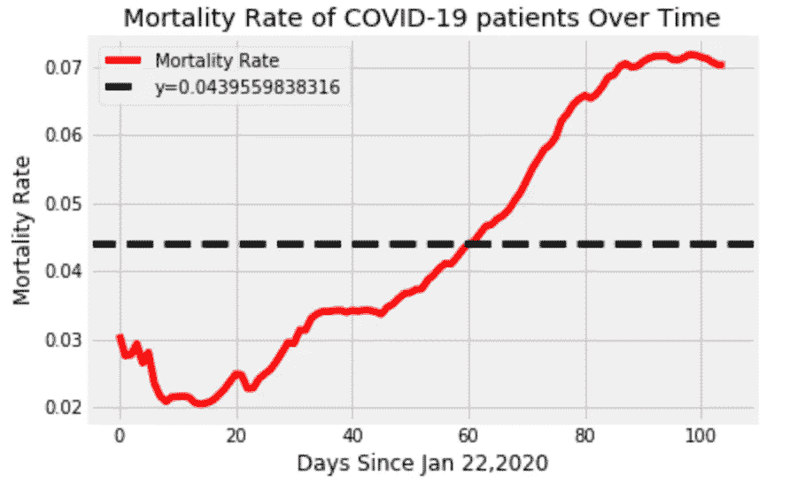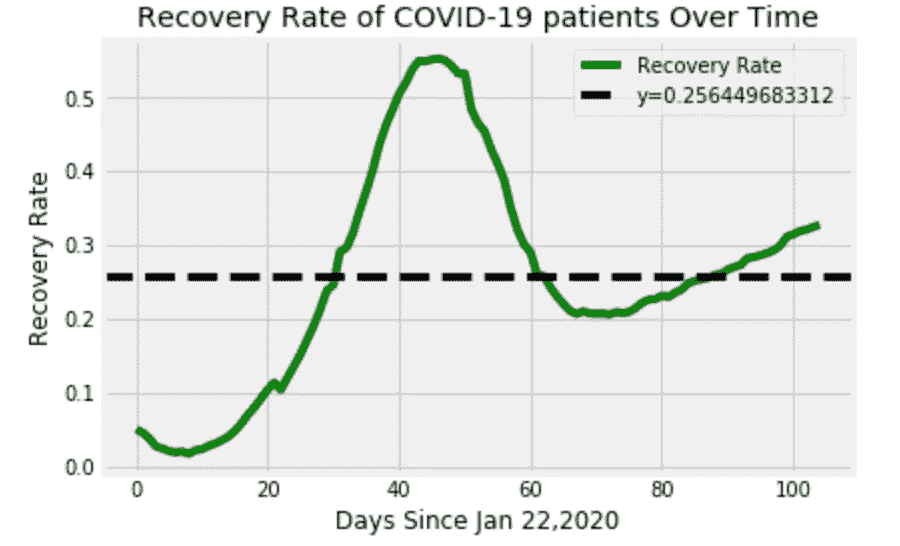

(a)新冠肺炎的死亡率(b)新冠肺炎的恢复率

现在，让我们绘制美国疫情数据。

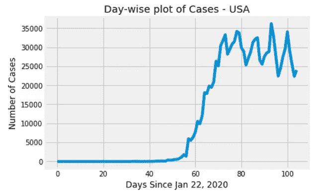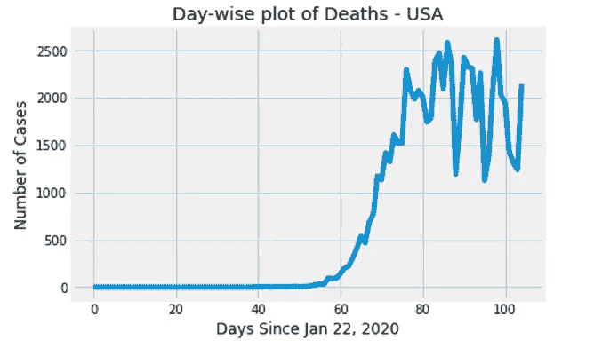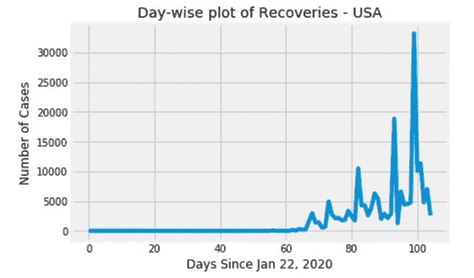

日间曲线图(a)确诊病例(b)死亡病例(c)恢复情况—美国范围

我们已经有了美国每日统计的图表，让我们看看确诊病例最多的前 10 个州/地区**。**其余状态被归入“其他”类别

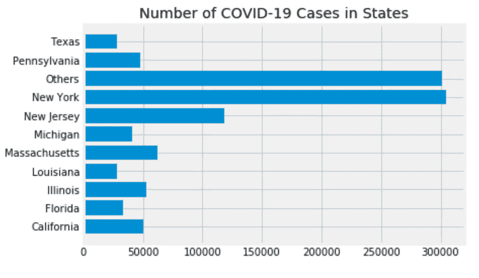

美国确诊病例最多的 10 个州

现在，我们开始预测未来的病例。

# 预言

在本节中，我们将使用 Python 的 scikit-learn 库的线性回归算法的变体来预测未来 15 天的病例数。

我们使用的第一个模型是基本的线性回归模型。

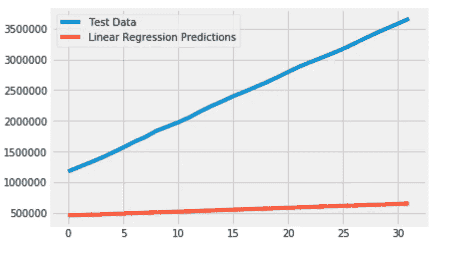

线性回归预测

从图中可以看出，基本线性回归模型的预测与试验数据相差甚远。

我们要尝试的下一个变体是多项式回归。也就是说，我们将特征转换成多项式特征。

为此，我们使用 scikit-learn 的多项式 Features 类。此类生成一个新的要素矩阵，该矩阵由阶数小于或等于指定阶数的要素的所有多项式组合组成。例如，如果输入样本是二维的并且形式为[a，b ]，则 2 次多项式特征为[1，a，b，a，ab，b]

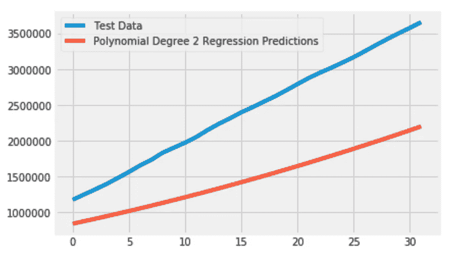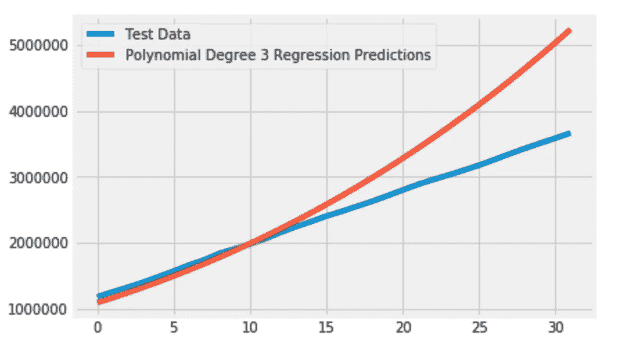

(a)二次多项式回归(b)三次多项式回归

可以看出，在三个模型中，3 次多项式回归对测试数据表现良好。但是，这个模型的未来预测是非常大的数字。因此，我们对 2 度和 3 度模型的多项式回归预测进行平均。

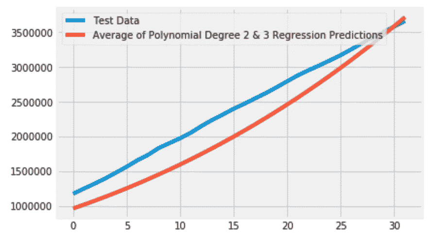

二次和三次多项式回归模型的平均值

三种算法的未来预测和多项式模型的平均值可以在下图中看到。

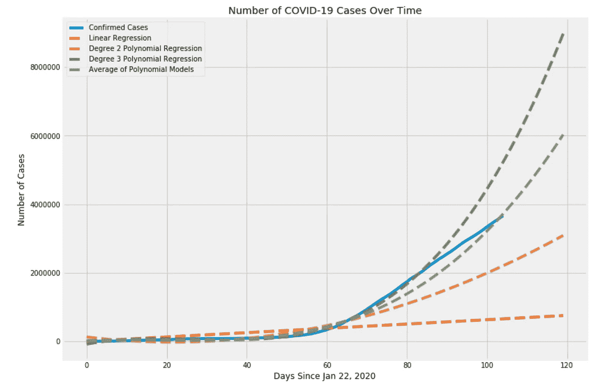

全球新冠肺炎病例的未来预测

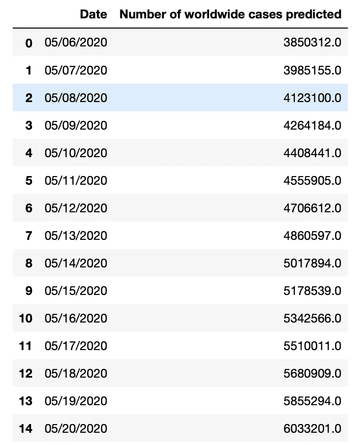

平均模型预测的病例数

***注:*** *这只是一个简单的模型，结果并不准确。为了获得更准确的预测，请尝试使用其他回归或深度学习技术。*

# 摘要

在这篇文章中，我们讨论了新冠肺炎·疫情，并对约翰·霍普金斯大学提供的数据做了一些分析。

我们也看到了一些当前可用数据的可视化，并试图预测未来可能发生的病例数。

这些仅仅是可能的报告的简单例子，可以帮助更容易地理解正在发生的事情的规模。

有许多因素可以改变这些预测。数据的收集方式可能会影响预测，目前，在该数据集中，缺少一些有帮助的功能，如关于阳性、康复和死亡的年龄间隔的统计数据。

希望你通过阅读这篇文章获得了一些知识。

代码可以在我的 [GitHub](https://github.com/chaitanyakasaraneni/covid19_analysis) 配置文件中找到。