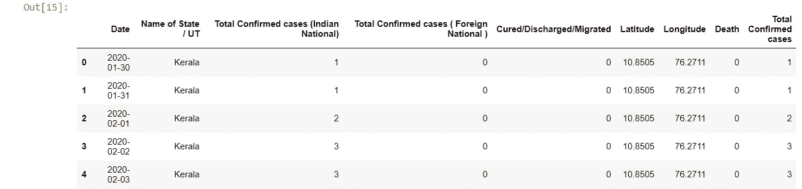
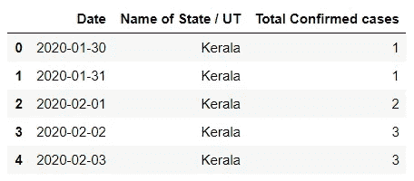
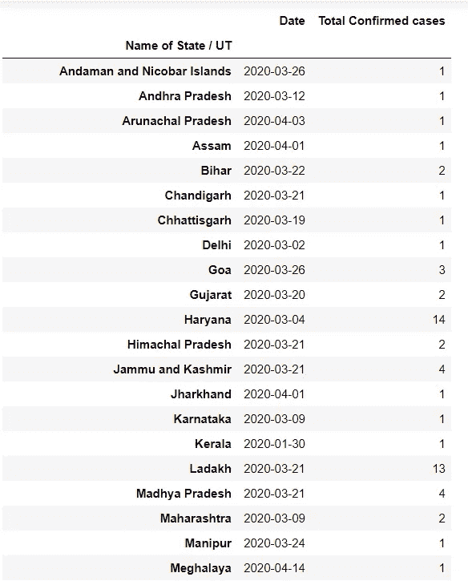
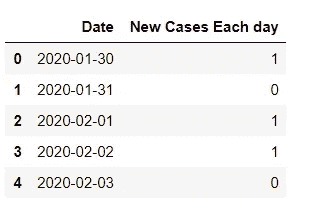
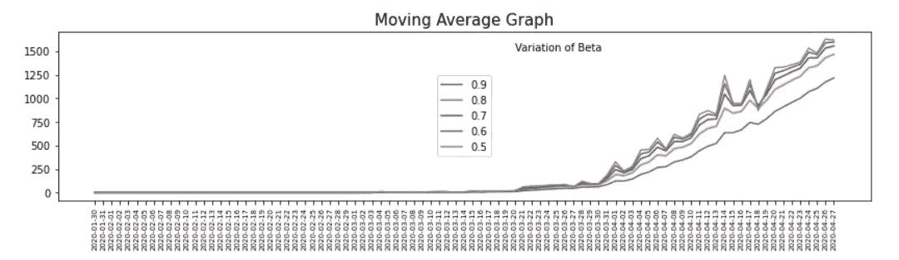

# 使用 Python 中的数据科学进行新冠肺炎数据分析

> 原文：<https://medium.com/analytics-vidhya/covid-19-data-analysis-using-data-science-in-python-fafdf0b2a0d4?source=collection_archive---------6----------------------->


> 作为我们知道**冠状病毒病 2019** ( **新冠肺炎**)是由严重急性呼吸综合征冠状病毒 2(新型冠状病毒)引起的传染病。

这场疫情已经造成了全球性的社会和经济混乱，包括自大萧条以来最大的全球性衰退。

在本文中，我们将使用 Python 和一些图形库来分析新冠肺炎数据，您可以预测新冠肺炎确诊病例的总数，还可以显示某个国家(本文以印度为例)在给定日期的总死亡人数。人类有时需要帮助解释和处理数据的含义，因此本文还演示了如何为各种参数创建图表。

# 让我们开始吧:

## **步骤 1:导入以下库:**

```
import pandas as pd
from matplotlib import pyplot as plt
from collections import OrderedDict
```

## **步骤 2:从任何样本源读取数据:**

这里，我使用的是新冠肺炎的随机数据集，它存储在一个带有 ***的 excel 文件中。xlsx* 分机**。

```
df = r"C:\Users\xyz\file\Covid19.xlsx"
d = pd.read_excel(df)
```

此新冠肺炎记录包含以下字段:

单日期

2-州名/UT

3-确诊病例总数(印度国民)

4-确诊病例总数(外国国民)

5-固化/放电/迁移

6 纬度

7 经度

8-死亡

9-确诊病例总数

让我们读前五行:

```
d.head()
```



上面的输出表示新冠肺炎记录的前五行

## **步骤 3:删除不需要的列:**

根据上述记录，我们将根据 3 个字段分析数据，即日期、州/ UT 名称和确诊病例总数。因此，删除其他列。

```
d.drop(['Latitude','Longitude','Death','Total Confirmed cases (Indian National)','Total Confirmed cases ( Foreign National )','Cured/Discharged/Migrated'],axis = 1,inplace =True)d.head()
```



输出

## **步骤 4:创建用于存储日期和州名的字典/UT:**

这样做是为了获得每个日期各州的确诊病例总数。

**现在，让我们深入代码:**

执行上述代码后，输出如下:



## **第五步:发现日常状态中出现的新案例:**

这可以通过创建包含日期和确诊病例总数的列表来完成:

借助于上面的代码，我们可以得到如下的新案例:



## **第六步:构建图形:**

对于每个日期，应该将该日期的病例数存储在 vector N 中。

之后，对于每个日期，从 A0=0 开始计算移动平均值。

## 最终输出:



图表显示不同 Beta 值的移动平均日期

# 结论:

通过这种方式，我们可以使用 Python 分析数据集，也可以估计其他因素。

我希望现在对你来说，创建、分析和监控新冠肺炎的后果和影响会很容易。

> 谢谢大家！！
> 
> 继续学习！！✌