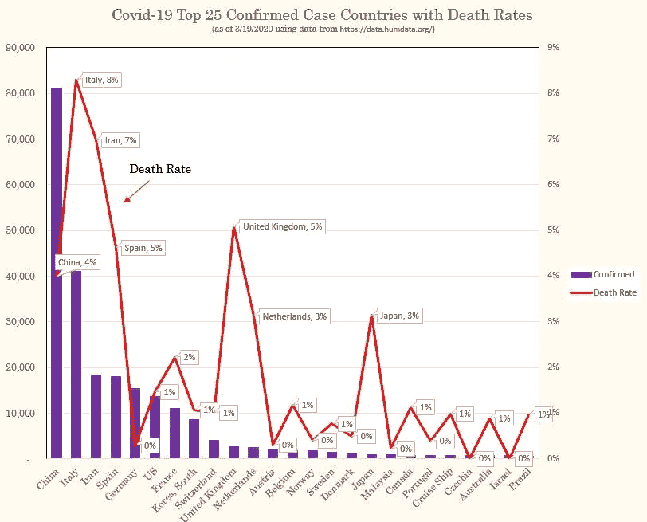
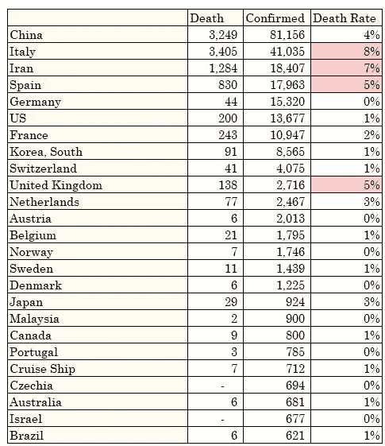

# 按确诊病例和死亡率分列的前 25 个国家的新冠肺炎数据图表

> 原文：<https://medium.com/analytics-vidhya/covid-19-data-chart-on-top-25-countries-by-confirmed-cases-and-death-rates-45a4e6e7d727?source=collection_archive---------22----------------------->

新冠肺炎死亡率最高的 25 个确诊病例县。截至 2020 年 3 月 19 日。使用 humdata.org 的数据

如上图所示，截至 2020 年 3 月 19 日，一些国家的新冠肺炎确诊病例和确诊死亡率高于其他国家。具体来说，意大利、伊朗、西班牙和英国是死亡率达到或超过 5%的国家。意大利的死亡率最高，约为 8%。在确诊病例少于 1000 例的国家中，日本的死亡率最高，为 3%。现在知道这些比率在不同国家的确切原因还为时过早。人口老龄化、检测工具少、反应时间慢可能是导致哪些国家病例和死亡率较高的原因。有关细分数字，请参见下表。

新冠肺炎死亡率最高的 25 个确诊病例县。截至 2020 年 3 月 19 日。使用 humdata.org 的数据